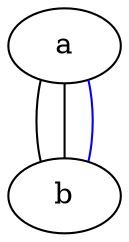

# node 大小
width
heigh
# 线段样式
## 直拐线
splines=ortho

## 曲线
splines=curved

## 直线
splines=line

## 无
splines=none
splines=""

# 最好 pip install graphviz

# 无向图(graph) 有向图(digraph) 子图(subgraph)
```graphiz
graph graph_1{
    a;
    b;
    c;
    d;
    e,f;  // node
    a -- b; // edge
    a--c;
    
}
```

```graphiz
digraph graphname{
    a -> b;
    b -> c;
    a -> c;
}
```

# 关键字
这些关键字包括：

node: 修饰节点
edge: 修饰连线
而常见的可以修饰的属性包括下面这些：

bgcolor: 背景颜色
shape: 形状
size: 大小
label: 标签名
fontsize: 字体大小
color: 一般是边框颜色
详见：https://graphviz.gitlab.io/_pages/doc/info/attrs.html


修饰属性可直接写在node,edge,个体上;
T [label="Teacher" color=Blue, fontcolor=Red, fontsize=24, shape=box]      // node T

## fillcolor?
style=filled, fillcolor=green

# 例子?

http://graphs.grevian.org/example

# 参考
http://graphs.grevian.org/reference
https://www.graphviz.org/documentation/


# tmp
Reference
Graphs and Vertices (Called Nodes in the GraphViz notation) may have a large number of attributes that affect both the graph's actual layout, and details like colours, labels, and line types. I cover a few of the attributes below but for a full reference see the GraphViz Attribute Index

## 5.2 记录
你现在可以用HTML来定义这一类节点了，这里有更多相关信息。

digraph structs {
    node[shape=record]
    struct1 [label="<f0> left|<f1> mid\ dle|<f2> right"];
    struct2 [label="{<f0> one|<f1> two\n\n\n}" shape=Mrecord];
    struct3 [label="hello\nworld |{ b |{c|<here> d|e}| f}| g | h"];
    struct1:f1 -> struct2:f0;
    struct1:f0 -> struct3:f1;
}
http://www.graphviz.org/doc/info/shapes.html

## Attributes
### Graph Attributes
label="My Graph";Label a graph itself
rankdir=LR;Lay the graph out from Left to Right, instead of Top to Bottom
{rank=same; a, b, c }Group nodes together at the same level of a graph
splines="line";Force edges to be straight, no curves or angles
K=0.6;Used to influence the 'spring' used in the layout, Can be used to push nodes further apart, which is especially useful for twopi and sfdp layouts
### Vertex Attributes
[label="Some Label"]Labels the Vertex
[color="red"]Colors the Vertex
[fillcolor="blue"]Fills the Vertex with the specified colour
### Edge Attributes
[label="Some Label"]Labels the Edge (Useful for Weights)
[color="red"]Colors the Vertex (Useful for Paths)
[penwidth=2.0]Adjusts the thickness of the edge line, Very useful for Paths
Edges may also have a weight attribute, defined as [weight=0.5] for example, but note that this doesn't display the weight directly, It instead acts as a hint to the graph layout to give this edge a more direct routing.
### Graphs
Graphs are defined as either a graph or a digraph using fairly standard syntax, similar to an edge list.

graph { node1 -- node2; node3 -- node2; }
digraph { node1 -> node2; node3 -> node2; }
### Vertices
Vertices are defined with a simple plaintext label, A, B, C, Test, Vertice1, some_vertex , etc. If you need a more complicated label you can declare the vertex first, before defining an edge, and give it a label attribute, for example:
digraph { someVertex[label="A Complicated Label"]; someVertex -> node2; node2 -> node3; }
### Edges
For the most part the only concern with edges is their colour/thickness, and Label, as the rest is handled automatically by the graph/digraph definition, To color an edge apply the color attribute to the graph definition as follows
digraph { node1 -> node2[color="red"]; }
To Display a weight, we give the vertex itself a label, similar to how we label nodes
digraph { node1 -> node2[label="0.2"]; node2 -> node3[label="0.2"]; }
We can actually apply any label we like to edge in this way digraph { node1 -> node2[label="edge1"]; node2 -> node3[label="edge2"]; }
You may combine these attributes in any way you please
digraph { node1[label="Some Complicated Label"]; node1 -> node2[label="An Edge",color=red]; node2 -> node3; }



