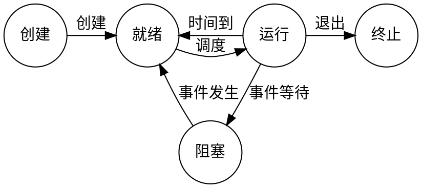

# 第一章 计算机系统概述

## 1.1 操作系统的基本概念
### 1.1.1 操作系统的概念 
...
### 1.1.2 操作系统的特征
#### 并发(Concurrence)
并发是指两个或多个事件在同一个时间间隔内发生

注意 同一时间间隔(并发)(宏观多道,微观交替) 和 
同一时刻(并行)(同时运算或操作) 的区别


#### 共享(Sharing)
##### 互斥共享方式
打印机等

##### 同时访问方式
宏观同时,分时共享
磁盘设备

并发和共享互为存在条件


#### 虚拟(Virtual)
把一个物理上的实体变为若干逻辑上的对应物

分时复用技术,空分复用技术(虚拟存储器)


#### 异步(Asynchronism)
走走停停


### 1.1.3 操作系统的目标和功能
#### 作为计算机资源的管理者
##### 处理机管理
处理机的分配和运行都以京城(或线程)为基本单位

##### 存储器管理


##### 文件管理
##### 设备管理
缓冲管理,设备分配,设备处理和虚拟设备等功能

#### 用户与计算机硬件系统之间的接口
##### 命令接口
联机命令接口 又称 交互式命令接口,使用与分时或实时操作系统

脱机命令接口 又称 批处理命令接口,适用于批处理系统

##### 程序接口
由一组系统调用(也称广义指令)组成


#### 操作系统用作扩充机器
没有任何软件支持的计算机称为裸机,它仅构成计算机系统的物质基础

裸机在最里层,其外面是操作系统

通道 硬件设备,接多外设

## 1.2 操作系统的发展与分类
### 1.2.1 手工操作阶段(无操作系统)
用户在计算机上的所有工作都要人工干预,如程序的输入,运行,结果的输出等


缺点:
1. 用户独占全机,不会被其他用户占用,但资源利用率第
2. CPU等待手工操作,CPU的操作不充分

唯一的解决方法就是用高速的及其替代相对较慢的手工操作来对作业进行控制


### 1.2.2 批处理阶段(操作系统开始出现)
为解决人机矛盾,出现了批处理系统,按发展历程分为 单道批处理系统,多道批处理系统

#### 单道批处理系统
系统对作业的处理是成批惊醒的,但内存中始终保持一道作业
特征:
1. 自动性,磁带上的一批作业能自动地逐个运行,无序人工干预
2. 顺序性,磁带上各道作业顺序地进入内存
3. 单道性,内存中仅有一道程序运行

面临的问题是: 运行期间,发出输入输出请求后,高速的CPU便处于等待低速的IO完成状态
为了进一步提高资源的利用率和系统的吞吐量,引入多道程序技术


#### 多道批处理系统
允许多个程序同时进入内存并允许它们在CPU中交替地运行,共享计算机的各种资源
当一道程序因IO请求而暂停运行时,CPU便立即转去运行另一道程序

特点:
1. 多道,计算机内存中同时存放多道相互独立的程序
2. 宏观上并行
3. 微观上串行

问题:
1. 如何分配处理器
2. 多道程序的内存分配问题
3. IO设备如何分配
4. 如何组织和存放程序和数据,

优点: 资源利用率高,多道程序共享计算机资源,系统吞吐量大
缺点: 用户响应时间长,不提供人机交互能力


### 1.2.3 分时操作系统
所谓分时技术,是指吧处理器的运行时间分成很短的时间片,按时间片轮流吧处理器分配给各联机作业使用

分时操作系统 是指多个用户通过终端同时共享一台主机

主要特征如下:
1. 同时性,也称多路性,即允许多个终端用户同时使用一台计算机
2. 交互性,
3. 独立性,多个用户彼此独立进行操作
4. 及时性,段时间内响应


### 1.2.4 实时操作系统
硬实时系统,如 飞行器自动控制系统
软实时系统,如 飞机订票系统,银行管理系统

主要特点是及时性和可靠性


### 1.2.5 网络操作系统和分布式计算机系统


### 1.2.6 个人计算机操作系统
### end


## 1.3 操作系统的运行环境

### 1.3.1 操作系统的运行机制
通常CPU执行两种不同性质的程序,一种是操作系统内核程序,
另一种是用户自编程序(应用程序)

具体实现上,将CPU的状态划分为 用户态 和 核心态

内核是计算机上配置的底层软件,是计算机功能的延伸
大多数操作系统内核高扩4方面的内容
1. 时钟管理
   1. 计时
   2. 时钟中断管理,实现进程的切换
2. 中断机制,只有一小部分功能属于内核,负责保护和恢复中断现场信息
3. 原语(Atomic Operation),直接方式是关中断
   1. 处于操作系统最底层,最接近硬件部分
   2. 原子性,其操作只能一气呵成(不可中断)
   3. 运行时间短,且调用频繁
4. 系统控制的数据结构及处理
   1. 系统中哟拿来扽即状态信息的数据结构,如作业控制块
   2. 进程控制块,设备控制块,各类链表等
   3. 常见操作有以下三种
      1. 进程管理
      2. 存储器管理
      3. 设备管理

### 1.3.2 中断和异常的概念
发生中断或异常是,运行用户态的CPU会立即进入核心态,这是通过硬件实现的

#### 中断和异常的定义
中断(Interuption)也称外中断

异常(Exception)也称内中断,例外或陷入(trap),不能被屏蔽


#### 中断处理的过程
流程描述如下
1. 关中断
2. 保存断点
3. 引出中断服务程序
4. 保存现场和屏蔽字
5. 开中断
6. 执行中断服务程序
7. 关中断
8. 恢复现场和屏蔽字
9. 开中断,中断返回

1~3,硬件自动(中断隐指令)完成的
4~9 有中断服务程序完成


### 1.3.3 系统调用
系统调用可视为特殊的公共子程序

* 设备管理
* 文件管理
* 进程控制 
* 进程通信 
* 内存管理 

用户程序可以执行 陷入指令 (又称 访管指令 或 trap指令 )来发起系统调用
请求操作系统提供服务

用户态转向核心态的例子
1. 用户程序要求操作系统的服务
2. 发生一次中断
3. 用户程序产生一个错误状态
4. 用户程序中企图执行一条特权指令
5. 从核心态转向用户态


访管指令是在用户台使用的,不可能是特权指令

过程:
1. 传参
2. trap
3. 执行
4. 返回


### end
子程序调用只需保存程序断点,即指令的下一条指令的地址
中断处理不仅要保存断点(中断隐指令),还要保存程序状态字寄存器(PSW)的内容,通用寄存器由操作系统保存


## 1.4 操作系统的体系结构
### 1.4.1 大内核和微内核
大内核将操作系统的主要功能模块都作为一个紧密联系的整体运行在和性台

微内核: 内核中最基本的功能保留在内核,而将那些不需要在核心态执行的功能移到用户态
从而降低内核的设计复杂性


库操作系统


单内核：也称为宏内核。
将内核从整体上作为一个大过程实现，并同时运行在一个单独的地址空间。所有的内核服务都在一个地址空间运行，相互之间直接调用函数，简单高效。
微内核：功能被划分成独立的过程，过程间通过IPC进行通信。模块化程度高，一个服务失效不会影响另外一个服务。
Linux是一个单内核结构，同时又吸收了微内核的优点：模块化设计，支持动态装载内核模块。
Linux还避免了微内核设计上的缺陷，让一切都运行在内核态，直接调用函数，无需消息传递。


### end

## 1.5 本章疑难点


# 第二章 进程管理
## 2.1 进程与线程

### 2.1.1 进程的概念
PCB 是进程存在的唯一标志

#### 进程的特性
1. 动态性,进程是程序的一次执行
2. 并发性
3. 独立性,进程实体是一个能独立运行,独立获得资源和接受调度的基本单位,
   1. 没有PCB的程序,都不能作为一个独立的单位参与运行
4. 异步性,间断?
5. 结构性,每个进程都配置一个PCB进行描述

只求理解
### 2.1.2 进程的状态与转换
通常进程有五种状态,前三种是进程的基本状态
1. 运行态,进程正在处理机上运行
2. 就绪态,进程获得处处理机外的一切所需资源
3. 阻塞态,又称 等待态
4. 创建态,正在被创建,尚未转到就绪态
5. 结束态,进程正从系统小时,可能是正常结束或中断推出运行




### 2.1.3 进程管理
一般把进程控制用的程序段看作 原语 ,执行期间不可中断

#### 进程的创建
允许一个进程创建另一个进程.此时创建者称为父进程,被创建的进程称为子进程
子进程可以继承父进程所拥有的资源.当子进程被撤销时,应将其从父进程拿获得的资源归还给父进程

操作系统创建一个新进程的过程如下:
1. 为新进程分配一个唯一的进程标识号,并申请一个空白的PCB.
   1. 若PCB申请失败,则创建失败
2. 为进程分配资源,
   1. 若资源不足,则处于阻塞态,等待资源
3. 初始化PCB,
   1. 主要包括初始化标志信息,处理机信息,处理机控制信息,设置进程的优先级
4. 若进程就绪队列能够接纳新进程,则将新进程插入就绪队列,等待被调度运行


#### 进程的终止
引起进程终止的事件主要有:
1. 正常结束
2. 异常结束
3. 外界干预

操作系统终止进程的过程如下:
1. 根据被终止进程的标识符,检索PCV,从中读出该进程的状态
2. 若被终止进程处于执行状态,立即终止其进程的执行,讲处理机资源分配给其他进程
3. 若该进程还有子进程,则应将其所有子进程终止
4. 将该进程所拥有的全部资源,或归还给其父进程,或归还给操作系统
5. 将该PCB从所在队列中删除


#### 进程的阻塞和唤醒
正在执行的进程,由于期待某些事件未发生,如请求系统资源失败等
由系统自动执行阻塞原语(Block),使自己有运行态变为阻塞态
可见,进程的阻塞是进程的一种自动行为,也因此只有处于运行态的进程
才可能将其转为阻塞态

阻塞原语的执行如下:
1. 找到将要被阻塞进程的标识号对应的PCB
2. 若该进程为运行态,则保护其现场,将其状态转为阻塞态,停止运行
3. 吧该PCB插入相应时间的等待队列,将处理机资源调度给其他就绪进程

当被阻塞进程所期待的时间出现时,如IO操作已完成等,
由有关(比如,释放该IO设备的进程)调用唤醒原语(Wakeup),将等待该事件的进程唤醒

唤醒原语的执行过程如下:
1. 在该事件的等待队列中找到相应的进程的PCB
2. 将其从等待队列中移出,并置其状态为就绪态
3. 把该PCB插入就绪队列,等待调度程序调度

Block 原语 和 Wakeup原语 必须成对使用
Block 由被阻塞进程自我调用实现
Wakeup 则是有一个与唤醒进程合作或被其他相关进程调用实现的


#### 进程切换
进程切换的过程如下:
1. 保存处理机上下文,包括程序计数器和其他寄存器
2. 更新PCB信息
3. 把进程的PCB移入相应的队列,如就绪,阻塞等队列
4. 选择另一个进程执行,并更新其PCB
5. 更新内存管理的数据结构?
6. 恢复处理机上下文

模式切换无需改变当前进程的环境信息

先有资源调度 后有进程的切换


### 2.1.4 进程的组织(构成)
核心是PCB
#### 进程控制块(PCB)
各部分
1. 进程描述符
   1. 进程标识符(PID)
   2. 用户标识符(UID)
2. 进程控制和管理信息
   1. ...
3. 资源分配清单
   1. 代码段指针,数据段指针,堆栈段指针,文件描述符,键盘,鼠标
4. 处理机相关信息
   1. 通用,地址,控制,标志寄存器值 状态字
   


#### 程序段
程序可以被多个进程共享

#### 数据段
进程对应的程序加工处理的原始数据

### 2.1.5 进程的通信
#### 共享存储
PV 操作

#### 消息传递
操作系统提供的消息官邸方法
##### 直接通信方式
消息缓冲队列
##### 间接通信方式
又称信箱通新方式

#### 管道通信

从管道读数据是一次性操作,数据一旦被读取,它就从管道中被抛弃,释放空间

管道只能采用半双工通信,即某一时刻只能单向传输
要实现双向通信,需要定义两个管道

管道在内存中

### 2.1.6 线程概念和多线程模型
#### 线程的基本概念
引入线程的目的是为来减少程序在并发执行时所付出的时空代缴,提高操作系统的并发性能
线程是一个基本的CPU执行单元,也是程序执行流程的最小单元
有线程ID,程序计数器,寄存器集合和堆栈组成
与同属一个进程的其他线程之间共享所拥有的全部资源
一个线程可创建和撤销另一个进程,同一个进程中的多个线程之间可以并发执行

线程也有就绪,阻塞,运行三种基本状态

线程的切换发生在同一个进程内,只需要很少的时空开销

#### 线程和进程的比较
1. 调度
   1. 不同进程中的线程切换?会引起进程切换
2. 拥有资源
   1. 进程都是拥有资源的基本单位,线程不拥有系统资源(也有一点必不可少的资源)
   2. 线程可访问其隶属进程的系统资源
3. 并发性
4. 系统开销
   1. 同一进程内的多个线程共享进程的地址空间,所以线程通信十分容易实现
5. 地址空间和其他资源(文件)
   1. 进程的地址空间之间相互独立,同一进程的个县城之间共享进程资源,
   2. 某进程内的县城对其他进程不可见
6. 通信方面
   1. IPC(进程间通信)需要同步与互斥,二新城可以直接读写数据段(如全局变量来通信


#### 线程的属性
多线程操作系统把线程作为独立运行的基本单位,
此时进程已不是一个基本的可执行实体
但它仍具有与执行相关的状态
所谓进程处于执行状态,实际上是指该进程中的某线程正在执行

县城的主要属性如下:
1. 线程是一个轻型实体
2. 不同线程可执行相同程序
3. 同一进程中的各个线程共享该进程拥有的资源
4. 进程是处理机的独立调度单位,
   1. 多个线程可以并发执行,
   2. 单CPU中,各线程可交替使用CPU
   3. 多CPU中,个线程可同时占用不同CPU
5. 一个线程被创建后,便开始了它的生命周期...


#### 线程的实现方式
线程的实现可以分为两类: 用户级线程(ULT)和内核级线程(KLT).
内核级线程又称内核支持的线程

在用户级线程中,有关线程管理的所有工作都有应用程序完成,
内核意识不到线程的存在

内核级线程中,线程管理的所哟工作由内核完成,应用程序没有进行线程管理的代码
只有一个到内核级线程的编程接口.内核来维护线程

也有些混合方式

#### 多线程模型
有些系统同时支持用户线程和内核线程,由此产生了不同的多线程模型
即实现用户级线程和内核级线程的连接方式
1. 多对一模型
   1. 多个用户级线程映射到一个内核级线程,线程管理在用户空间完成
   2. 优点: 线程管理在用户空间完成,因此效率比较高
   3. 缺点: 一个线程在内核服务时被阻塞,整个线程都被阻塞,多个线程不能并行地运行在多处理机上
2. 一对一模型
   1. 每隔用户级线程映射到一个内核级线程
   2. 优点: 并发能力强
   3. 缺点: 创建线程开销大
3. 多对多模型
   1. n个用户线程映射到m个内核级线程上,m≤n
   2. 特点 集两种所长???

### 2.1.7 本章小结

## 2.2 处理机调度
### 2.2.1 调度的概念
#### 调度的基本概念
是多道程序操作系统的基础,是操作系统设计的核心问题

####  调度的层次
##### 作业调度
又称高级调度,内存与辅存之极拿的调度.对每个作业只调入一次,调出一次

多道批处理系统中大多配有作业调度,其他系统通常不需要
作业调度的执行频率较低,通常为几分钟一次

##### 中级调度
又称内存调度,作用是提高内存利用率和系统吞吐量
为此,应将那些暂时不能运行的进程调至外存等等,把此时的进程状态称为 挂起态.
当它门以具备运行条件且内存又稍有空闲时,有中级调度来将复合运行条件的就绪进程
在重新调入内存,并修改其状态为就绪态.


##### 进程调度
又称低级调度,主要任务是按照某种方法和策略从就绪队列中选取一个进程,将处理机分配给它

进程调度的频率很高,一般几十毫秒一次

####  三级调度的联系
1. 作业调度为进程活动做准备,进程调度使进程正常活动起来,中级调度将暂时不能运行的进程挂起,中继调度处于作业调度和进程调度之间
2. 作业调度次数少,中级调度略多,进程调度平率最高
3. 进程调度是最基本的,不可或缺的


### 2.2.2 调度的时机,切换与过程
请求调度的事件发生后,
才可能运行进程调度程序,
调度了新的就绪进程后,才会进行进程间的切换

理论上这三件事情应该顺序执行,但在实际设计中,
操作系统内核程序运行时,若某时发生了引起进程调度的因素,
则不一定能够马上进行调度与切换

现代操作系统中,不能进行进程的调度与切换的情况如下:
1. 在处理中断的过程中
2. 进程在操作系统的内核程序临界区中,
   1. 进入临界区后,需要独占式的访问共享数据,理论上必须加锁,以防止其他并行程序进入(只要不破坏临界资源(打印机)的使用规则,就不影响处理机调度)
3. 其他需要完全屏蔽中断的原子操作过程中

应该进行进程调度与切换的情况如下:
1. 发生引起调度条件且当前进程无法继续运行下去,可以马上进行调度.
   1. 若操作系统只支持这种情况下进行进程调度,则是 非剥夺调度
2. 中断处理结束或自陷处理结束后,返回被中断进程的用户态执行现场前,
   1. 若置上请求调度标志,则可马上进行调度.
   2. 若操作系统支持这种情况下的调度程序,则实现了 剥夺式调度


### 2.2.3 进程调度方式
指当某个进程正在处理机上执行时,若有某个更为重要或紧迫的进程需要处理,
即有优先权更高的进程进入就绪队列,此时应该如何分配处理机
通海仓有以下两种进程调度方式:
1. 非剥夺调度方式,又称非抢占方式
2. 剥夺调度方式,又称抢占方式 

剥夺 不是一种任意性行为,必须遵循一定的原则,主要有优先权,短进程优先和时间片原则等


### 2.2.4 调度的基本准则
评价准则
1. CPU利用率
2. 系统吞吐量,单位时间内CPU完成任务的数量
3. 周转时间
   1. 周转时间指从作业提交到作业完成所经历的时间
   2. 周转时间 = 作业完成时间 - 作业提交时间
   3. 平均周转时间是指多个作业周转时间的平均值
   4. 带全权周转时间是指多个作业带权周转时间的平均值
   5. 带权周转时间 = 作业周转时间/作业实际运行时间
4. 等待时间,指进程处于等处理机状态的时间之和,
5. 响应时间,用户提交请求到系统首次产生响应所用的时间


### 2.2.5 典型的调度算法
#### 先来先服务(FCFS)调度算法
进程调度中,FCFS调度算法每次从就绪队列中选择最先进入该队列的进程,
将处理机分配它,使之投入运行,指导完成或某种原因而阻塞时才是释放处理机

不可剥夺算法,多对同优先级进程按FCFS原则处理
算法简单,效率低,对长作业有利,对短作业不利(相对SJF和高响应比)
有利于CPU繁忙型作业,不利于IO繁忙性作业


#### 短作业(SJF)优先算法
从后备队列中选择一个或若干估计运行时间最短的作业,将他们调入内存运行

缺点:
1. 对长作业不利
2. 完全未考虑作业的紧迫程度
3. 不一定能真正做到短作业优先调度

平均等待,平均周转时间最少


#### 优先级调度算法
每次从后背队列中选择优先级最高的一个或几个作业
根据更高优先级进程是否抢占正在执行的进程,可将该调度算法分成
非剥夺式优先级调度算法,剥夺式优先级调度算法

而根据进程创建后器优先级是否可以改变,可以将进程优先级分为以下两类:
静态优先级,动态优先级

一般来说,进程优先级的设置可以参照如下原则:
1. 系统进程 > 用户进程
2. 交互形进程 > 非交互型进程
3. IO型进程 > 计算型进程.让IO设备尽早工作,进而提升系统的整体效率


#### 高响应比优先调度算法
主要用于作业调度,选响应比高的作业投入运行
响应比 = (等待时间+要求服务时间)/要求服务时间

根据公式可知:
1. 作业等待时间相同,要求服务时间越短,响应比越高,有利于短作业
2. 要求服务时间相同,作业响应比由其等待时间决定,等待时间越长,响应比越高
3. 对长作业,作业的响应比可以随等待时间的增加而提高,克服了饥饿状态

#### 时间片轮转调度算法
主要适用于分时系统
进程调度程序总是选择就绪队列中的第一个进程执行,即先来先服务的原则
但仅能运行一个时间片,使用完后,即使进程未完成,也必须释放那个处理机给下一个进程使用
被剥夺的进程返回就绪队列重新排队,等待再次运行

时间片长短通常由以下因素确定: 系统的响应时间,就绪队列中的进程数目和系统的处理能力

这是绝对可以抢占的?抢占的定义


#### 多级反馈队列调度算法的
实现思路如下:
1. 设置多个就绪队列,并为各个队列赋予不同的优先级
2. 赋予各个队列中进程执行时间片的大小各不相同
   1. 优先级越高的队列中,每隔进程的运行时间片越小
3. 新进程进入内存后,首先将它放入第一级队列的末尾,按FCFS原则排队
   1. 当轮到该进程执行后,如果完成,就撤离系统
   2. 否则转入第二级队列末尾排队,如此类推
4. 仅当第一级队列为空时,调度程序才调度第2级队列中的进程运行...

优势:
1. 短作业 优先
2. 周转周期短
3. 不会饥饿


### 2.2.6 本章小结
#### 为什么要进行处理机调度
减少外部输入阻塞时间,充分利用CPU


## 2.3 进程同步
### 2.3.1 进程同步的基本概念
进程之间问题

#### 临界资源
将一次仅允许一个进程使用的资源称为 临界资源,
许多物理设备都属于临界资源,还有许多变量,数据等都可被若干进程共享,
对临界资源的访问必须互斥地进行,
在每个进程中,访问临界资源的那段代码称为 临界区
为保证临界资源的正确使用,可把临界资源的访问过程分为4个部分"
1. 进入区,检查是否可进,并设置标志
2. 临界区,访访问临界资源的代码,又称 临界段
3. 退出区,将正在访问临界区的标志清楚
4. 剩余区,代码中剩余部分


#### 同步
同步亦称 直接制约关系
工作次序


#### 互斥
互斥也称 简介制约关系
一个进程进入临界区时,另一个进程必须等待

为禁止两个进程同时进入临界区,同步机制应遵循以下准则:
1. 空闲让进,临界区空闲时,可以允许一个请求进入临界区的进程立即进入临界区
2. 忙则等待,当已有进程进入临界区时,其他试图进入临界区的进程必须等待
3. 有限等待,对请求访问的进程,应抱枕能在有限时间内进入临界区
4. 让权等待.进程不能进临界区是,应立即放那挂起处理器,防止进程忙等待


### 2.3.2 实现临界区互斥的基本方法
#### 软件实现方法
在进入区设置并检查一些标志来标明是否有进程在临界区中,
若有,则在进入去循环检查进行等待,进程离开临界区后则在退出区修改标志

##### 算法一: 单标志法
设置一个共用整形变量turn,用于指示被允许进入临界区的进程编号,(退出后更改)
两个进程必须交替进入,否则两个都无法进入


##### 算法二: 双标志先检查
在每个进程访问临界资源之前,先查看临界资源是否被访问,若正被访问,该进程需等待;
否则,进程才进入自己的临界区,
为此,设置一个数据flag[i],如第i个元素为FALSE,表示Pi进程为进入临界区.

优点: 不用交替进入,可连续使用
缺点: Pi和Pj可能同时进入临界区,
即在检查对方flag和切换自己的flag前后有一段时间


##### 算法三: 双标志法后检查
先将自己的标志设为TRUE,在检测对方的状态标志,若对方状态标志为TRUE,则等待.

可能导致 饥饿 现象 (谁也进入了临界区)


##### 算法四: Peterson's Algorithm
每个进程先设置自己的标志后再设置turn标志(不允许进入标志),之后,再检测进程状态和允许进入标志


flag[i]=1;turn=j;
while(flag[j]&&turn==j); // 让行 
// 临界区 
flag[i]=0


利用flag解决临界资源的互斥问题,而利用turn解决饥饿现象

不满足让权等待


#### 硬件实现方法
通过硬件支持实现临界段问题的方法称为 低级方法,或称 元方法

##### 中断屏蔽方法
关中断;
临界区;
开中断;


这种方法限制了处理机交替执行程序的能力,因此执行效率会明显降低
将关中断权利给用户很不明智

##### 硬件指令方法
TextAndSet指令,原子操作,功能是读出指定标志然后将该标志设置为真

可以为每个临界资源设置一个共享布尔变量lock,表示资源的两种状态,true标志正被占用
在进程访问临界资源之前,利用TextAndSet检查和修改标志lock;
若有进程在临界区,则重复检查,直到进程推出

Swap指令,交换两个字节的内容

为每个临界资源设置一个共享布尔变量lock,初值为false;在每个进程中再设置一个局部布尔变量key,用于与lock交换信息

key=true;
while(key!false) Swap(&lock , &key);
临界区 
lock=false 

优点: 适用于任意数目的进程,简单,容易
缺点: 耗费处理机时间,不能让权等待,有可能导致饥饿


### 2.3.3 信号量
只能被两个标准的原语wait(S)和signal(S)访问,也可记为 P操作,V操作
可实现让权等待

#### 整型信号量
整型信号量被定义为一个用于表示资源数目的整型量S,wait和signal操作可描述为
```c
wait(S){
    while(S<=0);
    S = S-1;
}
signal(S){
    S=S+1;
}
```
因为wait操作中,只要信号量S<=0就会不断测试,因此,该机制未遵循 让全等待的准则,而是使进程处于 忙等 的状态


#### 记录型信号量
记录型信号量不存在忙等现象的进程同步机制
除一个用于代表资源数目的整型变量value外,再增加一个进程链表L,用于连接所有等待该资源的进程.
记录型信号量可描述为
```c
typedef struct{
    int value;
    struc process *L;
}semaphore;
```
相应的wait(S)和signal(S)的操作如下:
```c
void wait(semaphore S){ // 申请资源
    S.value--;
    if(S.value<0){
        // add this process to S.L;
        block(S.L)
    }
    // 使用?
}

void signal(semaphore S) { // 释放资源
    S.value++;
    if(S.value<=0){
    // remove a process from S.L;
    wakeup(P)
    }
}
```


#### 利用信号量实现同步
信号量机制能用于解决进程间的各种同步问题.
设S为实现进程P1,P2同步的公共信号量,初值为0.
进程P2中的语句y要使用进程p1中语句x的运行结果,所以只有当语句x执行完成后y才可以执行

算法如下;
```c
semaphore S = 0;
P1(){
    x;
    V(s);
}

P2(){
    ...
    P(s);
    y;
}

```
P,wait,block
v,signal,weakup


#### 利用信号量实现进程互斥
```c
semaphore S = 1;
P1(){
    P(S);
    // 临界区
    V(S);
}

P2(){
    P(S);
    // 临界区
    V(S);
}

```

#### 利用信号量实现前驱关系
...
#### 分析进程同步和互斥问题的方法步骤
1. 分析关系
2. 整理思路
3. 设置信号量


### 2.3.4 管程
#### 管程的定义
这个代表共享资源的数据结构,以及由对该共享数据结构实施操作的一组过程所组成的资源管理程序,称为 管程(monitor) ,

管程由4部分组成:
1. 管程的名称;
2. 局部于管程内部的共享结构数据说明
3. 对该数据结构进行操作的函数
4. 对局部于管程内部的共享数据设置初始值的语句

管程的定义描述举例如下:
```c
monitor Demo{
    init_code(){
        S = 5;
    }
    take_away(){
        S--;
        ...
    }

    give_back(){
        S++;
        ...
    }
}
```
1. 管程吧对恭喜那个资源的操作封装起来
2. 每次仅允许一个进程进入管程,从而实现进程互斥.各进程只能窜性执行管程内的过程.


#### 条件变量
将阻塞源应定义为条件变量,可以设置多个

等待队列,wait和signal

x.wait,当对x对应的条件不满足时,正在调用管程的进程调用x.wait,将自己插入x条件的等待队列,并释放管程
x.signal,x对应的条件发生变化时,则调用x.signal,唤醒一个因x条件而阻塞的进程


### 2.3.5 经典同步问题
#### 生产者-消费者问题
#### 读者-写者问题
#### 哲学家进餐问题
#### 吸烟者问题


### 2.3.6 本章小结


## 2.4 死锁

### 2.4.1 死锁的概念
#### 死锁的定义
多个进程因竞争资源而造成的一种僵局(互相等待),若无外力,这些进程都将无法向前推进.


#### 死锁产生的原因
##### 系统资源的竞争
只有对可剥夺资源的竞争才可能产生死锁
对可剥夺的竞争是不会引起死锁的


##### 进程推进顺序非法
进程运行中,请求和释放资源的顺序不当,也同样会导致死锁
例如,并发进程P1,P2分别保持了资源R1,R2
而进程P1申请资源R2,进程P2申请资源R1是,两者都会因为所需资源被占用而阻塞.

信号量使用不当也会造成死锁.
例如,进程间彼此相互等待对方发来的消息.

##### 死锁产生的必要条件

1. 互斥条件
2. 不剥夺条件
3. 请求并保持
4. 循环等待条件


### 2.4.2 死锁的处理策略
1. 死锁预防
   1. 设置某些条件,破坏产生死锁的4个必要条件中的一个或几个,以防止发生死锁
2. 避免死锁
   1. 在资源动态分配过程中,用某种方法防止系统进入不安全状态,从而避免死锁.
3. 死锁的检测及解除
   1. 允许发生死锁,然后采取某种措施解除死锁

死锁处理策略比较
| 策略     | 资源分配策略            | 各种可能性                             | 主要优点                                    | 主要缺点                                                |
| -------- | ----------------------- | -------------------------------------- | ------------------------------------------- | ------------------------------------------------------- |
| 死锁预防 | 保守,宁可资源闲置       | 一次请求所有资源,资源剥夺,资源按序分配 | 适用于突发式处理的进程,不必进行剥夺         | 效率低,进程初始化时间延长;剥夺次数过多;不便灵活使用资源 |
| 死锁避免 | 预防和检测的折中        | 寻找可能的安全允许顺序                 | 不必进行剥夺                                | 必须知道将来的资源需求,  ;进程不能长时间阻塞            |
| 死锁检测 | 宽松,只要允许就分配资源 | 定期检查死锁是否已经发生               | 不延长进程初始化时间,允许对死锁进行现场处理 | 通过剥夺解除死锁,造成损失                               |


### 2.4.3 死锁预防
#### 破坏互斥条件
不太可行


#### 破坏不剥夺条件
当一个已保持  了某些不可剥夺资源的进程请求新的资源而等不到满足时,它必须释放已保持的所有资源,待以后需要时再重性盛情

比较复杂,会增加系统开销,降低系统吞吐率,常用于状态易于保存和恢复的资源如CPU的寄存器及内存资源.
一般不能用于打印机之类的资源


#### 破坏请求并保持
采用预先静态分配方法,即进程在运行前一次申请完它所需的全部资源,
一旦投入运行,这些资源就已知归它所有,

实现简单,但系统资源被严重浪费,而且会导致饥饿状态

#### 破坏循环等待条件
可采用顺序资源分配法.
首先给系统中的资源编号,规定每个进程必须按编号递增的顺序请求资源,同类资源自此申请完

问题是,编号必须相对稳定,限制了新类型设备的增加


### 2.4.4 死锁避免
死锁避免同样属于实现预防策略,但并不是事先采用某种限制措施,
而是在资源动态分配过程中,防止系统进入不安全状态,以避免发生死锁
这种方法所施加的限制条件弱,可以获得较好的系统性能

#### 系统安全状态
所谓安全状态,是指系统能按某种进程推进顺序,为每个进程Pi分配所需的资源,
直至满足每隔进程对资源的最大需求,使每个进程都可顺序完成.
此时称P1,P2,...,Pn为安全序列
若系统找不到一个安全序列,则称系统处于不安全状态


并非所有的不安全状态都是死锁状态,但当系统进入不安全状态后,便可能进入死锁状态;
反之,只要系统处于安全状态,系统便可避免进入死锁状态.


#### 银行家算法
进程运行前先声明对各种资源的最大需求量,当进程在执行中继续申请资源时,
先测试已站资源数与本次申请的资源数之和是否超过该进程声明的最大需求量
若超过则拒绝分配.若未超过再测试系统显存资源是否满足该进程尚需的最大资源
若满足则按当前的申请分配,否则也要推迟分配

##### 数据结构描述
* 可利用资源向量Available,含有m个元素的数组,其中每个元素代表一类可用的资源数目
* 最大需求矩阵 MaxNeed: nxm矩阵,定义系统中n个进程中对m类资源的最大需求
* 分配矩阵 Allocation:nxm矩阵,定义系统中美类资源当前已分配给每隔进程的资源数 
  * A[i,j]=K,标示进程i已分得Rj类资源的数目为K
* 需求矩阵 Need:nxm矩阵,表示每个进程接下来还需号多少资源

Need = MaxNeed - Allocation
一般MaxMeed和Allocation 是已知的


##### 银行家算法描述
Reques[i,j]=K,表示进程Pi需要j类资源K个


1. 若Request[i,j] <= Need[i,j],转向步骤 2 ,否则出错
2. 若Reqeest[i,j] <= Available[j],转向步骤 2,否则表示尚无足够资源,Pi需要等待
3. 系统试探把资源分给进程 P,并修改相应数据结构中的熟知
4. 系统执行安全性算法,检查此次资源分配后,系统是否处于安全状态
   1. 若安全,才正式分配资源
   2. 否则,将本次的试探分配作废,恢复原来的资源分配状态,让Pi等待


##### 安全性算法
设置工作向量Work,有m个元素,表示系统中的剩余可用资源数目.
在执行安全性算法开始时,Work  = Avilable

1. 初始安全序列为空
2. 从Need矩阵中找到复合下面条件的行: 
   1. 该行对应的进程不再安全序列中,而且该行相遇等于Work向量
   2. 找到后,把对应的进程加入安全序列,找不到执行步骤 4
3. 进程Pi进入安全序列后,可顺利执行,直至完成,并释放分配给它的资源
   1. 因此Work = Work+Allocation[i]
   2. 其中Alocation[i]标志进程Pi所有的资源,返回步骤 2 
4. 若此时安全序列中已有所有进程,则系统处于安全状态,否则系统处于不安全状态


#### 安全算法举例
#### 银行家算法举例


### 2.4.5 死锁的检测和解除
若系统为进程分配资源时不采用任何措施,则应该提供死锁检测和解除的手段
#### 资源分配图
用圆圈表示一个进程,用框表示一类资源
从进程到资源的有向边称为请求边
从资源到进程的边称为分配边


#### 死锁定理
简化资源分配图可检测系统状态S是否为死锁状态,简化方法如下
1. 找到既不阻塞又不孤点的进程Pi
   1. 即找到一条有向边与它相连,
   2. 且该有向边对应资源的申请数量小于等于系统中已有的空闲资源数量
   3. 小区它所有的请求边和分配边,使之称为孤立的节点
2. 进程Pi所释放的资源,可以环形某些因等待这些资源而阻塞的进程,
   1. 根据 步骤 1 中的方法进行一系列简化后,若能消去图中所有的边,则称该图是可完全简化的

S为死锁的条件当且仅当S状态的资源分配图是不可完全简化的,
该条件称为 死锁定理 

#### 死锁解除 
主要方法有:
1. 资源剥夺法.挂起某些死锁进程,并抢占它的资源,将这些资源分配给其他的死锁进程
   1. 但应防止被挂起的进程长时间得不到资源而处于资源匮乏的状态
2. 撤销进程法.强制撤销部分甚至全部死锁进程并剥夺这些进程的资源
   1. 撤销的原则可以按进程优先级和撤销进程的代价的高低进行
3. 进程回退法.让一个(或多)个进程回退到足以回避死锁的地步
   1. 要求系统保持进程的历史信息,设置还原点


### 2.4.6 本节小结


## 2.5 本章疑难点
通常把用户要求计算机完成的一串任务称为作业


# 第三章 内存管理
## 3.1 内存管理的概念
### 3.1.1 内存管理的基本定理和要求
操作系统对内存的划分和动态分配,就是内存管理的概念

内存管理的功能有:
* 内存空间的分配与回收
* 地址转换
* 内存空间的扩充
* 存储保护

在进行具体的内存管理之前,需要了解进程运行的基本原理和要求
#### 程序装入和链接
* 编译,由编译程序将用户源代码编译称若干目标模块
* 链接,将目标模块与所需的库函数链接在一起,形成一个完整的装入模块
  * 静态链接,运行前连接,以后不再拆开
  * 装入时动态链接,转入内存时,采用边装入边链接的方式
  * 运行时动态链接,在程序执行时需要该目标模块才进行连接
    * 便于修改和更新,便于对目标模块的共享
* 装入,由装入程序将装入模块装入内存运行
  * 绝对装入
    * 知道程序将驻留在内存的某个位置,
    * 则编译程序将产生绝对地址的目标代码
    * 只适用于单道程序环境
  * 可重定位装入
    * 在多道程序环境下,多个目标模块的起始地址通常都从0开始
    * 程序中的其他地址都是相对于起始地址,此时因采用可重定位装入方式
    * 根据内存的当前情况,将装入模块装入内存的适当位置.
    * 装入时,对目标程序中的指令和数据的修改过程称为 重定位
    * 地址变换通常是在装入时一次完成的,所以又称 静态重定位
  * 动态运行时装入,也称 动态重定位
    * 程序在内存中若发生移动,则需要采用动态的装入方式
    * 装入程序并不立即把相对地址转换为绝对地址
    * 而是把这种地址转换推迟到程序真正要执行时才进行
    * 需要一个重定位寄存器的支持
    * 特点:
      * 可将程序分配到不连续的存储区中
      * 程序运行前只需装入部分代码即可投入运行
      * 程序运行期间,根据需要动态申请分配内存
      * 便于程序段的共享,可向用户提供一个更大的地址空间


#### 逻辑地址和物理地址空间
编译后,每隔目标模块都从0号单元开始编址,这种陈为该目标模块的 相对地址(或 逻辑地址)
对地址构成统一的从0号单元开始编制的 逻辑地址空间

物理地址空间 是指内存中物理单元的集合,它是地址转换的最终地址,
将逻辑地址转换为物理地址,这个过程称为 地址重定位


#### 内存保护
可采用两种方法
* 在CPU中设置一对上,下限寄存器
* 采用 重定位寄存器(或 基址寄存器)(加)和 界地址寄存器(又称 限长寄存器)(比)
  * 重定位寄存器含最小的物理地址值,界地址寄存器含逻辑地址的最大值
  * 每个逻辑地址值必须小于界地址寄存器
  * ...

### 3.1.2 覆盖与交换
覆盖和交换是在多道程序环境下用来扩充内存的两种方法

#### 覆盖
由于程序运行时并非任何时候都要访问程序及数据的各个部分
因此可把用户空间分为一个固定去和若干覆盖区
将经常活跃的部分放在固定去,其余部分按调用关系分段
首先将即将要访问的段放到覆盖区,其他的段放在外存中,
在需要调用前,系统再将其调入覆盖区,替换覆盖区原有的段
不在覆盖区的段会常驻内存(固定区)

#### 交换
交换的基本思想是把处于等待状态的程序从内存中移到辅存,把内存空间腾出来,这一过程又称 换出
把准备号竞争CPU运行的程序从辅存移到内存,这一过程又称 换入
第二章介绍的中级调度采用的就是交换技术


### 3.1.3 连续分配管理方式
为一个用户程序分配一个连续的内存空间
连续分配方式主要包括 单一连续分配,固定分区分配 和 动态分区分配

#### 单一连续分配
内存在此方式下分为系统区和用户区

这种方式无序内存保护,应为内存中永远只有一道程序

优点: 简单,无外碎片,可以采用覆盖技术,不需额外的技术支持
缺点: 只用于单用户,单任务的操作系统,有内部碎片,存储器利用率极低

#### 固定分区分配
最简单的一种多道程序存储管理方式
它将用户内存空间划分为若干固定大小的区域,每个分区只装入一道作业
当有空闲分区时,便可再从外存的后备作业队列中选择适当大小的作业装入该分区,如此循环

划分分区是有两种不同的方法:
* 分区大小相等,
* 分区大小不等,

为便于饿逆存分配,通常将分区按大小排队,从小到大查找空间

当程序小于固定分区大小时,也占用一个完整的内存分区空间,这种现象称为 内部碎片


固定分区是可用于多道程序设计的最简单的存储分配,无外部碎片,
但不能实现多进程共享一个主存区,所以存储空间利用率低
固定分区分配很少用于现在通用的操作系统中,
但在某些用于控制多个相同对象的控制系统中仍发挥一定的作用


#### 动态分区分配
动态分区分配又称可变分区分配
这种分区方法不预先划分内存,而是在进程装入内存时,根据大小动态地建立分区

动态分区在开始分配时是很好的,但之后会导致内存中出现许多的小内存块
这些小的内存可称为 外部碎片,与固定分区中的内部碎片相对

在进程装入主存时,若内存中有多个足够大的空闲块,则操作系统要且定分配那个给进程使用,
这就是动态分区的分配策略,有以下几种算法:
1. 首次适应算法(First Fit)
   1. 空闲分区以地址递增的次序连接,分配内存时顺序查找,找到大小满足要求的第一个空闲分区
2. 最佳适应算法(Best Fit)
   1. 空闲分区按容量**递增**的方式形成区链,找到第一个满足要求的空闲分区
3. 最坏适应算法(Sorst Fit)
   1. 又称 最大适应算法(Largest Fit)
   2. 空闲分区以容量**递减**的次序链接,找到第一个能满足要求的空闲分区,即挑选出最大的分区
4. 临近适应算法(Next Fit)
   1. 又称 循环首次适应算法,由首次适应算法演变而成
   2. 不同之处是,分配内存时从上次查找结束的位置开始查找

首次适应算法不仅是最简单的,而且通常也是最好的
临近比首次结果差,常常导致在内存的末尾分配空间

最佳适应算法 性能通常很差,会产生更多的外部碎片(细小的)
最坏适应算法与最佳适应算法相反,但也性能差


### 3.1.4 非连续分配管理方式
非连续分配 允许一个程序分散地装入不相邻的内存分区
非连续分配管理方式 根据分区的大小是否固定,分为 分页存储管理方式 和 分段纯出管理方式


#### 基本分页存储管理方式
把主存空间划分为大小相等且固定的块,块相对较小,作为主存的基本单位.
每个进程也以块为单位划分,进程在执行时,以块为单位逐个申请主存中的块空间

每个进程平均值产生半个页大小的内部碎片(也称叶内碎片)

##### 分页存储的几个基本概念:
1. 页面和页面大小
   1. 进程中的块称为 页(Page),内存中的块称为 页框(Page Frame,或 页帧 )
   2. 外存也以同样的单位进行划分,直接称为 块(Block)
   3. 为方便地址转移,页面大小因是2的整数幂
2. 地址结构
   1. 页号,页内偏移
   2. 31~12位为页号,地址空间最多允许 $2^{20}$页
   3. 11~0位为页内地址,即每页大小为 4KB 
3. 页表
   1. 页表项第一部分是页号,第二部分是物理内存中的块号
   2. 页表项的第二部分与地址的第二部分共同组成物理地址
   3. 页表的作用是实现从页号到物理块号的地址映射

##### 基本地址变换机构
##### 具有快表的地址变换机构
##### 两级页表


#### 基本分段存储管理方式
分段管理方式的提出则考虑了用户和程序员,以满足方便编程,信息保护和共享
动态增长及动态链接等多方面的需要


##### 分段
段式管理方式 按照用户进程的自然段划分逻辑空间
段内要求连续,段间不要求连续

逻辑地址有段号S和段内偏移W两部分组成
段号16位,段内偏移16位,
因此一个作业最多有 $2^{16}=65536$段,最大段长为64KB

在页式系统中,逻辑地址的页号和页内偏移量对用户是不可见的
但在段式系统中,段号和段内偏移必须由用户显式提供
在高级程序设计语言中,这个工作由编译程序完成

##### 段表
每个进程都有一张逻辑地址空间和内存空间映射的段表
其中每隔段表项对应进程的一段,段表项记录该段在内存中的始地址和长度
段号 ,段长 , 本段在主存的始地址


##### 地址变换机构

##### 段的共享与保护
段的共享是通过两个作业的段表中相应表项指向被共享的段的同一个物理副本来实现的
不能修改的代码称为 纯代码 或 可重入代码 (不属于临界资源)
这样的代码和不能修改的数据可共享访问,而可修改的代码和数据不能共享访问

与分页管理类似,分段管理的包含方法主要有两种:
1. 存取控制保护
2. 地址越界保护


段号和段内偏移一定要显示给出


#### 段页式管理方式
将两种存储管理方法结合起来,便形成了段页式管理方式

在段页式系统中,作业的地址空间首先被分成若干逻辑段
每段都有自己的段号,然后将每段分为若干大小的固定的页.

在段页式系统中,作业的逻辑地址分为三部分,
段号S,页号P,页内偏移量W

段表: 段号,段长,页地址起始表
页表: 页号,物理起始地址

在一个进程中,段表只有一个,而页表可能有多个

在进行地址变换时,首先通过段查到页表始地址,然后通过页表找到页帧号
,最后形成物理地址

### 3.1.5 本章小结 
十六位地址分开时,从后往前,高位补零


### end


## 3.2 虚拟内存管理
### 3.2.1 虚拟内存的基本概念

#### 传统存储管理方式的特征
许多在程序运行中不用或暂时不用的程序(数据)占据了大量的内存空间
而一些需要运行的作业又无法装入运行,显然浪费了宝贵的内存资源


#### 局部性原理
局部性原理表现在以下两个方面:
1. 时间局部性,
   1. 程序中某条指令一旦执行,不久后该指令可能再次执行
   2. 某数据被访问过,不久该数据可能再次被访问
   3. 典型原因是程序中存在着大量的循环操作
2. 空间局部性
   1. 一旦程序访问了某个内存单元,不久后,其附近的存储单元也将被访问

时间局部性通过将近来使用的指令和数据保存在高速缓冲存储器中,
并使用高速缓存的层次结构实现

空间局部性通常使用较大的告诉缓存,
并将预取机制集成到告诉缓存控制逻辑中实现

虚拟内存技术实际上建立了 内存-外存 的两级存储器结构,利用局部性原理实现了高速缓存


#### 虚拟存储器的定义和特征
居于局部性原理,在程序装入时,将程序的一部分装入内存,而将其余部分留在外存
就可启动程序.在程序执行嗯过程中,当所访问的信息不在内存时,
由操作系统将所需的部分调入内存,然后继续执行
另一方面,操作系统将内存中暂时不用的内容换出到外存上,
从而腾出空间存放将要调入内存的信息
这样,系统好像为用户提供了一个比实际内存大得多的存储器,称为 虚拟存储器

虚拟存储器的大小由计算机的地址结构决定,并不是内存和外存的简单相加
虚拟存储器有以下三个主要特征:
1. 多次性
   1. 无须在作业运行时一次性全部装入内存,
   2. 而允许被分成多次调入内存运行
2. 对换性,
   1. 无需在作业运行时一直常驻内存
   2. 而允许在作业的运行过程中,进行换进和换出
3. 虚拟性,值从逻辑上扩从内存容量


#### 虚拟内存技术的实现
采用连续分配方式时,会使相当一部分内存空间都处于暂时或永久的空闲中状态
造成内存资源的严重浪费.
因此,虚拟内存的实现要建立在离散分配的内存管理方式的基础上

虚拟内存的实现有以下三种方式:
* 请求分页存储管理
* 请求分段存储管理
* 请求段页式存储管理

需要的支持:
* 一定容量的内存和外存
* 页表机制
* 中断机构,
  * 用户程序要访问的部分尚未调入内存时,则产生中断
* 地址变换机构,
  * 逻辑地址到物理地址的变换

### 3.2.2 请求分页管理方式
请求分页是目前最常用的一种实现虚拟存储器的方法

#### 页表机制
请求页表项构成如下:
页号,物理块号,状态位P,访问字段A,修改位M,外存地址

增加的4个字段说明如下:
* 状态位P,
  * 用于指示该页是否已调入内存
* 访问字段A
  * 记录本页在一段时间内被访问的次数
  * 或记录本页已有多长时间未被访问,共置换算法换出页面时参考
* 修改位M 
  * 标识该页在调入内存后是否被修改过
* 外存地址 
  * 指出该页在外存上的地址,通常是物理块号,供调入该页时参考


#### 缺页中断机构
每当所要访问的页面不再内存中时,便产生一个缺页中断
请求操作系统将所缺的页调入内存
此时应当将缺页的进程阻塞(调页完成唤醒),
若内存中有空闲块,则分配一个空闲块,将要调入的页装入该块,并修改页表中的相应表项
若没有空闲块,则要淘汰某也

与一般中断相比,有两个明显区别
* 缺页中断是内部中断
* 一条指令在执行期间,可能产生多次缺页中断


#### 地址变换机构 


### 3.2.3 页面置换算法
#### 最佳置换算法(OPT)
选择的被淘汰页面是以后永远不使用的页面
或是在(未来?)最长时间内不被访问的页面

常用来评价其他算法?

#### 先进先出页面置换算法(FIFO)
淘汰最早进入内存的页面

FIFO算法还会产生所分配的物理块数量增大而页故障数不减反增的异常现象
称为 Belay异常.只有FIFO可能出现 Belay异常
LRU 和 OPT 永远不会出现 Belay异常


#### 最近最久未使用置换算法(LRU)
选择最精最长时间违背访问的页面予淘汰

LRU算法性能较好,但需要寄存器和栈的硬件支持

理论上堆栈类算法不可能出现 Belay异常


#### 时钟置换算法(CLOCK)
试图用比较小的开销接近LRU算法的性能,这类算法都是 CLOCK算法 的变体

简单的CLOCK算法给每帧关联一个附加位,称为 使用位
当某页某次装入内存是,将该帧的使用位设置为1;
当该页随后再被访问到时,其使用位也被置为1
对于页面替换算法,用于替换的候选帧集合可视为一个循环缓冲区,并有一个指针与之项关联
当某一页被替换时,该指针被设置成指向缓冲区的下一帧.
当需要替换一页时,系统扫描缓冲区,以查找使用位被置为0的一帧.
每当遇到一个使用位为1的帧时,操作哦系统就将该位新置为0
若在这个过程开始时,缓冲区中所有帧的使用位均为0,则选择遇到的第一个帧替换
若所有帧的使用位均为1,则指针循环一周,将所有使用位都置0,
并留在最初的位置上,替换该帧中的页

又称 最近未用算法(NRU)

在 使用位 的基础上再增加一个 修改位,得到改进型 CLOCK 置换算法
这样,每帧都处于以下四种情况之一:
1. 最近未被访问,也未被修改
2. 最近被访问,但未被修改
3. 最近未被访问,但被修改
4. 最近被访问,被修改(u=1,m=1)

算法执行如下操作步骤:
1. 从指针的当前位置开始,扫描缓冲区.
   1. 在这次扫描过程中,对使用位不做任何修改,选择遇到的一个帧(u=0,m=0)用于替换
2. 若 1 失败,则重新扫描,超找(u=0,m=1)的帧,
   1. 选择第一个这样的帧用于替换
   2. 在扫描过程中,对每个跳过的帧,把它的使用位设置成0
3. 若第 2 步失败,则指针将回到最初位置,且集合中素有帧的使用位均为0
   1. 重复第 1 步,若有必要重复第 2 步,以便可以找到替换的帧
替换时,首选没有变化的页面,节省时间


### 3.2.4 页面分配策略

#### 驻留集大小
给一个进程分配的物理页框的集合就是这个进程的驻留集,需要考虑以下几点:
1. 分配给一个进程的存储量越小,任何时候驻留在主存中的进程就越多,从而提高处理机的时间利用率
2. 若一个进程在主存中的页数过少,则尽管有局部性原理,页错误率仍然会相对较高
3. 若页数过多,由于局部性原理,给特定进程分配更多的主存空间对该进程的错误率没有明显影响

基于这些因素,现代操作系统通常采用三种策略:
1. 固定分配局部置换
   1. 每个进程分配一定数目的物理块,在整个运行期间都不改变
   2. 若内存在运行中发生缺页,则只能从该进程在内存中的页面选一页换出
2. 可变分配全局置换
   1. 最易时隙拿的物理块分配和置换策略
   2. 为每个进程分配一定数目的物理块,操作系统自身也保持一个空闲物理块队列
   3. 当某进程发生缺页时,系统取一空闲物理块分配给该进程
3. 可变分配局部置换
   1. 为每个进程分配一定数目的物理块
   2. 当某个进程发生缺页时,只允许该进程在内存的页面中选一页换出,
   3. 若进程频繁缺页,则系统再为该进程分配若干物理块,
   4. 直到该进程缺页率趋于适当程度
   5. 反之,若进程缺页率特别低,则可适当减少分配给该进程的物理块
   6. 这种牺牲是值得的


#### 调入页面的时机
1. 预调页策略
   1. 将预计在不久后便会访问的页面预先调入内存
   2. 成功率仅 50%
   3. 主要用于进程的首次调入,有程序员指出应先调那些页
2. 请求调页策略
   1. 需要访问的页面不在内存而提出请求


#### 从何处调入页面
请求分页系统中的外存分为两部分,
用于存放文件的文件区,用于存放对换页面的对换区
对换区通常采用连续分配方式,而文件区采用离散分配方式

从何处调入页面有以下三种情况:
1. 系统拥有足够的对换区空间
   1. 可全部从对换区调入所需页面
   2. 为此,在进程运行前,需将该进程的有关文件从文件区复制到对换区:star:
2. 系统缺少足够对换区空间
   1. 凡不会被修改的文件直接从文件区调入
   2. 对那些可能修改的部分,在将他们换出时需调到对换区,
   3. 以后需要时再从对换区调入
   4. 读的速度比写快
3. UNIX方式
   1. 与进程有关的文件都放在文件区


### 3.2.5 抖动
在页面置换过程中,一种最糟糕的情形是,刚刚换出的页面马上又要换入内存
给那个换入的页面马上又要换出内存,这种频繁的页面调度行为称为 抖动 或 颠簸

若一个进程在换页上用的时间多于执行时间,则这个进程就在颠簸

频繁发生缺页中断的主要原因是,某个进程频繁访问的页面数目高于可用的物理页帧数目


发生“抖动”的根本原因是：
      同时在系统中运行的进程太多 ，由此分配给每一个进程的物理块太少，不能满足进程正常运行的基本要求，致使每个进程在运行时，频繁地出现缺页，必须请求系统将所缺之页调入内 存。
太多的话， 最直接有效的方法当然是撤销部分进程。
增加交换区与进程优先级都没什么用?

### 3.2.6 工作集
工作集 是指在某段时间间隔内,进程要访问的页面集合.
工作集窗口大于工作集大小
> t时刻工作窗口为t前面窗口大小个页面,工作集是去重后结果?
基于局部性原理,可以用最近放访问过的页面来确定工作集.

一般分配给进程的物理块数 要大于 工作集大小
### 3.2.7 地址翻译

...


### 3.2.8 本章小结 

### end
系统内没有越界错误,不会进行越界出错处理


## 3.3 本章疑难点
```yaml
分页:
    目的: [
        实现离散分配方式,
        削减内存的外零头,
        由于系统管理的需要,
    ]
    长度: [
        页的大小固定且由系统决定,

    ]
    地址空间: [
        作业地址空间是一维的,
        程序利用一个记忆符即可表示一个地址,
    ]
    碎片: [
        有内部碎片,
        无外部碎片,
    ]
    共享和动态链接: 不容易实现

分段:
    目的: [
        含有一组意义相对完整的信息,
        目的是为了更好地满足用户需求,
    ]
    长度: [
        段长度不固定,
        根据信息性质划分,
    ]
    地址空间: [
        作业地址空间是二维的,
        标识一个地址时,既要给出段名,又需给出段内地址
        ]
    碎片: [
        有外部碎片,
        无内部碎片,
    ]
    共享和动态链接: 容易实现
```


# 第四章 文件管理
## 4.1 文件系统基础
### 4.1.1 文件的概念
#### 文件的定义
在系统运行时,计算机以进程为基本单位进行资源的调度和分配
而在用户进行的输入,输出中,则以文件为基本单位

通过自底向上的方式来定义文件的结构:
1. 数据项
   1. 基本数据项,
      1. 原子数据
   2. 组合数据项
2. 记录,一组相关数据的集合
3. 文件

#### 文件的属性
1. 名称
2. 标识符,内部名称
3. 类型
4. 位置
5. 大小,文件当前大小,也可包含文件允许的最大值
6. 保护,对文件进行保护的访问控制信息
7. 时间,日期和用户标识


#### 文件的基本操作
1. 创建文件
   1. 在文件系统中为文件找到空间
   2. 在目录中为新文件创建条目
2. 写文件
3. 读文件
4. 文件重定位(文件寻址)
   1. 按某条件搜索目录,将到那个前文件位置设为给定值
5. 删除文件
6. 截断文件,允许文件所有属性不变,并删除文件内容?

#### 文件的打开与关闭
通常,系统打开文件表的每个文件时,还用一个文件打开计数器,以记录多少进程打开了文件
当打开计数器为0时,表示该文件不再被使用,系统将回收分配给该文件的资源
若文件被修改过,则将文件写会外存?,将系统打开文件表中相应条目删除
最后释放文件的文件控制块

文件控制块(file control block ,FCB)

每个打开文件都有如下关联信息:
1. 文件指针
2. 文件打开计数
3. 文件磁盘位置
4. 访问权限
   1. 访问模式


### 4.1.2 文件的逻辑结构
文件的逻辑结构 是从用户观点看到的文件的组织形式
文件的物理结构(又称文件的存储结构) 是从实现观点出发看到的文件在外存上的存储组织形式


#### 无结构文件(流式文件)
无结构文件将数据按顺序组织吃呢个记录并积累,保存,
它是有序相关信息项的几何,以字节(Byte)为单位 

对基本信息单位操作不多的文件叫适于采用字符流的无结构方式,如源程序,目标代码文件等


#### 有结构文件(记录式文件)
##### 顺序文件
文件中的记录一个接一个地顺序排列,记录通常是定长的,
可以顺序存储或以链表形式存储

##### 索引文件
索引表

##### 索引顺序文件
将顺序文件中的所有记录分为若干组,为顺序文件建立一张索引表

##### 直接文件或散列文件(Hash File)
给定记录的键值或通过散列函数转换的键值直接决定记录的物理地址...
...
这 


### 4.1.3 目录结构
#### 文件控制块和索引节点
为实现目录管理,操作系统引入了文件控制块的数据结构


文件控制块(FCB)是用来存放控制文件需要的各种信息的数据结构,以实现 按名存取
FCB的有序集合称为文件目录,一个FCB就是一个目录文件项
FCB主要包含以下信息:
* 基本信息
  * 文件名
  * 文件的物理位置
  * 文件的逻辑结构
  * 文件的物理结构 
* 存取控制信息
  * 文件存取权限
* 使用信息
  * 文件建立时间
  * 修改时间


索引节点
有点系统,采用了文件名和文件描述信息分开的方法
文件描述信息单独形成一个称为索引节点的数据结构,简称 i节点
在文件目录中每个目录项仅由文件名和指向该文件所对应的i节点的指针形成

存放那个在磁盘上的索引节点称为 磁盘索引节点 ,
UNIX中的每个文件都有一个唯一的磁盘索引节点,主要包括以下几个方面:
* 文件主标识符
* 文件类型
* 文件存取权限
* 文件物理地址
  * 每个索引节点中含有13个地址项,直接或间接方式给出数据文件所在盘块编号
* 文件长度
* 文件链接计数
* 文件存取时间

文件打开时又新增了以下内容
* 索引节点编号
* 状态
* 访问计数
* 逻辑设备号
* 链接指针

#### 目录结构 
所要执行的操作
* 搜索
* 创建文件
* 删除文件
* 显示目录
* 修改目录


##### 单级目录结构
整个文件系统中只建立一张目录表,每个文件占一个目录项

单机目录结构实现了 按名存取 ,
但查找速度慢,文件不允许重名,不方便完呢间共享等缺点,
对多用户的操作系统显然不适合


##### 两级目录结构
将文件目录分为 主文件目录 和 用户文件目录 两级 

解决了多用户之间的文件重名问题,一定程度上保证了文件的安全
可以实现访问限制,但缺乏灵活,不能对文件分类


##### 多级目录结构(树形目录结构)
增加了磁盘访问次数,影响查询速度


##### 无环图目录结构
方便实现文件共享


### 4.1.4 文件共享
#### 基于索引节点的共享方式(硬链接)

count = 0 时,系统将负责删除该文件


#### 利用符号链实现文件共享(软链接)
新文件中只包含被连接文件F的路仅名,这样的连接方法被称为 符号链接

每次访问时,都要多次地读盘

硬链接和软链接都是文件系统中的静态共享方法,
在文件系统中还存在另外的共享需求,
即两个进程对同一个文件进行操作,这种共享称为 动态共享

硬链接就是多个指针指向一个索引节点,
保证只要还有一个指针指向索引节点,索引节点就不会被删除

软链接就是把到达共享文件的路径记录下来,当要访问文件时,根据路径寻找文件


### 4.1.5 文件保护
文件保护通过 口令保护,加密保护 和 访问控制 等方式实现

#### 访问类型
* 读
* 写
* 执行
* 添加
* 删除 
* 列表清单,列出文件名和文件属性

此外还可以对文件的重命名,赋值,编辑等加以控制 


#### 访问控制
访问控制列表(Access control list,ACL)

使用精简的访问列表,有三种用户类型:
1. 拥有者
2. 组 ,一组需要共享文件且具有类似访问的用户
3. 其他.系统内的所有其他用户

口令 指用户在建立一个文件时提供一个口令,系统为其建立FCB时附上相应口令,
同时告诉允许共享该文件的其他用户,用户请求访问时必须提供相应口令
时间和空间开销不多,缺点是口令直接存在系统内部,不安全

密码 指用户对文件进行加密,文件被访问时需要使用密钥
保密性强,节省了存储空间,不过编码和译码要花费一定时间

注意:
1. 线代操作系统常用的文件保护方法是,
   1. 访问控制列表和其他方案一起使用
2. 对多级目录结构而言,
   1. 不仅需要保护单个文件,而且需要保护子目录内的文件


## 4.2 文件系统实现
### 4.2.1 文件系统的层次结构

结构从上到下,如下
#### 用户调用接口
文件系统为用户提供与文件及目录有关的调用


#### 文件目录系统
管理文件目录

#### 存取控制验证模块
权限验证

#### 逻辑文件系统与文件信息缓冲区
根据文件的逻辑结构将用户要读写的逻辑记录转换成文件逻辑结构内的相应块号


#### 物理文件系统
吧逻辑地址转换成实际的物理地址

#### 辅助分配模块
管理辅存空间,即分配辅存空闲空间和回收辅存空间

#### 设备管理程序模块
分配设备,分配设备读写用缓存区,磁盘调度,启动设备


### 4.2.2 目录实现

#### 线性列表
使用存储文件名和数据块指针的线性表

采用链表结构可以减少删除文件的时间
优点在于实现简单,不过比较费时

#### 哈希表
根据文件名得到一个值,并返回一个指向线性列表中元素的指针

优点: 查找迅速,插入删除简单
需要避免冲突,哈系表长度固定即哈希函数对表长的依赖

为减少IO操作哦,把当前使用的文件目录复制到内存,


### 4.2.3 文件实现
文件的物理结构
文件的分配方式讲对磁盘非空闲块的管理
文件储存空间管理,讲的是对磁盘空闲块的管理

#### 文件分配方式
##### 连续分配
用第一块的磁盘地址和连续块的数量来定义

优点: 实现简单,存取数度快
缺点: 文件长度不宜动态增加,反复增删后会产生外部碎片

##### 链接分配
显著提高磁盘空间利用率,可以动态增长

隐式链接
每个文件对应一个磁盘块的链表;
除最后一个盘块外,每个盘块都有指向下一个盘块的指针,
目录包括文件第一块的指针和最后一块的指针


显示链接
把用于链接文件各物理块的指针,从每隔物理块末尾提取出来,
显示地参方在内存的一张链接表中.该表在整个磁盘中仅设置一张,
称为 文件分配表 (file allocation table ,FAT)
每隔表项中存放对应块的下一个链接指针,即下一个盘块号
文件的第一个盘块号记录在目录中,后续盘号可通过查FAT找到

FAT的表项与全部磁盘块意义对应,并可用一个特殊的数字-1表示文件的最后一块,
用-2表示这个磁盘块是空闲的(当然-3,-4也可以),
因此文件分配表(FAT)不仅记录了文件各块之间的先后链接关系,还标记了空闲的磁盘块


##### 索引分配
每个文件都有其索引块,索引块的第i个条目指向文件的第i个块
目录条目包括索引块的地址,

* 连接方案
  * 将多个索引块链接起来
* 多层索引
  * ...
* 混合索引
  * 系统既采用直接地址,有采用单级索引分配方式或两级索引分配方式

通常将文件的索引块读入内存


##### end
优缺点表


#### 文件存储空间管理
文件存储器空间的划分与初始化

文件存储器空间管理

##### 空闲表法
属于连续分配方式
为外存上的空闲去建立一张空闲盘块表

##### 空闲链表法
将所有空闲盘区拉称一条空闲链
根据构成链所用的基本元素不同,可把链表分为两种形式:
空闲盘块链
将空闲空间以盘块为单位拉成一条链

空闲盘区链
将磁盘上所有空闲盘区(若干连续盘块)拉称一条链


##### 位视图法
所有盘块都有一个二进制为与之对应


##### 成组链接法
UNIX系统采用
克服了表太大的缺点
思想: 把顺序的n个空闲扇区地址保存在第一个空闲扇区内,
其后一个空闲扇区则保存在另一顺序空闲扇区的地址,如此继续,
指导所有空闲扇区均予以连接,系统只需保存一个指向第一个空闲扇区的指针

表示文件存储器空闲空间的位向量表或第一个成组链块,以及卷中的目录区,
文件区划分信息都需要存放在辅存器中,一般放在卷头位置,在UNIX系统中称为超级块


### 4.2.4 本章小结


## 4.3 磁盘组织与管理
### 4.3.1 磁盘的结构
所有盘片上相对位置相同的磁道组成柱面

磁盘地址用 柱面号>盘面号>扇区号 表示

磁头相对于盘片的径向方向固定的,称为 固定头磁盘
每个磁道一个磁头,磁头可移动的,称为 活动头磁盘,磁头臂可来回伸缩定位磁道
磁盘永久秃顶在磁盘驱动器内,称为 固定盘磁盘;可移动和替换的,称为 可换盘磁盘


### 4.3.2 磁盘调度算法
一次磁盘读写操作由 寻道时间,延迟时间 和 传输时间 决定
1. 寻道时间 Ts
   1. 这个时间除跨越n条磁道的时间外,还包括启动磁臂的时间s
   2. Ts = m × n +s
   3. 其中 m是与磁盘驱动器速度有关的常数,约为0.2ms,
   4. 磁臂启动时间约为 2ms
2. 延迟时间 Tr 
   1. 设磁盘的旋转速度为r
   2. Tr = 1/2r
   3. 对于硬盘,典型的旋转速度5400转/分,相当于一周 11.1ms,则Tr为5.55ms
3. 传输时间 Tt
   1. 这个时间取决于每次所读写的字节数b和磁盘的旋转速度r
   2. Tt = b/rN 
   3. N 为一个磁道上的字节数


#### 先来先服务算法(FCFS)
根据请求磁盘的先后顺序进行调度


#### 最短寻找时间优先(SSTF)
选择与当前磁头距离最近的磁道

会产生饥饿

#### 扫描算法(SCAN)
在磁头当前移动方向上选择与当前磁头所在的磁道
距离最近的请求作为下次服务的对象

又称 电梯调度算法

在访问局部性方面不如 FCFS,SSTF 好


#### 循环扫描算法(C-SCAN)
在扫描算法的基础上规定磁头单向移动来提供服务,
返回时直接快速移动至起始端而不服务任何请求

磁头移动到达最远段的一个请求即可返回,不需要到达磁盘端点
这种形式的SCAN算法和C-SCAN算法称为LOOK调度和C-LOOC调度,
因为它们在朝一个给定方向移动前会查看是否有请求

若无特别说明,也可以默认SCAN算法和C-SCAN算法为LOOK和C-LOOK调度

#### end
磁盘调度算法比较
| 算法       | 优点                         | 缺点                                      |
| ---------- | ---------------------------- | ----------------------------------------- |
| FCFS算法   | 公平,简单                    | 平均寻道距离大,仅应用在磁盘IO较少的场合   |
| SSTF算法   | 性能比FCFS好                 | 不能保证平均寻道时间最短,可能出现饥饿现象 |
| SCAN算法   | 寻道性能较好,可避免饥饿现象  | 不利于原理磁头一端的访问                  |
| C-SCAN算法 | 消除了对两端磁道请求的不公平 | -                                         |


### 4.3.3 磁盘的管理
#### 磁盘初始化
* 低级格式化(物理分区)
  * 分成扇区以便磁盘控制器能进行读和写操作
  * 为每个磁盘的每隔扇区采用特别的数据结构
  * 每个扇区的数据结构通常由头,数据区域(通常512B大小)和尾部组成
将磁盘分为由一个或多个柱面组成的分区
* 逻辑格式化(创建文件系统)
  * 将初始的文件系统数据结构存储到磁盘上
  * 这些数据结构包括空闲和已分配的空间及一个初始为空的目录


#### 引导块
自举程序

将完整功能的自举程序保存在磁盘的启动块上,启动块位于磁盘的固定位,
拥有启动分区的磁盘称为启动磁盘或系统磁盘


#### 坏块
对坏块的处理实质上就是用某种机制,使系统不去使用坏块.
坏块属于硬件故障,操作系统是不能修复坏块的


## 4.4 本章疑难点
### 磁盘结构
引导控制块(boot control block)包括系统从该分区引导操作系统所需的信息
若磁盘没有操作系统,则这块内容为空
它通常为分区的第一块,
UFS 称为引导块(boot block)
NTFS 称为分区引导扇区(Partition boot sector)

分区控制块(partition control block)包括分区详细信息,如分区的块数,块的大小,
空闲块的数量和指针,空闲FCB的数量和指针等,
UFS 称为超级块,NTFS称为主空文件表

### 内存结构 
内存分区表包含所有安装分区的信息
内存目录结构用来保存最近来访问过的目录信息
系统范围的打开文件表,包括每个打开文件的FCB赋值和其他信息
单个进程的打开文件表,包括一个指向系统范围内已打开文件表中合适条目和替他信息指针


# 第五章 输入/输出管理
## 5.1 IO管理概述
### 5.1.1 IO设备

计算机系统中的IO设备按使用特性可分为以下类型:
1. 人际交互类外部设备
2. 存储设备
3. 网络通信设备

除了上面常见的分类方法,IO设备还可以按以下方法分类


#### 按传输速率分类 
1. 低速设备,每秒几字节到百字节,如键盘,鼠标等
2. 中速设备,每秒数千字节到万字节,打印机等
3. 高速设备,每秒百千字节到前字节,磁盘即,光盘机等


#### 按信息交换的单位分类
1. 块设备
   1. 信息存取总是以数据块为单位
   2. 如磁盘等
2. 字符设备
   1. 用于数据输入/输出的设备为字符设备
   2. 如交互式终端机,打印机等


### 5.1.2 IO控制方式
外围设备和内存之间的输入输出控制方式有4中,下面分别加以介绍

#### 程序直接控制方式
计算机从外部设备读取数据到存储器,每次读一个字的数据
对读入的每个字,CPU需要对外设状态进行循环检查,直到该字已经在IO控制器的数据寄存器中

简单易于时隙拿,但CPU和IO设备只能串行工作,导致CPU的利用率相当低


#### 中断驱动方式
允许IO设备主动打断CPU的运行并请求服务,从而揭发CPU,
使得其向IO控制器发送度命令后可以继续做其他有用的工作

从IO控制器的角度来看,IO控制器从CPU接受一个读命令,然后从外围设备读数据
一旦数据读入该IO控制器的数据寄存器,便通过控制线给CPU发出一个中断信号,
表示数据已准备好,然后等待CPU请求该数据.
IO控制器收到CPU发出的取数据请求后,将数据放到数据总线上
传到CPU的寄存器中.
至此,本次IO操作完成

从CPU的角度来看,CPU发出读命令,然后保存当前运行程序的上下文(程序计数器及处理机寄存器)
转去执行其他程序.在每个指令周期的末尾,CPU检查中断,
当有来自IO控制器的中断时,CPU保存当前正在运行程序的上下文,
转去执行中断处理程序以处理该中断.这是,CPU从IO控制器读一个字的数据传送到寄存器,并存入主存
接着,CPU恢复发出IO命令的程序的上下文,然后继续运行


#### DMA方式
在IO设备和内存之间开辟直接的数据交换通路,彻底解放CPU
特点如下:
1. 基本单位是数据块
2. 所传送数据,是从设备直接送入内存,或者相反
3. 尽在传送一个或多个数据块开始和结束时,才虚CPU干预

要在主机与控制器之间时隙拿成块数据的直接交换,须在MDA控制器中设置如下4类寄存器:
1. 命令/状态寄存器(CR)
   1. 用于接受从CPU发来的IO命令或有关控制信息,或设备状态
2. 内存地址寄存器(MAR),
   1. 输入时,它把数据松设备传送到内存的起始地址
   2. 输出时,它存放由内存到设备的内存源地址
3. 数据寄存器(DR),暂存从设备到内存或从内存到设备的数据
4. 数据计数器(DC),存放本次要传送的字节数

#### 通道控制方式
IO通道是指专门负责输入/输出的**处理机**(不是软件),IO通道方式是DMA方式的发展,
它可以进一步减少CPU的干预,
即把对一个数据块的读(或写)为单位的干预,
减少为对一组数据块的读(或写)及有关控制和管理为单位的干预
同时,有可实现CPU,通道,IO设备三者的并行操作,从而更有效地提高整个系统的资源利用率

例如,当CPU要完成一组相关的读写操作及有关控制时,只需向IO通道发送一条IO指令
以给出其所要执行的通道程序的首地址和要访问的IO设备,通道接到该指令后
执行通道程序便可完成CPU指定的IO任务,数据结束时项CPU发送中断请求

IO通道与一般处理机的区别是: 通道指令单一,没有自己的内存,
通道所执行的通道程序是放在主机的内存中的,也就是说通道与CPU共享内存

IO通道与DMA方式的区别是: DMA方式需要CPU来控制传输的数据块大小,传输的内存位置
而通道方式中这些信息是由通道控制的.
另外,每个DMA控制器对应一台设备与内存传递数据,
而一个通道可以控制多台设备与内存的数据交换


### 5.1.3 IO子系统的层次结构
为了使复杂的IO软件具有清晰的结构,良好的可移植性和适应性,
在IO软件中普遍采用了层次式结构,将系统输入/输出功能组织成一系列的层次,
每层都利用其下次层提供的服务,完成输入//输出功能中的某些子功能,
并屏蔽这些功能实现的细节,向高层提供服务

1. 用户层IO软件
   1. 实现与用户交互的接口,用户可直接调用,操作 
   2. 大部分IO软件都在操作系统内部,但仍有一小部分在用户层
   3. 包括与用户程序链接在一起的库函数,以及完全运行在内核之外的一些程序
   4. 用户层软件必须通过一组系统调用来获取操作系统服务
2. 设备独立性软件
   1. 用于实现用户程序与设备驱动器的统一接口,设备命令,设备保护即设备分配与释放等
   2. 也称设备无关性,使得应用程序独立于具体使用的物理设备
   3. 为实现,引入了逻辑设备和物理设备两个概念
   4. 在应用程序中,使用逻辑设备名来请求使用某类设备;
   5. 在系统实际执行时,必须将逻辑设备名称映射成物理设备名使用
   6. 好处
      1. 增加设备分配的灵活性
      2. 易于实现IO重定向,指用于IO操作的设备可更换而不必改变应用程序
   7. 主要功能分为以下两个方面
      1. 执行所有设备的共有操作
      2. 向用户层提供统一接口
3. 设备驱动程序
   1. 与硬件直接相关,负责具体实现系统对设备发出的操作指令,驱动IO设备工作的驱动程序
   2. 通常每类设备配置一个设备驱动程序
   3. 设备驱动程序,是IO进程与设备控制器之间的通信程序
   4. 每类设备只需一个设备驱动程序?
4. 中断处理程序
   1. 用于保存被中断进程的CPU环境,
5. 硬件
   1. IO设备通常包括一个机械部件和一个电子部件
   2. 电子部件称为 设备控制器,通常是插入主板扩充槽的印制电路板
   3. 机械部件则是设备本身

设备控制器通过寄存器与CP通信,在某些计算机上,这些寄存器占用内存地址的一部分
称为 内存映像IO

另一些计算机则采用IO专用地址,寄存器独立编址

设备控制器的主要功能如下:
1. 接受和识别CPU或通道发来的命令
2. 实现数据交换
3. 发现和记录设备及自身的状态信息,供CPU处理使用
4. 设备地址识别

为实现上述功能,设备控制器必须包含以下组成部分
1. 设备控制器与CPU的接口
   1. 数据线
      1. 数据寄存器
      2. 控制/状态寄存器
   2. 地址线
   3. 控制线
2. 设备控制器与设备的接口
   1. 一个接口连接一台设备
   2. 每个接口中都存在数据,控制和状态三种类型的信号
3. IO控制逻辑
   1. 用于实现对设备的控制


## 5.2 IO核心子系统
### 5.2.1 IO子系统概述
由于IO设备种类繁多,功能和传输率差异巨大,因此需要多种方法来进行设备控制
这些方法共同组成了操作系统内核的IO子系统,
它将内核的其他方买你从繁重的IO设备管理中解放出来.
IO核心子系统提供的服务主要有IO调度,缓冲与高速缓存,
设备分配与回收,假脱机,设备保护和差错处理等


### 5.2.2 IO调度概念
IO调度就是确定号一个好的顺序来执行这些IO请求.
应用程序所发布的系统调用顺序不一定总是最佳选择,所以需要IO调度来改善系统整体新能,
使进程间公平地共享设备访问,减少IO完成所需的平均等待时间

4.3节的磁盘调度算法其实就是IO调度的一种


### 5.2.3 高速缓存与缓冲区
#### 磁盘高速缓存
来提高磁盘的IO速度

利用内存中的存储空间来暂存从磁盘中读出的一系列盘块中的信息
磁盘高速缓存逻辑上属于磁盘,物理上则是驻留在内存中的盘块

高速缓存在内存中分两种形式:
一种是在内存中开辟一个单独的存储空间作为磁盘高速缓存,大小固定
另一种,是把未利用的内存空间作为一个缓冲池,供请求分页系统和磁盘IO时共享

#### 缓冲区
在设备管理子系统中,引入缓冲区的目的主要如下:
1. 缓和CPU与IO设备间速度不匹配的慢段
2. 减少对CPU的中断频率,放宽对CPU中断相应时间的限制
3. 解决基本数据单元大小不匹配的问题
4. 提高CPU和IO设备之间的并行性

实现方法如下:
1. 次啊用硬件缓冲器
2. 采用缓冲区(位于内存区域)

特点: 当缓冲区的数据非空时,不能往缓冲区冲去数据,必须把缓冲区充满后,才能从缓冲区把数据传出


缓冲技术分为如下几种
1. 单缓冲
   1. 在研究各种缓冲技术的每块数据的处理时间时,有一个技巧
   2. 假设一种初始状态,然后计算下一次到达相同状态所需的时间,
   3. 就是处理一块数据所需的时间
   4. 处理每块数据的时间为 max(C,T)+M
   5. 从磁盘吧一块数据输入缓冲区的时间为 T,
   6. 操作系统将该缓冲区中的数据传送到用户区的时间为 M
   7. CPU对这一块数据处理的时间为 C
2. 双缓冲
   1. 根据单缓冲的特点,CPU在传送时间M内处于空闲状态,由此引入双缓冲
   2. IO设备输入数据时先装填到缓冲区1,缓冲区1满后才开始装缓冲区2
   3. 与此同时处理机可从缓冲区1中取数据放入用户进程处理
   4. 而IO设备又可以状填缓冲区1
   5. 提高了处理机和输入设备并行操作的程度
   6. 双缓冲区处理一块数据的用时为 max(C+M,T)
   7. 处理多块用时,计算每块读入时间*块数+读入用户区时间+处理时间
3. 循环缓冲
   1. 包含多个大小相等的缓冲区,每个缓冲区中有一个链接指针指向下一个缓冲区
   2. 最后一个缓冲区指向第一个缓冲区,多个缓冲区构成一个环形
   3. 用于输入/输出时,要有两个指针in和out.
4. 缓冲池
   1. 有多个系统共用的缓冲区组成
   2. 按使用情况分为三个队列
      1. 空缓冲队列
      2. 装满输入数据的缓冲队列
      3. 装满输出数据的缓冲队列
   3. 还应具有四种缓冲区
      1. 收容输入数据的工作缓冲区
      2. 提取输入数据的工作缓冲区
      3. 收容输出数据的工作缓冲区
      4. 提取输出数据的工作换出去
   4. 当输入进程需要输入数据时,便从空缓冲队列的队尾摘下一个空缓冲区
   5. 把它作为收容输入工作缓冲区,然后把输入数据输入其中,
   6. 装满后再将它挂到输入队列队尾

#### 高速缓存与缓冲区的对比


### 5.2.4 设备分配与回收
#### 设备分配概述
设备分配是指根据用户的IO请求分配所需的设备.
分配的总原则是充分发挥设备的使用效率,尽可能让设备忙碌,又
要避免由于不合理的分配方法造成进程死锁

从设备的特性来看,分为三种设备
1. 独占式使用设备
2. 分时共享使用设备
   1. 对磁盘设备的IO操作,各进程的每次IO操作请求可以通过分时来交替进行:star:
3. 以SPOOLing方式使用外部设备
   1. 在批处理操作系统时代引入
   2. 实质上就是对IO操作进行批处理
   3. 是一中空间换时间的技术

#### 设备分配的数据结构
* 设备控制表(DCT)
  * 一个设备控制表就表征一个设备
  * 控制表中的表项就是设备的各个属性
  * 每个DCT都需要一个表项来表示控制器,
  * 即需要一个指向控制器控制表(COCT)的指针,
  * 因此DCT与COCT有一一对应关系
* 控制器控制表(COCT)
  * 每个COCT必定有一个表项存放指向相应通道控制表(CHCT)的指针
* 通道控制表(CHCT)
  * 而一个通道可为多个设备控制器服务
  * 因此CHCT中必有一个指针,指向一个表,
  * 表上信息表达的是CHCT提供服务的那几个设备控制器
  * CHCT与COCT的关系是一对多的关系
* 系统设备表(SDT)
  * 整个系统只有一个SDT,它记录已连接到系统中所有物理设备的情况,
  * 每个物理设备占一个表目

#### 设备分配策略
1. 设备分配原则
   1. 既要充分发回设备的使用效率
   2. 又要避免造成进程死锁
   3. 还要将用户程序和具体设备隔离开
2. 设备分配方式
   1. 静态分配,
      1. 对独占设备的分配,由系统一次性分配
      2. 一旦分配,就一直为该作业占用
   2. 动态分配
      1. 进程在执行中根据执行需要进行
      2. 一旦用完立即释放?
3. 设备分配算法
   1. 请求先分配
   2. 优先级高者优先

#### end
对于独占设备,即可采用动态分配方式,又可采用静态分配方式

共享设备多采用动态分配方式,但每个IO传输的单位时间内只被一个进程所占有

#### 设备分配的安全性
指设备分配中应防止发生进程死锁
1. 安全分配方式
   1. 每当进程发出IO请求便进入阻塞态
   2. 直到IO操作完成时才被唤醒
   3. 优点是设备安全
   4. 缺点是,CPU和IO设备串行工作(对同一进程而言)
2. 不安全分配方式
   1. 进程子啊发出IO请求后继续运行,需要时有发出第二个,第三个IO请求
   2. 仅当进程所请求的设备已被另一进程占用时,才进入阻塞态
   3. 优点是一个进程可同时操作多个设备,
   4. 缺点是可能产生死锁

#### 逻辑设备名到物理设备名的映射
逻辑设备表(logical Unit table,LUT)
在系统中可采取两种方式建立逻辑设备表:
1. 整个系统只设置一张LUT,所有设备分配情况都记录在这张表中,
   1. 因此不允许有相同的逻辑设备名
2. 每各用户设置一张LUT,并把该表放入进程的PCB


### 5.2.5 SPOOLing技术(假脱机技术)
该技术利用专门的外围控制机,将低速IO设备上的数据传送到高速磁盘上,或相反

SPOLLing的意思是外部设备同时联机操作,又称 假脱机输入/输出操作
是操作系统中采用的一项将独占设备改造成共享设备的技术

通过预输入程序,井管理程序和缓输出程序管理三部分资源

#### 输入井和输出井
指在磁盘上开辟出的两个存粗区域
输入井模拟脱机输入时的磁盘,用于收容IO设备输入的数据

> 联机输入\输出是dao指作业的I/O是联机的，du也就是说作zhi业从输入机到磁带，dao有磁带调入主存版，以至于结权果的输出和打印都是由中央处理机直接控制的。
>脱机输入\输出是指外设不由中央处理机直接控制，主要是由外围计算机与外设打交道，过程是作业通过外围计算机输入到磁带上，当主机需要输入作业时，就把输入带同到主机上，主机从输入带上把作业调入主存，并予以执行，作业完成后，主机负责把结果记录到输出带上，再由外围计算机把输出带上的信息打印输出。

#### 输入缓冲区和输出缓冲区
在内存中开辟的两个缓冲区,
输入缓冲区用于暂存由输入设备送来的数据,以后再传送到输出井

#### 输入进程和输出进程
输入进程模拟脱机输入时的外围控制机,
将用户要求的数据从输入机通过输入缓冲区再送到输入井

共享打印机是使用SPOOLing技术的一个实例
当用户进程请求打印输出时,SPOOLing系统同意为它打印输出,
但并不真正立即吧打印机分配给该用户进程,而只为它左两件事:
1. 由输出进程在输入井中为之申请一个空闲磁盘快区,并将要打印的数据送入其中
2. 输出进程再为用户进程申请一张空白的用户请求打印表,并将用户的答应请求填入其中
3. 再将该表挂到请求打印队列上

SPOOLing系统的主要特点有: 提高了IO速度,将独占设备改造为共享设备,实现了虚拟设备功能

数据可以先输入到输入井中,然后再做其他事

### end
设备独立性是指用户在编程序时使用的设备与实际设备无关
即用户程序中只指明IO使用的设备类型即可
优点:
1. 方便用户编程
2. 是程序运行不受具体机器环境的限制
3. 便于程序移植


## 5.3 本章疑难点
1. 分配设备
   1. 根据IO请求中的物理设备名查找系统设备表
   2. 从中找出该设备的DCT,再根据DCT中的设备状态字段
   3. 可知设备是否正忙
   4. 若忙,便将请求进程的PCB挂到设备队列上
   5. 若空闲,则按一定的算法来分配给进程,否则仍将其PCB挂到设备队列上
2. 分配控制器
   1. 系统把设备分配给请求IO的进程后,再到DCT中找到对应的COCT,
   2. 根据状态
3. 分配通道
   1. ...

该进
1. 增加设备的独立性
   1. 只要一类中有一个设备可用,就进一步分配
2. 考虑多通路情况
   1. 仅当所有控制器(通道)都忙时,此次分配才算失败

设备分配要过三关
## end
# end