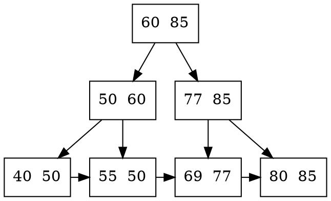

## 7.1 查找的基本概念
1. 查找,查找成功,查找失败
2. 查找表(查找结构),用于查找的数据集合
   1. 查询特定数据
   2. 检索满足条件的数据
   3. 插入数据
   4. 删除数据
3. 静态查找表, 若一个查找表只涉及上述操作1,2 ,则无需动态修改查找表
4. 关键字 唯一标识该元素的某个数据项的值
5. 平均查找长度(ASL),比较次数的平均值,概率×查找长度

## 7.2 顺序查找和折半查找
### 7.2.1 顺序查找
又称线性查找

#### 一般线性的顺序查找
哨兵,数组某端添加额外key,使得不必判断数据越界问题

不是很需要呢...
#### 有序的顺序查找

### 7.2.2 折半查找
又称二分查找

最小比较次数为1，例如[1，2，3]二分查找2。

最大比较次数为log_2(n)(向下取整) + 1 ，

### 7.2.3 分块查找
又称索引顺序超找

将查找表分为若干子块,块内元素可以无序,但块之间是有序的

## 7.3 B树和B+树
### 7.3.1 B数及其操作
B树,又称多路平衡查找树
B树中所有节点的孩子个数的最大值称为B树的阶,通常用m表示
一颗m阶B树或为空树

特性:
1. 树中每个节点至多有m棵子树,即至多还有m-1个关键字
2. 若根节点不是终端节点,则至少有两棵子树,一个关键字
3. 除根节点外的所有非叶节点至少有 ⌈ m/2 ⌉ 棵子树,即至少含有⌈ m/2 ⌉ - 1 个关键字
4. 所有非叶节点的结构如下:
   1. n,p0,k1,p1,k2,p2,...,kn,pn
   2. 其中ki为节点的关键字,满足k1<k2<...kn
   3. pi为指向子树根节点的指针,且pi-i所指子数中所有节点的关键字均小于ki,pi所指子树中所有节点关键字均大于ki,n为节点中关键字的个数
5. 所有叶节点都出现在同一层次上,且不带信息?(空指针)

B树是所有节点的平衡因子均为0的多路平衡查找树

空叶节点表示查找失败

#### B树的高度(磁盘存取次数)
高度不包括最后不带任何信息的叶节点所处的那一层

若n≥1,则对任意一棵包含n个关键字,高度为h,阶数为m的B树
h≥logₘ(n+1)

$h≥log_{⌈ m/2 ⌉}((n+1)/2)+1$ 

#### B树的查找
在B树中找节点
在节点中找关键字

#### B树的插入
定位,利用B树查找算法,找到插入该关键字的最底层的某个非叶节点,插入位置一定是最底层中的某个非叶节点
插入,插入后的节点关键字小于m可以直接插入,若插入后的节点关键字个数大于m-1,此时必须对节点进行分裂

分裂方法::star:
确一个新节点,在插入key后的原节点,从中间位置(⌈ m/2 ⌉)将其中的关键字分为两部分
做不份包含的关键字放在元节点中,右部分的关键字放到新节点中
中间位置的节点插入原节点的父节点.
若此时导致其父节点的关键字个数也超过了上限,则继续进行这种分裂操作

#### B树的删除
要使删除后的节点中的关键字个数≥⌈ m/2 ⌉-1,因此涉及节点的合并问题

当被删关键字k不在终端节点(最底层非叶节点),
可用k的前驱(或后继)k'来替代k
然后在相应节点中删除k',关键字k'必定落在某个终端节点中,则转换成了被删关键字在终端节点中的情形

当被删关键字在终端节点,有下列三种情况:
1. 直接删除关键字
2. 兄弟够借,父子换位,父节点关键字替代删除节点的,兄弟节点的替代原父节点关键字
3. 兄弟不够借,删除后与兄弟节点与双亲节点中的关键字进行合并

若在合并过程中,双亲节点中的关键字会减一
若双亲节点是根节点,且关键字个数减少至0,直接将根节点删除,合并后的新节点成为根
若父节点不是根节点,且关键字个数减少到⌈ m/2 ⌉-2,则又要与它自己的兄弟节点进行调整或合并操作,
并重复上述步骤,直至符合B树的要求为止

### 7.3.2 B+数的基本概念
B+树是应数据库所需二出现的一种B树的变形树

一棵m阶的B+树需满足下列条件:
1. 每个分支节点最多有m棵子树
2. 非叶根节点至少有两棵子树,其他每各分支节点至少有⌈ m/2 ⌉棵子树
3. 节点的子树个数与关键字个数相等
4. 所有叶节点包含全部关键字及指向相应记录的指针,叶节点中将关键字按大小顺序排列,并且相邻叶节点按大小顺序相互链接起来
5. 所有分支节点(可视为索引的索引)中仅包含它的各个子节点中关键字的最大值及指向其子节点的指针

B+树中叶节点包含全部关键字,所有非叶节点仅起索引作用,
非叶节点中的每个索引项只含有对应子树的最大关键字和指向该子树的指针,不含有该关键字对应记录的存储地址

B+树中,每个关键字对应一棵子树

B+树可以进行两种查找运算
一种是从最小关键字开始的顺序查找
另一种是从根节点开始的多路查找

## 7.4 散列表
### 7.4.1 散列表的基本概念
散列函数: 一个把查找表中的关键字映射成该关键字对应的地址的函数,记为Hash(key) = Addr
散列函数可能会把两个或两个以上的不同关键字映射到同一地址,称这种情况为冲突
这些不同的关键字称为同义词

散列表: 根据关键字而直接进行访问的数据结构,也就是说,散列表建立了关键字和存储地址之间的一种直接映射关系

### 7.4.2 散列函数的构造方法
需要注意
1. 散列函数的定义域必须包含全部需要存储的关键字,而值域的范围则依赖于散列表的大小或地址范围
2. 散列函数计算出来的地址应该能等概率,均匀地分布在整个地址空间中,从而减少冲突的发生
3. 散列函数应尽量简单

常用散列函数
#### 直接定址法
直接取关键字的某个线性函数值为散列地址,散列函数为
H(key) = key 或 H(key) = a×key+b

适合关键字的分布基本连续的情况

#### 除留余数法
假定散列表表长m,取一个不大于m但接近或等于m的质数p,利用以下公式吧关键字转换成散列函数
H(key) = key%p

#### 数字分析法
选取数码分布较为均匀的若干位作为散列地址

适合于已知的关键字集合,

#### 平方取中法
去关键字平方值的中间几位作为散列地址
### 7.4.3 处理冲突的方法
Hᵢ 表示处理冲突中第i次探测得到的散列地址

#### 开放定址法
可存放新表项的空闲地址既指向它的同义词表项,又向它的非同义词表项开放,
其数学地推公式为

$H_i = (H(key)+d_i) \% m$ 
dᵢ 为增量序列
通常有4种取法
1. 线性探测法
   1. dᵢ = 0,1,2,3,...,m-1
   2. 会造成元素在相邻的散列地址上 聚集 起来
   3. 在原有值的基础上逐渐加 
2. 平方探测法
   1. dᵢ = 0²,1²,-1²,2²,-1²,...k²,-k²,其中k≤m/2,
   2. 散列表长度m必须是一个可以表示成4k+3的素数,又称二次探测法
   3. 缺点是不能探测到散列表上的所有单元
3. 再散列法
   1. dᵢ = Hash₂(Key)时,称为再散列法,又称双散列法
   2. Hᵢ =(H(key)+i×Hash₂(key)) % m
4. 伪随机序列法
   1. dᵢ = 伪随机序列

在开放定址的情形下,不能删除表中已有元素,
因此要删除一个元素时,可以给它做一个删除标记,进行逻辑删除

需要定期维护散列表,把删除标记的元素实际删除掉

#### 拉链法(链接法,chaining)
把所有同义词存储在一个线性链表上
适用于经常进行插入和删除的情况

### 7.4.3 散列查找及性能分析
1. 检测查找表中地址为Addr的位置上是否有记录
   1. 若无记录,返回查找失败
   2. 若有记录,比较它与key的值,
      1. 若相等,则返回查找成功标志,
      2. 否则,执行步骤 2
2. 用给定的处理冲突方法计算 下一个散列,并把Addr置为此地址,转入步骤 1 

散列表的查找效率取决于三个因素: 散列函数,处理冲突的方法 和 装填因子
装填因子a: $a = \frac{表中记录数n}{散列表长度m}$

散列表的平均查找长度依赖于散列表的装填因子,而不直接依赖于n或m

## 归纳总结
## 思维拓展
