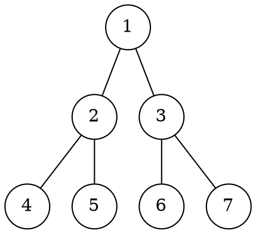
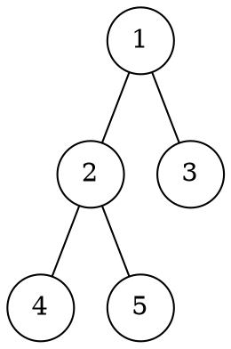
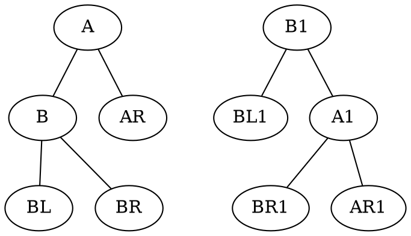
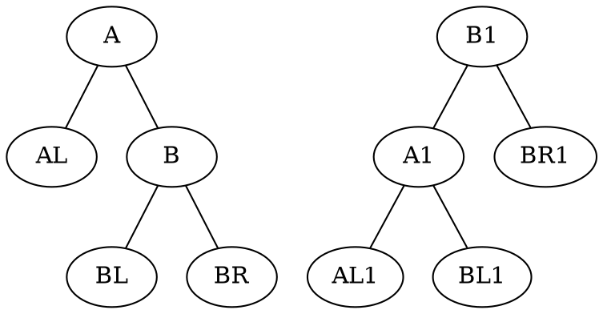
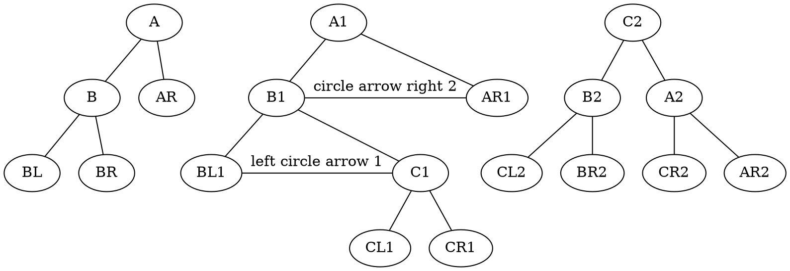
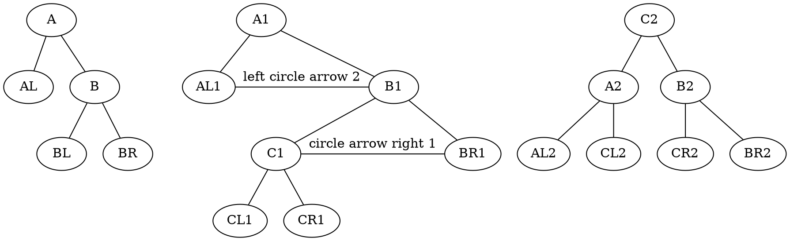

## 5.1 树的基本概念
### 5.1.1 树的定义
树是有n个节点的有限集
当n=0时,称为空树
在任意一棵非空树中应满足
1. 有且仅有一个特定的称为节点的根
2. 当n>1时,其余节点可以分为m(m>0)个互不相交的有限集,其中每个集合本身又是一颗树,并且称为根的子树

显然树的定义是递归的,有两个特点
1. 树的根节点没有直接前驱,除根节点外的所有节点有且仅有一个前驱
2. 数中所有节点可以有零个或多个后继

### 5.1.2 基本术语
1. 祖先,子孙,双亲,孩子,兄弟
2. 一个节点的孩子的个数称为该节点的**度**,树中节点的最大度上称为树的度
3. 度大于零的节点称为分支节点,度为0的节点称为叶子节点,每个节点的分支数就是该节点的度
4. 节点的深度,高度和层次
   1. 节点的层次,从树根开始定义,根节点为第一层,它的子节点为第二层,以此类推,双亲在同一层的节点互为堂兄弟
   2. 节点的深度,从根节点自顶向下逐层累加
   3. 节点的高度,从叶节点自低向上逐层累加的
   4. 数的高度(或深度),是节点的最大层数
5. 有序和无序树,有序树不能互换子树次序
6. 路径和路径长度
   1. 两节点之间的路径有这两个节点之间所经过的节点序列构成的
   2. 路径长度是路径上所经过的边的个数
7. 森林,m(m≥0)棵互不相交的树的合集

### 5.1.3 树的性质 :star:
1. 树中节点数等于所有节点的度加1
2. 度为m的树中第i层上至多有 $m^{i-1}$ 个节点 (i≥1)
3. 高度为h的m叉树至多有$(m^h-1)/(m-1)$个节点,等比
4. 具有n个节点的m叉数的最小高度为 $\lceil log_m(n(m-1)+1) \rceil$ 

## 5.2 二叉数的概念
### 5.2.1 二叉树的定义及其主要特征
#### 二叉树的定义
二叉树是有序树

二叉树与度为2的有序树的区别
1. 度为2的树至少有3个节点,而二叉树可以为空
2. 二叉树无论其孩子是否是两个,都要确定左右次序

#### 几个特殊的二叉树
##### 满二叉树
约定编号从根节点器,自上而下,自左向右
对于编号为i的节点,若有父节点,则其父节点为\floor{i/2}
若有左子节点,则左子节点为2i,有字节点为2i+1

##### 完全二叉树
当且仅当每隔节点都与高度为h的满二叉树中编号为1∼n的节点一一对应是,称为完全二叉树

特点:
1. 若 i ≤ ⌊n/2⌋ ,则节点i为分支节点,否则为叶子节点
2. 叶子节点只可能在层次最大的两层上出现,对于最大层次中的叶子节点,都依次排列在该层最左边的位置上
3. 若有度为1的节点,则只可能有一个,而且该节点只有左孩子,而无右孩子:star:
4. 按层编号后,一旦出现某节点为叶子节点,或只有左孩子,则编号大于它的节点均为叶子节点
5. 若n为奇数,则每个分支节点都有左右孩子;若n为偶数,则编号最大的分支节点(n/2)只有左孩子

##### 二叉排序树
左子树中所有节点的关键字均小于根节点的关键字,
##### 平衡 二叉树
树上任一节点的左子树和右子树的深度之差不超过1
#### 二叉树的性质 :star:
非空二叉树上的叶子节点数等于度为2的结点数加1 $n_0 = n_2 + 1$  :star: 
总节点数 =  分支总数 + 1
分支总数 = n₁+2n₂

非空二叉树上第k层至多有 $2^{k-1}$  个节点 (k ≥ 1)

高度为h的二叉树至多有2ʰ-1 个节点 (h≥1)

对**完全二叉树**按从上到下,从左到右的顺序依次编号,则有以下关系
1. i为偶数,节点为左孩子,i为奇数,节点为右孩子
2. 2i ≤ n 时, 节点i的左孩子编号为2i,否则无左孩子
3. 当2i+1≤n,节点i的右孩子编号为2i+1
4. 节点i所在层次为 ⌊ log₂i⌋+1

具有n个节点的完全二叉树的高度为 ⌈log₂(n+1) ⌉ 或 ⌊log₂n ⌋ + 1

### 5.2.2 二叉树的存储结构
#### 顺序存储结构
即将完全二叉树上编号为i的节点元素存储在一维数组下标为i-1的分量中

#### 链式存储结构
lchild data rchild

## 5.3 二叉树的遍历和线索二叉树
### 5.3.1 二叉树的遍历
序 指的是根在何时被访问

#### 先序遍历
#### 中序遍历
#### 后序遍历
#### 递归算法和非递归算法的转换
#### 层次遍历
从上往下,从左往右
#### 由遍历序列构造二叉树
先序遍历中,第一个节点一定是二叉树的根节点
中序遍历中,根节点必然将中序序列分割成两个子序列,前一个子序列是根节点的左子树,...

在先序序列中,左子序列的第一个节点是左子树的根节点

若只知道先序和后序,无法唯一确定一颗二叉树 :star:
层序和中序也可唯一确定一棵二叉树

### 5.3.2 线索二叉树
#### 线索二叉树的基本概念
n个节点的二叉树中,总空指针数为 n+1

规定,若无左子树,令lchild指向其前驱节点,若无右子树,则,令rchild指向其后继节点

附加标志位,指示指针是指向前驱与否
线索链表
指向前驱和后继的指针称为线索 

#### 中序线索二叉树的构造
p.lchild = pre

pre.rchild = p

为方便可在二叉树的线索链表上也添加一个头节点,令其lchild域的指针指向二叉树的根节点,rchild域的指针指向中序访问的最后一个节点

#### 中序线索二叉树的遍历
while p.ltag==0:
    p = p.lchild

    if p.rtag==0:
        return Firstnode(p.rchild)
en,c还是python呢

#### 先序线索二叉树和后序线索二叉树
后序线索二叉树较复杂

## 5.4 树,森林
### 5.4.1 树的存储结构
不特指二叉树
#### 双亲表示法
连续空间
每个节点增设一个伪指针

#### 孩子表示法
将每个节点的孩子节点都用单链表链接起来形成一个线性结构

#### 孩子兄弟表示法
又称二叉树表示法

节点包括三部分内容,节点值,指向节点第一个孩子节点的指针,指向节点下一个兄弟节点的指针

方便实现树转二叉树

若为每一个节点增设一个parent域指向其父节点,则查找节点的父节点也很方便

### 5.4.2 树,森林,二叉树的转换
树转换为二叉树的规则:
每个节点左指针指向它的第一个孩子
右指针指向它在树中的相邻的右兄弟
这个规则又称左孩子右兄弟

树转二叉树的画法:
在兄弟节点之间加一条线
对每个节点只保留它与第一个孩子的连线
以树根为轴心,顺时针↻ 旋转45° 

森林转二叉树
将第二棵树对应的二叉树单调工作第一棵二叉树根的右子树,将第三棵数对应的二叉树当作第二棵二叉树的右子数

递归拼合,由右往左
### 5.4.3 树和森林的遍历
...

数的后根遍历与相应二叉树的中序遍历序列相同

### 5.4.4 树的应用,并查集
双亲表示数组

数组顺序标识为元素
内容为父节点

## 5.5. 树与二叉树的应用
### 5.5.1 二叉排序树(BST)

#### 二叉排序树的定义
二叉排序树,也称二叉查找树,具有依下特征
1. 若左子树非空,则左子树上所有节点的值均小于根节点的值
2. 若右子树非空,则右子树上所有节点的值均大于根节点的值
3. 左右子树也分别是一棵二叉排序树

#### 二叉排序树的查找
#### 二叉排序树的插入
#### 二叉排序树的构造
#### 二叉排序树的删除
1. 若被删除节点是叶节点,则直接删除
2. 若节点z只有一颗子树,则让z的子树称为s复节点的子树代替z的位置
3. 若节点z有左右子数,则领z的直接后继(或直接前驱),替代z,然后从二拆排序数中删除这个直接后继(或直接前驱),这样就转换成了第一或第二种情况
(中序第一个子女)
#### 二叉排序树的查找效率分析
若二叉排序数的左右子数的高度差的绝对值不超过1,则称为平衡二叉树
平均查找长度为o(log₂n)
插入删除o(n)

### 5.5.2 平衡二叉树

#### 平衡二叉树的定义
若二叉排序数的左右子数的高度差的绝对值不超过1,则称为平衡二叉树,简称平衡树

平衡因子 左减右
#### 平衡二叉树的插入

##### LL平衡旋转(右单旋转)
由于在节点A的左孩子L的左子树L上插入了新节点,导致A为根的子树失去平衡

需要将A的左孩子B上右上旋转代替A称为根节点
将A节点向右下旋转成为B的右子树的根节点,而B的原右子树则作为A节点的左子树

##### RR平衡旋转(左单旋转)
节点A的右孩子的右子树上插入了新的节点

将A的右孩子项左上旋转代替A成为根节点,将A节点项左下旋转称为B的左子树,二B 的原左子树则作为A节点的右子树

##### LR平衡旋转(先左后右双旋转)
由于在A 的左孩子的右子树上出入新节点

先将A节点的左孩子B的右子树的根节点C向上旋转提升到B节点的位置,然后把该C节点向右上旋转提升到A节点的位置

##### RL平衡旋转(先右后左双旋转)

平衡顺序与查找顺序相反?

从根向下,依次恢复平衡

LR和RL旋转时,新节点究竟是插入C的左子树还是插入C的右子树不影响旋转过程 :start:
单旋没有这个顾虑?

#### 平衡二叉树的查找
与二叉排序树相同

非叶节点的平衡因子均为1的平衡二叉树,计算总节点的公式为
$C_n = C_{n-1}+C_{n-2}+1$ 

### 5.5.3 哈夫曼树和哈夫曼编码
#### 哈夫曼数的定义
权值
带权路径长度 ∑wᵢlᵢ
w是权值
l是该叶节点到根节点的路径长度

#### 哈夫曼数的构造
给定n个权值的节点,构造哈夫曼数的算法描述如下
1. 将n个节点作为n棵仅含一个节点的二叉树,构成森林F
2. 构造一个新节点,从F中选取两个根节点全职最小的数作为新节点的左右子数,并且将新节点的全职置为左右子树上权值之和
3. 从F中删除刚刚选出的两颗树,同时将新街点加入F中
4. 重复 2 和 3 ,直到F中只剩下一棵树为止

特点如下:
1. 每个初始节点都将称为叶节点,且权值越小的节点到根节点的路径长度越大
2. 共新建n-1个节点,因此哈夫曼树的节点总数为2n-1
3. 哈夫曼树中不存在度为1的节点

哈夫曼树不为一,但带权路径一定相同
#### 哈夫曼数的编码

## 归纳总结

## 思维拓展