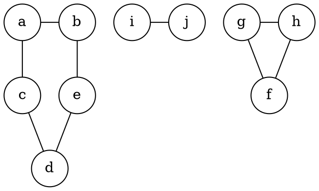
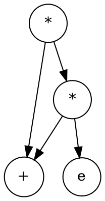

## 6.1 图的基本概念
### 6.1.1 图的定义
顶点集V和边集E

图不可以是空图,顶点集一定非空

#### 有向图
若E是有向边(也称弧)的有限集合时,则图G为有向图
弧是顶点的有序对,计为<v,w>,其中v,w是顶点,
v称为弧尾,w称为弧头

#### 无向图
若E是无向边(简称边)的有限集合,则图G为无向图
边是顶点的无序对,记为(v,w)

#### 简单图
若一个图G满足
1. 不存在重复边
2. 不存在顶点到自身的边

则图G称为简单图

数据结构中仅讨论简单图

#### 多重图
若图G中某两个节点之间的边数多于一条,有允许顶点通过同一条边和自己关联,则G为多重图

#### 完全图(简单完全图)
有n(n-1)/2条边的无向图称为完全图,
在完全图中任意两个顶点之间都存在边

#### 子图
设有两个图G-(V,E),G' = (V',E'),
若V'是V的子集,E'是E的子集,则称G'是G的子图

若有满足V(G') = V(G) 的子图,则其为G的生成子图

#### 连通,连通图,和连通分量
在无向图中,若从顶点v到顶点为有路径存在,则称v和w是连通的

若图G中任意两个顶点都是连通的,则称图G为连通图,否则称为非连通图(连通不是存在边,比完全图弱)

无向图中的极大连通子图称为连通分量

若一个图有n个顶点,且边数小于n-1,则此图必是非连通图

N个顶点的连通图至少要有（N-1）条边（也就是树）才能保证图可能为连通图.

N个顶点的连通图至少要有(N-1)(N-2)/2 +1条边才能保证图在**任何情况下**为连通图.
(N-1个顶点完全图加一条边连最后一个顶点)

极大连通子图是无向图的连通分量,极大即要求该连通子图包含器所有的边,
极小图是既要保持图连通又要使得边数最少的子图

无向图G4

其中每个分开的都是连通分量

#### 强连通图,强连通分量
在**有向图**中若从顶点v到顶点w和从顶点w到顶点v之间都有路径,则称这两个顶点是强连通的
若图中任何一对顶点都是强连通的,则称此图为强连通图

有向图中的极大强连通子图称为有向图中的强连通分量

#### 生成树,生成森林
连通图的生成树是包含图中全部定地拿的一个极小连通子图

#### 顶点的度,入度和出度
图中每个顶点的度定义为该顶点为一个端点的边的数目

对于无向图,顶点v的度是指依附于该顶点的边的条数,计为TD(v)
无向图的全部顶点的度之和等于边数的两倍 sum TD = 2e(边数)

对于有向图,顶点v的度分为入度和出度,
入度是一顶点v为终点的有向边的数目,即为ID(v)
而出度是以顶点v为起点的有向边的数目,即为OD(v)
顶点v的度等于其入度和出度之和

有向图的全部顶点的入度之和出度之和相同

#### 边的权和网
每条边可以标上权值

这种边上带有权值的图称为带权图,也称网

#### 稠密图,稀疏图
边数很少的图称为稀疏图,反之称为稠密图

一般当图G满足|E|<|V|log|V| 时,可将G视为稀疏图

#### 路仅,路径长度和回路
顶点p到顶点器的一条路径是指顶点序列,当然关联的边也可以理解为路径的构成要素
路径上边的数目称为路径长度
第一个顶点和最后一个顶点相同的路径称为回路

若一个图有n个顶点,大于n-1条边,则此图必有回路

#### 简单路径,简单回路
在路径序列中顶点不重复出现的路径称为简单路径
除第一个顶点和最后一个顶点外,其余顶点不重复出现的回路称为简单回路

#### 距离
从顶点u出发到顶点v的最短路径若存在,则此路径的长度称为从u到v的距离,
若从u到v根本不存在路径,则记该距离为无穷(∞)

#### 有向树
一个顶点的入度为0,其余顶点的入度均为1的有向图称为有向树

存在回路的图不存在拓扑序列

## 6.2 图的存储及基本操作
### 6.2.1 邻接矩阵法
用一个一维数组存储图中顶点的信息
用一个二维数组存储图中边的信息

储存顶点之间邻接关系的二维数组称为邻接矩阵

无向图的邻接矩阵一定是一个对称矩阵

稠密图适合用邻接矩阵表示

设图G的邻接矩阵为A,Aⁿ的元素Aⁿ[i][j]等于有顶点i到j的长度为n的路径的数目

### 6.2.2 邻接表法
当一个图为稀疏图时,使用邻接表较好

对图G中每隔顶点建立一个单链表,第i个单链表中的节点表示依附于顶点v的边
这个单链表就称为顶点v的边表

顶点域 边表指针
data firstarc

邻接点域 指针域
adjves nextarc

特点:
1. 若G为无向图,所需存储空间为O(V+2E);若G为有向图,所需存储空间为P(V+E)
2. 对于稀疏图,采用邻接表更好
3. 邻接表好找邻边,邻接矩阵好找路径
4. 求度
5. 图的邻接表不唯一

对于DFS,BFS遍历来说，时间复杂度和存储结构有关：
1.若采用邻接矩阵存储，时间复杂度为O(n^2);
2.若采用邻接链表存储，时间复杂度为O(n+e);

### 6.2.3 十字链表
十字链表是有向图的一种链式存储结构

顶点节点
data firstin firstout

弧节点
tailvex headvex hlink tlink info
hlink 指向弧头相同的下一条弧
tlink 指向弧尾相同的下一条弧

### 6.2.4 邻接多重表
邻接多重表是无向图的一种链式存储结构

mark ivex ilink jvex jlink info
mark 为标志域,可以标记该边是否被搜索过
ivex,jvex 为该边依附的两个顶点在图中的位置
ilink 指向下一条依附与顶点ivex的边
jlink 指向下一条依附与顶点jvex的边
### 6.2.5 图的基本操作
...
## 6.3 图的遍历

### 6.3.1 广度优先搜索
BSF 

#### BFS 算法的性能分析
#### BFS 算法求解单源最短路仅

#### 广度优先生成树

### 6.3.2 深度优先搜索
DFS
#### DFS 算法的性能分析
#### 深度有限的生成树和生成森林
### 6.3.3 图的遍历与图的连通性
图的遍历可以用来判断图的连通性
对于无向图来所,若其是连通的,则从任意节点出发,仅需一次遍历就能访问图中的所有节点

对有向图来说,若从初始点到图中每个顶点都有路径,则能够访问到图中所有节点

## 6.4 图的应用
### 6.4.1 最小生成树
带权树
最小生成树 树形不唯一
最小生成树权值之和唯一
#### Prim 算法
类似于最短路的Dijkstra算法
1. 任取一顶点加入树T
2. 之后选择一个与当前T中顶点集合距离最近的顶点,并将该顶点和相应边加入T

每次操作后T中的顶点与边数都增加1
指导图中所有顶点加入T,得到的T就是最小生成树
时间复杂度 O(V^2)
适用于求边稠密图的最小生成树

#### Kruskal 算法
按权值的递增次序选择合适的边来构造最小生成树

不断选取当前未被选取过且权值最小的边,若该边连接的顶点落在T中不同的连通分量上,则将次边加入T,否则就舍弃此边而选择下一条权值最小的边

适合边稀疏二顶点较多的图

### 6.4.2 最短路径
带权有向图最短路径
#### Dijkstra 算法求单源最短路径问题
1. 初始化,集合S初始为0,dist的初始值 dist[i] = arcs[0][j]
2. dist[j] = min(dist[i]); 选择已知的到某点的最短路径,将j加入点集
3. 若 dist[j] + arcs[j][k] < dist[k],则更新关于k的路径长度
4. 重复 2∼3 步骤共n-1次,直到所有顶点都包含在S中

找最短权值连接的顶点加入顶点列表

贪心策略

边带有负权值时,Dijkstra算法不使用

#### Floyd 算法求各顶点间最短路径问题
求所有顶点之间的最短路径问题

Floyd算法的基本思想是:递推产生一个n阶方阵序列
其中 $A^{k}[i][j]$ 表示从顶点i到顶点j的路径长度,k表示绕行第k个顶点的运算不走

算法描述如下
$A^{-1}[i][j] = arcs[i][j]$ 
$A^{k}[i][j] = Min{A^{k-1}[i][j],A^{k-1}[i][k]+A^{k-1}[k][j]}$ 
经过n次迭代后,所得到的 $A^{n-1}[i][j]$就是i到j的最短路径长度

### 6.4.3 有向无环图描述表达式
有向无环图: 若一个有向图中不存在环,则称为有向无环图,简称DAG图
有向无环图是描述含有公共子式的表达式的有效工具

### 6.4.4 拓扑排序
AOV网: 若用DAG图表示一个工程,其顶点表示活动,用有向边表示活动i必须先于活动j进行的这样一种关系,则将这种有向图称为 顶点表示活动的网络,即为AOV网

拓扑排序: 
由一个有向无环图的顶点组成的序列,当且仅当满足下列条件时,称为该图的一个拓扑排序
1. 每个顶点出现且仅出现一次
2. 若顶点A在序列中排在顶点B的前面,则在图中不存在从顶点B到顶点A的路径

对AOV网进行拓扑排序的一种方法
1. 从AOV网选择一个没有前驱的顶点并输出
2. 从网中删除该顶点和所有以它为起点的有向边
3. 重复1,2 直到当前的AOV网络为空或当前网中不存在无前驱的顶点为止,后一种情况说明有向图中必然存在环

对一个AOV网,如果采用下列不走进行排序,则称为逆拓扑排序
1. 从AOV网选择一个没有后继的顶点并输出
2. 从网中删除该顶点和所有以它为终点的有向边
3. 重复1,2 直到当前的AOV网络为空 

用拓扑排序处理AOV网是,应注意以下问题
1. 入度为0的顶点,工程可以从这个顶点所代表的活动开始或继续
2. 若一个顶点有多个直接后继,则拓扑排序结果通常不唯一
3. 可以按拓扑排序的结果重新生成编号

### 6.4.5 关键路径
在带权有向图中,以顶点表示事件,以有向边表示活动,一边上的权值表示完成该活动的开销,称之为用边表示活动的网络,简称AOE网

AOE网有两个性质
1. 只有某顶点所代表的时间发生后,从该顶点出发的其他活动才能开始
2. 只有在进入某顶点的各有向边所代表的活动都已结束时,该顶点所代表的时间才能发生

开始顶点(源点)
结束顶点(汇点)

具有最大路径长度的路仅称为关键路径,而把关键路径上的活动称为关键活动

#### 事件vₖ的最早发生时间ve(k)
指从源点v1到顶点vk的最长路径长度

ve(源点) = 0
ve(k) = Max{ve(j)+Weight(vj,vk)},vk为vj的任意后继,Weight(vj,vk)表示<vj,vk>上的权值
计算ve的值时,按从前往后的顺序进行,可以在拓扑排序的基础上计算
初始时,令ve[1...n] = 0
输出一个入度为0的顶点vj时,计算它所有直接后继顶点vk的最早发生时间
v[k] = Max{ve[j]+Weight(vj,vk),v[k]}
以此类推,直到输出全部顶点

#### 事件vₖ的最迟发生时间vl(k)
它是指在不推迟整个工程完成时间的前提下,即保证它的后继时间vj在其最迟发生时间vl(j)能够发生时,该时间最迟必须发生的时间,可以用下面的递推公式来计算:
vl(汇点) = ve(汇点)
vl(k) = Min{vl(j)-Weight(vk,vj)},vk为vj的任意前驱

从后往前计算

过程如下:
初始时,令vl[1...n] = ve[n]
vl[k] = Min{vl[j] - Weight(vk,vj),vl[k]}

#### 活动aᵢ的最早开始时间e(i)
它是指该活动弧的起点所表示的时间的最早发生时间
若<vk,vj>表示活动ai,则有e(i) = ve(k)
#### 活动aᵢ的最迟开始时间l(i)
表示该活动弧的终点所表示事件的最迟发生时间与该活动所需的时间之差
若边<vk,vj>表示活动ai,则有l(i) = vl(j) - Weight(vk,vj)

#### 一个活动aᵢ的最迟开始时间l(i)和其最早开始时间e(i)的差额d(i) = l(i)-e(i)
指该活动的时间余量
活动可拖延的时间
若时间余量为零,则说明该活动必须要如期完成,否则会拖延整个工程的进度
所以称l(i) -e(i) = 0 的活动ai是关键活动

求关键路径的算法步骤:
1. ve,事件最早发生时间,从前往后,取最大值(前驱要全开始,所以取最大值)
2. vl,事件最迟发生时间,从后往前,取最小值(后继要按时开始,所以取最小值)
3. e ,边(活动)最早开始时间,与 ve 起点事件(顶点) 对应
4. l ,边(活动)最迟开始时间,是 vl 终点事件(顶点) 减去 边的权值
5. d,d=0的活动构成关键路径

注意:
关键路径上的所有活动都是关键活动
网中的关键路径不唯一,只有加快那些包括在所有关键路径上的关键活动才能达到缩短工期的目的

## 归纳总结
