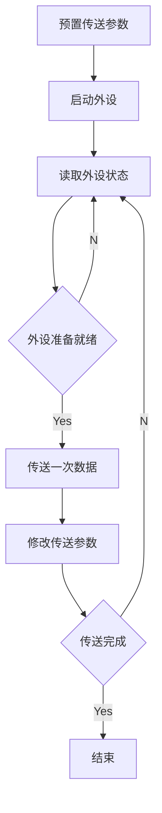

## 7.1 IO系统基本概念
基本概念
1. 外部设备
2. 接口
3. 输入设备
4. 输出设备
5. 外存设备

一般来说IO系统由IO软件及IO硬件两部分构成

### 7.1.2 IO控制方式
基本的控制方式主要有以下4种
1. 程序查询方式
   1. 由CPU通过程序不断查询IO设备是否已经做好准备,从而控制IO设备与主机交换信息
2. 程序中断方式
   1. 只在IO设备准备就绪并向CPU发送中断请求时才予以响应
3. DMA方式
   1. 主存和IO设备之间有一条直接数据通路,当主存与IO设备交换信息是,无需调用中断服务程序
4. 通道方式
   1. 在系统中设有通道控制部件,每个通道都挂接若干外设,主机在执行IO命令时,只需启动有关通道,通道将执行通道程序,从而完成IO操作
其中,1,2 主要用于数据传输率较低的外部设备
3,4 主要用于数据传输率较高的设备
> IO 设备通过设备控制器与主板的系统总线相连
> 
> IO 指令是系统指令的一部分,是机器指令的一类,但为来反映特点,格式与通用格式不同

## 7.2 外部设备
### 7.2.1 输入设备
1. 键盘
   1. 查出按下的是哪个键
   2. 将改键帆西城能被主机接收的编码
   3. 将编码传送给主机
2. 鼠标
   1. 鼠标在平面上移动时,其底部传感器把运动方向与距离检测出来,从而控制光标

### 7.2.2 输出设备
#### 显示器
参数有
```yaml
屏幕大小: 以对角线长度表示,常用12∼29英寸
分辨率: 所能表示的像素个数,以宽和高的乘积表示
灰度级: 灰度越多,图像层次越清楚,逼真
刷新: 在光点消失之前再重型扫描显示一遍
刷新频率: 刷新频率大于30Hz 时才不会感到闪烁,通常显示器的频率为60∼120Hz
显示存储器(VRAM): 
    VRAM容量: 分辨率×灰度级数
    VRAM带宽: 分辨率×灰度级数×帧频
```
##### 阴极射线管(CRT)显示器
按显示信息内容不同,可分为字符显示器,图形显示器和图像显示器;
按扫描方式不同,可分为广栅扫描,和随机(任意)扫描

###### 字符显示器
将字符点阵存放在ROM构成的字符发生器中,

所需显示字符的ASCII代码被存放在视频存储器VRAM中以备刷新
###### 图形显示器 
分辨率高且显示曲线平滑,缺点是当显示复杂图形时会有闪烁感

##### 液晶显示器(LCD)
原理: 利用液晶的电光效应,由图像信号电压直接控制薄膜晶体管,再间接控制液晶分子的光学特性来实现图像的显示

特点: 体积小,重量轻,省电,无辐射,绿色环保,画面柔和,不伤眼

##### LED(发光二级管)显示器 
原理: 通过控制半导体发光二极管来显示文字,图形,图像等信息

与LCD相比,LED在亮度,空号,可视角度和刷新率上都更具有优势

#### 打印机
按工作原理,打印机分为击打式和非击打式;
按工作方式,打印机分为点阵答应即,针式打印机,喷墨打印机,激光打印机等
##### 针式打印机
特点: 针式打印机擅长多层复写打印,实现各种票据或蜡纸等的答应,原理简单,造价低廉,耗材便宜,但打印分辨率和打印速度不够高

##### 喷墨打印机
原理: 带点的墨喷雾经过电极偏转后,直接在纸上形成所需字型

特点: 打印噪音小,可实现高质量彩色打印,通常打印速度比针式快;
但防水性差,高质量打印需要专用打印纸

##### 激光打印机
原理: 计算机输出的二进制信息,经过调制后的激光扫描,在感光鼓上形成潜像,...

特点: 打印质量高,速度快,噪音小,处理能力强,但耗材多,价格贵,不能复写打印多份,且多纸张要求高

感光鼓是激光打印机的核心部件

### 7.2.3 外存储器
#### 磁盘存储器
目前主要使用磁表面储存器
指把某些磁性材料薄薄地涂在金属铝或塑料表面上作为载磁体来存放信息

磁盘存储器,磁带存储器均属于磁表面存储器

优点: 容量大,位价低;记录介质可重复使用;记录信息可长期保存,非破坏性读出,

缺点: 存取速度慢,机械结构赋值,对工作环境要求高

> 磁盘扇区中包含数据,地址,校验等信息
##### 磁盘设备的组成
磁盘:
    记录面:
        磁道:
            扇区

* 磁头数(Heads): 即记录面数
* 柱面数(Cylinders): 每面盘片上有多少磁道
* 扇区数(Sectors): 每个磁道上有多少个扇区

硬盘存储器的构成
* 磁盘驱动器 核心部件是磁头组件和盘片组件,温彻斯特盘是一种可移动磁头固定盘片的硬盘存储器
* 磁盘控制器 硬盘存储器和主机的接口,主流有IDE,SATA,SCSI


##### 磁记录原理
原理: 磁头和磁性记录介质相对运动时,通过点磁转换完成读写操作

编码方式: 

磁记录方式: 通常采用调频制(FM)和改进型调频制(MFM)的记录方式
##### 磁盘的性能指标
* 磁盘容量 
  * 非格式化 可用磁化单元总数
  * 格式化 按某种特定的记录格式所能存储信息的总量
* 记录密度
  * 道密度
  * 位密度
  * 面密度
* 平均存取时间
  * 平均寻道时间(磁头移动到目的磁道的时间)
  * 旋转延迟时间(去旋转一周时间的一半)
  * 传输时间
* 数据传输率
  * Dr = r(r转每秒)N(每个磁道容量N字节)
##### 磁盘地址
驱动器号;柱面(磁道)号;盘面号;扇区号
##### 磁盘工作过程
寻址,读盘,写盘,每个操作都对应一个控制字
硬盘工作时,第一步是取控制字,第二步是执行控制字

机械式部件,读写串行
#### 磁盘阵列
RAID(廉价冗余磁盘阵列)

总之RAID 通过同时使用多个磁盘,提高了传输率与数据吞吐量
通过镜像功能,提高安全可靠性;通过数据校验,提供容错能力

#### 光盘存储器
特点: 储存密度高,携带方便,成本低,容量大,储存期限长和容易保存
光盘的类型如下
* CD-ROM: 只读
* CD-R: 只可写一次
* CD-RW : 可读可写,可重复读写
* DVD-ROM : 高容量CD-ROM
#### 固态硬盘
flash memory

> 汉字内码在主存中占2B

## 7.3 IO接口
IO接口是主机和外设**之间**的交换界面,通过接口可以实现主机和外设之间的信息交换

### 7.3.1 IO接口的功能
1. 实现主机和外设的通信联络控制
2. 进行地址译码和设备选择
3. 实现数据缓冲
4. 信号格式转换
5. 传送控制命令和状态信息

### 7.3.2 IO接口的基本结构

### IO接口的类型
* 数据传送方式(外设和接口一侧的传送方式)
  * 并行接口
  * 串行接口
  * 接口要完成数据格式的转换
* 主机访问IO设备的控制方式 
  * 程序查询接口
  * 中断接口
  * DMA接口
* 功能选择的灵活性
  * 可编程接口
  * 不可编程接口


### IO端口及其编址
IO端口是指接口电路中可被CPU直接访问的寄存器,主要有数据端口,状态端口,控制端口
若干端口加上相应的控制逻辑电路组成接口

通常,CPU能对数据接口读写,但对状态端口只能读,对控制端口只能写
状态与控制可以合一...

IO端口想要能够被CPU访问,就必须对各个端口进行编号,每隔端口对应一个端口地址
而对IO端口的编制方式有与存储器同一编址,和对立编址两种

IO端口是指IO接口中用于缓冲信息的寄存器

CPU使用数据总线在CPU寄存器和端口之间传输数据


#### 统一编址
指把IO端口当作存储器单元进行地址分配

使用访存指令来完成输入/输出操作

#### 独立编址
IO映射方式,
IO端口的地址空间与主存地址空间是两个独立的地址空间

用专门的输入输出指令来完成输入输出操作

优点: 输入输出指令与存储器指令有明显区别

缺点: 输入输出指令少,一般只能对端口进行传送操作,增加了控制的复杂性

## 7.4 IO 方式
### 7.4.1 程序查询方式
信息交换的控制完全由主机执行程序实现,程序查询方式接口中设置了一个数据缓冲寄存器(数据端口).
主机进行IO操作时,先发出询问信号,读取设备的状态并根据设备状态决定下一步操作究竟是进行数据传送还是等待


特点: CPU有踏步等待现象,CPU与IO串行工作,设计简单,设备量少,花费时间多,一段时间只能和一台外设交换信息

### 7.4.2 程序中断方式

#### 中断的基本概念
中断的作用如下
1. 实现CPU与IO设备的并行工作
2. 处理硬件故障及软件错误
3. 实现人际交互
4. 实现多道程序,分时系统,
5. 实时处理需要用中断系统来实现快速响应
6. 实现应用程序和操作系统的切换,称为软中断
7. 多处理器系统中各处理器之间的信息交流和任务切换

在可以响应中断的条件下,CPU暂时中止正在执行的程序,转去执行中断服务程序为外设服务


#### 程序中断方式工作流程
##### 中断请求
###### 内中断与外中断
外中断是指来自处理器和内存以外的部件引起的中断,一般称为中断()

内中断主要指在处理器和内存内部产生的中断,包括
运算错误,地址非法,检验错,页面失效,存取访问控制错,算术操作溢出,数据格式非法,除数为零,非法指令,用户执行特权指令,时间片中断和核心态切换

###### 硬件中断与软件中断
硬件中断: 通过外部硬件差生的中断(外中断)

软件中断: 通过某条指令产生的中断,可编程实现(内中断)


###### 非屏蔽中断和可屏蔽中断
都是硬件中断,外中断

##### 中断判优
一般来说 硬件顾站中断 > 软件中断;
非屏蔽 > 可屏蔽;
DMA > IO传送中断;
高速设备 > 低速设备;
输入设备 > 输出设备;
实时设备 > 普通设备;

##### CPU响应中断的条件
1. 中断源有中断请求
2. CPU允许中断及开中断
3. 一条指令执行完毕,且没有更紧迫的任务

> CPU响应中断在每条指令执行结束后(外中断)


##### 中断隐指令
CPU响应中断后,经过某些操作,转去执行中断服务程序.这些操做由硬件直接实现,称它为中断隐指令
它不是指令系统中的一条真正指令,没有操作码

它所完成的操作如下
1. 关中断
2. 保存断点 (将PC的内容保存起来(原来程序的断点))
3. 引出中断服务程序 (取出中断服务程序的入口地址并传送给程序计数器(PC))


##### 中断向量
中断服务程序的入口即中断向量

系统中全部中断向量集中放在存储器的某个区域内,这个存储区域就成为中断向量表

CPU响应中断后,中断硬件会自动将中断向量地址传送到CPU,有CPU负责程序的切换
称为中断向量法

##### 中断处理过程
由中断隐指令+中断服务程序组成


1. 关中断
2. 保存断点
3. 引出中断服务程序(以上由硬件完成)
4. 保存现场和屏蔽字 (程序状态字,中断屏蔽寄存器和CPU某些寄存器的值)
5. 开中断 (允许更高级中断请求)
6. 执行中断服务程序
7. 关中断 (保证在恢复现场和屏蔽字时不被打断)
8. 恢复现场和屏蔽字
9. 开中断,中断返回

> 恢复现场值在中断返回前,必须将寄存器的内容恢复到中断处理前的状态,这部分工作由中断服务程序完成.
> 中断返回由中断服务程序的最后一条中断返回指令完成

1~3,硬件自动(中断隐指令)完成的
4~9 有中断服务程序完成

##### 多重中断和中断屏蔽技术
单重中断(单级中断): 中断期间又出现了新的更高优先级的中断请求,而CPU对新的中断请求不予相应

多重中断: 对新高中断响应,又称 中断嵌套

中断屏蔽技术主要用于多重中断.
CPU要具备多重中断的功能必须满足下列条件
1. 在中断服务程序中提前开中断指令
2. 优先级别高的中断源有权中断优先级别低的中断源

每个中断源都有一个屏蔽触发器,1表示屏蔽该中断源的请求,0表示可以正常申请
所有屏蔽字触发器组合在一起便构成一个屏蔽字寄存器,
屏蔽字寄存器的内容称为屏蔽字

中断源对应不同屏蔽字,来确定有优先级

### 7.4.3 DMA 方式
DMA 方式是一种完全由硬件进行成组信息传送的控制方式,
它具有程序中断方式的优点,即在数据准备阶段,CPU与外设并行工作
DMA方式在外设与内存之间开辟一条 直接数据通路 

适用于磁盘次,磁带机等告诉设备大批量数据的传送,它的硬件开销比较大
在DMA方式中,中断的作用仅限与故障和正常传送结束时的处理

#### DMA方式的特点
1. 使主存与CPU的固定联系脱钩
2. 数据传送,主存地址确定,传送数据的计数都由硬件电路直接实现
3. 主存中要开辟专用缓冲区,及时供给和接受外设的数据
4. DMA传送速度快,CPU和外设并行工作,提高了系统效率
5. DMA在传送开始前要通过程序进行预处理,结束后要通过中断方式进行后处理


#### DMA控制器的组成
通过DMA控制器项CPU提出DMA传送请求,CPU响应后将让出系统总线,有DMA控制器接管总线进行数据传送,主要功能如下
1. 接受外设发出的DMA请求,并向CPU 发出总线请求
2. CPU响应此总线请求,发出总线响应信号,接管总线控制权,进行DMA操作周期
3. 确定传送数据的主存单元地址及长度,并主动修改主存地址计数和传送长度计数
4. 规定数据在主存和外设之间的传送方向,发出读写等控制信号,执行数据传送操作
5. 项CPU报告DMA操作的结束

DMA控制器必须具有控制系统总线的能力
#### DMA的传送方式
DMA控制器与CPU通常采用以下三种方式使用主存
1. 停止CPU访问主存 CPU基本处于不工作或保持原始状态
2. DMA与CPU交替访存 适用于CPU的工作周期比主存周期长的情况
3. 周期挪用(或周期窃取)


#### DMA的传送过程
1. 预处理
   1. 由CPU完成一些必要的准备工作
2. 数据传送
   1. DMA控制
3. 后处理
   1. DMA控制器向CPU发送中断请求,CPU执行中断服务做DMA结束处理,包括检验数据,举定是否继续使用


#### DMA方式和中断方式的区别
DMA方式和中断方式的重要区别如下
1. 中断方式是程序的切换,需要保护和恢复现场;而DMA方式除了预处理和后处理,其他时候不占用CPU的任何资源
2. 中断发生在每条指令执行完毕后;二DMA请求的响应可发生在每个及其周期结束时,只要CPU不占总线
3. 中断传送过程需要CPU的干预,DMA传送不需要CPU干预
4. DMA请求的优先级高于中断请求
5. 中断方式具有对异常事件的处理能力,而DMA方式仅局限于传送数据快的IO操作
6. 从数据传送来看,中断方式靠程序传送,DMA方式靠硬件传送

## 7.6 常见问题和易混淆知识点
中断响应优先级有硬件排队线路或中断查询程序的查询顺序决定,不可动态更改

中断处理优先级可以有中断屏蔽字来改变

通道指令是通道本身的指令,用来执行IO操作,如读写磁带等操作