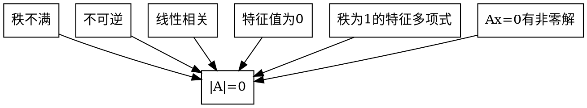

# 知识结构网格图
<!-- ```dot
graph abc{
    rankdir=LR
    node[shape=box]
    a[label="行列式"]
        aa[label="概念"]
            aaa[label="不同行不同列元素乘积的代数和"]
            aab[label="性质"]
        ab[label="展开式"]
        ac[label="计算"]
            aca[label="数字型"]
            acb[label="三角化法"]
            acc[label="公式法"]
            acd[label="递推法"]
            ace[label="抽象型"]
        ae[label="应用"]
}
```  -->

## 行列式
### 概念
- 不同行不同列元素乘积的代数和
### 性质
- 经转置后行列式的值不变,即|A^T| = |A|
- 某行(列)有公因式k,可把k提到行列式外
- 两行(列)互换,行列式变号 
> $A_1 ∼ A_2,|A_2| = -|-A_1|$ 
- 某行(列)所有元素都是两个数的和,则可写成两个行列式之和
- 某行(列)的k倍加至另一行,行列式值不变
### 展开式
$|A| = a_{i1}A_{i1} + a_{i2}A_{i2}+ ... + a_{in}A_{in}$ 

余子式: $M_{ij}$,除原行列式i行j列形成的行列式
代数余子式: $A_{ij} = (-1)^{i+j}M_{ij}$,为$a_{ij}$的代数余子式
### 计算
#### 数字型
- 三角化法
- 公式法
- 递推法
#### 抽象型
- 用行列式形式
- 用矩阵性质
- 用特征值 $|A| = ∏ \lambda_i$,相似 
### 证|A| = 0
- Ax = 0 有非零解
- 反证法
- r(A)<n
- 0是A的特征值
- |A|=-|A|
### 应用
- Ax = 0 有非零解
- 伴随矩阵求逆法
- 线性相关(无关)判定
- 可逆的证明
- 克拉默法则
- 特征值计算
- 二次型正定判定

> 主乘 减 副乘

# 基本内容与重要结论
## 基础知识
### 逆序数
一个排列中如果一个大的数排在小的数之前,就成这两个数构成一个逆序
一个排列的逆序总数称为这个排列的逆序数
### n阶行列式值计算
$=sum_{j_1j_2...j_n}(-1)^{r(j_1j_2...j_n)}a_{1j_1}a_{2j_2}...a_{nj_n}$
### 代数余子式
$A_{ij} = (-1)^{i+j}M_{ij}$,为$a_{ij}$的代数余子式


## 重要定理
### 定理1.1
n阶行列式等于它任意一行的所有元素与它门各自对应的代数余子式的乘积之和
$D = a_{k1}A_{k1}+a_{k2}A_{k2}+...+a_{kn}A_{kn}$ 

### 定理1.2
不同行的元素与代数余子式相乘为0

## 主要公式
### 上(下)三角**行列值**等于主对角线元素的乘积
### 副对角线的行列式要加 $(-1)^{\frac{n(n-1)}{2}}$ 
### 两个特殊的拉普拉斯展开式
$$
\left|
    \begin{array}{cc}
        A & * \\
        O & B
    \end{array}
\right|
= \left|
    \begin{array}{cc}
        A & O \\
        * & B
    \end{array}
\right|
= |A|*|B|
$$

$$
\left|
    \begin{array}{cc}
        O & A \\
        B & *
    \end{array}
\right|
= \left|
    \begin{array}{cc}
        * & A \\
        B & O
    \end{array}
\right|
= (-1)^{mn}|A|*|B| \\
m,n 分别是矩阵A,B的阶数
$$

### 范德蒙行列式

$$
\begin{vmatrix}
    1 & 1 & ... & 1 \\
    x_1 & x_2 & ... & x_n \\
    x_1^2 & x_2^2 & ... & x_n^2 \\
    ⋮ & ⋮ & ⋮ &⋮ \\
    x_1^n & x_2^n & ... & x_n^n  \\
\end{vmatrix} =
\prod_{1 ≤ j ≤ i ≤ n}(x_i-x_j)
$$

### 特征多项式
设A=($a_{ij}$ )是三阶矩阵,则A的特征多项式
$|λ E-A| = \lambda^3-(a_{11}+a_{22}+a_{33})\lambda^2+s_2\lambda -|A|$ 
特别地,若r(A)=1,则$|λ E-A| = \lambda^3-(a_{11}+a_{22}+a_{33})\lambda^2$
那么矩阵的特征值 $λ_1 = ∑a_{ij}λ^2,λ_2=λ_3=0$ 

其中 $
s_2=
\begin{vmatrix}
    a_{11} & a_{12} \\
    a_{21} & a_{22}
\end{vmatrix}
+
\begin{vmatrix}
    a_{11} & a_{13} \\
    a_{31} & a_{33}
\end{vmatrix}
+
\begin{vmatrix}
    a_{22} & a_{23} \\
    a_{32} & a_{33}
\end{vmatrix}
$ 

> 设A是n阶矩阵,a是n维非零列向量,若
> Aa = $\lambda$ a,a $≠ 0$
> 则称 $\lambda$ 是矩阵A的特征值,a是矩阵A属于特征值$\lambda$的特征向量
## 方阵的行列式
A,B均为n阶矩阵
- $|A^T| = |A|$
- $|kA|=k^n|A|$
- $|AB| = |A||B|$
- $|A^*| = |A|^{n-1}$
- $|A^{-1}| = |A|^{-1}$
- $|A| = \prod_{i=1}^{n}\lambda_i$ 
- 若n阶矩阵A和B**相似**,则$|A|=|B|$    

相似比等价条件多


## 克拉默法则
若**系数行列式**$D ≠ 0$
则方程有唯一解
$$
x_1 = \frac{D_1}{D},x_2=\frac{D_2}{D},\cdots,x_n=\frac{D_n}{D}, \\
其中D_j = \sum_{i=1}^{n} b_i A_{ij} =
\begin{vmatrix}
    a_{11}  & ⋯ & a_{1,j-1} & b_1 & a_{1,j+1} & ⋯ & a_{1,n} \\
    a_{21}  & ⋯ & a_{2,j-1} & b_2 & a_{2,j+1} & ⋯ & a_{2,n} \\
    ⋮  & ⋮ & ⋮ & ⋮ & ⋮ & ⋮ & ⋮ \\
    a_{n1}  & ⋯ & a_{n,j-1} & b_n & a_{n,j+1} & ⋯ & a_{n,n} \\
\end{vmatrix} \\
(j=1,2,3,4,\cdots,n) \\
j 列换成b中元素,b为线性方程组值向量
$$
将值列替换对应数字的系数列


# 典型例题分析选讲
## 数字型行列式
展开求解,拉普拉斯展开式,逐行相加(倍数),

爪型行列式,化为上下三角行列式,提取,消值

有0总是好的,直接计算也方便


## 抽象行列式
抽象**行列式**内部可以分离运算|a,b,c,d+e| = |a,b,c,d|+|a,b,c,e|

没有 $(A+B)^{-1}$ 的法则

|3a,b,c| 是可以提的
(1,2)
(3,4) 是不能提的

|3A|,其中的3是对矩阵来说的,不是对行列式来说的

|A - 2E| = 0 ,其中2是A的一个特征值

## 特征多项式
因式分解求全部

化为上下三角,直接看出特征值

## 矩阵秩的概念
$$
r(A) = r \leftrightarrow A 中有r阶子式不为0,任何r+1阶子式(若还有)必全为0 \\
r(A) < r \leftrightarrow A 中每一个r阶子式全文0 \\
r(A) >= r \leftrightarrow A 中有r阶子式不为 \\
特别地,r(A) = 0 \leftrightarrow A=O(0矩阵) \\
A ≠ O \leftrightarrow r(A)>=1 \\ 
.\\
若 A是 n阶矩阵, \\
r(A) = n \leftrightarrow |A| ≠ 0 \leftrightarrow A 可逆 \\
r(A) < n \leftrightarrow |A| = 0 \leftrightarrow A 不可逆 \\
.\\
若A是m×n阶矩阵,则r(A) \leq min(m,n)
$$

## 关于 |A|=0
秩为1的特征多项式


## 克拉默法则


# 整理


```mermaid
graph LR
a[AB=O] --> aa["B的列向量是齐次线性方Ax=0的解"]
a --> ab["r(A)+r(B)<=n"]
a --> Ax=0有非零解
```