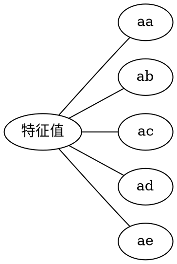
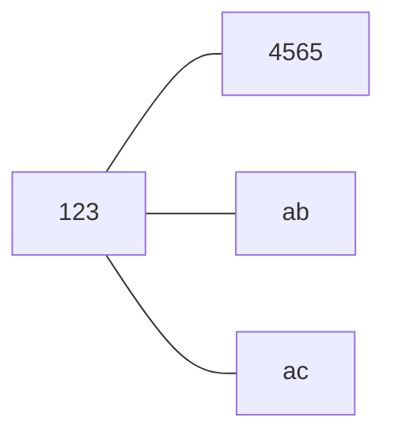

# 知识结构网格图
<!-- ```graphviz
graph abc{
    rankdir = LR
    node[shape=box width="0.5"]
    root[label=特征值]
    root -- {定义,求法,性质,相似,实对称矩阵}
        定义 -- "Aα = λα,α ≠ 0"
        求法 -- {特征值,特征向量}
        性质 -- 不同特征值的特征向量线性无关
        性质 -- k重特征值至多有k个线性无关的特征向量
        性质 -- "|A| = ∏λᵢ, ∑αᵢᵢ = ∑λᵢ"
        相似 -- {相似的定义,可对角化}
        实对称矩阵 -- {必与对角矩阵相似,可用正交矩阵对角化,不同特征值的特征向量比正交,特征值必是实数,k重特征值必有k个线性无关的__}

}
``` -->
<!-- ```mermaid
graph LR
    a[特征值] --- aa[定义]
    a[特征值] --- ab[求法]
    a[特征值] --- ac[性质]
    a[特征值] --- ad[相似]
    a[特征值] --- ae[实对称矩阵]
``` -->
```yaml
特征值:
    定义:
        Aα=λαα≠0:
    求法:
        特征值:
        特征向量:
    性质:
        不同特征值的特征向量线性无关:
    相似:
        定义:
        可对角化:
    实对称矩阵:
```





# 基本内容与重要结论
## 基础知识
定义 5.1 :
设A是n阶矩阵,如果存在一个数λ,即非零的n维列向量α,使得
Aα= λα
成立,则称λ是矩阵A的一个特征值,称非零向量α是矩阵A属于特征值λ的一个特征向量

定义 5.2 :
设 $A=[a_{ij}]$ 为一个n阶矩阵,则行列式
$|\lambda E - A|$ 称为矩阵A的特征多项式,  
$|\lambda E - A| = 0$ 称为A的特征方程呢个

> 由$A\alpha = \lambda \alpha , \alpha \neq 0 $  有
> $(λE-A)α = 0,α ≠ 0$ 
> 即α是齐次线性方程组(λE-A)x=0的非零解
> 先求特征值,再求特征值对应的线性无关的变量

定义 5.3 :
设A和B都是n阶矩阵,如果存在可逆矩阵P,使得
$P^{-1}AP = B$ 
则称矩阵A和B相似,记作A∼B
特别地,如果A能与对角矩阵相似,则称A可对角化


## 重要定理
定理 5.1 :
特征值的线性组合依旧是特征值

定理 5.2 :
$\sum \lambda_i = \sum \alpha_{ii}$ 
$|A| = \prod  \lambda_i$ 

定理 5.3 :
不同特征值对应的特征向量线性无关

定理 5.4 :
n重特征值对应的线性无关向量的个数不超过m个

定理 5.5 :
如果n阶矩阵A和B相似,则A与B有相同的特征多项式,从而A与B有相同的特征值
即若A∼B,则
|λE-A| = |λE-B|

定理 5.6 :
n阶方程A可对角化的充分必要条件是A有n个线性无关的特征向量

定理 5.7 :
若n阶矩阵有n个不同的特征值,则A可相似对角化
且 A 相似于 特征值组成的对角矩阵中

定理 5.8 :
$$
A \sim \Lambda 
\begin{aligned}
    \leftrightarrow & \lambda_i是A的n_i重特征值,则\lambda_i有n_i各线性无关的特征向量 \\
    \leftrightarrow & 秩r(\lambda_iE-A) = n-n_i,\lambda_i为n_i重特征值
\end{aligned}
$$


定理 5.9 :
实对称矩阵A的不同特征值所对应的特征向量比正交

定理 5.10 :
实对称矩阵A的特征值都是实数

定理 5.11 :
n阶实对称矩阵A比可对角化,总存在正交阵Q,使得
$Q^{-1}AQ = Q^TAQ = 特征值的对角矩阵$ 


## 主要公式
# 典型例题