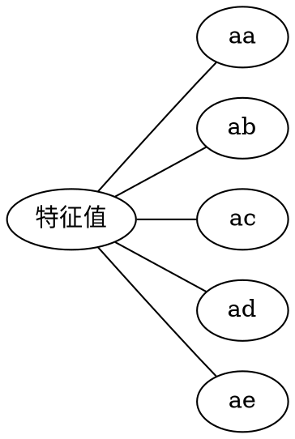
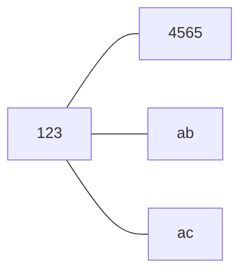

# 知识结构网格图
<!-- ```graphviz
graph abc{
    rankdir = LR
    node[shape=box width="0.5"]
    root[label=特征值]
    root -- {定义,求法,性质,相似,实对称矩阵}
        定义 -- "Aα = λα,α ≠ 0"
        求法 -- {特征值,特征向量}
        性质 -- 不同特征值的特征向量线性无关
        性质 -- k重特征值至多有k个线性无关的特征向量
        性质 -- "|A| = ∏λᵢ, ∑αᵢᵢ = ∑λᵢ"
        相似 -- {相似的定义,可对角化}
        实对称矩阵 -- {必与对角矩阵相似,可用正交矩阵对角化,不同特征值的特征向量比正交,特征值必是实数,k重特征值必有k个线性无关的向量}

}
``` -->
<!-- ```mermaid
graph LR
    a[特征值] --- aa[定义]
    a[特征值] --- ab[求法]
    a[特征值] --- ac[性质]
    a[特征值] --- ad[相似]
    a[特征值] --- ae[实对称矩阵]
``` -->
```yaml
特征值:
    定义:
        Aα=λαα≠0:
    求法:
        特征值:
        特征向量:
    性质:
        不同特征值的特征向量线性无关:
    相似:
        定义:
        可对角化:
    实对称矩阵:
```





# 基本内容与重要结论
## 基础知识
定义 5.1 :
设A是n阶矩阵,如果存在一个数λ,即非零的n维列向量α,使得
Aα= λα
成立,则称λ是矩阵A的一个特征值,称非零向量α是矩阵A属于特征值λ的一个特征向量

定义 5.2 :
设 $A=[a_{ij}]$ 为一个n阶矩阵,则行列式
$|\lambda E - A|$ 称为矩阵A的特征多项式,  
$|\lambda E - A| = 0$ 称为A的特征方程呢个

> 由$A\alpha = \lambda \alpha , \alpha \neq 0 $  有
> $(λE-A)α = 0,α ≠ 0$ 
> 即α是齐次线性方程组(λE-A)x=0的非零解
> 先求特征值,再求特征值对应的线性无关的变量
> 1. 先由|λE-A| = 0 求矩阵A的特征值λi(共n个)
> 2. 再由(λi E -A)x =0 求基础解系,即矩阵A属于特征值λi的线性无关的特征向量


### 定义 5.3 : 矩阵相似
设A和B都是n阶矩阵,如果存在可逆矩阵P,使得
$P^{-1}AP = B$ 
则称矩阵A和B相似,记作A∼B
特别地,如果A能与**对角矩阵**相似,则称A可对角化(包含对角有0的)


## 重要定理
定理 5.1 : 
特征值的线性组合依旧是特征值

定理 5.2 :
n 阶矩阵中:
$\sum \lambda_i = \sum \alpha_{ii}$ 
$|A| = \prod  \lambda_i$ 

定理 5.3 :
不同特征值对应的特征向量线性无关

定理 5.4 :
n阶矩阵中,m重特征值对应的线性无关向量的个数不超过m个

定理 5.5 :
如果n阶矩阵A和B相似,则A与B有相同的特征多项式,从而A与B有相同的特征值
即若A∼B,则
|λE-A| = |λE-B| = 0?

### 定理 5.6 : 可对角化
n阶方程A可对角化的充分必要条件是A有n个线性无关的特征向量

### 定理 5.7 : 特征值 相似对角化 
若n阶矩阵有n个不同的特征值λ1,λ2,λ3,...λn,则A可相似对角化,且
A ∼ diag([λ1,λ2,λ3,...,λn]) :star:


定理 5.8 :
n阶矩阵可相似对角化的充分必要条件是对于A的每个特征值,其线性无关的特征向量的个数恰好等于该特征值的重数,即:star:
$$
A \sim \Lambda 
\begin{aligned}
    \leftrightarrow & \lambda_i是A的n_i重特征值,则\lambda_i有n_i各线性无关的特征向量 \\
    \leftrightarrow & 秩r(\lambda_iE-A) = n-n_i,\lambda_i为n_i重特征值
\end{aligned}
$$


定理 5.9 :
实对称矩阵A的不同特征值所对应的特征向量比正交

> 实对称矩阵 : 矩阵元素都为实数,矩阵的转置等于本身


定理 5.10 :
实对称矩阵A的特征值都是实数

定理 5.11 :
n阶实对称矩阵A总可对角化,总存在正交阵Q,使得
$Q^{-1}AQ = Q^TAQ = 特征值的对角矩阵$ 


## 主要公式
# 典型例题
## 特征值,特征向量
### 数字型矩阵
计算!

### 抽象矩阵

### 相似矩阵
0 也可以是特征值

A和B相似,A和B特征值相同
|λ E - B| = ...
A不知道,所以换成B来求

### 相似,相似对角化
特征值相似对角化,用特征矩阵来代替运算

n阶矩阵可相似对角化的充分必要条件是对于A的每个特征值,其线性无关的特征向量的个数恰好等于该特征值的重数,即:star:
记住就行了


对角阵上的值为特征值
上下三角行列式(不能用等价转化,只能用原矩阵)

### 相似对角化时的可逆矩阵P
求特征值,要么原矩阵是上下三角矩阵
要么就用|λE-A|=0 来求未知量λ

非自由变量尽量选系数为1的
求A相似标准形的方法(对可对角化的矩阵)
1. 求A的特征值 λ 1,2,3
2. 对每个特征值,求(λi E -A)x = 0 的基础解系,得特征值a 1,2,3
3. 令可逆矩阵 P = [a1,2,3],则
4. $P^{-1}AP = diag(\lambda_1,\lambda_2,\lambda_3)$ 

可以用相似对角化来找到与抽象矩阵相似的矩阵,一次求元矩阵的特征值等,
相似的共性很多

求可逆矩阵使A为对角阵,实际是求特征值与对应的特征向量

认真找关系..

### 求参数的问题
仔细算
特征值与特征向量

### 用相似求Aⁿ
$若A∼Λ,则P^{-1}AP = Λ ,从而P^{-1}A^nP = Λ^n ,故A^n = PΛ^nP^{-1} $ 

### 反求矩阵A
可以简化求解

### 实对称矩阵
$A^2 = A,A^2α = λAα=λ^2α=λα = Aα$

对可对角化的矩阵加减单位矩阵可以看成是对每个特征值加减

矩阵拆分求解特征值

不正交的特征向量要Schmidt正交化


用正交矩阵把实对称矩阵A化为对角矩阵的步骤
1. 求矩阵A的特征值
2. 求矩阵A的特征向量 
3. 单位化,有可能还要正交化
4. 构造正交矩阵P(P与Λ次序要协调一致)

### 二次型的正定性

## tmp
$已知A的特征值为λ_1,λ_2,λ_3,则A^*的特征值为\frac{|A|}{λ_i}(i=1,2,3)$
$Aa = λa,\frac{|A|}{A^*}a = λa,A^*a =\frac{|A|}{λ}a$  
k