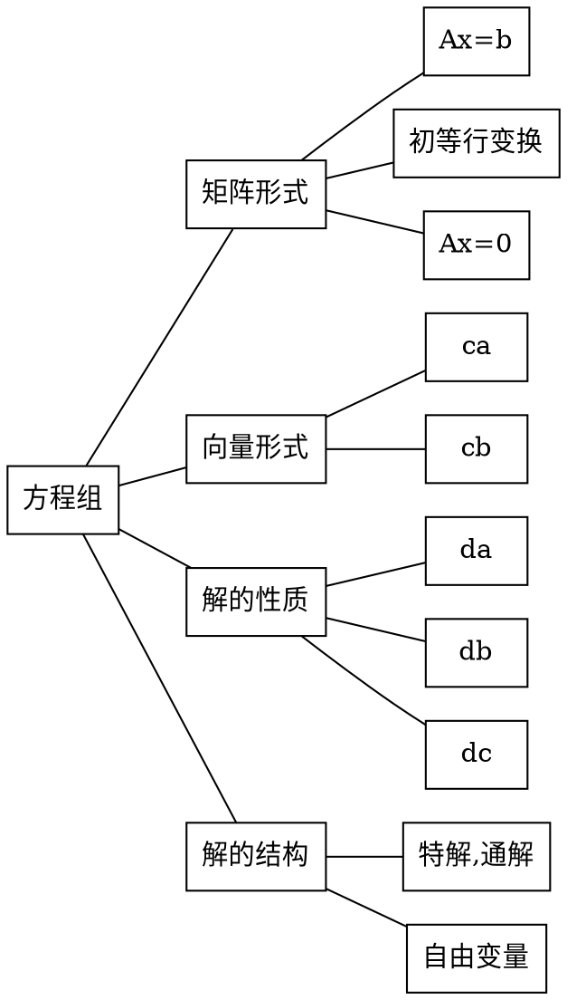

# 知识结构网格图

# 基本内容与重要结论
## 基础知识
若将一组数分别代替方程中的变量,是得m个等式都成立,则称有序数组是方程组的一组解

齐次线性方程组(常数项为零)
全体系数及常数项构成增广矩阵 $\overline{A}$ 
全体系数构成系数矩阵 A
如果两个方程组有相同的解集合,则称他们是同解方程组

定义 4.1 :
下列三种变换称为线性方程组的初等变换
1. 用一个非零常数乘方程的两边
2. 吧某方程的k倍加到另一方程上
3. 互换两个方程的位置

线性方程组经初等变换化为阶梯形方程组后,每一个方程中的第一个未知量(正交基)通常称为主变量,其余未知数称为自由变量
对增广矩阵用初等行变换

定义 4.2 :
向量组 $\eta_1,\eta_2,\cdots,\eta_t,$ 称为齐次线性方程组Ax = 0的基础解系,如果
1. $\eta_1,\eta_2,\cdots,\eta_t,$ 是Ax=0的解 
2. $\eta_1,\eta_2,\cdots,\eta_t,$  线性无关
3. Ax = 0 的任一解都可由$\eta_1,\eta_2,\cdots,\eta_t,$ 线性表出
如果$\eta_1,\eta_2,\cdots,\eta_t,$ 是齐次线性方程组Ax = 0的一组基础解系,那么,对任意常数$c_1,c_2,\cdots,c_t,$ 
$c_1 \eta_1+c_2 \eta_2+\cdots,c_t \eta_t$ 是齐次方程组Ax=0的通解

## 重要定理
定理 4.1 :
线性方程组的初等行变换把线性方程组变成**与它同解的方程组**

定理 4.2 :
对于n元线性方程组的增广矩阵进行高斯消元法,得到阶梯性矩阵
如果 $d_{r+1} \neq 0$ 方程组无解 
如果 $d_{r+1} = 0$ 方程组有解,且当r=n时有唯一解,当r < n 时有无穷多解

定理 4.3 :
齐次方程组有非零解 <--> r(A) < n <--> A的列向量线性相关
推论 1 :
当 m < n (即 方程的个数<未知数个数),齐次线性方程组必有非零解
推论 2 : 
当 m = n 时,齐次线性方程组有非零解的充分必要条件是行列式|A|=0

定理 4.4 :
设齐次线性方程组系数矩阵的秩r(A) = r < n ,则 A x =0 的基础解系由n-r(A)个线性无关的解向量所构成 :star:

定理 4.5 :
有解判定定理
非齐次线性方程组Ax = b有解的充分必要条件是其系数矩阵和增广矩阵的秩相等,即 $r(A) = r(\overline{A})$ 
若$r(A) = r(\overline{A}) = n$ ,则方程有唯一解
若$r(A) = r(\overline{A})<n$,则方程有无穷多解
非齐次线性方程Ax=b无解 <-->$r(A)+1 = r(\overline{A})$ <--> 不能由A的列向量线性表出

定理 4.6 :
解的性质 :star:
1. 如果 $\eta_1,\eta_2$是齐次线性方程组Ax=0的两个解,则其线性组合也是该齐次线性方程组的解
2. 如果 $\alpha,\beta$ 是线性方程组 Ax=b的解,则 $\alpha-\beta$ 是导出组Ax=0的解
3. 如果 $\alpha$ 是线性方程组Ax=b的解, $\eta$是导出组Ax=0的解,则 $\alpha + \eta$ 是 Ax=b的  解

定理 4.7 :
解的性质 
已知解加基础解系的线性组合为Ax+b的通解

## 主要公式
# 典型例题
## 基础解系
列变换也能求方程秩,但是是改变了未知量的关系,,

同解方程组

方程组通解,行解系数矩阵,提出自由变量,

如何确定自由变量并赋值
1. 对系数矩阵作初等行变换化为其阶梯形
2. 由秩r(A)确定自由变量的个数n-r(A)
3. 其余n-r(A)列对应的就是自由变量
4. 每次给一个自由变量赋值为1,其余的自由变量赋值为0
5. 对阶梯形方程由下忘上依次求解

## 解方程组Ax=b
非齐次线性方程的求法
1. 对增广矩阵作初等变换化为阶梯形矩阵
2. 求导出组的基础解系
3. 求方程组的特解(可令自由变量全为0)
4. 按解的结构写出通解
> 方程组中含有参数时,不要丢情况

特解加常系数自由基

## 有解判定,解的结构,性质
## 公共解,同解
叠加方程求公共解
## 方程组的应用
计算比较多啊啊啊啊啊啊