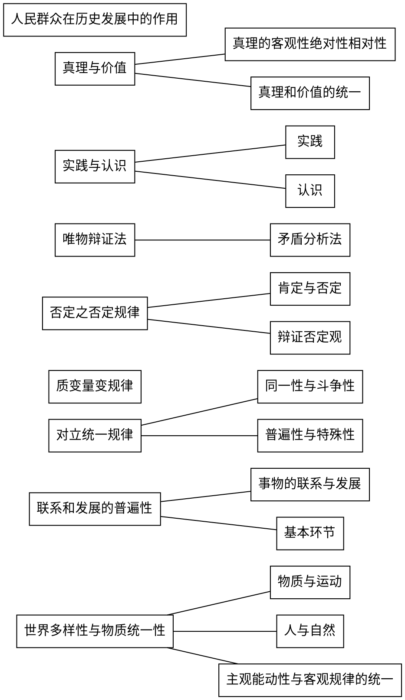
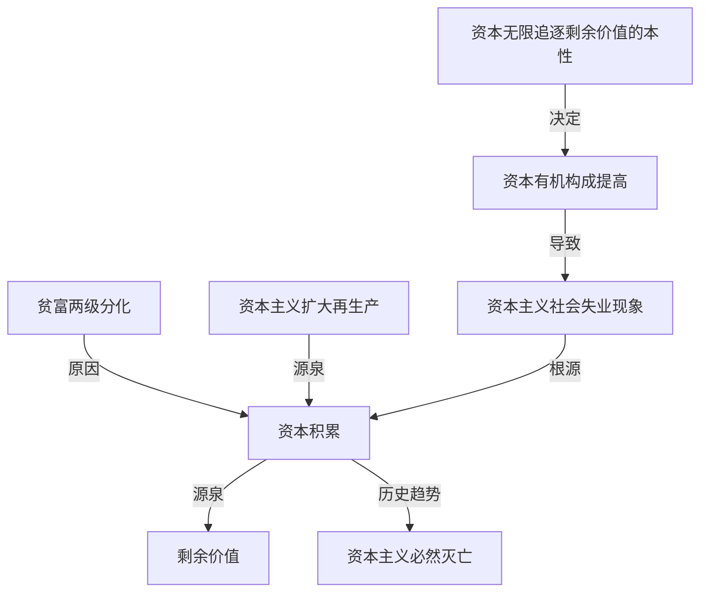

# 第一部分 马克思主义基本原理
总论: 第一章
马克思主义哲学(世界观方法论): 二(唯物论,辩证法)三(认识论)四(唯物史观)章
马克思主义政治经济学(资本主义与垄断资本主义论): 五(自由资本主义)六(垄断资本主义)章
科学社会主义(社会主义与共产主义论): 七八章

##  第一章 马克思主义是关于无产阶级和人类解放的科学
分别阐述了马克思主义唯物论与辩证法的基本原理
1. 第一节
   1.  两观两原理 物质观,意识观,以及物质与意识的辩证关系原理,世界的物质统一性原理
2. 第二节 
   1. 两个总特征 联系和发展的观点是唯物辩证法的总观点和总特征
   2. 三个规律; 对立统一规律,量变质变规律和否定之否定规律
   3. 五对基本范畴;内容与形式,本质与现象,原因与结果,必然与偶然,现实与可能
   4. 其逻辑顺序是:特征-范畴-规律
3. 第三节
   1. 唯物辩证法是认识世界和改造世界的根本方法

###   第一节 马克思主义的创立和发展
###   1 马克思主义和马克思主义基本原理
###   2 马克思主义的创立

####    马克思主义产生的社会根源,阶级基础和思想渊源
1. 资本主义经济的发展为马克思主义的产生提供了经济,社会历史条件
   1.  显露了固有的内在矛盾,预示着未来社会革命的性质和历史发展方向
2. 无产阶级在反对资产阶级的斗争中逐步走向自觉,对科学理论的指导提出强烈的需求(阶级和实践基础)
   1. 几次工人运动的失败
3. 马克思,恩格斯的革命实践和对人类文明成果的继承与创新(主观条件)
   1. 资本主义经济社会的发展及其矛盾运动,为马克思主义的产生提供了 客观条件
   2. 无产阶级与资产阶级的斗争对马克思主义的产生提出了 现实需求
   3. 这些都是马克思主义产生的 时代和实践基础,但这些只是为马克思主义产生提供了可能性
   4. 这些可能性,只有通过马克思,恩格斯的革命实践和 继承与创新 才会变成现实

德国古典哲学,英国古典政治经济学,英法两国的空想社会主义 为马克思主义的创立提供了 直接的理论来源
细胞学说,能量守恒与转化定律,生物进化论,为马克思主义的产生提供了 自然科学前提

1. 1844年2月 德法年鉴 完成了从唯心主义向唯物主义,从革命民主主义向共产主义的转变,为创立 马思 奠定了 思想前提
2. 1845 德意志意识形态 第一次比较系统地阐述了历史唯物主义基本原理
3. 1848 共产党宣言 发表,标志马克思主义的公开问世
4. 1867 资本论 马克思主义最厚重,最丰富的著作,被誉为 工人阶级的圣经
5. 1876-1878 恩格斯 反杜林论 全面阐述马克思主义理论体系,被称为马克思主义的 百科全书

####    共产党宣言 的发表标志着马克思主义的公开问世

###   3 马克思主义的发展
####    列宁对马克思主义的丰富和发展
提出社会主义革命可能在一国或数国首先取得胜利的论断

俄国十月革命的胜利,使科学社会主义从理论开始变为现实

####    共产党对马克思主义的丰富和发展
先后产生了毛泽东思想和中国特色社会主义理论体系

####    一 
####    二
####    三
####    四
####    五

###   第二节 马克思主义的鲜明特征和当代价值
####    一 马克思主义的鲜明特征
#####     科学性
突出特征 和 理论优势,也是马克思主义科学性的重要体现

#####     革命性
集中表现在它的彻底的批判精神和鲜明的无产阶级立场
马克思主义的革命性是建立在科学性基础上的,是与科学性高度统一的

#####     实践性
实践性是马克思主义理论区别于其他理论的显著特征
实践观点是马克思主义 首要的和基本的观点

#####     人民性
人民至上是马克思主义的政治立场
人民性是马克思主义最鲜明的品格

为人类求解放

#####     发展开发性
马克思主义是不断发展的学说,具有与时俱进的理论品质(发展性)
马克思主义不断吸取人类历史上一切优秀思想文化成果而不断丰富自己(开放性)

####    二 马克思主义的当代价值
#####     观察当代世界变化的工具
#####     指引当代中国发展的行动指南
#####     引领人类社会进步的科学真理
马克思主义仍然是当今时代的真理,
人类的未来仍然需要马克思主义的启迪和指南

##  第二章 世界的物质性及发展规律
###   第一节 世界多样性与物质统一性(两观,两原理)
####    一 物质及其存在形态
1. 哲学基本问题--存在和思维的关系问题
2. 哲学基本问题的内容,包含两个方面
   1. 第一,存在和思维究竟谁是世界的本原,即 物质和精神何者是第一性
   2. 第二,思维能否正确认识存在的问题,即 存在和思维有无同一性的问题
3. 哲学基本问题原理的意义,为划分哲学中的基本派别确定了科学标准
4. 唯物主义和唯心主义,可知论与不可知论,辩证法和形而上学
   * 对世界本原问题的不同回答
     * 唯物主义
     * 唯心主义
   * 对世界是否可知问题的不同回答
     * 可知论
     * 不可知论
   * 对世界是怎样存在的不同回答
     * 辩证法: 坚持用联系的,发展的观点看世界,认为发展的根本原因在于事物的内部矛盾
     * 形而上学: 坚持用孤立的,静止的观点看问题,否帧事物内部矛盾的存在和作用
   * 对社会历史观基本问题的不同回答
     * 历史唯物主义(唯物史观),社会存在决定社会意识
     * 历史唯心主义(唯心史观),社会意识决定社会存在
5. 唯物主义和辩证法要统一起来

###### 物质和物质范畴 
1. 唯物主义对 物质的认识过程
   1. 物质范畴史唯物主义哲学关于世界本原和统一性的最高抽象,是唯物主义世界观的基石
   2. 对 物质 认识对深度和广度是区分唯物主义三种形态对重要依据
      1. 唯物主义等三种形态,对物质对理解
      2. 古代朴素唯物主义,金,木等具体股指形态
      3. 近代形而上学唯物主义,原子
      4. 现代辩证唯物主义,客观实在
      5. 共同点: 主张物质第一性
2. 马克思主义物质观
   1. 强调要从能动的实践出发去把握客观世界的意义
   2. 恩格斯对物质概念作论初步概括
      1. 物,物质无非是各种物对总和,而这个概念就是从这一总和中提取出来对
      2. 明确指出论哲学物质概念与自然科学关于具体的物质形态和物质结构的概念之间共性和个性的关系
   3. 列宁对物质概念作了全面的科学的规定
      1. 物质是标志客观实在的哲学范畴
      2. 列宁是从物质与意识的关系上来把握物质的
      3. 物质的 唯一特性 是 客观实在性,
      4. 所谓物质,就是不依赖于人的意志而存在,并能为人类的意识所反映的客观存在

###### 马克思主义物质观的理论意义
第一,坚持唯物主义一元论,同唯心主义一元论和二元论划清了界限
第二,坚持了能动的反映论和可知论,有力地批判了不可知论,世界上只存在尚未认识的东西,不存在不可认识的东西
第三,体现了唯物论和辩证法的统一,主张客观实在性是物质的共性,唯一特性,
第四,体现了唯物主义自然观和唯物主义历史观的统一,为彻底的唯物主义奠定了理论基础

物质与意识的对立,只有在它们何者为第一性,这一范围内才具有绝对意义;超出这个范围,物质和意识的对立便是相对的

马克思主义以前的旧唯物主义在自然观上是唯物的,在历史观上却陷入了唯心,所以是不彻底的 唯物主义

###### 三 物质的存在形态
1. 物质与运动
   1. 运动是物质的根本属性
      1. 世界是物质的,而物质是运动的
   2. 物质和运动不可分割
      1. 一方面,物质是运动的物质,没有不运动的物质
      2. 另一方面,运动是物质的运动,任何形式的运动都有它的物质载体
2. 运动与静止
   1. 静止的含义
      1. 运动是普遍的,永恒的,无条件的,因而是绝对的(人不能两次踏入同一条河流)
      2. 静止是物质的特殊状态,是物质运动在一定条件下的稳定状态,
      3. 包括空间的相对位置暂时不变和事物的根本性质暂时不变这两种运动的特殊状态
   2. 绝对运动与相对静止的辩证统一
      1. 无条件的绝对运动和有条件的相对静止构成了事物的矛盾运动
3. 物质运动与时间,空间
   1. 时间和空间的含义及特点
   2. 时间和空间是物质运动的存在形式
   3. 时空既是有限的又是无限的,既是绝对的又是相对的

相对静止是事物存在和发展的必要条件,是人们认识和利用事物的前提,
是过去运动的结果和未来运动的出发点
是理解和衡量运动的尺度

否认绝对运动,把相对静止绝对化,就会走向形而上学不变论
借口绝对运动,否认相对静止,就会导致相对主义诡辩论(人连一次也不能踏进同一条河流)

客观实在性 是物质的 唯一特性,
运动 是 物质的 根本属性,
时空 是 物质运动的 存在形式

唯物主义运动观与唯心主义运动观的根本区别在于是否承认 运动是物质的运动(不设想非物质的运动)

###### 四 实践是自然存在与社会存在区分和统一的基础
马克思从实践出发去揭示社会的本质,指出 全部社会生活在本质上是实践的 ,从而阐明了社会与自然的区别和联系

从实践出发理解社会生活的本质要把握两大方面
一方面,实践是使 物质世界分化为自然界与人类历史的 历史前提,
又是使 自然界与人类社会统一起来的 物质基础

另一方面,实践是人类社会的基础,是理解和揭示一切社会现象的钥匙
马克思主义确认社会生活在本质上是实践的,也就是把社会生活 当作实践去理解
社会生活是人们各种社会活动的总称.
社会生活的实践性主要体现在:第一,实践是社会关系形成的基础,
第二,实践形成了社会生活的基本领域,第三,实践构成了社会发展的动力

###### 五 人与自然的关系 
anki
当今世界出现的生态等全球危机问题,并不单纯是自然系统内平衡关系的严重破坏,
实际上也是人与自然关系的严重失衡
马克思认为,应当合理地调节人与自然之间的物质交换,
在最无愧与和最适合于人类本性的条件下进行这种物质交换
人与自然是生命共同体.
人类必须尊重自然,顺应自然,保护自然.
人类只有遵循自然规律才能有效防止在开发利用自然上走上弯路
人类对大自然的伤害最终会伤及人类自身,这是无法抗拒的自然规律

自然界包括了人类活动尚未触及的自在自然,以及打上人类活动印记的人化自然
关于动力的几个提法
* 矛盾是事物发展的动力
* 设计间构成了社会发展的动力
* 社会基本矛盾是社会发展的根本动力

####    二 物质与意识的辩证关系
物质决定意识,意识依赖于物质并反作用于物质

#####     物质决定意识
意识是物质世界长期发展的产物,是人脑的机能和属性,是客观世界的主观映像
1. 意识的起源
   1. 意识是自然界长期发展的产物
   2. 意识又是社会历史发展的产物
2. 意识的本质
   1. 意识是物质的产物,但又不是物质本身,意识是特殊的物质,人脑的机能和属性
   2. 意识从本质来看是客观世界的主观映像,是客观内容和主观形式的统一

* 意识虽然有主观性,但是意志的产生和存在都必须依赖于物质,意识不可以脱离物质
* 意识是由物质产生的,但并非一切物质都有意识,
  * 人脑是意识的器官,但不是意识的源泉,意识的源泉是客观世界
* 意识,不管正确错误,先进落后,都是物质世界的主观映像.
  * 人的意识不管主观色彩多浓厚,归根到底都有自己的客观原型
* 高级动物也有感觉和心理,但只有人才有意识,
  * 实践,意识都是人特有的,动物,机器(人工智能)都没有

#####     意识对物质具有反作用(意识的能动性)
人特有的积极认识世界和改造世界的能力和活动,主要表现在
1. 意识活动具有目的性和计划性
2. 意识活动具有创造性
3. 意识具有指导实践改造客观世界的作用

#####     主观能动性和客观规律的统一
所谓规律,是指事物及其发展过程中固有的 本质的,必然的,稳定的客观联系
规律和必然性 是同等程度的概念,代表着事物发展过程中必定如此,确定不移的趋势
规律是客观的,是不以人们的意志为转移的

1. 正确认识和把握物质的决定作用和意识的反作用,必须处理好主观能动性和客观规律的关系
   1. 实践是客观规律性与主观能动性统一的基础
2. 争取发挥主观能动性的前提和条件
   1. 第一,从实际出发,努力认识和把握事物的发展规律,
   2. 这是正确发挥主观能动性的前题
   3. 第二,实践是发挥人的主观能动性的基本途径
   4. 第三,主观能动性的发挥,还依赖于一定的物质条件和物质手段
3. 在社会历史领域,主观能动性与客观规律性的辩证关系具体表现为社会历史趋向与主体选择的关系

主观能动性与客观规律性的辩证关系 
anki
作为矛盾双方,危和机在一定条件下可以相互转化,但这一转化不可能自动实现,需要发挥人们的主观能动性,这就要求我们处理好主观能动性和客观规律性的关系.
首先,尊重客观规律是正确发挥主观能动性的前提.
人们只有在认识和掌握规律的基础上,才能达到认识世界和改造世界的目的.
其次,只有充分发挥主观能动性,才能正确认识和利用客观规律

####    三 世界的物质统一性
#####     世界的物质统一性原理
1. 包括自然界和人类社会的整个世界,其真正统一性在于它的物质性
2. 物质是世界的本原
3. 世界物质统一性原理的内容包括
    1. 世界是统一的,即世界的本原是一个
    2. 世界的统一性在于它的物质性,即世界统一的基础是物质,
    3. 物质世界的统一性是多样性的统一,而不是单一的无差别的统一
4. 世界的物质统一性首先体现在,意识同一于物质
    1. 从意识的起源上看,意识是客观存在的主观映像
    2. 从意识的作用上看,意识能动性的发挥必须以尊重物质世界的客观规律为前题
    3. 因此,意识统一于物质,在统一的物质世界外,没有任何非物质的存在或非物质的活动
5. 世界的物质统一性还体现在,人类社会也统一于物质
    1. 人类社会依赖自然界
    2. 人们的实践活动,仍然是以物质力量改造物质力量的活动,仍然是物质性的活动
    3. 物质资料的生产方式是人类社会存在和发展的基础,集中体现在人类社会的物质性

* 世界上的一切事物和现象,包括意识现象,归根到底都是物质的表现形式或物质的属性和存在形式
  * 世界上的一切发展,变化多陈都是物质运动的具体表现,器原因是物质世界自身
* 唯心主义是一元论的世界观,主张世界统一于精神.二元哲学否认世界的统一性,把物质和意识绝对对立起来

#####     世界的物质统一性原理的重大理论意义和实践意义
其理论意义在于,它是马克思主义哲学的基石,
其实践意义在于,它是我们从事一切工作的立足点,一切从实际出发是唯物主义一元论的根本要求

###   第二节 事物的联系与发展(特征-范畴-规律)

####    一 联系和发展的普遍性
唯物辩证法是关于世界普遍联系和变化发展的科学,
联系和发展的观点是唯物辩证法的 总观点和总特征

#####     事物的普遍联系
1. 联系的内涵
   1. 联系指事物内部各要素之间和事物之间相互影响,相互制约和相互作用的关系
2. 联系的特点
   1. 客观性,事物的联系是事物本身所固有的,不是主观臆想的(客观的)
   2. 普遍性
      1. 任何事物具有内在的结构性
      2. 任何事物都处于一定的相互联系之中
      3. 整个世界是相互联系的统一整体
      4. 世界的普遍联系是通过 中介 来实现的
   3. 多样性
      1. 直接联系与间接联系
      2. 内部联系和外部联系
      3. 本质联系与非本质联系
      4. 必然联系与偶然联系
   4. 条件性
3. 事物普遍联系原理的方法论
   1. 要求人们善于分析事物的具体联系,确立整体性,开放性观念,从动态中考察事物的普遍联系

实践作为人的生命活动和社会存在的形式,实质上是人类所持有的联系形式,即人类社会与自然界
社会中人与人的一切现实联系的基本方式和途径

联系的普遍性
anki
联系和发展的观点是唯物辩证法的总观点和总特征,
联系具有客观性.事物的联系是事物本身所固有的,不是主观臆想的.
联系具有普遍性,任何事物都不能孤立存在,都同其它事物处于一定的相互联系中
整个世界是相互联系的统一整体,每一事物都是世界普遍联系中的一个成分或环节,
并通过它表现出联系的普遍性

#####     事物的变化发展
1. 联系和运动是不可分割的
   1. 事物的相互联系包含事物的相互作用,
   2. 而相互作用必然导致事物的运动变化和发展
   3. 概括一切形式的变化就是运动,运动变化的基本趋势是发展
2. 发展及其实质
   1. 发展是前进的,上升的运动
   2. 发展的实质是新事物的产生和旧事物的灭亡
   3. 发展始终是运动多向性中的主流
3. 新事物是不可战胜的
   1. 新事物指合乎历史前进方方向,具有远大前途的事物
   2. 旧事物是指丧失了历史必然性,日趋灭亡的东西
   3. 新事物是不可战胜的,因为
      1. 就新事物与环境的关系而言,新适应了变化的环境和条件
      2. 就新事物与旧事物的关系而言,新在 旧的母体中孕育成熟,它即否定了旧事物中消极腐朽的东西,
      3. 又保留了旧事物中合理的,东西,
      4. 并添加了旧事物所不能容纳的新内容
      5. 这两方面也旧事新事
      6. 物在本质上优越于旧事物,具有强大生命力的原因所在
4. 事物的发展是一个过程
   1. 恩格斯指出 世界不是既成事物的集合体,而是过程的集合体
5. 事物的发展过程...
6. 用历史的眼光看问题

####    二 联系和发展的基本环节
#####     内容与形式
1. 含义
   1. 内容指构成事物的一切要素的总和,是事物存在的基础
   2. 形式指把诸要素统一起来的结构或表现内容的方式
2. 关系
   1. 内容决定形式,形式反作用与内同
   2. 一方面,内容是事物存在的基础,对形式具有决定作用
   3. 另一方面,形式对内同具有反作用,适合内容的形式,对内容的发展起积极的推动作用
3. 方法论意义
   1. 既要重视内容,反对形式主义
   2. 又要善于运用形式,发挥其积极租用,利用和创造必要的形式,适时地抛弃与内容不相适应的形式

内容与形式相互依赖,不可分割
同一内容可以通过多种形式来体现,同一中形式也可以表现不同的内容
在内容与形式的矛盾运动中,内容较为易变,形式则较为稳定?

#####     本质与现象
1. 含义
   1. 本质是事物的根本性质
   2. 现象是事物的外部联系和表面特征,是事物本质的外在表现
2. 关系
   1. 本质与现象相互区别
   2. 本质与现象有是统一的,相互联系,相互依存
      1. 本质决定现象
      2. 现象表现本质,任何现象都是从一定的方面表现着本质,即使假象也是本质的表现
      3. 不表现为现象的本质和不表现本质的现象都是不存在的
3. 方法论意义
   1. 透过现象揭示本质

* 现象与本质是表现与被表现的关系,但两者不会直接合而为一,透过现象发现本质是科学研究的任务
* 真假像是本质正反面的表现,错觉是主观的

#####     原因与结果
1. 含义 
   1. 辩证法把这种**引起与被引起的关系**称为因果关系
   2. 因果联系是由时间顺序的联系,总是原因在前,结果在后
2. 关系
   1. 原因和结果的区分既是确定的,又是不确定的
   2. 原因和结果相互作业,互为因果
   3. 原因和结果相互渗透,结果存在于原因之中,原因表现在结果之中
   4. 原因和结果的关系是复杂多样的
3. 方法论意义
   1. 正确把握事物的因果联系是自觉的实践活动的必要条件
   2. 可以增强人们活动的自觉性,预测性和调控性,即所谓 凡事预则立,不预则废

在一个具体的因果联系中,因果不能混淆和颠倒,
在事物因果联系的长链中,果可以是其他的因

#####     必然与偶然
1. 含义
   1. 必然与偶然是揭示事物产生,发展和衰亡过程中的不同趋势的一对范畴
   2. 必然,指事物联系与发展过程中确定不移的趋势,在一定条件下具有不可避免性
   3. 偶然,指事物联系与发展过程中不确定的趋势
2. 关系
   1. 二者有区别
      1. 它们产生和形成的原因不同
         1. 必然产生于事物内部的根本矛盾,
         2. 偶然产生于非根本矛盾和外部条件
      2. 它们表现形式不同
         1. 必然是同类事物普遍具有的发展趋势
         2. 偶然是事物发展中的个别表现
      3. 它们在事物发展中的低位和作用不同
         1. 必然在事物发展中居于支配地位,决定事物发展方向
         2. 偶然居于从属地位,对事物的发展过程起促进或延缓作用
   2. 必然与偶然又是统一的
      1. 必然与偶然相互依存,没有脱离偶然的必然,也没有脱离必然的偶然
         1. 必然存在于偶然中,通过大量偶然表现出来,并为自己开辟道路
         2. 偶然背后隐藏着必然,收必然支配
      2. 必然和偶然在一定条件下可以相互转化
         1. 相对某一过程来说是必然的东西,对另一过程就可能称为偶然的东西
3. 方法论意义
   1. 必须重视事物发展的必然性,把握事物发展的总趋势,但也绝不可忽视偶然性的作用
   2. 要善于从偶然中发现必然,把握有利于事物发展的机遇

必然性与本质是同等程度的范畴,揭示的都是事物内在联系,认识必然性和认识本质一样,是科学的任务

#####     现实与可能
1. 含义
   1. 现实与可能是揭露事物的过去,现在和未来的相互关系的一对范畴
   2. 现实是指相互联系着的实际存在的事物的综合
   3. 可能是指包含在食物中预示事物发展前途的种种趋势
2. 关系
   1. 现实与可能相互区别(对立)
   2. 现实与可能相互转化(统一)
3. 方法论意义
   1. 要求人们立足现实,展望未来,注意分析事物发展的各种可能性,
   2. 发挥主观能动性,做好应对不利情况的准备,争取实现好的未来

可能有两种形式,即现实的可能性和抽象(非现实)的可能性,
二者的区别在于,现实中的根据和条件是否重非
可能性和不可能性的区别在于,现实中有无根据和条件

####    三 对立统一规律是事物发展的根本规律
#####     唯物辩证法的实质和核心
对立统一规律是唯物辩证法的实质和核心
从根本上回答了事物为什么会发展的问题
中心线索,钥匙
根本方法 --  矛盾分析法

#####     矛盾的同一性和斗争性及其在事物发展中的作用
1. 矛盾是辩证法的核心概念
   1. 对立统一规律又称矛盾规律,简言之,矛盾即对立统一
   2. 矛盾是反映事物内部和事物之间对立统一关系的哲学范畴
2. 矛盾的同一性与矛盾的斗争性的含义
   1. 同一性和斗争性是矛盾的两种基本属性,是矛盾双方相互联系的两个方面
   2. 同一性 指 矛盾双方相互依存,相互贯通的性质和趋势
      1. 矛盾着的对立面相互依存,互为存在前提
      2. 矛盾的对立面之间相互贯通,在一定条件下相互转化
   3. 斗争性 指 矛盾这的对立面之间相互排斥,相互分离的性质和趋势
3. 矛盾的同一性和斗争性的辩证关系
   1. 同一性不能脱离斗争性而存在,没有斗争性就没有同一性
   2. 因为矛盾的同一是以差别和对立为前提的,是包含差别和对立的同一
   3. 斗争性也不能脱离同一性而存在,斗争性寓于同一性中,没有同一就没有斗争
   4. 斗争性是无条件的绝对的,同一性是有条件的相对的
   5. 斗争性与同一性相结合,构成事物的矛盾运动,推动事物的发展
4. 矛盾的同一性和斗争性在事物发展中的作用
   1. 斗争性与同一性相结合,构成事物的矛盾运动,推动事物的发展
      1. 同一性在事物发展中的作用
         1. 矛盾双发可以利用对发的发展使自己获得发展
         2. 相互吸取有利于自身的因素
         3. 向着对立面转化而得到发展,并规定事物的发展方向
      2. 斗争性在事物发展中的作用
         1. 为对立面的转化,事物的质变创造条件
         2. 促使矛盾双发地位或性质转化,实现事物的质变
      3. 同一性在事物发展中的作用
5. 矛盾的同一性和斗争性原理的方法论意义
   1. 第一,事物的发展不仅表现为 相反相成 而且表现为 相辅相成,
   2. 我们在分析和解决矛盾时,必须从对立中把握同一,从同一中把握对立
   3. 第二,要正确把握和谐对事物发展的作用,
   4. 和谐是相对的有条件的

是否承认对立统一学说是唯物辩证法和形而上学对立的实质

#####     矛盾的普遍性和特殊性及其相互关系
1. 普遍性
   1. 一切事物都是对立统一的,矛盾是事物的普遍本质
2. 特殊性
   1. 不同事物的矛盾各有特点
   2. 同一事物的矛盾在不同的发展过程和阶段各有不同的特典
   3. 构成事物的诸多矛盾及每一矛盾的不同方面各有不同的性质,地位和作用
      1. 主要矛盾是矛盾体系(许多对矛盾中)中处于支配地位,对事物发展起决定作用的矛盾
      2. 每一对矛盾中有以防处于支配地位,其主导作用,这是矛盾的主要方面
      3. 事物的性质是由主要矛盾的主要方面所规定的
      4. 在实际工作中,要坚持 两点论  和 重点论 的统一
      5. 矛盾解决的形式也是多种多样的,主要有
         1. 克服,同归于尽,协同运动的新形式,融合成新事物
3. 普遍性与特殊性的辩证关系
   1. 矛盾的共性和个性,绝对和相对的道理,
   2. 是关于事物矛盾问题的精髓,是正确理解矛盾学说的关键

矛盾是普遍存在的,承认矛盾的普遍性是一切科学认识的首要前提(正视矛盾)
矛盾又具有特殊性,只有具体问题具体分析,才能采取正确的方针和办法去解决矛盾

共性寓于个性中
共性不可能包含所有个性

#####     矛盾的普遍性和特殊性的辩证关系原理的意义
矛盾的普遍性和特殊性辩证关系的原理是马克思注意的普遍真理和各国具体实际相结合的哲学基础,也是建设中国特色社会注意的哲学基础

####    四 量变质变规律和否定之否定规律
#####     量变质变规律
1. 事物存在的质,量,度
   1. 质 是一事物成为自生身并区别于其他事物的内在规定
   2. 量 是事物的规模,程度,速度等可用数量关系表示的规定性
   3. 度 是保持事物质稳定性的数量界限,即事物的限度,幅度和范围
   4. 在认识和处理问题时要掌握适度的原则
2. 事物发展的量变和质变及其辩证关系
   1. 量变
      1. 事物数量的增减和组成要素排列次序的变动
   2. 质变
      1. 事物性质的根本变化
   3. 区分量变和质变的根本标志
      1. 事物的变化是否超出度
   4. 量变和质变的辩证关系
      1. 量变是质变的必要准备
      2. 质变是量变的必然结果
      3. 量变和质变是相互渗透的
      4. 量变和质变是相互依存,相互贯通的
      5. 量变质变规律体现了事物发展的渐进性和飞跃性的统一
3. 量变质变规律原理的方法论意义
   1. 揭示了事物发展过程是连续和阶段性的统一,是无产阶级政党指定路线,方针,政策的重要理论依据

质和事物的存在是直接同一
量和事物是不可分离的,但并不是直接同一的
#####     否定之否定规律
1. 事物发展过程中的肯定和否定
   1. 任何事物内存都存在肯定因素和否定因素
2. 辩证否定观的基本内容
   1. 发展的实质是新事物的产生和旧事物的灭亡
   2. 在新事物取代旧事物的过程中,辩证的否定是决定性环节
   3. 辩证否定观的基本内容
      1. 否定是事物的自我否定
      2. 否定是事物发展的环节
      3. 否定是新旧事物联系的环节
      4. 辩证否定的实质是 扬弃
3. 辩证否定观的方法论意义
   1. 辩证的否定观既是世界观又是方法论,是观察和分析一切问题的方法论原则
   2. 坚持辩证的否定观,就是反对肯定一切和否定一切的形而上学的否定观
   3. 坚持辩证的否定观,就是对一切事物采取科学的分析态度
4. 否定之否定规律及其意义
   1. 否定之否定规律原理
      1. 第一,事物的辩证发展过程经过第一次否定,使矛盾得到初步解决,
      2. 而处于否定阶段的事物仍然具有片面性,还要经过再次否定,即 否定之否定
      3. 实现对立面的统一,使矛盾得到解决
      4. 第二,肯定-否定-否定之否定 ,一个周期,
      5. 第三,从内容上看,是自己发展自己,从形式上看,是螺旋上升或波浪式前进的过程
   2. 否定之否定规律原理的意义
      1. 揭示了事物发展的方向和道理,前进行与曲折性的统一

形而上学的否定信条是 : 是就是是,不是就是不是,否定是绝对的否定,是不包含肯定的否定
辩证否定是事物的自我否定

###   第三节 唯物辩证法是认识世界和改造世界的根本方法
####    一 唯物辩证法是科学的认识方法
#####     客观辩证法与主观辩证法的统一
1. 客观辩证法与主观辩证法的含义
客观辩证法 指客观事物或客观存在的辩证法,即客观事物以相互作用,相互联系的形式呈现出来的各种物质形态的辩证运动和发展规律

主观辩证法指人类认识和思维运动的辩证法,即以作为思维细胞的辩证思维运动和发展规律

唯物辩证法即包括客观辩证法,也包括主观辩证法
2. 主观辩证法与客观辩证法的关系
主观辩证法是客观辩证法在人的思维中反映,本质上是统一的,但在表现形式上却是不同的
可以简要地把主观辩证法称为概念辩证法

#####     唯物辩证法是伟大的认识工具

#####     矛盾分析法是根本的认识方法 :star: 
矛盾分析方法是对立统一规律在方法论上的体现,在唯物辩证法的方法论体系中居于核心的地位,是根本的认识方法
矛盾分析法包含广阔而深刻的内容

马克思主义的最本质的东西,马克思主义的活的灵魂,就在于具体地分析具体的情况

运用唯物辩证法的矛盾分析方法研究问题和解决问题,根本的是具体问题具体分析,一切以时间,地点,和条件为转移

####    二 辩证思维方法与现代科学思维方法
####    辩证思维方法
1. 归纳与演绎
2. 分析与综合
3. 抽象与具体
4. 逻辑与历史相统一

辩证思维方法
anki
唯物辩证法要求我们用联系的,发展的,全面的观点看问题从事物相互联系,相互作用的关系出发,
分析矛盾,抓住关键,找准重点,洞察事物发展规律.
联系和发展的观点是唯物辩证法的总观点和总特征.
要把握事物的普遍联系,主义事物的系统性,整体性,从全局人手,统筹兼顾疫情防控和经济发展的过程,
当疫情防控形式出现变化时就要既是调整因对策略: 
要抓关键,看主流,主要矛盾是对事物发展起决定性作用的矛盾,
武汉作为主战场在抗疫斗争中起到决定性的作用;
要坚持两点论和重点论相结合,既要看到疫情带来的不利印象,也要看到其中蕴藏的机遇
####    现代科学思维方法
...

####    三 学习唯物辩证法,不断增强思维能力
#####     辩证唯物主义是中国共产党人的世界观和方法论
...
#####     习近平新时代中国特色社会主义思想对唯物辩证法的创造性运用和发展
四个全面战略布局
新发展理念

##  第三章 实践与认识及其发展规律
两对关系(实践与认识,真理与价值)
两个规律(认识发展规律,真理发展规律)
一个统一(认识和实践的统一)
突出马克思主义的鲜明特点: 把实践的观点引入认识论,把辩证法应用于反映论

认识过程的反复性与无限性
anki
实践决定认识,实践是认识的基础
实践是认识的来源和认知发展的动力,是检验认知真理性的唯一标准
从实践到认知,从认识到实践,实践,认识,再实践,再认识,
认知运动不断反复和无限发展,这是人类认识运动的辩证发展过程
也是人类认知运动的基本规律.
这个过程既是在实践基础上沿着科学性方向不断深化发展的过程,
也是实践在认识的指导下沿着合理性方向不断深入推进的过程

###   第一节 实践与认识
实践与认识的辩证关系
anki
实践是认知发展的动力,实践的需要推动认识的产生和发展.是不断发展之根本
实践是认识的目的,认识活动的目的在于更好的改造客体,有效地指导实践
认识指导实践,为实践服务的过程,即认识价值的实现过程.
实践是认识的起点,也是认识的归宿,认识世界的目的是改造世界.
因此,科学研究要坚持问题导向和需求导向,真正解决实际问题.

####    一 实践的本质与基本结构
#####     实践的本质和基本特征
1. 实践的本质
   1. 实践是人类能动地改造世界的社会性的物质活动
2. 实践的基本特征
   1. 直接现实性
      1. 实践的这一特征把它同人的主观活动区分开来
   2. 自觉能动性
   3. 社会历史性
      1. 实践从一开始就是社会性的活动
      2. 实践的社会性决定了它的历史性,实践是历史地发展着的实践
#####     实践的基本结构
1. 实践活动的三项基本要素
   1. 实践主体
      1. 自主性和能动性的因素(人)
   2. 实践客体
      1. 实践活动所指对象
   3. 实践中介
      1. 人的肢体延长,等工具性系统
      2. 语言符号工具系统
2. 实践的主体和客体相互作用的关系
   1. 实践关系,最根本的关系
   2. 认识关系
   3. 价值关系

主体客体化:实践,形成世界上本不存在的对象物,体外积累
客体主体化:例如把物质工具作为自己身体器官的延长包括在自身的生命活动中

#####     实践的基本类型
1. 实践的三种类型
   1. 物质生产实践
   2. 社会政治实践
      1. 社会交往
      2. 政治活动
   3. 科学文化实践
   4. (虚拟实践,派生形式,具有相对独立性)
2. 三种实践类型的关系
   1. 物质生产实践是最本质的实践活动,它构成全部的社会生活的基础
   2. 其他类型受生产实践的制约并对其产生能动的反作用

一种活动是否能称为实践活动,关键看它是否超出了纯粹的意识活动,是否改变了除实践主体的意识状态之外的其他存在物的状态

#####     实践在认识活动中的决定性作用
1. 实践是认识的来源
2. 实践是认识发展的动力
3. 实践是认识的目的
4. 实践是检验认识真理性的唯一标准
5. 实践的观点是辩证唯物主义认识论的第一和基本的观点

####    二 认识的本质与过程
认识是主体在实践基础上对客体的能动反映
#####     认识的本质
1. 唯物主义反映论与唯心主义先验论的对立
   1. 一条是坚持从物到感觉和思想的唯物主义认识路线(反映论)
   2. 另一条是坚持从思想和感觉到物的唯心主义认识路线(先验论)
2. 辩证唯物主义能动反映论与旧唯物主义直观反映论的区别
   1. 旧唯物主义直接反映论的严重缺陷
      1. 离开实践考察认知问题,因而不了解实践对认识的决定作用
      2. 不了解认识的辩证性质,不能把认识看作一个不断发展的过程,而认为认识是一次性完成的
   2. 批判继承
      1. 坚持以科学的社会实践为特征的实践观,是两种认识论的根本区别
      2. 辩证唯物主义有两个突出特点
         1. 把实践的观点引入认识论
         2. 把辩证法应用于反映论考察认识的发展过程
3. 认识是主体在实践基础上对客体的能动反映
   1. 认识的本质是主体在实践基础上对客体的能动反映
   2. 第一,认识是主体对客体的反映,实在 思维中再现客观事物的状态属性和本质(反映性)
   3. 第二,主体对客体的反映是一个能动的创造性的过程(创造性)
   4. 第三,反映和创造性是不可分割的,坚持反映性和创造性,才能真正揭示认识的本质和规律

#####     从实践到认知

1. 感性认识和理性认识的含义
   1. 感性认识
      1. 感觉,知觉,表像
      2. 直接性
   2. 理性认识
      1. 概念,判断,推理
      2. 抽象性,间接性
2. 感性认识和理性认识的辩证联系
   1. 区别,感性认识和理性认识在内容和形式上有质的区别
   2. 联系
      1. 感性认识有待于发展和深化为理性认识
      2. 感与里相互渗透相互包含
   3. 在实践的基础上形成,绝不能割裂二者的辩证统一关系
      1. 唯理论(教条主义)
      2. 经验论(经验主义)
3. 感性认识向理性认识的飞跃
4. 认识过程中理性因素和非理性因素

非理性因素在认识发展中的作用
anki
非理性因素主要指认识主体的感情和意志.
人的认识过程是理性因素和非理性因素共同作用的结果
非理性因素对人的认识能力具有激活,驱动和控制作用
所以,在科学研究中,我们既要注重理性因素,有因当充分发挥假设和猜想等非理性因素的积极作用
#####     从认识到实践
1. 必要性和重要性
   1. ?
2. 实现飞跃的条件

####    三 实践与认识的辩证运动及其规律

#####     实践与认识的辩证运动及其规律
在实践基础上由感性认识到理性认识,再由理性认识到实践,多次反复才能完成

波浪式前进和螺旋上升的过程

#####     认识和实践的具体的历史的统一

###   第二节 真理与价值

####    一真理的客观性,绝对性和相对性
#####     真理的客观性
1. 真理的含义
   1. 真理是标志主观与客观相符合的哲学范畴,
   2. 是对客观事物及其规律的正确反映
   3. 真理内容是客观的,形式是主观的
2. 真理的客观性
   1. 真理是客观的,凡事真理都是客观真理
   2. 客观性是真理的本质属性
3. 真理的一元性
   1. 真理的客观性决定了真理的一元性
   2. 同一条件下对特定的认识客体的真理性认知只有一个,
   3. 不因主体认识的差别而变化而改变
   4. 不能说 它对谁来说是真理

真理是不是客观的,一切唯心主义都作了否定回答,一切唯物主义都做了肯定回答

真理不是主观产物,不等同客观实在?
错误:
* 真理是 观念与主体感觉相符合(客观)
* 真理是思维和他打先验形式相一致(主观?)
* 真理 是绝对理念的自我显现
* 真理是思想形式,是社会组织起来的经验
* 凡事多数人承认的就是真理
* 有用即真理

真理的一元是针对真理的客观内容而言的,其表现是多样的

#####     真理的绝对性和相对性及其辩证关系
承认真理是客观的,这是真理问题上的唯物论
真理既具有绝对性又具有相对性,它们是同一客观真理的两种属性,这是真理问题上的辩证法
任何真理,既具有客观性,又同时具有绝对性和相对性

1. 真理的绝对性和相对性
   1. 绝对性
      1. 任何真理都标志这主观与客观的符合,都包含不依赖于人的客观内容,同谬误有原则的界限,这是无条件的,绝对的
      2. 承认世界的可知性,也就是承认了绝对的真理?人能正确认识世界,这是绝对的
   2. 相对性
      1. 人们在一定条件下对客观事物及其本质和发展规律的正确认识总是有限度的,不完善的
      2. 任何真理都只是对客观世界的某一阶段,某一部分的正确认识,有待扩展
      3. 就特定事物而言,任何真理都是对客观事物一定方面的正确认知,有待深化
2. 绝对性和相对性的辩证统一关系
   1. 相互依存
   2. 相互包含
3. 真理发展的规律
   1. 真理永远处于在由相对绝对的转化和发展中,是从真理的相对性走向绝对性,接近绝对性的永无止境的过程
4. 真理的绝对性和相对性的起源
   1. 人的认知能力,思维能力既然是无限性与有限性,绝对性与相对性的对立统一,
   2. 作为人的正确认识成果的真理,当然也是绝对性和相对性的对立统一
5. 承认真理是绝对性和相对性的辩证统一
   1. 绝对主义 (片面夸大真理的绝对性),教条主义和思想僵化
   2. 相对主义(片面夸大真理的相对性),不可知论和诡辩论
6. 马克思主义也是绝对性和相对性的统一

anki
真理是个发展过程,既是绝对的,又是相对的.
真理的绝对性,是指真理主客观统一的确定性和发展的无限性.真理的相对性,是指人在一定条件对客观事物及其本质和发展规律的正确认识总是有限的,不玩善的.
任何特定的真理不仅所反映的对象在范围上是有限的,而且其正确程度也是有限的
真理的绝对性与相对性是辩证统一的,二者相互依存,相互包含.
真理永远处于由相对向绝对的转化和发展过程中,是从真理的相对性走向绝对性,接近绝对性的过程

#####     真理与谬误
1. 真理与谬误的对立统一关系
   1. 真理与谬误相互对立
      1. 在确定的对象和范围内,真理和谬误的对立是绝对的
      2. 与对象不相符合的就是谬误,反之为真理
   2. 又是统一的,它们相互依存,相互转化
      1. 真理与谬误相比较而存在的,没有真理也无所谓谬误
      2. 真理和缪误超出一定范围酒水相互转化
2. 成功与失败
   1. 真理与谬误是从认识的角度区分
   2. 成功与失败是从实践的角度看的

真理是具体的,任何真理在一定范围内,一定条件下才能成立,否则就会变成谬误
真理又是全面的,把某个原理孤立地抽取出来,斩断联系,就会变成谬误

####    二真理的检验标准
#####     实践之所以能称为真理的唯一检验标准,是由真理的本质和实践的特点决定的
1. 真理的本性在于主观和客观相符合
   1. 检验认知真理性的标准只能是把主观和客观联系起来的桥梁--社会实践
2. 实践的直接现实性,是它能够称为检验真理标准的主要根据

实践是检验真理的唯一,除此以外,再无其它标准
如果把主观的东西当作真理的标准,就属于主观真理标准论,如
* 圣人或权威的意见为标准
* 以自己的观念,意见为标准
* 以多数人的意见和感觉为标准
* 以有用,有效为标准 ???

#####     在实践检验真理的过程中,逻辑证明可以起到重要的补充作用
真理一定符合逻辑,但符合逻辑的不一定是真理

#####     实践标准的确定性与不确定性
实践作为标准,是确定性与不确定性的统一

1. 实践标准的确定性即绝对性
   1. 实践作为标准的唯一性
2. 实践标准的不确定性即相对性
   1. 实践对认识真理性的检验的条件性
3. 坚持实践标准的确定性与不确定性的统一,
4. 就是坚持真理问题上的实践标准的辩证法
5. 既可防止唯心主义的随意性,又可避免形而上学的绝对化

####    三真理与价值的辩证统一
#####     价值及其特性
1. 哲学上 价值 的含义
   1. 实践基础上形成的主体和客体中间的意义关系
   2. 是客体对人,群体乃至整个社会生活和活动所具有的积极意义
   3. 价值由两方面构成
      1. 主体需要
      2. 客体的特性
2. 价值的基本特性
   1. 主体性
      1. 价值直接同主体相联系,始终以主体为总性
      2. 价值关系的形成依赖主体的存在
      3. 价值关系的形成依赖于主体的创造
   2. 客观性
      1. 主体的存在和需要具有客观性
      2. 客体的存在,属性及作用是客观的
   3. 多维性
      1. 每个主体的价值关系具有多样性,同一客体对主体的不同需要会产生不同的价值
   4. 社会历史性
      1. 主体是在一定社会关系总从事实践的具体的人,随着实践和历史的发展
      2. 主体和客体之间的关系发生变化

价值不是实体,而是主体与客体之间的一种特定的关系,
在价值关系中,是物趋近人

#####     价值评价及其特点
1. 也称作价值判断
2. 价值评价的基本特点
   1. 以主客体的价值关系为认知对象
   2. 评价结果与评价主体直接相关,受主体意志的影响
   3. 评价结果的正确与否依赖于对客体状况和主体需求的认知
#####     真理和价值在实践中的辩证统一

1. 实践的真理尺度和价值尺度
2. 真理和价值在实践中的辩证统一关系
   1. 价值尺度以真理为前提
   2. 尺度推动人们发现新真理
3. 新时代中国特色社会主义的伟大实践,充分体现了真理尺度与价值尺度的辩证统一

对真理不能说对谁来说是真理,对价值,必须说对谁来说
同一真理对不同主体有不同价值

anki
人们的实践活动总是受着真理尺度和价值尺度的制约
实践的真理尺度是指在实践中们必须遵循正确反映客观事物本质和规律的真理.
实践的价值尺度是指实践中人们都是按照自己的尺度和需要去认识世界和改造世界.
任何实践活动都是在两种尺度的共同制约下进行的,任何成功的实践都是真理尺度和价值尺度的统一

###   第三节 认识世界和改造世界
####    一认知世界和改造世界相结合
#####     认知世界和和改造世界及其辩证关系
认知世界和和改造世界是人类创造历史的两种基本活动
坚持认知与实践的统一,归根结底是要将认知世界和改造世界相结合起来

认识与改造是相互依赖,相互制约的辩证关系

二者统一的基础是实践

#####     改造客观世界和改造主观世界及其辩证关系

#####     认识世界和改造世界的过程是从必然走向自由的过程
1. 认识与改造世界是一个充满矛盾的过程
   1. 主观和客观的矛盾是人类认知和实践活动中的基本矛盾
   2. 也是人类认识世界和改造世界的根本动力
2. 自由是对必然的认识和对客观世界的改造
   1. 自由是标志人的活动状态的范畴
   2. 指人在活动中通过认知和利用必然所表现出的一种自觉自主的状态
   3. 必然性即规律性,
   4. 认识必然,争取自由,是人类认识世界和改造世界的根本目标
3. 自由是有条件的
   1. 认识条件
   2. 实践条件
4. 自由和必然的关系贯穿于人类存在和发展的始终,并称为人类存在和发展的永恒矛盾
5. 因此也是人类存在和发展的永恒动力

从必然王国到自由王国

####    二一切从实际出发,实事求是
一切从实际出发是马克思主义认知论的根本要求
实事求是是中国共产党思想路线的核心

####    三实现理论创新和实践创新的良性互动
实践创新为理论创新提供不竭的动力
理论创新为实践创新提供科学的行动指南
我们要努力实现理论创新和实践创新的良性互动

##  第四章 人类社会及其发展规律
本课程重点章,主要讲述唯物史观
第一节,社会基本矛盾及其运动规律,包括 
一个问题(历史观的基本问题,社会存在与社会意识),
两个规律(生产力与生产关系矛盾运动的规律,经济基础与上层建筑矛盾运动的规律),
一个一般,三种特殊(社会更替的一般规律,五种社会形态的依次更替,三种特殊形式---必然和选择,统一和多样性,前进性与曲折性)

第二节,阐述社会发展动力,从客体的角度揭示了社会历史发展的五种动力(一个根本,一个直接,三个重要)

第三节,阐述人民群众在历史发展中的作用,从主体的角度回答人民群众和个人在社会历史发展中的作用

###   第一节 社会基本矛盾及其运动规律
####    一社会存在与社会意识
#####     两种根本对立的历史观
在马克思主义诞生之前,唯心史观一直占据统治地位
其缺陷是,至多考察了人们生活的思想动机,而没有进一步考究思想动机背后的物质动因和经济根源
二是,只看到人在历史上的作用,忽视了人民群众创造历史的决定性作用

#####     社会存在
社会存在也称社会物质生活条件,是社会生活的物质方面,主要包括自然地理环境,人口因素和物质生产方式
1. 自然地理环境,人类社会生存和发展的永恒的,必要的条件
2. 人口因素,社会存在和发展的必要条件
3. 物质生产方式(决定性力量)
   1. 生产力和生产关系的统一体,集中地体现了人类社会的物质性
#####     社会意识
社会意识就是社会生活的精神方面,是社会存在的反映

在阶级社会中,占统治地位的思想文化,本质上是经济上占统治地位的阶级的意识形态,因而具有鲜明的阶级性

1. 社会意识
   1. 社会心理
      1. 人们的感知,情绪等
   2. 社会意识形态
      1. 社会意识形态(观念上层建筑,有阶级性)
         1. 政治法律思想 核心/主导
         2. 道德,艺术...
      2. 非意识形态的社会意识形态(无阶级性)
         1. 语言学,心理学,自然科学

#####     社会存在和社会意识的辩证关系
1. 社会存在决定社会意识
2. 社会意识既依赖于社会存在有具有相对独立性
   1. 社会意识还有自己特有的发展形势和规律
   2. 社会意识对社会存在能动的反作用,这是社会意识相对对立性的突出表现

社会存在决定社会意识,社会意识是社会存在的反映,并反作用于社会存在
不论先进还是落后的社会意识都会对社会存在产生反作用,只不过性质不同
社会意识的能动性是通过指导人们的实践活动实现的

#####     社会存在和社会意识辩证关系原理的意义
第一,它是人类思想史上第一次正确解决了社会历史观的基本问题,是社会历史观革命性变革的基础

第二,它对社会发展具有指导意义

####    二生产力与生产关系的矛盾运动及其规律
#####     生产力与生产关系
1. 生产力
   1. 含义
      1. 人类在实践中形成的改造自然以适合社会需要的物质力量
      2. 生产力具有客观实在性和社会历史性
   2. 结构
      1. 劳动资料,手段
         1. 物质资料或物质条件,是人和劳动对象之间的媒介
         2. 生产工具是生产力发展水平的客观尺度,是区分社会经济时代的客观依据(物质标志)
      2. 劳动对象
         1. 是现实生产的前提
         2. 从侧面体现劳动力的发展水平
         3. 劳动资料和劳动对象合成 生产资料
      3. 劳动者
         1. 劳动者是生产力中最活跃的因素
      4. 科学技术是生产力的重要因素
2. 生产关系
   1. 含义
      1. 人们在物质生产过程中形成的不以人的意志为转移的紧急关系
      2. 生产关系是社会关系中最基本的关系
   2. 内容
      1. 生产资料所有制关系(基本,决定性的)
         1. 区分不同产生方式,判定社会经济结构性质的客观依据
      2. 人与人的关系
      3. 产品分配关系
   3. 分析生产关系必须透过物看到物后面的人与人的关系,生产关系具有客观性
      1. 生产关系是一种客观的物质的社会关系,
      2. 是一种物质利益关系

#####     生产关系一定要适合生产力状况的规律(人类社会发展的基本规律)
1. 生产力与生产关系的相互关系
   1. 生产力决定生产关系
   2. 生产关系对生产力具有能动的反作用
      1. 归根结底还是由生产力决定的,
      2. 生产关系对生产力反作用的性质取决于它是否适合生产力的状况
2. 生产力与生产关系矛盾运动规律
   1. 生产关系一定要适合生产力状况的规律
   2. 这是社会形态发展的普遍规律
3. 生产力与生产关系矛盾运动规律的原理的意义
   1. 理论意义
      1. 科学地确立了生产力发展是 社会进步的最高标准
   2. 现实意义
      1. 是马克思主义政党指定路由,政策的重要依据

####    三经济基础与上层建筑的矛盾运动及其规律
#####     经济基础与上层建筑
1. 经济基础的含义
   1. 社会一定发展阶段的生产力所决定的生产关系的总和
   2. 决定一个社会性质的是其占支配地位的生产关系
2. 上层建筑的含义
   1. 建立在一定经济基础上的意识形态与之相对应的制度
      1. 意识形态又称观念上层建筑
      2. 政治法律制度又称政治上层建筑
   2. 观念上层建筑和政治上层建筑的关系
      1. 政治上层建筑是在一定意识形态指导下建立起来的,是统治阶级意志的体现
      2. 一旦形成,就会成为一种现实的力量,影响并制约着人们的思想理论观点
   3. 国家的起源和实质
      1. 政治上层建筑居主导地位,国家政权是核心
      2. 国家的实质是一个阶级统一另一个阶级的工具

#####     上层建筑一定要适合紧急基础状况的规律(人类社会发展的又一基本规律)
经济基础决定上层建筑,上层建筑反作用于经济基础,二者相互影响,相互作用
上层建筑反作用的性质,归根到底取决于它是否有利于生产力的发展

上层建筑,既对经济基础有依赖性,又具有相对独立性

经济基础状况决定上层建筑的发展方向,决定其调整与变革,而不允许器长期落后或不适应自己的发展

####    四社会形态更替的一般规律及其特殊形式
#####     社会形态的内涵
社会形态是关于社会运动的具体形式,发展阶段和不同质态的范畴
是同生产力发展一定阶段相适应的经济基础与上层建筑的统一体
经济基础是社会的 骨骼系统,上层建筑是社会的 血肉系统

#####     社会形态更替的统一性和多样性
社会形态发展的统一性与多样性,根源于社会发展的客观必然性与人们的历史选择性相统一的过程
1. 社会形态更替的统一性
2. 社会形态更替形式的多样性
3. 

#####     社会形态更替的必然性与人们的历史选择性
生产力的发展具有最终的决定意义

#####     社会形态更替的前进性与曲折性

###   第二节 社会历史发展的动力
####    一社会基本矛盾在历史发展中的作用
#####     社会基本矛盾的内容
1. 内容
   1. 生产力和生产关系
   2. 经济基础和上层建筑
2. 原因
   1. ...

社会主要矛盾可以发生阶段性变化

#####     社会基本矛盾在历史发展中的作用
社会基本矛盾是历史发展的根本动力,表现在
1. 生产力是社会基本矛盾运动中最基本的动力因素,是人类社会发展和进步的终决定力量
2. 社会基本矛盾是一切历史冲突的根源,决定着社会中其它矛盾的存在和发展
3. 社会基本矛盾具有不同的表现形式和解决方式,从根本上影响和促进社会形态的变化和发展

4. 社会基本矛盾是社会发展的根本动力
5. 阶级斗争是社会根本矛盾在阶级社会中的直接表现,是阶级社会发展的直接动力
6. 社会革命是推动社会发展特别是社会形态更替的重要动力
7. 改革是图董社会发展的又一重要动力
8. 科学技术革命是社会动力体系中的一种重要动力

#####     社会主要矛盾在历史发展中的作用
社会主要矛盾是社会基本矛盾的具体体现
会在一定条件下发生转化

####    二阶级斗争和社会革命在阶级社会发展中的作用
#####     阶级和阶级斗争是人类社会发展到一定阶段才会出现的社会现象
生产资料占有关系不同,是划分阶级的基础

#####     阶级斗争在阶级社会发展中的作用
作用是历史的,变化的
#####     社会革命的实质和作用
社会革命既是基本矛盾运动的结果,又是推动社会发展的重要动力
1. 社会革命的实质
   1. 国家政权
2. 社会革命的根源
   1. 社会基本矛盾的尖锐化
3. 社会革命的作用
   1. 实现社会形态更替的手段和决定性环节

####    三改革在社会发展中的作用
#####     改革的性质和作用
改革是同一种社会形态发展过程中的量变和部分质变,是推动社会发展的又一重要动力
#####     改革是社会主义的自我完善和自我发展

####    四科学技术在社会发展中的作用
科学技术是社会发展的重要动力

#####     科学技术的含义

#####     科技革命是推动经济和社会发展的强大标杆
通过促进人们的生产方式,生活方式和思维方式的深刻变化来推动社会发展的
#####     正确把握科学技术的社会作用

###   第三节 人民群众在历史发展中的作用
anki
在社会历史发展过程中,人民群众起着决定性的作用
人民群众是社会历史实践的主体,是历史的创造者
首先,人民群众是社会物质财富的创造者,其次,人民群众是社会精神财富的创造者,再次,人民群众是社会变革的决定力量.
唯物史观关于人民群众是历史创造这的原理,要求我们坚持马克思主义群众观点,贯彻党第的群众路线.
因此,必须要广泛发动和依靠群众,才能打赢疫情防控的人民战争

####    一人民群众是历史的创造者
#####      两种历史观在历史创造者问题上的对立
1. 英雄史观
2. 群众史观
#####      唯物史观考察历史创造者的原则
1. 唯物史观立足于现实的人及其本质来把握历史的创造者
2. 立足于社会历史的过程
3. 社会历史发展的必然性
4. 历史关系的不同层次

人们自己创造自己的历史 不是 人人创造历史(只有代表促进社会历史前进的人才属于历史的创造者,其它人至多算历史的参与者)

#####      人民群众在创造历史过程中的决定作用
1. 人民群众的含义
   1. 一个历史范畴
   2. 指一切对社会历史发展起推动作用的人们
   3. 最稳定的主体部分始终是从事物质资料生产的劳动群众
2. 人民群众在创造历史过程中的决定作用
   1. 人民群众是物质财富的创造者
   2. 是社会精神财富的创造者
   3. 是社会变革的决定力量
3. 人民群众创造历史的活动受到一定社会历史条件的制约

#####      无产阶级的群众路线

####    二个人在社会历史中的作用
#####     杰出人物的历史作用
普通个人,历史人物

杰出人物是历史人物中对推动历史发展作出重要贡献或起重要作用的人,不能决定和改变历史发展的总进程和总方向

#####     辩证地理解和评价个人的历史作用

历史分析法
阶级分析法

#####     正确评价无产阶级领袖

##  第五章 资本主义的本质及其规律
第一节,重点与难点,商品经济和价值规律,揭示了商品经济的一般规律

第二节,资本主义经济制度的本质,揭示了资本主义经济危机的本质特征,根本原因,具体表现和周期性

第三节,资本主义国家的政治制度和意识形态

###   第一节 商品经济和价值规律
####    一自然经济
自然经济是一种以自己自足为特征的经济形式,

####    二商品经济产生的历史条件
商品经济得以产生的历史条件有两个:
1. 社会分工的存在
2. 生产资料和劳动产品属于不同的所有者

####    三商品的二因性
#####     商品的二因性
商品是用来交换的能满足人们某种需要的劳动产品,
具有使用价值和价值两个因素,是使用价值和价值的矛盾统一体

#####     使用价值
商品的有用性
反映的是人与自然之间的物质关系,
是商品的自然属性,
是一切劳动产品所共有的属性

#####     价值
价值是凝结在商品中的无差别的一般人类劳动,即人类脑力和体力的耗费
价值是商品所持有的社会属性

商品的价值在质的规定上是相同的,因而它们可以相互比较
价值是交换价值的基础,交换价值是价值的表现形式

商品的价值在本质上体现了生产者之间的一定的社会关系

天然的物品不是劳动产品,不是为了交换而生产的劳动产品不是商品

#####     商品的价值和使用价值的对立统一关系
对立性表现在,商品的使用价值和价值是相互排斥的,二者不可兼得
统一性表现在,作为商品必须同时具有使用价值和价值两个因素

使用价值是价值的物质承担者,价值寓于使用价值之中

####    四生产商品的劳动二重性
1. 具体劳动和抽象劳动
   1. 具体劳动,有用劳动,形成使用价值
   2. 抽象劳动,撇开一切具体形式的无差别的一般人类劳动,即人的体力和脑力消耗
   3. 形成价值实体
   4. 正是劳动的二重性,决定了商品的二因性
2. 具体劳动和抽象劳动的对立统一关系
   1. 一方面,不是各自独立,在时间上和空间上是统一的
   2. 另一方面,具体劳动反映人与自然的关系,是劳动的自然属性
   3. 抽象劳动反映商品生产者的社会关系,是劳动的社会属性
####    五商品价值量的决定
#####     社会必要劳动时间决定商品的价值量
商品的价值包括质的规定与量的规定两个方面
价值的质的规定回答的是价值的实体是什么(抽象价值)
价值的量的规定则回答价值的大小由什么决定和怎么决定

决定商品价值量的,不是生产商品的个别劳动时间,而只能是社会必要劳动时间

#####     商品的价值与劳动生产率的关系
劳动生产率指的是劳动者生产使用价值的能力,可用单位劳动时间内生产的产品数量来衡量,也可用单位产品所耗费时间来测量

同一劳动在同样的时间内提供的价值量总是相同的

#####     形成商品价值量的劳动以简单劳动为尺度
简单劳动是指不需要经过专门训练和培养的一般劳动者都能从事的劳动

在以私有制为基础的商品经济条件下,复杂劳动转化为简单劳动,不是商品生产者自觉计算出来的,而是在商品交换过程中自发实现的

####    六价值形式的发展与货币的产生,货币的本质和职能
#####     价值形式的发展与货币的产生
从历史上看,商品价值形式的发展经历了四个阶段
简单的或偶然的价值形式,总和的或扩大的价值形式,一般价值形式,货币形式

#####     货币的本质和职能
货币在长期交换过程中形成的固定充当一般等价物的商品,体现商品生产者之间的社会经济关系

货币具有五种基本职能
1. 价值尺度
   1. 为商品定价,只需观念的货币
2. 流通手段
   1. 一手交钱,一手交货,必须是是在的货币
3. 储藏手段
   1. 退出流通领域,必须是足值的金属货币
4. 支付手段
   1. 延期支付形式
5. 世界货币
   1. 在世界范围内的应用

商品内在的使用价值和价值的矛盾发展成为外在的商品和货币的矛盾

货币的出现没有也不可能解决商品经济的基本矛盾
即 私人劳动和社会劳动的矛盾,反而使矛盾更加扩大和加深了

####    七价值规律及其作用
#####     价值规律的内容
商品的价值量由生产商品的社会必要劳动时间决定,商品交换以价值量为基础,按照等价交换的原则进行
价值规律是贯穿整个商品经济的一般规律,它既支配商品生产,又支配商品流通

#####     价值规律的表现形式
商品的价格围绕商品的价值自发波动

价值规律的各种表现形式
1. 平均利润出来前
   1. 围绕商品价值
2. 平均利润出来后
   1. 围绕生产价格
3. 垄断出现后
   1. 价格围绕垄断价格上下波动

并没有否定价值规律的作用

#####     价值规律的作用
价值规律的作用是自发的
1. 自发调节生产资料和劳动力在社会各生产部门之间的分配比例
2. 自发地刺激社会生产力的发展
3. 自发地调节社会收入的分配

消极后果
1. 社会资源浪费
2. 阻碍技术的进步
3. 导致收入两级分化

作用可以与消极后果对应,从记忆的角度

####    八以私有制为基础的商品经济的基本矛盾
#####     私人劳动和社会劳动
商品生产者的劳动的私人性质是由生产资料私有制决定的

#####     私人劳动和社会劳动的矛盾构成私有制商品经济的基本矛盾
私人劳动和社会劳动的矛盾贯穿商品经济发展过程的始终,决定着商品经济的各种内在矛盾及其发展趋势

首先,私人劳动和社会劳动的矛盾决定商品经济的本质及其发展过程
其次,私人劳动和社会劳动的矛盾是商品经济其它一切矛盾的基础
最后,私人劳动和社会劳动的矛盾决定着商品生产者的命运

交换是解决私人劳动和社会劳动矛盾的唯一途径

#####     资本主义的基本矛盾
生产资料的资本主义私人占有和生产社会化之间的矛盾

####    九马克思劳动价值论的理论和实践意义
1. 马克思劳动价值论扬弃了英国固定政治经济学的观点,为剩余价值的创立奠定了基础
   1. 创立了劳动的二重性
   2. 劳动二重性理论成为 理解政治经济学的枢纽
2. 揭示了私有制条件下商品经济的基本矛盾,
3. 揭示了商品经济的一般规律,对理解社会主义市场经济具有指导意义

####    十深化对马克思劳动价值论的认识
...

###   第二节 资本主义经济制度的本质
####    一 资本主义经济制度的产生
1. 前资本主义社会形态的演进和更替
2. 资本主义生产关系的产生
   1. 小商品经济分化出来
   2. 商人和高利贷者转化而来
3. 资本的原始积累
   1. 资本原始积累的内涵
      1. 生产者与生产资料相分离
      2. 货币资本迅速集中于少数人手中的历史过恒
   2. 资本原始积累的途径主要有两个
      1. 暴力手段剥夺农民的土地
      2. 暴力手段掠夺货币财富
4. 资本主义生产方式的确立

####    二 劳动力成为商品与货币转化为资本
这一经济制度的形成是以劳动力成为商品为前提条件的
1. 劳动力成为商品的基本条件
   1. 劳动力
   2. 两个基本条件
      1. 劳动者是自由人
      2. 劳动者没有别的商品可以出卖
   3. 劳动力成为商品,标志着简单商品生产发展到资本主义商品生产的新阶段
2. 劳动力商品与货币转化为资本 重要
   1. 劳动力商品的价值,
      1. 是由生产,发展,维持和延续劳动力所必须的生活必需品的价值决定的
      2. 它包含三个部分
         1. 维持劳动者本人生存所必须的生活资料的价值
         2. 维持劳动者家属生存所必须的生活资料的价值
         3. 劳动者接收教育和训练所支出的费用
      3. 劳动力价值的构成包含着一个历史的和道德的因素
   2. 劳动力商品的一大特点,是它的使用价值是价值的源泉
      1. 它在消费过程中能够创造新的价值,而这个新的价值比劳动本身的价值更大
      2. 一旦货币购买的劳动力带来剩余价值,货币也就变成了资本
   3. 在资本主义条件下,资本家购买的是雇佣工人的劳动力而不是劳动
      1. 劳动是劳动力商品的使用价值,它本身不是商品
      2. 劳动力商品具有能传造比资本价值更大的价值的特点

劳动力商品首先是商品,具有商品的一般属性

劳动力的使用价值就是劳动,而劳动是价值的(唯一)源泉,因此才有它的使用价值是价值的源泉的说法

####    三 资本主义所有制
1. 所有制与所有权
   1. 经济意义上的所有制
      1. 指,事实上生产资料归谁所有
   2. 法律意义上的所有制
      1. 由占有生产资料的法律原则决定的
   3. 所有制与所有权的关系
      1. 所有制是所有权的基础
      2. 所有制决定着所有权
      3. 所有权是所有制的法律形式,它反映着经济关系的意志关系,这种关系根本上是由这种经济关系本身所决定的
2. 资本主义所有制的本质 重要
   1. 资本家凭借对生产资料的占有,
   2. 在等价交换的原则的掩盖下,雇佣工人从事劳动
   3. 无偿占有雇佣工人创造的剩余价值,这就是资本主义所有制的本质

####    四 生产剩余价值是资本主义生产方式的绝对规律
1. 资本主义生产过程的两重性
   1. 一方面是物质生产过程,
      1. 生产使用价值
      2. 工人的劳动隶属于资本家
      3. 劳动的全部成果或者产品全部归资本家所有
   2. 另一方买你是剩余价值的生产过程,即价值的增值过程
      1. 所谓劳动增值过程,是超过劳动力价值的补偿这个一定点而延长了价值形成过程
   3. 资本主义生产过程是劳动价值和价值增值过程的统一
2. 剩余价值的实质
   1. 必要劳动,用于再生产劳动力的价值
   2. 剩余劳动,用于无偿地为资本家生产剩余价值,
      1. 这是价值形成过程转变为价值增值过程的关键
3. 资本的本质
   1. 资本是可以带来剩余价值的价值
   2. 资本的本质不是物,而是一定的历史社会形态下的生产关系
4. 不变资本和可变资本的区分及其意义
   1. 不变资本
      1. 以生产资料形态存在的资本,
      2. 生产资料的价值通过工人的具体劳动被转移到新产品中,其转移的价值量不会大于它原有的价值量
      3. 不仅有固定资本还有流动资本
   2. 可变资本
      1. 用来购买劳动力的那部分资本
      2. 可变资本的价值在生产过程中是由工人的劳动再生产出来的
   3. 区分的意义
      1. 进一步揭示了剩余价值产生的源泉
      2. 剩余价值既不是有全部资本创造的,也不是由不变资本创造的,而是由可变资本创造的
      3. 雇佣劳动者的剩余劳动是剩余价值产生的唯一源泉
5. 剩余价值率
   1. 剩余价值与可变资本的比率,
   2. m' = m/v
6. 绝对剩余价值和相对剩余价值
   1. 绝对剩余价值
      1. 必要劳动时间不变的条件下,由于延长工作日的长度而生产的剩余价值
   2. 相对剩余价值
      1. 工作日长度不变的条件下,通过缩短必要劳动时间
      2. 而相对对延长剩余劳动时间生产的剩余价值
      3. 缩短必要劳动时间是通过全社会劳动生产率的提高而实现的
      4. 全社会劳动生产力的提高是资本家最逐剩余价值的结果
7. 超额剩余价值
   1. 由于提高劳动生产率而使商品的个别价值低于社会价值的差额
   2. 资本家主观追求超额剩余价值,客观后果是普遍获得相对剩余价值
8. 生产自动化条件下剩余价值的源泉
   1. 本质上依然是物化劳动或不变资本的事务形式
   2. 价值在工人生产它们的过程中形成,不创造新的价值
   3. 只是资本家获得高额剩余价值的手段
   4. 雇佣工人的剩余劳动依然是这种剩余价值的源泉

五组劳动划分总结
1. 具体劳动与抽象劳动
   1. 劳动的二重性,决定了商品的二重性
2. 个别劳动和社会必要劳动
   1. 举定商品价值量的是社会必要劳动时间
3. 简单劳动和复杂劳动
   1. 商品价值量是以简单劳动为尺度计算的
4. 私人劳动和社会劳动
   1. 私人劳动转化为社会劳动(商品卖出去),商品的价值才得到了实现
   2. 交换是解决私人劳动和社会劳动之间矛盾唯一的途径
5. 必要劳动和剩余劳动
   1. 必要劳动用于再生产劳动力的价值,剩余劳动无偿地为资本家生产剩余价值

####    五 资本积累
把 剩余价值 转化为 资本,或者说 剩余价值的资本化,就是资本累积

1. 资本主义简单在生产 和 扩大再生产(形式,实质和特点) 重要
   1. 简单再生产
      1. 资本家瓜分剩余价值后,将其完全用于个人消费
      2. 就实质而言 是物质资料再生产和资本主义生产关系再生产的统一
   2. 扩大再生产
      1. 资本主义再生产的特点是扩大再生产
      2. 将无偿占有的剩余价值,一部分转化为资本,用来购买追加的生产资料和劳动力
      3. 使生产在扩大的规模上重复进行,这就是资本主义扩大再生产
      4. 资本积累是资本主义扩大再生产的源泉
2. 资本积累的本质,源泉和后果
   1. 本质
      1. 资本积累的本质,就是资本家不断利用无偿占有的工人创造的剩余价值来扩大自己的资本规模
      2. 进一步扩大和加强对工人的剥削和统治
   2. 源泉 
      1. 资本积累的源泉是剩余价值
      2. 规模大小取决于对工人的剥削程度,劳动生产率的高低,所用资本和所费资本之间的差额,以及垫付资本的大小
   3. 后果
      1. 资本积累不但是社会财富占有两级分化的重要原因,而且是资本主义社会失业现象产生的根源
3. 资本有机构成
   1. 这种由生产的技术水平所决定的生产资料和劳动力之间的比例,叫做 资本的 技术构成
   2. 从价值形式上看 ,资本分为不变资本与可变资本,这两部分资本价值之间的比例,叫做 资本的 价值构成
   3. 资本的技术构成决定资本的价值构成
   4. 由 **技术构成** 决定并反映 技术构成变化的资本价值构成,叫做资本的有机构成,
   5. 通常用 c:v 来表示,其中c为不变资本,v为可变资本
4. 相对过剩人口
   1. 在资本主义生产过程中,资本有机构成的提高是一般趋势,这是由资本无限追逐剩余价值的本性决定的
   2. 相对过剩人口,就是劳动力供给超过了资本对它的需要
   3. 之所以是相对的,是因为它并不是社会发展所绝对不需要的
   4. 基本上有三种形式
      1. 流动的过剩人口
      2. 潜伏的过程人口
      3. 停止的过程人口
5. 资本积累的历史趋势
   1. 生产的社会性 和 资本主义的私人占有形式 之间便发生了深刻的矛盾
   2. 这是资本主义被新的,能适应社会化大生产要求的社会形态所取代的根本原因

* 抽象劳动是价值的唯一源泉,具体劳动是使用价值的源泉
* 劳动力商品的使用价值是价值的源泉
* 劳动者的剩余价值是剩余价值产生的唯一源泉
* 资本积累是资本主义扩大在生产的源泉
* 剩余价值是资本积累的源泉

####    六 资本的循环周转与再生产
1. 资本循环及其职能形式
   1. 资本作为一种自行增值的价值 (资本循环周转规律)
   2. 产业资本循环的三个阶段和采取的三种职能形式
      1. 购买阶段,货币资本的职能
      2. 生产阶段,生产资本的职能
      3. 售卖阶段,商品资本的职能

2. 产业资本运动的基本前提条件
   1. 产业资本的三种职能形式必须在空间上并存
   2. 三种职能形式必须在时间上继起,时间上依次连续
   3. 产业资本的连续循环,是流通过程和生产过程的统一,也是它的所有三种循环形式的统一
3. 资本周转及其速度
   1. 资本周转 
      1. 资本是在运动中增值的
      2. 周而复始的资本循环,就叫做资本的周转
   2. 资本周转速度 
      1. 影响资本周转快慢的关键因素有两个
         1. 资本周转时间 
         2. 生产资本中固定资本和流动资本的构成
            1. 固定资本占的比重大,整个资本周转速度就慢,
            2. 流动相反
4. 社会再生产的核心问题及实现条件
   1. 核心问题
      1. 社会总产品的实现问题,即社会总产品的价值补偿和实物补偿问题
   2. 实现条件
      1. 分析社会在生产的两个基本理论前提
         1. 社会总产品
            1. 社会在一定使其(通常为一年)所生产的全部物质资料的总和,又叫 社会总价值
            2. 它划分为
               1. 包括在产品中的生产资料的转移价值 c 
               2. 凝结在产品中的由工人必要劳动创造的价值 v 
               3. 凝结在产品中的由工人在剩余劳动时间里创造的价值 m 
         2. 社会总产品在物质形态上可分为两大类
            1. 生产生产资料的部门所构成,其产品进入 生产领域
            2. 生产消费资料的部门构成,其产品进入 生活消费领域 
      2. 社会再生产的实现条件 
         1. 生产中所耗费的资本在价值上得到补偿
         2. 实际生产过程中所还非的生产资料和消费资料得到实物替换
            1. 客观上要求两大部类内部之间保持一定比例关系
            2. 只有两大部类的生产不仅在规模上,而且在结构上保持一定的比例
            3. 社会总产品的价值补偿和实物替换才能正产实现
            4. 社会再生产才能顺利进行
      3. 经济危机实际上是以强制的放那骨坏死解决社会再生产的实现问题的途径

马克思对资本家垫付资本的划分
1. 资本在生产中是否增值
   1. 不变资本,可变资本
2. 资本在循环中执行的不同职能
   1. 货币资本,生产资本,商品资本 
3. 资本价值的周换方式
   1. 固定资本,流动资本

####    七 工资与剩余价值的分配
1. 资本主义工资的本质和形式
   1. 资本主义工资的本质
      1. 在资本主义制度下,工人的工资是劳动力的价值或价格,这是资本主义工资的本质
      2. 工资表现为 劳动的价格,模糊了工人的必要劳动和剩余劳动的报酬
   2. 资本主义工资的形式
      1. 计时工资
      2. 计件工资 
      3. 还有各种血汗工资制度
   3. 在当代资本主义国家,工人的实际工资呈不断提高的趋势
      1. 与工人创造的剩余价值增长幅度相比,还是较小的
2. 平均利润的形成和剩余价值的分配
   1. 剩余价值转化为利润
      1. 剩余价值是对可变资本而言,利润是对全部垫付资本而言
      2. 剩余价值是利润的本质,利润是剩余价值的转化形式
   2. 平均利润率与剩余价值的瓜分
      1. 利润平均化
         1. 体现着不同部分的资本家集团按照等量资本要求等量利润的原则来瓜分剩余价值
         2. 在加强对工人阶级的剥削上,资本家有着共同的阶级利益
      2. 随着利润转化为平均利润,商品价值就转化为生产价格,即生产成本加平均利润
      3. 生产价格是商品价值的转化形式,价值规律作用的形式发生了变化

平均利润是不同部门之间竞争的结果
超额利润是部门内部竞争的结果

####    八 马克思剩余价值理论的意义
1. 剩余价值理论深刻揭露了资本主义关系的剥削本质,阐明了资产阶级与无产阶级之间阶级斗争的经济根源,指出无产阶级革命的历史必然性
2. 对发展社会主义市场经济也具有重大指导意义
####    九 资本主义的基本矛盾与经济危机
1. 资本主义基本矛盾 
   1. 生产资料的资本主义私人占有和生产社会化之间的矛盾,是资本主义的基本矛盾
   2. 这是生产力和生产关系之间的矛盾在资本主义社会的具体表现
2. 资本主义经济危机的本质
   1. 生产相对过剩是资本主义经济危机的本质特征
      1. 相对于劳动人民的支付能力的需求来说社会生产的商品显得过剩,
      2. 而不是与劳动人民的实际需要相比绝对过剩
   2. 经济危机的根源
      1. 抽象的一般可能性
         1. 首先是由货币作为流通手段和支付手段引起的
      2. 资本主义经济危机爆发的根本原因
         1. 资本主义的基本矛盾
         2. 体现在
            1. 生产无限扩大的趋势,劳动人民有支付能力的需求相对缩小的矛盾
            2. 个别企业内部生产的有组织性和整个社会生产的无政府状态之间的矛盾
   3. 经济危机的周期性
      1. 由资本主义基本矛盾运动的阶段决定的
      2. 使得社会资本再生产也呈现了周期性的特点
      3. 危机阶段是周期性的基本阶段,是必经阶段

###   第三节 资本主义政治制度和意识形态
####    一 资本主义政治制度及其本质
1. 资本主义国家的职能和本质
   1. 资本主义国家的职能
      1. 对内实行政治统治和社会管理
      2. 对外进行国际交往和维护国家安全及利益
      3. 资本主义国家的对外职能是国家对内政治统治职能的延伸,是服务于其政治统治的
   2. 资本主义国家的本质 
      1. 资产阶级进行阶级统治的工具
2. 资本主义的民主制度及其本质
   1. 资本主义民主制度与法制
      1. 资本主义民主制度
         1. 在不危及资本主义国家安全和资产阶级根本利益的前提下,给予民众一定的自由
      2. 资本主义法制
         1. 资本主义民主制度的重要内容 
         2. 宪法是资本主义国家法律制度的核心
         3. 在 私有制,主权在民,分权与制衡,人权原则 的基础上建立起来
   2. 资本主义国家的政权组织形式
      1. 立法,行政,司法 分开,制横
   3. 选举制度
      1. 竞争制度是公民才与国家事物的重要形式
      2. 是协调统治阶级内部利益关系和矛盾的重要措施
   4. 政党制度
      1. 当代资本主义国家实行的基本上是政党制度
      2. 资本主义民主制度的本质
         1. 资产阶级政治统治的工具 
3. 资本主义政治制度的进步作用和局限性
   1. 唉人类社会历史发展进程中曾经起到过重要的进步作用
   2. 局限性
      1. 金钱操纵下的民主
      2. 名义上的平等掩盖事实上的不平等
      3. 维政党是一种维护资产阶级统治的政治制度
      4. 政党恶斗,决策效率低下,激化社会矛盾

####    二 资本主义意识形态及其本质
1. 资本主义意识形态的形成
2. 资本主义意识形态的本质
   1. 资本主义意识形态是资本主义社会条件下的观念上层建筑,
   2. 为资本主义的经济基础和政治上层建筑服务的
   3. 资本主义意识形态是资产阶级的阶级意识的集中体现
3. 辩证地分析资本主义意识形态

##  第六章 资本主义的发展及其趋势

###   第一节 垄断资本主义的形成与发展
####    一 资本主义从自由竞争到垄断
1. 资本主义发展的两个阶段
   1. 自由竞争资本主义(19世纪70年代以前)
   2. 垄断资本主义 
   3. 私人垄断资本主义是在生产集中和基本集中的基础上形成的
2. 生产集中与资本集中
   1. 生产集中,指生产资料,劳动力,商品的生产日益集中到少数大企业的过程
   2. 资本集中,指大资本吞并小资本,或由许多小资本合并成大资本的过程
   3. 生产集中和资本集中是资本家追求剩余价值和自由竞争的结果
   4. 资本积累 ,剩余价值转化为资本
   5. 资本集聚,单个资本因积累而在生产规模上的扩大
   6. 基本集中,大资本吞并小资本等
3. 垄断的形成,本质及垄断组织
   1. 形成
      1. 自由竞争引起生产集中和资本集中
      2. 集中发展到一定阶段,自然而然地走到垄断,这是资本主义发展的客观规律
   2. 本质
      1. 操纵垄断价格以取得高额垄断利润 
4. 垄断与竞争
   1. 垄断并不能消除竞争的原因
      1. 垄断没有消除产生竞争的经济条件
      2. 垄断必须通过竞争维持
      3. 垄断不可能全包
      4. 实际上,垄断之内,之间都存在广泛而激烈的竞争
   2. 垄断条件下竞争的特点
      1. 竞争目的上,获得更多利润或超额利润
      2. 竞争手段上,采用经济,非经济手段
      3. 竞争范围上,遍及各个部门
      4. 垄断条件下的竞争不仅规模大,实践长,手段残酷,且具有更大的破坏性
5. 金融资本与金融寡头
   1. 金融资本
      1. 由工业垄断资本和银行垄断资本融合在一起而形成的一种垄断资本
      2. 形成的主要途径包括金融联系,资本参与和人事参与
   2. 金融寡头
      1. 在金融资本形成的基础上,产生了金融寡头
      2. 在经济领域中 通过 参与制 实现
      3. 在政治上 通过 同政府 个人联合(亲自担任或指派代理人担任政府要职)来实现 
6. 垄断利润和垄断价格
   1. 垄断资本的本质
      1. 获取垄断利润
   2. 垄断利润的来源
      1. 归根到底来自无产阶级和其它劳动人民所创造的剩余价值
   3. 垄断利润的实现方式
      1. 通过垄断组织指定的垄断价格来实现
      2. 垄断价格 =成本+平均利润+垄断利润 
      3. 垄断价格包括垄断高价和垄断低价(低于生产价格)两种形式
   4. 垄断价格的产生没有否定价值规律
      1. 价值规律在垄断资本主义阶段作用的具体体现

垄断的形成并不能增加价值总量,垄断本身也不能创造价值或剩余价值,垄断价格的制定也不能完全脱离价值

####    二 垄断资本主义的发展
1. 国家垄断资本主义的形成,主要形式和作用
   1. 形成和发展的原因
      1. 社会生产力的发展,要求资本主义生产资料在更大范围内被支配,从而促进了国家垄断资本主义的产生
      2. 经济波动和经济危机的深化
      3. 缓和社会矛盾,协调利益关系,
   2. 主要形式 
      1. 国家素有直接经营的企业
      2. 国家与私人共有,合营企业
      3. 国家通过多种形式参与私人垄断资本再生产过程
      4. 宏观调控,
      5. 微观调控,反拖拉斯法,公共事业规制,社会经济规制
   3. 双重作用 
      1. 一定程度上有利于社会生产力的发展
      2. 有利于缓解资本主义生产的无政府状态
      3. 是劳动人民生活水平有所改善和提高
      4. 加快了国家国民经济的现代化进程
      5. 没有改变垄断资本主义的性质,没有从根本上消除资本主义的基本矛盾
2. 金融垄断资本的发展
   1. 西方国家普遍走上金融自由化和金融创新的道理
   2. 金融自由化与金融创新是金融垄断资本得以形成和壮大的重要制度条件
   3. 金融垄断资本快速发展的表现
      1. 金融化程度不断提高
      2. 金融业在国民经济中的地位大幅上升
      3. 实体经济衰落,金融资本急剧膨胀
      4. 制造业就业人数严重减少
      5. 虚拟经济脱离实体经济
   4. 金融垄断资本快速发展的作用
      1. 导致经济危机频繁发生
3. 垄断资本在世界范围的扩展及其后果
   1. 动因
      1. 将国内过剩的资本输出
      2. ...
   2. 基本形式 
      1. 借贷资本输出,生产资本输出,商品资本输出
      2. 私人资本输出,国家资本输出
      3. 商品资本输出在自由竞争资本主机阶段占主导地位
      4. 借贷资本输出和生产资本的输出则在垄断资本主义阶段占主导地位
   3. 经济后果
      1. 对资本输出国的影响
         1. 带来巨额利润
         2. 扩大了商品输出
         3. 该善了国际收支状况
         4. 对发展中国家经济命脉形成控制,进一步巩固和扩大了垄断优势地位
      2. 对资本输入国的影响
         1. 积极作用
            1. 吸收了经济发展所需的资金
            2. 引进了比较先进的及其设备和工艺技术,培训人员
            3. 利用外资和技术,优化产业结构
            4. 利用外资扩大生产
            5. 推动经济发展
         2. 消极作用
            1. 付出较大的经济代价以及环境污染,
            2. 产业调整和布局可能受制于外资的投资战略
            3. 冲击民族工业
            4. 债务负担加重
            5. 对国际资本的依赖性增强
4. 垄断资本国际化条件下的垄断组织
   1. 国际垄断同盟的产生
      1. 各资本主义国家的垄断组织通过订立协议建立起国际垄断资本的联盟,以便在世界范围形成垄断,并在经济上瓜分世界
      2. 早期的国际垄断同盟主要是国际卡特尔,瓜分产品的世界市场,规定垄断价格,谋求垄断利润
   2. 当代国际垄断同盟的形式
      1. 以国家垄断资本主义的国际联盟为主(西方七国集团,欧盟)
   3. 国际经济调节机制
      1. 国际垄断资本 还建立起国际经济协调机构,以加强国际协调
      2. 国际垄断同盟 
         1. 主要形式 
            1. 早期 国际卡特尔,例如 国际钢铁卡特尔
            2. 当代 国家垄断资本主义的国际同盟,例如 G7,欧盟
      3. 国际经济协调机制
         1. 主要形式 
            1. 经济组织和集团,例如 国际货币基金组织,世界银行
      4. 国际垄断组织等的实质
         1. 一定程度上缓和了局部范围的经济波动
         2. 但难以对全球性经济波动和经济危机发挥有效的协调作用
         3. 根本上说它们都是为了维护资本阶级的利益,为它们获取高额垄断利润服务的
5. 垄断资本主义的基本特征和实质
   1. 垄断组织在经济生活中起决定作用
   2. 在金融资本的基础上形成金融寡头的统治
   3. 资本输出有了特别重要的意义
   4. 瓜分世界的资本国家国际垄断同盟已经形成
   5. 最大资本主义列强已经把世界上的领土瓜分完毕
   6. 集中体现了帝国主义的实质,即垄断资本凭借垄断地位,获取高额垄断利润

####    三 经济全球化及其影响
1. 经济全球化的表现
   1. 经济全球化的含义
   2. 经济全球化的表现
      1. 国际分工进一步深化
      2. 贸易全球化
      3. 金融全球化
      4. 企业生产经营全球化
2. 经济全球化的动因
   1. 从本质上讲,经济全球化是生产力发展和社会化大生产的必要要求
   2. 首先,科学技术的进步和生产力的发展为经济全球化提供了坚实的物质基础和根本推动力
   3. 其次,跨国公司的发展为经济全球化提供了适宜的企业组织形式
   4. 最后,各国经济体制变革是经济全球化的体制保障
3. 经济全球化的影响
   1. 经济全球化的积极效应
      1. 生产社会化程度不断提高
   2. 消极后果
      1. 发达与发展中国家在 经济全球化的过程中地位和收益不平等呢,不均衡
      2. 加剧发展中国家资源短缺和环境污染恶化
      3. 一定程度上增加经济风险

国际金融危机不是经济全球化的必然产物,而是金融资本过度逐利的结果

###   第二节 正确认识当代资本主义的新变化
#### 一 第二次世界大战后资本主义变化的新特点
当代资本主义主要指第二次世界大战结束以来西方发达国家的国家垄断资本主义

1. 当代资本主义政治经济新变化的表现和特点
   1. 生产资料所有制的变化
      1. 国家资本所有制
      2. 法人资本所有制
         1. 股东化的产物
         2. 使公司资本的所有权与控制权重新趋于合一
         3. 两种形式
            1. 企业法人资本所有制
            2. 机构法人资本所有制
         4. 法人资本所有制在性质上是一种基于基本雇佣劳动的垄断资本集体所有值
         5. 体现了资本剥削雇佣劳动的关系
   2. 劳资关系和分配关系的变化 高频
      1. 职员参与决策,终生雇佣,职工持股
   3. 社会阶层和阶级结构的变化
      1. 资本家的地位和作用发生很大变化
         1. 成为以剪息票为生的食利者
      2. 高级职业经理成为大公司经营活动的实际控制者
      3. 知识性和服务性劳动者的数量不断增加,劳动方式发生了新变化
   4. 经济调节机制和经济危机形态的变化
      1. 经济调节机制的变化
      2. 经济危机呈现新的特点
   5. 政治制度的变化
      1. 政治制度出现多元化的趋势,公民权利有所扩大
      2. 重视并加强法制建设,以协调社会各阶级,阶层的利益
      3. 改良主义政党在政治舞台上的影响日益扩大
2. 当代资本主义政治经济新变化原因和实质 重要
   1. 原因
      1. 首先科学技术革命和生产力的发展,是当代资本主义发生新变化的根本推动力量
      2. 其次,工人阶级争取自生权利和利益的斗争
      3. 再次,社会主义制度初步显示的优越性对资本主义产生了严重影响
      4. 最后,主张改良主义的政党对资本主义制度的改革
   2. 实质 
      1. 首先,当代资本主义的发展从根本上是人类社会发展拿一般规律和资本主义经济规律作用的结果
      2. 其次,变化是在资本主义制度基本框架内的变化,并不意味着资本呢主义生产关系的根本性质发生变化
      3. 表明,有变化,但没有改变本质
#### 二 2008年国际金融危机以来资本主义的矛盾与冲突
由美国次贷危机引发的2008年国际金融危机是20世纪30年代大萧条以来最为严重的全球性经济危机

第一,经济发展 失调,表现为: 虚拟经济与实体经济发展失衡,福利风险增加,债务负担沉重
第二,政治体制 失灵,西式选举难以选贤,政党利益可能凌驾于国家利益,民主陷阱,大众政治与精英政治对立
第三,社会融合机制 失效,社会极端思潮抬头,社会流动性退化,社会矛盾激化,群体性世界增多

归根结底在于资本主义的基本矛盾

###   第三节 资本主义的历史地位和发展
####    一 资本主义的历史地位
1. 资本主义社会的出现是不以人的意志为转移的自然历史进程
2. 资本主义的巨大的历史进步性
   1. 资本主义将科学技术转化为强大的生产力
   2. 资本追求剩余价值推动了社会生产力的迅速发展
   3. 资本主义在意识形态和政治上战胜了封建社会
3. 资本主义自生的局限性
   1. 资本主义基本矛盾阻碍社会生产力的发展
   2. 资本主义制度下,财富两级分化,引发经济危机
   3. 资本家阶级不断激化社会矛盾和冲突

####    二 资本主义为社会主义所替代的历史必然性
1. 资本主义内在矛盾决定了资本主义必然被社会主义所代替
   1. 首先,资本主义基本矛盾 包含着现代一切冲突的萌芽
   2. 其次,资本积累推动资本主义基本矛盾不断激化并最终否定资本主义自身
   3. 再次,国家垄断资本主义是资本社会化的更高形式,将成为社会主义的前奏
   4. 最后,资本主义社会存在资产阶级和无产阶级两大阶级之间的矛盾和斗争
2. 社会主义代替资本主义是一个长期的历史进程
   1. 资本主义制度还能为生产力的发展提供一定空间,向社会主义转变会触及资产阶级的根本利益
   2. 首先,任何社会形态的存在都有相对稳定性,从产生到衰亡都有相当长的时间跨度
   3. 其次,资本主义发展不平衡性决定了过度的长期性,从一些国家逐步项更多国家扩展
   4. 最后,当代资本主义的发展,还有进步空间

##  第七章 社会主义的发展及其规律
阐述社会主义的发展及其规律
第一节,社会主义五百年的历史进程,
第二节,科学社会主义一般原则的主要内容及如何正确把握一般原则
第三节,实践中探索社会主义的发展规律

###   第一节 社会主义五百年的历史(三次飞跃)
####    一 社会主义从空想到科学
1. 空想社会主义发展的阶段
   1. 产生于16世纪初
   2. 与资本主义生产方式发展所经历的家庭手工业,手工工厂,机器大工厂,三阶段相适应,
   3. 空想社会主义思潮也经历了三个历史发展阶段
      1. 16-17世纪,早期空想社会主义
         1. 乌托邦,莫尔
         2. 太阳城,康帕内拉
      2. 18世纪 空想平均共产主义
         1. 摩莱里和马布利
         2. 自然法典
         3. 论法制和法律的原则
      3. 19世纪,批判的空想社会主义
         1. 圣西门,傅立叶,欧文
         2. 为代表的空想社会主义是科学社会主义的直接思想来源
2. 空想社会主义的历史贡献与时代的局限
   1. 理论上的贡献
      1. 对资本主义旧制度的辛辣批判
      2. 对社会主义新制度的描述,闪烁着诸多天才的火花
   2. 理论缺陷
      1. 看到了资本主义必然灭亡的命运,但未能揭示必然灭亡的经济根源
      2. 要求埋葬资本主义,却看不到埋葬资本主义的力量
      3. 憧憬取代资本主义的理想社会,确找不到通往理想社会的现实道路
3. 科学社会主义的创立
   1. 马克思,恩格斯在新的历史条件下创立了唯物史观和剩余价值学说(两大发现)
   2. 从而超越了空想社会主义,创立了科学社会主义
   3. 共产党宣言的发表,标志着科学社会主义的问世

####    二 社会主义从理想到现实
1. 第一国际和巴黎公社
   1. 1864年,国际工人协会(第一国际)应运而生
      1. 马克思是第一国际的灵魂
      2. 促进了马克思主义的传播与国际工人运动的结合,
      3. 初步确立了马克思主义在工人运动中的指导地位
   2. 1871,巴黎公社革命
      1. 第一国际精神的产儿
      2. 是无产阶级夺取政权的第一次伟大尝试
      3. 采取两项重要措施
         1. 规定所有公职人员无论职位高低,实行全面的选举制和撤换制
         2. 取消高薪,规定任何工人工作年薪不得超过熟练工人的工薪水平
2. 十月革命胜利与第一个社会主义国家的建立
   1. 十月革命的胜利,实现了社会主义从理想到现实的伟大飞跃,开辟了人类历史的新纪元
   2. 苏维埃成为世界上第一个社会主义国家

####    三 社会主义从一国到多国
1. 社会主义在苏联一国的实践
   1. 列宁领导的苏维埃俄国对社会主义道路探索的过程
      1. 进一步巩固苏维埃政权时期
      2. 外国武装干涉和国内战争时期即战时共产主义时期
         1. 1918年夏到1921年春,余粮收集制 和 取消货币关系 为主要特征的战时共产主义政策
         2. 用无产阶级国家直接下命令的办法在一个小农国家里按共产主义原则来调整国家的产品生产和分配的做法脱离了现实,现实生活说明我们错了
      3. 新经济政策时期
         1. 1921年3月,饿共十大,
         2. 决定用 粮食税 替代余量收集制
         3. 过度超实行发展商品经济为主要特征的新经济政策
   2. 列宁对建设社会主义的新构想 重要
      1. 首先,把建设社会主义作为一个长期探索,不断实践的过程
      2. 其次,把大力发展生产力,提高劳动生产率放在首要地位
      3. 再次,在多种经济成分并存的条件下,利用商品,货币和市场发展经济
      4. 最后,利用资本主义建设社会主义
      5. 列宁努力把马克思主义基本原理同俄国具体世纪相结合,....
   3. 苏联模式的形成
      1. 20世纪20年代末,30年代处,苏联模式形成并最终确立
      2. 历史证明,苏联模式并不是社会主义的唯一模式
2. 社会主义发展到多个国家

####    四 社会主义在中国焕发出强大生机活力

###   第二节 科学社会主义的一般原则
####    一 科学社会主义的一般原则及其主要内容
科学社会主义一般原则是 社会主义事业发展规律的集中体现
是马克思主义政党领导人民进行社会主义革命,建设,改革的基本遵循

1. 人类历史发展规律和资本主义基本矛盾是 资本主义必然灭亡,社会主义必然胜利 的根本依据
2. 无产阶级是最先进最革命的阶级
3. 无产阶级革命是无产阶级进行斗争的最高形式,以建立无产阶级专征的国家为目的
4. 社会主义社会要在生产资料公有制基础上组织生产,以满足全体社会成员的需要为生产的根本目的
5. 按劳分配
6. 人与自然和谐共生
7. 发展社会主义先进文化
8. 坚持无产阶级政党的领导
9. 逐步消灭剥削和消除两极分化

####    二 正确把握科学社会主义一般原则
1. 对待科学社会主义一般原则的态度
   1. 必须始终坚持科学社会主义一般原则,反对任何背离科学社会主义一般原则的错误倾向
   2. 与本国世纪相结合
   3. 紧跟时代和实践的发展
2. 中国特色社会主义,是科学社会主义理论逻辑与中国社会发展历史逻辑的辩证统一

###   第三节 在实践中探索社会主义的发展规律
####    一 经济文化相对落后国家建设社会主义的长期性
原因
1. 生产力发展状况的制约
2. 经济基础和上层建筑发展状况的制约
3. 国际环境的严峻挑战
4. 马克思主义执政党对社会主义发展道路的探索和对社会主义建设规律的认知,需要一个长期的过程 

####    二 社会主义发展道路的多样性
#####     社会主义发展道路多样性的原因
具体来说,社会主义发展道路多样性的原因在于:
1. 各个国家的生产力发展状况和社会发展阶段决定了社会主义发展道路具有不同的特点
2. 历史文化传统的差异性
3. 时代和实践的不断发展

#####     探索符合本国国情的发展道路
...

####    三 社会主义在实践探索总开拓前进
#####     在实践中开拓前进是社会主义事业发展的必然要求
#####     以自信担当,开拓奋进的姿态走向社会主义光明未来

##  第八章 共产主义崇高理想及其最终实现
主要阐述共产主义
###   第一节 展望未来共产主义新社会
####    一 预见未来社会的方法论原则
在展望未来社会的问题上,是否坚持科学的立场,观点和方法是能否正确预见未来的 基本前提
也是马克思主义与空想社会主义的 根本区别
马克思主义经典作家站在科学的立场上,提出并自觉运动了预见未来社会的科学方法论原则,这是我们展望未来理想社会的基本依据

1. 在揭示人类社会发展一般规律的基础上指明社会发展的方向
2. 在剖析资本主义旧世界的过程中阐发未来新世界的特点
   1. 发现资本主义的矛盾运动中孕育着的新社会因素,并依次作出对未来社会特点的预见
3. 在社会主义社会发展中不断深化对未来共产主义社会的认识
4. 立足于揭示未来社会的一般特征,而不对各种细节作具体描述

####    二 共产主义社会的基本特征
1. 物质财富极大丰富,消费资料按需分配
   1. 社会生产力高度发展,产品极大丰富,这是实现共产主义的必要条件,又是共产主义社会本身的一个重要特征
   2. 废除私有制,实行普遍的生产资料公有制
   3. 对生产进行有计划的组织和管理,没有商品,货币,市场
   4. 个人消费品的分配实行 各尽所能,按需分配
2. 社会关系高度和谐,人们精神境界极大提高
   1. 阶级消亡,国家消亡,战争不复存在
   2. 三大差别消失,工业与农业,城市与乡村,脑力劳动和体力劳动
   3. 社会关系高度和谐,社会与自然之间也达成了和谐
   4. 人们的精神境界极大提高
3. 实现每个个人自由全面的发展,人类从必然王国向自由王国飞跃
   1. 这是马克思主义最求的根本价值目标,也是共产主义社会的根本特征
   2. 人的自由而全面发展的含义
      1. 建立在高度自由自觉基础上的全面发展
      2. 人摆脱了 对人的以来,对物的依赖,实现了人的自由个性的发展
   3. 人的自由而全面的发展的实现条件
      1. 旧式分工的消除
      2. 自由时间大大延长
      3. 劳动不是单纯的谋生手段,而成为 生活的第一需要
      4. 必然王国向自由王国的飞跃

###   第二节 实现共产主义是历史发展的必然趋势
####    一 实现共产主义是历史发展的必然 
共产主义理想的实现是历史规律的必然要求

实现共产主义理想是广大人民群众的共同愿望,
实现共产主义,必须找到现实的阶级力量,这是现代工人将诶即和无产阶级
无产阶级的解放与全人类的解放那个是完全一致的

####    二 实现共产主义是长期的历史进程
1. 资本主义的灭亡和社会主义的转变是一个长期过程
2. 社会主义社会的充分发展和最终向共产主义过度需要很长的历史时期

###   第三节 共产主义远大理想与中国特色社会主义共同理想

####    一 坚持远大理想与共同理想的辩证统一
#####     坚持和发展中国特色社会主义是中华民族通向共产主义的必由之路
#####     正确认知和把握共产主义 远大理想 与中国特色社会主义共同理想的关系
时间上看,远大理想与共同理想 的关系 是 最终理想与阶段性理想的关系
层次上看,远大理想与共同理想 的关系 是 最高纲领与最低纲领的关系
范围来看,远大理想与共同理想的关系也是全人类理想与全体中国人民理想的关系

####    二 坚定理想信念,投身新时代中国特色社会主义事业

# 第二部分 毛泽东思想和中国特色社会主义理论体系概述

1~4章,毛泽东思想 
5~14章 ,中国特色社会主义理论体系
8~14章,习近平新时代中国特色社会主义思想(重点)
## 第一章 毛泽东思想及其历史地位
###   第一节 毛泽东思想的形成和发展
####    一 毛泽东思想形成发展的历史条件
毛泽东思想是马克思列宁主义在中国的运用和发展,是被实践证明了的关于中国革命和建设的正确的理论原则和经验总结,是中国共产党集体智慧的结晶

1. 毛泽东思想形成发展的时代背景
   1. 20世纪上半叶,帝国主义战争和无产阶级革命的时代主题
   2. 是毛泽东思想形成和发展的时代背景
2. 毛泽东思想形成和发展的实践基础
   1. 中国共产党领导人民进行的革命和建设的成功实践,是毛泽东思想形成和发展的实践基础
   2. 毛泽东思想是对中国革命和建设经验教训进行深刻总结形成的理论成果

####    二 毛泽东思想形成发展的历史过程
1. 毛泽东思想的形成 重要
   1. 中国社会各阶级的分析
   2. 湖南农民运动考察报告
   3. 中国的红色政权为什么能够存在
   4. 井冈山上的斗争
   5. 星星之火可以燎原
   6. 反对本本主义
   7. 在理论上阐述了中国革命的新道路,这标志着毛泽东思想初步形成(开始形成)
2. 毛泽东思想的成熟 重要
   1. 实践论 
   2. 矛盾论 
   3. 共产党人 发刊词 
   4. 中国革命和中国共产党 
   5. 新民主主义论 
   6. 论联合政府 
   7. 标志着毛泽东思想得到多方面展开而趋于成熟
   8. 1945年党的七大,将毛泽东思想写入党章,确立为党必须长期坚持的指导思想
3. 毛泽东思想的继续发展
   1. 人民民主专制理论
   2. 社会主义改造理论
   ... 

农村包围城市,武装夺取政权道路理论(中国革命道路理论)的提出,标志着毛泽东思想的 初步形成
新民主主义理论的系统阐明,标志折毛泽东思想得到多方面展开而 达到成熟

###   第二节 毛泽东思想的主要内容和活的灵魂

####    一 毛泽东思想的主要内容
精髓就是实事求是,紧紧围绕中国革命和建设的主体

新民主主义革命理论,社会主义革命和社会主义建设理论,革命军队建设和军事战略的理论,政策和策略的理论,...

####    二 毛泽东思想活的灵魂
1. 具有中国共产党特色的立场,观点和方法 
   1. 中国革命和建设的长期艰苦奋斗中形成了具有中国特色中国共产党人特色的立长,观点和方法 
2. 实事求是 
   1. 含义
      1. 一切从实际出发,理论联系实际,坚持在实践中检验真理和发展真理 
      2. 实事,客观存在着的一切事物
      3. 是,客观事物的内部联系
      4. 求,就是我们去研究 
   2. 重要性 
      1. 党的思想路线的核心,是党的根本思想路线
   3. 要求
3. 群众路线
   1. 含义
      1. 一切未来群众,一切依靠群众.从群众中来,到群众中去
   2. 重要性
      1. 群众路线是我们党的生命线和根本工作路线,是我们党永葆青春活力和战斗力的重要传家宝
   3. 要求
      1. 坚持人民是推动历史发展的根本力量
      2. 坚持全心全意为任命服务的根本宗旨
      3. 保持党同人民群众的血肉联系
4. 独立自主
   1. 含义
      1. 坚持独立思考,走自己的路,坚定不移维护民族独立,捍卫国家主权
      2. 把立足点放在依靠自己力量的基础上,同时积极争取外援,开展国际经济文化交流,学习外国一切对我们有益的先进事物
   2. 重要性
      1. 独立自主是中华民族的优良传统
      2. 是中国共产党,中华人民共和国立党立国的重要原则
      3. 是我们当从中国实际出发,依靠当和人民力量进行革命,建设,改革的必然结论
   3. 要求
      1. 坚持中国的事情必须中国人民自己处理
      2. 坚持独立自主的和平外交政策,坚定不移走和平发展道路 

###   第三节 毛泽东思想的历史地位

####    一 马克思主义中国化的第一个重大理论成果
1938年,毛泽东在党的六届六中全会上作的题为 论新阶段 的政治报告中最先提出了 马克思主义中国化 这个命题

具体来说,马克思主义中国化就是:
1. 把马克思主义基本原理同中国革命,建设和改革的实践结合起来
2. 总结和提炼中国革命,建设和改革的实践经验,既坚持马克思主义有发展马克思主义
3. 同中国优秀传统和优秀文化结合起来
毛泽东是马克思主义中国画的伟大开拓者,是毛泽东思想的主要传立者.毛泽东思想是马克思主义中国化第一次历史性飞跃的理论成果

毛泽东思想 形成于 战争与革命的时代,实践基础是革命和建设
中国特色社会主义理论体系 形成于 和平与发展的时代,实践基础是改革开放和现代化建设

####    二 中国革命和建设的科学指南
...
毛泽东思想 

####    三 中国共产党和中国人民宝贵的财富精神

####    四 正确认识毛泽东思想的历史地位和指导意义

1. 这个问题的重要性
2. 正确评价毛泽东
   1. 全面,历史,辩证地看待和分析
3. 完整准确地理解毛泽东思想

毛泽东思想,是中国共产党集体智慧的结晶,不是毛泽东个人的思想(虽然他是主要创立者)

## 第二章 新民主主义革命理论
###   第一节 新民主主义革命理论形成的依据
####    一 近代中国国情和中国革命的时代特征
1. 认清中国国情,是解决中国革命问题的基本前提
   1. 近代中国,已经沦为一个半殖民地半封建性质的社会,这是基本的国情
2. 近代中国的国情
   1. 社会性质 
      1. 1840年鸦片战争后,独立的中国逐步沦为半殖民地的中国
      2. 封建的中国逐渐成为半封建的中国
   2. 主要矛盾 
      1. 帝国主义和中华民族的矛盾,占支配地位的主要矛盾 
      2. 封建主义和人民大众的矛盾
   3. 革命的根本任务与性质 
      1. 近代中国革命是资产阶级民主革命,不是无产阶级社会主义革命
3. 近代中国革命的时代特征 
   1. 旧民主主义革命 
      1. 鸦片战争到辛亥革命期间,的各种反帝反封建的斗争,属于旧民主主义革命的范畴
   2. 新民主主义革命 
      1. 以俄国十月革命为胜利标志,标志着人类历史开始了由资本主义向社会主义转变的进程
      2. 使中国的资产阶级民主革命,转变为新的资产阶级民主主义革命的范畴,属于世界无产阶级社会主义革命的一部分
   3. 旧民主主义革命转变为新民主主义革命 重要
      1. 近代中国革命以五四运动为开端,进入新民主主义革命的崭新阶段,这一转变的条件是
         1. 主观条件
            1. 十月革命的影响下,1919 五四运动后,无产阶级开始以独立的政治力量登上历史舞台
            2. 马克思主义逐步成为中国革命的指导思想
         2. 客观条件 
            1. 旧民主主义革命的失败
            2. 近代中国革命形式的发展
            3. 世界形式的新变化(1914 一站,1917 十月革命)

####    二 新民主主义革命理论的实践基础
1. 旧民主主义革命的失败呼唤新的革命理论
   1. 新民主主义革命理论正是应近代中国革命的现实需要而生的,
   2. 它的形成包括了对旧民主主义革命失败教训的深刻总结
2. 新民主主义革命的艰辛奠定了革命理论形成的实践基础
   1. 新民主主义革命实践,是新民主主义理论得以形成的实践基础和智慧源泉

###   第二节 新民主主义革命的总路线和基本纲领
####    一 新民主主义革命的总路线
#####     新民主主义革命总路线的提出
1. 总路线的含义
   1. 相对于具体路线而言的更本指导路线
2. 总路线的提出 
   1. 1939年,毛泽东在 中国革命和中国共产党 一文中,第一次提出了新民主主义革命的科学概念和总路线的内容
   2. 提出 所谓新民主主义革命,就是在无产阶级领导下的人民大众的反帝反封建的革命
3. 总路线的完整表述
   1. 1948年,毛泽东在 在晋绥干部会议上的讲话 中完整地标注了总路线的内容
   2. 指出,无产阶级领导的,人民大众的,反对帝国主义,封建主义和官僚资本主义的恶名
   3. 就是中国的新民主主义革命,这就是中国共产党在当前历史阶段的总路线和总政策 

#####     新民主主义革命的对象
1. 分清敌友,这是革命的首要问题
   1. 近代中国社会的性质和主要矛盾,决定了中国革命的主要敌人,就是帝国主义,封建主义,和官僚资本主义
2. 新民主主义革命的对象
   1. 帝国主义是中国革命的首要对象
      1. 推翻帝国主义的压迫是中国走向独立和富强的前提
   2. 封建主义是中国革命的另一对象
   3. 官僚资本主义也是中国革命的对象
      1. 买办的国家垄断资本主义
3. 在不同历史阶段,集中反对的主要敌人有所不同
   1. 历史阶段 , 革命的主要对象
   2. 国共合作的大革命时期,帝国主义支持的北洋军阀
   3. 土地革命战争时期,国民党新军阀
   4. 抗日战争时期,日本帝国主义
   5. 解放战争时期,蒋介石反动政权
4. 民族革命与民主革命的相互关系

#####     新民主主义革命的动力
1. 包括无产阶级,农民阶级,城市小资产阶级和民族资产阶级
   1. 中国无产阶级,农民,知识分子和其它小资产阶级,乃是决定国家命运的基本势力
2. 中国无产阶级 是中国革命最基本的动力
3. 农民是中国革命的主力军,其中的贫顾农是无产阶级最可靠的同盟军,中农是无产阶级可靠的同盟军
4. 城市小资产阶级也是中国革命的动力之一
   1. 民族资产阶级是一个带有两面性的阶级
   2. 由它的软弱性决定的
   3. 它虽然也是中国新民主主义革命的动力之一,但既不能充当革命的主要力量,更不可能是革命的领导力量

#####     新民主主义革命的领导力量
1. 无产阶级的领导权是中国革命的中心问题,也是新民主主义革命理论的核心问题
2. 无产阶级的领导权是由历史和中国无产阶级的特点决定的
   1. 无产阶级及其政党的领导,是中国革命取得胜利的根本保证
3. 无产阶级及其政党对中国革命的领导权不是自然得来的,而是在于资产阶级争夺领导权的斗争中实现的
   1. 实现领导权的基本条件
   2. 无产阶级及其政党实现对各革命阶级的领导,必须建立在以工农联盟为基础的广泛的统一战线,这是实现领导权的关键
   3. 独立自主的原则,实行又联合又斗争的方针,这是坚持领导权的基本策略
   4. 建立和发展人民的革命武装力量,这是保证领导权的坚强支柱
   5. 加强无产阶级政党的建设是实现党领导权的根本保证

民主革命的几个重要提法
1. 革命的首要问题
   1. 分清敌友
2. 中国革命的中心问题,新民主主义革命理论的核心问题
   1. 无产阶级领导权 
3. 中国革命的基本问题
   1. 农民问题 
4. 新民主主义革命的主要内容
   1. 没收封建地主阶级的土地归农民所有
5. 新民主主义革命的实质
   1. 中国共产党领导下的农民革命

#####     新民主主义革命的性质和前途
1. 社会性质和革命任务决定革命性质
2. 新旧民主主义革命的区别
   1. 革命的领导力量是中国无产阶级及其先锋队--中国共产党
   2. 这是与旧民主主义革命的根本区别
3. 新民主主义革命与社会主义革命的联系与区别
   1. 区别
      1. 性质不同
   2. 联系 
      1. 民主革命是社会主义革命的必要准备
      2. 社会主义革命是民主主义革命的必然趋势 
4. 党的历史上关于新民主主义革命的性质和前途上的错误观点
   1. 左,一次革命,也反民族资产阶级
   2. 右,二次革命,主张在民主革命胜利后,再进行社会主义革命 

新民主主义革命的性质依然是资产阶级民主主义性质的革命,但它属于世界无产阶级社会主义革命的一部分
中国革命必须分 两步走,第一步是民主主义革命,第二步是社会主义革命

####    二 新民主主义的基本纲领
#####     新民主主义的基本纲领的提出 
1940,新民主主义论 ,阐述了新民主主义的政治经济和文化
1945,论联合政府,进一步具体阐述新民主主义的政治,经济文化...

#####     新民主主义的政治纲领,经济纲领和文化纲领
1. 新民主主义的政治纲领
   1. 内容
      1. 推翻帝国主义和封建主义的统治,建立一个无产阶级领导的,以工农联盟为基础的,各革命阶级联合专政的新民主主义的共和国
   2. 性质 
      1. 几个革命阶级的联合专政--人民民主专政
   3. 国体与政体
      1. 国体,各革命阶级联合专政
      2. 政体,民主集中制的人民代表大会制度 
2. 新民主主义的经济纲领
   1. 内容 
      1. 没收封建地主阶级的土地归农民所有
      2. 没收官僚资本归新民主主义国家所有 
      3. 保护民族工商业
         1. 由新民主主义革命的性质和中国落后的生产力所决定的
3. 新民主主义的文化纲领
   1. 新民主主义的文化纲领的内容
   2. 民族的 
   3. 科学的 
   4. 民主的 

###   第三节 新民主主义革命的道路和基本经验
####    一 新民主主义革命的道路
1. 新民主主义革命道路的提出
   1. 党成立初期,首先把工作重心放在城市
   2. 1927年大革命失败后,党的工作重心开始转向农村
      1. 提出工农武装割据
      2. 初步形成农村包围城市的革命道路理论
   3. 红军长征到陕北后 
      1. 1938年,六届六中全会上
      2. 确立了经过长期武装斗争,先占乡村,后取城市,最后夺取全国胜利的革命道路 
2. 新民主主义革命道路形成的必然性 
   1. 必要性 
      1. 中国革命必须走农村包围城市,武装夺取政权的道路,是由中国的具体国情决定的 
      2. 国情决定,斗争形式 
      3. 农业大国决定 群众方法 
   2. 可能性 
      1. 由中国的特殊国情决定 
      2. 全国革命形式继续向前发展,为农村建设革命根据地提供了 客观条件
      3. 相当力量正是红军的存在,为农村革命根据地的创立,巩固和发展提供了坚强后盾 
      4. 党的领导,主观条件 
3. 新民主主义革命道路的内容及意义 
   1. 新民主主义革命道路的内容
      1. 中国革命走农村包围城市,武装夺取政权的道路,
      2. 根本在于处理号土地革命,武装斗争,农村革命根据地建设三者之间的关系 
   2. 意义 
   3. 

####    二 新民主主义革命的三大法宝
1. 三大法宝的提出
   1. 毛泽东 在 共产党 发刊词 一文中,总结了中国革命两次胜利和两次失败的经验教训
   2. 指出,统一战线,武装斗争,党的建设,是中国共产党战胜敌人的三个法宝,三个主要法宝 
2. 三大法宝的相互关系
   1. 统一战线和武装斗争是中国革命的两个基本特点 ,基本武器 
   2. 武装斗争是统一战线的中心支柱,
   3. 党的组织则是掌握统一战线和武装斗争这两个武器以实行对敌冲锋陷阵的英勇战士 
3. 统一战线
   1. 建立革命统一战线的必要性 
      1. 统一战线是无产阶级政党策略思想的重要内容 
      2. 首先由中国半殖民地半分拣社会的阶级状况所决定的
      3. 其次是由中国革命的长期性,残酷性及其发展的不平衡性所决定的 
   2. 建立革命统一战线的可能性 
      1. 当时中国社会的诸多矛盾
   3. 革命统一战线历程 
      1. 时间,统一战线,主要目标
      2. 1924-1927,国民革命联合战线(第一次国共合作),反对帝国主义支持的北洋军阀 
      3. 1927-1937,工农民主统一战线,反对封建压迫和国民党新军阀
      4. 1937-1945,抗日民族统一战线(第二次过同合作),反对日本帝国主义
      5. 1946-1949,人民民主统一战线,反对美帝国主义支持的蒋介石反对政权
   4. 革命统一战线的内容
      1. 工人阶级共同农民,广大知识分子和其它劳动者的联盟,主要是工农联盟,统一战线的基础
      2. 工人阶级和非劳动人民的联盟,主要是与民族资产阶级的联盟,也重要 
   5. 建立,巩固和发展革命统一战线的实践经验 
      1. 
4. 武装斗争 
   1. 武装斗争是中国革命的特点和优点之一
      1. 武装斗争是中国革命的主要斗争形式
   2. 建设新型人民军队及其经验
      1. 必须建设一支新型人民军队
      2. 建设新型人民军队的经验
         1. 坚持中国共产党对人民军队的绝对领导,根本原则,根本前提,毛泽东建军思想的核心
         2. 建设以全心全意为人民服务为唯一宗旨的人民军队,基本前提,根本准则,出发点与归宿
         3. 坚持正确的战略战术原则
5. 党的建设 
   1. 加强党的建设的必要性
      1. 中国共产党的成员中,农民和小资产将诶即出生的党员占多数
      2. 当长期处于农村游击战争的环境,无产阶级思想和非无产阶级思想之间的矛盾成为党内思想上的主要矛盾 
   2. 党加强自身建设经验(也是主要内容)
      1. 必须把思想建设始终放在当的建设的首位,关键是要以无产阶级思想克服和改造各种非无产阶级思想
      2. 在加强当的思想建设的同时,必须加强当的组织建设和作风建设
      3. 理论和实践相结合的作风,和人民群众紧密地联系在一起的作风和自我批评的作风,这三大优良作风,是中国共产党区别于其它人们政党的显著标志
   3. 必须联系当的政治路线加强党的建设 
####    三 新民主主义革命理论的意义
1. 解决了在一个以农民为主体的,落后的半殖民地半封建的东方国家进行革命的一系列理论问题
2. 指导中国人民取得新民主主义革命的胜利,建立中华人民共和国
3. 是十月革命之后改变世界面貌的伟大历史事件

## 第三章 社会主义改造理论
###   第一节 从新民主主义到社会主义的转变
####    一 新民主主义社会是一个过度性的社会
1. 新民主主义理论的发展
2. 新民主主义是属于社会主义体系的过渡性的社会 高频,重要 
   1. 1949-1956,社会主义改造基本完成,新民主主义社会不是一个独立的社会形态而是由新民主主义转变为社会主义的过渡性的社会
   2. 新民主主义社会的经济成分
      1. 通过没收官僚资本而形成的社会主义的国营经济,掌握这主要经济命脉,居于领导地位,
      2. 农业或手工业为主体的个体经济,占绝对优势
   3. 新民主主义社会的阶级构成与主要矛盾
      1. 随着土地改革的基本完成(1952年底),工人阶级和资产阶级的矛盾逐步成为国内的主要矛盾
   4. 在新民主主义社会在社会主义的因素上不论是经济上还是在政治上都已经居于领导地位

新民主主义社会: 国营经济居于领导地位(掌握主要经济命脉),个体经济占绝对优势
社会主义初级阶段: 社会主义经济占绝对优势,公有制成为我国社会的经济基础

####    二 党在过度时期的总路线及其理论依据
1. 对从新民主主义社会过渡打扫社会主义社会的时间和方式的认知过程 重要
   1. 最初设想 (线搞工业化建设,再一举过渡)
   2. 新的认知 (建设和改造同时并举,逐步过渡)
   3. 最终实际结果是社会主义改造完成并进入社会主义社会,但工业化并没有完成
2. 过渡时期的总路线
   1. 提出 
      1. 1953,毛泽东,中央政治局,正是提出过渡时期的总路线和总任务 
   2. 主要内容 
      1. 一化三改
         1. 一化,即社会主义工业化 
         2. 三改 ,对个体农业,手工业和对资本主义工商业的社会主义改造 
         3. 一化是主体,三改是两翼
         4. 体现解放生产力和发展生产力,变革生产关系和发展生产力的有机统一 
   3. 党在过渡时期的总路线的理论依据
      1. 理论依据 
         1. 马克思 
         2. 列宁 
      2. 中国化的过渡时期理论
         1. 我国经济和文化的洛有,要求一个相当长的时期来创造为保证社会主义完全胜利所必要的经济上和文化上的前提
         2. 我国有一个相当大的个体农业和手工业,需要一个相当长的时期来改造它们 

###   第二节 社会主义改造道路和历史经验
####    一 适合中国特点的社会主义改造道路
1. 积极引导农民组织起来,走互助合作道路
   1. 遵循自愿互利,典型示范和国家帮助的原则,以互助合作的优越性吸引农民走互助合作道路
   2. 正确分析农民阶级和阶级状况,制定正确的阶级政策 
   3. 坚持积极领导,稳步前进的方针,采取循序渐进的步骤
      1. 互助组,初级社,高级社
      2. 互助组是农业合作化的最初过渡形式,具有社会主义萌芽性质
      3. 初级社具有半社会主义性质
      4. 高级社实行生产资料农民集体所有制,按劳付酬,取消土地分红,具有完全的社会主义性质
      5. 1956年底,农业社会主义改造基本完成
2. 手工业的社会主义改造 重要 
   1. 手工业供销小组 ,具有社会主义萌芽性质 
   2. 手工业供销合作社 ,半社会主义性质
   3. 手工业生产合作社,是社会主义性质的集体经济组织 
   4. 党和政府采取说服教育,示范和国家帮助的方法 
3. 资本主义工商业的社会主义改造
   1. 用和平赎买的方法改造资本主义工商业
      1. 含义 
         1. 国家有偿地将私营企业改为国营企业
         2. 让资本家在一定年限从企业经营所得获取一部分利润
      2. 可能性
         1. 民族资产阶级具有两面性 
         2. 统一战线,非敌对 
         3. 经济命脉 
   2. 采取从低级到高级的国家资本主义的过渡形式
      1. 国家资本主义的含义 
         1. 在国家直接控制和支配下的资本主义经济,
         2. 带有很大的社会主义性质,是对工人和国家有利的
      2. 国家资本主义的形式 
         1. 初级形式
            1. 委托加工,计划订货,统购包销,经销代销
         2. 高级形式
            1. 公私合营,个别和全行业
      3. 对资本主义工商业的社会主义改造的步骤
         1. 初级形式的国家资本主义 
            1. 这些企业的利润,按国家所得税,企业公基金,工人福利非,资方福利 
            2. 四马分肥
            3. 资本主义的剥削受到限制,这就使这些企业具有了社会主义的因素
         2. 个别企业的公私合营
            1. 半社会主义性质 
            2. 资本家的剥削程度进一步被限制
         3. 全行业的公私合营
            1. 基本上成为了社会主义国营性质的企业
   3. 把资本主义工商业者改造成自食齐力的社会主义劳动者 
      1. 量才使用,适当照顾

####    二 社会主义改造的历史经验
1. 社会主义改造的历史经验 
2. 社会主义改造的基本完成是一个伟大的历史性胜利

###   第三节 社会主义制度在中国的确立
####    一 社会主义基本制度的确立及其理论根据
1. 社会主义改造的基本完成 
   1. 1956年底,我国对农业,手工业和资本主义工商业的社会主义改造基本完成
   2. 标志着中国历史上长达数千年的阶级剥削制度的结束
   3. 实现了由新民主主义项社会主义的转变,社会主义基本制度在我国初步确立
2. 社会主义制度在我国确立
   1. 以生产资料公有制为基础的社会主义经济制度已经建立起来 
   2. 我国的政治领域也发生了重大变化
      1. 1954年第一届全国人大,中华人民共和国宪法
      2. 中国成为一个社会主义国家
   3. 我国社会的阶级关系也发生了根本的变化
3. 社会主义基本制度确立的理论依据

####    二 确立社会主义基本制度的重大意义 重要
1. 为当代中国一切发展奠定了制度基础,也为中国特色社会主义制度的创新和发展提供了重要前提 
2. 社会主义基本制度的确立,促进了社会生产力的发展
3. 使广大劳动人民真正成为国家的主人 
4. 世界社会运动史上又一个历史性的伟大胜利
5. 证明了马克思列宁主义的真理性

## 第四章 社会主义建设道理初步探索的理论成果
###   第一节 初步探索的重要理论成果
如何在中国这样一个经济文化比较落后的东方大国建设和巩固社会主义,是党面临的一项崭新课题

毛泽东,提出 要探索马克思主义同中国实际的 第二次结合 ,走适合中国特点的社会主义建设道路

####    一 调用一切积极因素为社会主义事业服务
1. 明确建设社会主义必须根据本国情况走自己的道路这一根本思想
   1. 1956,毛泽东,论十大关系,明确提出以苏为鉴,独立自主地探索适合中国情况的社会主义建设道路
   2. 论十大关系 标志着当探索中国社会主义建设道路的良好开端
2. 论十大关系 的报告确定的基本方针
   1. 论十大关系,确定了一个基本方针,就是把党内党外,国内国外的一切积极的因素,直接的间接的,积极因素全部调动起来,为社会主义建设服务
3. 调动一切积极因素为社会主义事业服务的要求
   1. 坚持中国共产党的领导
   2. 发展社会主义民主政治
   3. 有一个如何认识社会主义发展阶段和社会主义建设规律的问题

####    二 正确认识和处理社会主义社会矛盾的思想
1. 社会主义矛盾理论提出的背景
   1. 
2. 社会主义社会矛盾的理论
   1. 毛泽东,1957,如何处理人民内部的矛盾,系统论述了社会主义社会矛盾的理论
   2. 社会主义社会同样存在着矛盾
   3. 社会主义的基本矛盾的内容,性质,特点和解决途径
      1. 基本矛盾,仍然是生产关系和生产力之间的矛盾,上层建筑和经济基础之间的矛盾
      2. 它不是对抗性的矛盾,而是非对抗性(适应性)的矛盾
      3. 可以经过社会主义制度本身,不断地得到解决
   4. 关于社会主义社会的两类不同性质的矛盾 
      1. 政治上,划分为敌我矛盾和人民内部矛盾 
      2. 敌我矛盾是根本利益对立基础上的矛盾,因而是对抗性的矛盾 
      3. 人民内部矛盾,是人民利益根本一致的基础上的矛盾,因而是非对抗性的矛盾
      4. 在一定条件下,两类不同性质的矛盾可以相互转化
      5. 解决敌我和人民内部这两类不同性质的矛盾,采用专政和民主这两种不同反噶法
      6. 利用民主的方法解决人民内部矛盾,这是一个总方针
      7. 正确处理人民内部矛盾的问题是社会主义国家政治生活的主体
   5. 关于我国社会的主要矛盾和根本任务
      1. 国内的主要矛盾,已经是人民对建立先进的工业国的要求同洛有的农业国的现实之间的矛盾
      2. 是人民对经济文化迅速发展的需要同当前经济文化不能满足人民需要的状况之间的矛盾
3. 社会主义社会矛盾的理论的意义
   1. ...

解决人民内部矛盾的一系列具体方针:
...

####    三 走中国工业化道路的思想
中华人民共和国的成立,为我国时隙拿工业化提供了根本的政治前提 

两条腿走路
####    四 初步探索的其它理论成果

###   第二节 初步探索的意义和经验教训
####    一 初步探索的意义
1. 巩固和发展了我国的社会主义制度 
2. 为开创中国特色社会主义提供了宝贵经验,理论准备,物质基础 
3. 丰富了科学社会主义的理论和实践 

####    二 初步探索的经验教训 
1. 必须把马克思主义与中国实际相集合,探索符合中国特点的社会主义建设道路 
2. 必须正确认识社会主义社会的主要矛盾和根本任务,集中力量发展生产力
3. 必须从实际出发进行社会主义建设,建设规模和速度要和国立相适应,不能急于求成
4. 必须发展社会主义民主,健全社会主义法制
5. 必须坚持当的民主集中制和集体领导制度,加强执政党的建设
6. 必须坚持对外开放,借鉴和吸收人类文明成果建设社会主义,不能关起门来搞建设

## 第五章 邓小平理论
###   第一节 邓小平理论的形成
####    一 邓小平理论的形成条件
邓小平理论是在和平与发展成为时代主题的历史条件下,
在总结我国社会主义胜利和挫折的历史经验并借鉴其它社会主义国家兴衰成败历史经验的基础上
在我国改革开放和现代化建设的实践中,逐步形成和发展起来的

1. 和平和发展成为时代主题是邓小平理论形成的时代背景
2. 社会主义建设的经验教训是邓小平理论形成的历史依据
3. 改革开发和现代化建设的实践是邓小平理论形成的现实依据

邓小平领导全党从总结群众成功实践的经验中,也从总结工作的某些失误的教训中,
把经验上升为理论,揭示了我国社会主义现代化建设的规律,从而创立了邓小平理论

####    二 邓小平理论的形成过程 
1. 1982年在党的十二大上,邓小平理论的主题形成
   1. 从此,中国特色社会主义 成为我们当的全部理论和实践创新的主题
2. 从党的十二大到十三大,邓小平提出了关于社会主义的许多重要的科学论断
   1. 关于经济体制改革的决定,提出公有制基础上的有计划的商品经济
3. 1987年在党的十三大上,邓小平理论的轮廓形成
   1. 第一次比较系统地论述了我国社会主义初级阶段理论,明确概括和全面阐述了当的 一个中心,两个基本点 的基本路线
   2. 这是我们当的第一次对中国特色社会主义理论进行系统的概括,也标志着邓小平理论轮廓 的形成 
4. 1992年邓小平南方谈话,邓小平理论逐步走向成熟
   1. 南方谈话是邓小平理论的集大成之作
   2. 从理论上深刻地回答了当时困扰和束缚人门思想的一系列重大问题(社会主义本质,三个有利于,社会主义可以搞市场经济)
   3. 推动改革开发和社会主义现代化建设进入新阶段,邓小平理论也逐步走向成熟
5. 1997年召开的党的十五大正式提出 邓小平理论 这以概念

###   第二节 邓小平理论的基本问题和主要内容
####    一 邓小平理论回答的基本问题 重要 
1. 什么是社会主义,怎样建设社会主义,是邓小平理论的基本问题
   1. 基本的伦理问题
2. 搞清楚社会是社会主义,关键要在坚持社会主义基本制度的基础上进一步认清社会主义的本质
   1. 对社会主义本质的科学概括 
      1. 社会主义的本质,是解方生产力,发展生产力,消灭剥削,消除两极分化,最终达到共同富裕
   2. 社会主义本质科学概括的意义
      1. 纠正过去忽视生产力发展的错误观念
      2. 为我们坚持公有制又完善公有制指出了明确的方向
      3. 反映了人民的利益和时代要求

####    二 邓小平理论的主要内容 
1. 解法思想,实事求是的思想路线
   1. 邓小平强调解法思想,实事求是
   是邓小平理论的活的灵魂,是邓小平理论的精髓
2. 社会主义初级阶段理论
   1. 
3. 党的基本路线
   1. 党的基本路线的提出及其内容
      1. 建设 富强,民主,文明的社会主义现代化国家 
      2. 一个中心,两个基本点,这是基本路线最主要的内容,是实现现代化奋斗目标的基本途径
         1. 以经济建设为中心 
         2. 坚持四项基本原则
         3. 坚持改革开发
      3. 领导和团结全国各族人民 
      4. 资历更生,艰苦创业.这是我们党的优良传统
   2. 毫不动摇地坚持党的基本路线
      1. 党的基本路线是当和国家的生命线,人民的幸福线
         1. 当的基本路线,是兴国,立国,强国的重大法宝,是党和国家的生命线,人民群众的幸福线
      2. 坚持党的基本路线的要求
         1. 紧紧围绕经济建设这一中心
         2. 坚持四项基本原则同坚持改革开发结合起来,正确处理改革开发和四项基本原则的关系
   3. 党的基本路线在改革开发实践中不断充实和完善
4. 社会主义根本任务的理论
   1. 强调社会主义的根本任务是发展生产力
      1. 社会主义的根本任务是发展生产力 
   2. 发展是硬道理,中国解决素有问题的关键是要靠自己的发展,发展要抓住机遇
   3. 中国要发展,离不开科学
      1. 科学技术是第一生产力
5. 三步走战略
   1. 三步走 战略的提出
      1. 1981-1900,一番
      2. 1991-20世纪末,一番
      3. 21世纪中叶,两番
   2. 实现三步走发展战略的两个重要思想
6. 改革开发理论 
   1. 新时期最鲜明的特点就是改革开发
   2. 改革开放是中国的第二次革命 
      1. 同革命一样,都是为了解放生产力
      2. 具有根本性,广泛性和深刻性
      3. 是社会主义制度的自我完善和发展
   3. 改革是社会主义社会发展的直接动力
   4. 判断改革的三个有利于标准 
      1. 有利于发展社会主义社会的生产力 
      2. 有利于增强社会主义国家的综合国立
      3. 有利于提高人民的生活水平
   5. 开放也是改革 
      1. 对外开放是建设中国特色社会主义的一项基本国策 
         1. 1984年,对外开放成为我国的一项基本国策
      2. 实行对外开放要处理好的关系
         1. 正确对待资本主义社会创造的现代文明成果 
         2. 高度珍惜并坚决维护中国人民经过长期奋斗得来的独立自主权利
7. 社会主义市场经济理论
   1. 深化社会主义经济体制改革面临的主要问题
      1. 市场和计划的矛盾
   2. 社会主义市场经济理论的提出
      1. 计划经济和市场经济不是划分社会制度的标志
      2. 计划和市场都是经济手段 
      3. 市场经济作为资源配置的一种方式本身不具有制度属性
   3. 建立社会主义市场经济体制
      1. 1992年党的十四大确立了社会主义市场经济改革目标,提出市场在国家宏观调控下对资源配置起基础性作用
8. 两手抓,两手都要硬
   1. 物质文明和精神文明都要搞好,根本方针
9.  一国两制
   2. 中国共产党始终把国家的统一作为自己奋斗的一个重要目标
      1. 完成祖国统一大业,是中国名组的根本利益所在
      2. 中国共产党人始终把国家的统一作为自己奋斗的一个重要目标
   3. 和平统一,一国两制构想的提出
      1. 最早是针对台湾问题提出来的
      2. 首先运动与解决香港和澳门的问题
   4. 和平统一,一国两制构想的基本内容
      1. 坚持一个中国,和性,基础
      2. 两制并存,高度自治
   5. 和平统一,一国两制构想的意义
      1. 既体现了坚持祖国统一,维护国家主权的原则性,有体现了照顾历史世纪和现实可能的灵活性,是对马克思主义国家学说的创造性发展
10. 中国问题关键在于党
    1.  ...

###   第三节 邓小平理论的历史地位
####    一 马克思列宁主义,毛泽东思想的继承和发展

####    二 中国特色社会主义理论体系的开篇之作
1. 邓小平作为中国特色社会主义理论的创立这,紧紧抓住 什么是社会主义,
   1. 怎样建设社会主义这个基本问题,响亮提出 走自己的道路,建设有中国特色社会主义的伟大号召
   2. 从此中国特色和社会主义成为我们党全部理论和实践一以贯之的主题
2. 这一科学理论体系为我们坚持走自己的路,建设中国特色社会主义提供了根本遵循

####    三 改革开发和社会主义现代化建设的科学指南
邓小平理论指导了改革开发的伟大实践,使改革开放后的中国发生天翻地覆的变化
邓小平理论是中国共产党和中国人民宝贵的精神财富,是改革开发和社会主义现代化建设的科学指南,是党和国家必须长期坚持的指导思想

## 第六章 三个代表重要思想
###   第一节 三个代表 重要思想的形成
在和平与发展仍是时代的主题的背景下,在对冷战结束后国际局势科学判断的基础上形成的
在科学判断当的历史方位和总结历史经验的基础上提出来的,在建设中国特色社会主义伟大实践的基础上形成的

###   第二节 三个代表 重要思想的核心观点和主要内容

####    三个代表 重要思想的核心观点
中国共产党必须始终代表先进生产力的发展要求
代表中国先进文化的前进方向
代表中国最广大人民的根本利益,这是对 三个代表 重要思想的集中概括
1. 始终代表中国先进生产力的发展要求
   1. 始终代表中国先进生产力的发展要求,大力促进先进生产力的发展,是我们党站在时代前列,保持先进性的根本体现和根本要求
2. 始终代表中国先进文化的前进方向
3. 始终代表中国最广大人民的根本利益
   1. 我们全部工作的出发点和落脚点,就是不断实现号维护好发展好最广大人民的根本利益
   2. 根本的衡量尺度,就是人民拥护不拥护,人民赞成不赞成,...
   3. 党和国家的一切工作和方针政策,都要以符合最广大人民群众的根本利益为最高衡量标准

####    三个代表 重要思想的主要内容 
1. 发展是党执政兴国的第一要务
2. 建立社会主义市场经济体制 重要 高频
   1. 明确提出使用 社会主义市场经济体制 ,把建立社会主义市场经济体制确立为我国经济体制改革的目标
      1. 十四大
   2. 勾画了建立社会主义市场经济体制的蓝图和基本框架
   3. 到20世纪末,我国初步建立了社会主义市场经济体制
3. 全面建设小康社会
   1. 十五大报告,初步勾画实现第三步战略目标的蓝图,新的三步走
      1. 
4. 建设社会主义政治文明
   1. 最根本的就是要坚持党的领导,人民当家做主和依法治国的有机统一
   2. 建设社会主义政治文明,必须坚持依法治国,建设社会主义法治国家
   3. 建设社会主义政治文明,必须进行政治体制改革
5. 推进党的建设新的伟大工程

###   第三节 三个代表 重要思想的历史地位
####    中国特色社会主义理论体系的接续发展
始终做到 三个代表,是我们党的立党之本,执政之基,力量之源

####    加强和改进党的建设,推进中国特色社会主义事业的强大理论武器 
三个代表 重要思想在邓小平理论的基础上,进一步回答了什么是社会主义,怎样建设社会主义
创造性地回答了建设什么样的当,怎么建设党的问题
集中起来就是深化了对中国特色社会主义的认知

## 第七章 科学发展观
###   第一节 科学发展观的形成
深刻把握我国基本国情和新的阶段特性的基础上,在深入总结改革开发以来特别是党的十六大以来实践经验的基础上
在深刻分析国际形式,顺应世界发展趋势,借鉴国外发展经验的基础上形成和发展的

###   第二节 科学发展观的科学内涵和主要内容
####    科学内涵 重要 
科学发展观,第一要义是发展,
核心立场是以人为本,
基本要求是全面协调可持续,
根本方法是统筹兼顾,这是对科学发展观的集中概括

####    主要内容
科学发展观丰富和发展了中国特色社会主义理论体系
1. 加快转变经济发展方式
2. 发展社会主义民主政治
3. 推进社会主义文化强国建设 
4. 构件社会主义和谐社会 
5. 推进生态文明建设 
6. 全面提高党的建设科学化水平

###   第三节 科学发展观的历史地位
####    中国特色社会主义理论体系的接续发展
科学发展观最鲜明的精神实质是解放思想,实事求是,与时俱进,求真务实

创造性地回答了新形势下实现怎么样的发展,怎么发展的重大问题

####    发展中国特色社会主义必须长期坚持的指导思想

## 第八章 习近平新时代中国特色社会主义思想及其历史地位
重点 
###    第一节 中国特色社会主义进入新时代 
####    一 历史性成就和历史性变革
解决了许多长期想解决而没有解决的难题,办成了许多过去想办而没有办成的大事
推动党和国家事业取得了全方位,开创性的历史性成就
发生了深层次,根本性的历史性变革 

####    二 社会主要矛盾的变化
1. 科学判断社会主要矛盾的重要性 
   1. 对社会主要矛盾的科学判断,是制定党的路线方针政策的基本依据
2. 党对我国社会主要矛盾的认识根据社会发展变化而不断调整和深化
   1. 1956,八大: 
   2. 国内主要矛盾,是人民对于建立先进的工业过的要求同落后的农业国的现实之间的矛盾,
   3. 人民对经济文化迅速发展的需要同当前经济文化不能满足人民需要的状况之间的矛盾
   4. 
   5. 1981,十一届三种全会:
   6. 社会主义改造完成后,我国所要解决的主要矛盾,
   7. 人民日益增长的物质文化同落后的社会生产之间的矛盾
3. 党的十九大对我国社会主要矛盾作出新的判断
   1. 十九大,我国社会主要矛盾已经转化为
   2. 人民日益增长的美好生活需要和不平衡不充分的发展之间的矛盾
   3. 我国社会主要矛盾已近转化的依据
      1. 社会生产 
      2. 社会需求 
      3. 影响满足人民美好生活需要的因素很多,主要是发展不平衡不充分问题,主要根源,
   4. 我国社会主要矛盾新判断的重要意义
      1. 为推动党和国家各项事业的发展提供了科学准确的逻辑前提
      2. 我国社会主要矛盾的变化是关系全局的历史性变化,对党和国家工作提出了许多新的要求
      3. 着力解决号发展不平衡不充分问题
   5. 我国社会主要矛盾的变化,没有改变我们对我国社会主义所出历史阶段的判断
      1. 两个没有变
         1. 我国仍处于并将长期处于社会主义初级阶段的基本国情没有变
         2. 我国是最大发展中国家的国际地位没有变
         3. 党的基本路线是兴国,立国,强国的重大法宝,是党和国家的生命线,人民的幸福线,必须毫不动摇地坚持

####    三 新时代的内涵和意义
经过长期努力,中国特色社会主义进入了新时代,这是我国发展新的历史方位
1. 中国特色社会主义进入新时代的依据
   1. 基于中国特色社会主义进入新的发展阶段,我国发展到新的历史起点上
   2. 基于我国社会主要矛盾发生了新变化
   3. 基于历史交汇期新的奋斗目标
   4. 国际环境发生了新变化
   5. 总的来说,符合中国特色社会主义实际,是改革开发以来我国社会发展进步的必然结果
   6. 是我国社会主要矛盾运动的必然结果
   7. 更是十八大后全党全国人民推进党和国家事业发生历史性变革的必然结果,
   8. 也是我们党团结带领全国各族人民开创光明未来的必然要求
2. 中国特色社会主义进入了新时代的内涵
   1. 这个时代,是中国特色社会主义新时代,而不是别的什么新时代
   2. 承前启后
   3. 决胜全面建成小康社会 
   4. 奋斗实现中华名组伟大复兴中国梦的时代
   5. 我国日益走近世界舞台中央
3. 中国特色社会主义进入了新时代的意义
   1. 从中华民族复兴的历史进程看
      1. 意味着近代以来久经磨难的中华民族迎来了从站起来,富起来到强起来的伟大飞跃,迎来了实现中华民族伟大复兴的光明前景
   2. 从科学社会主义发展进程看 
      1. 意味着科学社会主义在21世纪的中国焕发出强大生机活力,在世界高高举起了中国特色社会主义伟大旗帜
   3. 从人类文明进程看
      1. 意味着中国特色社会主义道理,理论,制度,文化不断发展,拓展了发展中国家走向现代化的途径,给世界上那些既希望加快发展又希望保持自身独立性的国家和民族提供了全新的选择,为解决人类问题贡献了中国智慧和中国方案

虽然主要矛盾的变化和新时代的提法都是2017年党的十九大上提出的,但发生这些变化的时间点是十八大

###    第二节 习近平新时代中国特色社会主义思想的主要内容
####    一 习近平新时代中国特色社会主义思想的核心要义和丰富内涵 重要 
1. 习近平新时代中国特色社会主义的创立
   1. 形成条件
      1. 中国特色社会主义进入新时代 
      2. 科学社会主义迈向新阶段
      3. 当今世界经历新变局
      4. 党面领执政新考验 的历史条件下形成和发展起来的
   2. 习近平新时代中国特色社会主义思想的主要创立者
2. 习近平新时代中国特色社会主义的核心要义
   1. 坚持和发展中国特色社会主义,是改革开方以来我们党全部理论和实践的鲜明主题
   2. 也是习近平新时代中国特色社会主义思想的核心要义
   3. 第一,对坚持和发展什么样的中国特色社会主义,...
   4. 第二,对怎样坚持和发展中国特色社会主义
3. 习近平新时代中国特色社会主义的丰富内涵(八个明确)
   1. 最重要,最核心的内容就是党的十九大报告概括的 八个明确
   2. 
####    二 坚持和发展中国特色社会主义的基本方略(十四个坚持)
1. 坚持党对一切工作的领导.党政军民学,东西南北中,党是领导一切的
2. 坚持以人民为中心,人民是历史的创造者,是决定党和国家前途命运的根本力量
3. 坚持全面深化改革
4. 坚持新发展理念
5. 坚持人民当家作主.坚持党的领导,人民当家做主,依法治国的有机统一是社会主义政治发展的必然要求
6. 坚持全面依法治国,本质要求和重要保障
7. 坚持社会主义核心价值体系
8. 坚持在发展中保障和改善民生.增进民生福祉是发展的根本目的
9. 坚持人与自然和谐共生
10. 坚持总体国家安全观
11. 坚持党对人民军队的绝对领导
12. 坚持 一国两制 和 推进祖国统一
13. 坚持推动构件人类命运共同体
14. 坚持全面从严治党.勇于自我革命,从严管党治党,是我们当最鲜明的品格

八个明确 偏重于理论层面的高度概括和凝练,是指导思想层面的表述,重点讲的是怎么看,
十四个坚持,偏重于实践层面,方略层面的展开,是行动纲领层面的表述,重点讲怎么办
八个明确 和 十四个坚持 体现了习近平新时代中国特色社会主义思想理论与实践的统一

习近平新时代中国特色社会主义思想是开方理论体系,是我们推进马克思主义中国化的新的起点,必将随着党和国家事业而不断发展

###    第三节 习近平新时代中国特色社会主义思想的历史地位 
####    一 马克思主义中国化最新成果
习近平新时代中国特色社会主义思想与马克思列宁,毛泽东思想,邓小平理论,三个代表重要思想,科学发展观既一脉相承又与时俱进,
是中国精神的时代精华,是国家政治生活和社会生活的根本指针

####    二 新时代的精神旗帜
习近平新时代中国特色社会主义思想是国家政治生活和社会生活的根本指针

####    三 实现中华民族伟大复兴的行动指南
习近平新时代中国特色社会主义思想是党和国家必须长期坚持的指导思想
是全党全国家各族人民团结奋斗的共同思想基础,是决胜全面建成小康社会,建设社会主义现代化强国
实现中华民族伟大复兴中国梦的行动纲领

## 第九章 坚持和发展中国特色社会主义的总任务
### 第一节 实现中华民族伟大复兴的中国梦
####    一 中华民族近代以来最伟大的梦想
1. 中国梦是中华民族伟大复兴的形象表达
   1. 坚持和发展中国特色社会主义的总任务,是实现社会主义现代化和中华民族伟大复兴
   2. 中国梦是中华民族伟大复兴的形象表达 
2. 中国梦的提出
   1. 实现中华民族伟大复兴,就是中华民族近代以来最伟大的梦想
3. 提出中国梦的重要意义

####    二 中国梦的科学内涵
1. 中国梦的本质是国家富强,民族振兴,人民幸福
   1. 国家富强,指我国综合国力进一步增强
   2. 民族振兴,通过自身不断发展与强大
   3. 人民幸福,人民权利保障更加充分
2. 中国梦是国家情怀,民族情怀,人民情怀相统一的梦
   1. 人民是中国梦的主义,是中国梦的创造者和享有者 
   2. 中国梦是国家的梦,民族的梦,也是每一个中国人的梦
3. 中国梦与世界各国人民的美好梦想相通
####    三 奋力实现中国梦

### 第二节 建成社会主义现代化强国的战略安排
####    一 开启全面建设社会主义现代化强国的新征程
中国共产党领导中国人民的一切奋斗,归根到底是为了实现社会主义现代化和中华民族伟大复兴这以伟大目标
中国特色社会主义发展是阶段性和连续性的统一
1. 我国社会主义现代化建设战略安排的历史回顾
   1. 20世纪50年代中至60年代末, 两步走 发展战略 (目标 四个现代化)
   2. 十三大,三步走 (温饱->小康->基本实现现代化)
   3. 十五大,为实现第三部规划新的 三步走 
   4. 十六大,正式宣布人民生活总体达到小康,提出全面建设小康社会的奋斗目标
   5. 十七,十八大,对全面建成小康社会提出新要求
      1. 建党100年,更高水平的小康社会
      2. 建国100年,基本实现现代化 
2. 开启全面建设社会主义现代化强国的新征程 
   1. 实现社会主义现代化强国 两步走 战略
      1. 2020-2035,在全面建成小康社会的基础上,再奋斗15年,基本实现社会主义现代化
      2. 2035到本世纪中叶,在基本实现现代化的基础上,再奋斗15年,把我国建成富强民主文明和谐美丽的社会主义现代化强国
   2. 两步走 战略的特点 
      1. 把基本实现社会主义现代化的时间提前15年
      2. 目标中加了美丽
      3. 不提GDP翻番之类的指标
   3. 重要意义 

####    二 实现社会主义现代化强国 两步走 战略的具体安排
1. 2020-2035年,基本实现社会主义现代化强国的目标要求 
   1. 经济建设 
      1. 跻身创新型国家前列
   2. 政治建设 
      1. 人民平等参与,平等发展权利得到充分保障
   3. 文化建设 
      1. 国家软文化实力显著提升
   4. 民生和社会建设,
      1. 人民生活更为宽裕
   5. 生态文明建设
      1. 生态环境根本好转,美丽中国目标基本实现
2. 2035-2050,建成社会主义现代化强国的目标要求
   1. 高度的物质文明
   2. 高度的政治文明 
   3. 高度的精神文明
   4. 高度的生态文明
   5. 

## 第十章 五位一体 总体布局
重点 

###   第一节 建设现代化经济体系
####    贯彻新发展理念
1. 新理念的提出
   1. 党的十八届五中全会坚持以人民为中心的发展思想
   2. 鲜明提出了创新,协调,绿色,开发,共享的新发展理念
   3. 是我国社会发展必须长期坚持的重要遵循 
   4. 治本之策,战略指引
2. 新理念发展的科学内涵
   1. 创新是引领发展的第一动力
      1. 创新注重的是解决发展力问题
      2. 创新是国家综合国力和核心竞争力的最关键因素 
      3. 更好引领新常态的根本之策 
   2. 协调是持续健康发展的内在要求
      1. 协调注重的是解决发展不平衡的问题
   3. 绿色是永续发展的必要条件
      1. 绿色注重的是解决人与自然和谐问题
      2. 绿色发展是构建高质量现代化经济体系的必然要求,是解决污染问题的根本之策
   4. 开发是国家繁荣发展的必由之路
      1. 开发注重的是内外联动问题
   5. 共享是中国特色社会主义的本质要求
      1. 共享注重的是解决社会公平正义问题
      2. 内涵有四个方面
         1. 全民共享
         2. 全面共享
         3. 共建共享
         4. 渐进共享
3. 新发展理念是具有内在联系的集合体
   1. 是具有内在联系的集合体

####    深化供给侧结构性改革
1. 深化供给侧结构性改革的必要性
   1. 是适应把握引领发展新常态的重大创新,
   2. 是推动我国经济实现高质量发展的必然要求
   3. 当前和今后一个时期,我国经济发展面临的问题,供给和需求两侧都有
   4. 但矛盾的主要方面在供给侧
   5. 解决这些结构性问题,必须从供给侧发力,找准在世界供给市场上的定位
   6. 必须把改善供给侧结构作为主攻方向
   7. 实现由低水平供需平衡项高水平供需平衡跃升
2. 供给侧结构性改革的主要任务
   1. 供给侧结构性改革的重点,是解法和发展社会生产力
   2. 用改革的办法推进结构调整
   3. 减少无效和低端供给,扩大有效和中高端供给
   4. 增强供给结构对需求变化的适应性和灵活性
   5. 提供哦啊要素生产率
   6. 第一,推进增长动能转换,以加快发展先进制造业为重点全面提升实体经济
   7. 第二,深化要素市场化配置改革,实现由以价取胜向以质取胜的转变
   8. 第三,加大人力资本培育力度,更加注重调动和保护人的积极性
   9. 第四,持续推进 三去一降一补(去产能,去库存,去杠杆,降成本,补短板)优化市场供求结构

####    建设现代化经济体系的主要任务
1. 我国经济已由高速增长阶段转向高质量发展阶段(新时代我国经济发展的基本特征)
   1. 新常态提出,我国经济从高速增长转为中高速增长
   2. 新发展理念提出,要推动我国经济实现高质量发展
   3. 新时代我国经济发展的基本特征,是由高速增长阶段转向高质量发展阶段
2. 建设现代化经济体系的重要意义
   1. 建设现代化经济体系是开启全面建设社会主义现代化国家新征程的重大任务
   2. 建设现代化经济体系是我国发展的战略目标
   3. 建设现代化经济体系是适应我国紧急已由高速增长转向高质量发展阶段的必然要求,迫切要求
   4. 建设现代化经济体系是遵循紧急发展规定,适应我国社会主要矛盾变化,保持经济持续健康发展的必然要求
3. 现代化经济体系的科学内涵(六个体系,一个体制)
   1. 第一,建设创新引领,协同发展的产业体系
   2. 第二,建设统一开方,竞争有序的市场体系
   3. 第三,建设体现效率,促进公平的收入分配体系
   4. 第四,建设彰显优势,协调联动的城乡趋于发展体系
   5. 第五,建设资源节约,环境友好的绿色发展体系
   6. 第六,建设多元平衡安全有效的全面开放体系
   7. 第七,建设充分发挥市场作用,更好发挥政府作用的经济体制
4. 建设现代化经济体系的主要任务
   1. 大理发展实体经济,筑劳现代化经济体系的坚实基础
      1. 实体经济是一国经济的立身之本,是财富创造的根本源泉,
      2. 是国家强盛的重要支柱,是现代化经济体系的坚实基础
      3. 先进制造业是实体经济的一个关键
   2. 加快实施创新驱动发展战略,强化现代化经济体系的战略支撑
      1. 
   3. 实施乡村振兴,夯实线代化经济体系的重要基础
      1. 
   4. 积极推动城乡区域协调发展,优化现代化经济体系的空间布局
   5. 着力发展开放型经济,提高现代化经济体系的国际竞争力
   6. 深化经济体制改革,完善现代化经济体系的制度保障
   7. 

###   第二节 发展社会主义民主政治
####    坚持中国特色社会主义政治发展道路
1. 中国特色社会主义政治发展道理具有独特优势和鲜明特色
2. 走中国特色社会主义政治发展道路的要求
   1. 坚持党的领导,人民当家做主,依法治国有机统一 
   2. 走中国特色社会主义政治发展道路,必须坚持正确政治方向
      1. 我们需要借鉴国外政治文明有益成果,但决不能放弃中国政治制度的根本

####    健全人民当家做主制度体系
国体: 人民民主专政
政体: 人民代表大会制度,

基本政治制度: 民族区域自治制度,基层群众自治制度,中国共产党领导的多党合作和政治协商制度

社会主义协商民主: 和选举民主相对应

1. 人民代表大会制度
2. 中国共产党嗯领导的多党合作和政治协商制度
   1. 基本方针是 长期共存,相互监督肝胆照,荣辱与共
   2. 共产党领导,多党派合作
   3. 人民政协的性质,主题和职能
      1. 中国人民政治协商会议是中国人民爱国统一战线的组织
      2. 人民政协的主题是团结和民主
      3. 主要职能是 政治协商,民主监督,参政议政
      4. 聚焦党和国家中心任务,围绕团结和民主两大主题,把协商民主贯穿政治协商,民主监督,参政议政全过程
3. 民族区域自治制度
   1. 核心是保障少数民族当家做主,管理本民族,本地方事物的权利
   2. 既保证了国家团结统一,又实现了各民族共同当家作主
   3. 坚持统一与自治相结合,民族因素和区域因素相结合
4. 基层群众自治制度
   1. 自我管理,自我服务,自我教育,自我监督
   2. 我国协商民主以根本政治制和基本政治制度为支撑
   3. 文化基础,理论基础,实践基础,制度基础 
   4. 

####    巩固和发展爱国统一战线

####    坚持一国两制,推进祖国统一 高频 重要 
#####     全面准确贯彻 一国两制方针,
1. 香港,澳门回归祖国以来,一国两制 实践取得举世公认的成功
2. 继续推动香港,澳门各项事业向前发展,必须全面准确贯彻一国两制方针
   1. 必须准确把握 一国 和 两制的关系
   2. 必须始终依照宪法和基本法办事
   3. 必须始终聚焦发展这个第一要务
   4. 必须始终维护和谐稳定的社会环境
3. 一国两制 成功实践的重要经验 重要
   1. 制度自信
   2. 正确方向 
   3. 使命担当
   4. 社会政治基础

#####     扎实推进祖国和平统一进程
1. 解决台湾问题,实现祖国完全统一,共同愿望,根本利益,新时代共产党,中国政府三大历史任务之一
2. 扎实推进祖国和平统一进程 
3. 
#####     扎实推进祖国和平统一进程

###   第三节 推动社会主义文化繁荣兴盛
####    牢牢掌握意识形态工作领导权
1. 意识形态的重要性
   1. 意识形态关乎旗帜,关乎道路,关乎国家政治安全,决定前进方向和道路
   2. 使全体人民在 ... 团结在一起
2. 牢牢掌握意识形态工作领导权
   1. 旗帜鲜明坚持马克思主义指导地位
   2. 加快构建中国特色哲学社会科学
   3. 坚持正确舆论导向
   4. 建设号网路空间
   5. 落实号意识形态工作责任制
   
####    培育和践行社会主义核心价值观
1. 核心价值观的重要性
2. 社会主义核心价值观的基本内容
   1. 国家,富强,民族,文明,和谐
   2. 社会,自由,平等,公平,法治
   3. 公民,爱国,敬业,诚信,友善
3. 社会主义核心价值观与社会主义核心价值体系的关系
   1. 价值观是价值体系的内核凝练和集中表达,体现体系的根本特性和基本特征
   2. 二者方向一致
   3. 二者各有侧重,价值观突出核心要素,强化实践导向
4. 培育和践行社会主义核心价值观
   人民有信仰,国家有力量,民族有希望

####    坚定文化自信,建设社会主义文化强国
1. 文化与建设文化强国的重要性
   1. 文化是一个国家,一个民族的灵魂,是人民的精神家园,也是政党的精神旗帜
   2. 文化兴国运兴,文化强国运强
   3. 实现中华民族伟大复兴,迫切要求我国由一个文化大国转变为一个文化强国
2. 文化强国的含义
3. 坚定文化自信,建设社会主义文化强国
4. 走中国特色社会主义文化发展道路

###   第四节 坚持在发展中保障和改善民生 
####    提高保障和改善民生水平
1. 提高保障和改善民生水平的重要性 重要
   1. 民生是人民幸福之基,社会和谐之本
   2. 人民对美好生活的向往就是我们奋斗目标
   3. 保障和改善民生是推动发展的根本目的
   4. 以保障和改善民生为重点
2. 提高保障和改善民生水平 
   1. 优先发展教育事业 ,培养德智体美全面发展的社会主义接班者和接班人
   2. 提高就业质量和人民收入水平
   3. 加强社会保障体系建设,形成共建共治共享的社会保障体系
   4. 坚决打赢脱贫攻坚战
   5. 实施健康中国战略

####    加强和创新社会治理
1. 加强和创新社会治理的重要性
   1. 题中应有之意
   2. 2035年,我国现代社会治理格局基本形成
2. 坚持和完善共建共治共享的社会治理制度,保持社会稳定,维护国家安全
   1. 社会治理是国家治理的重要方面
   2. 完善正确处理新新形势下人民内部矛盾有效机制
      1. 坚持和发展新时代 枫桥经验,努力将矛盾化解在基层
   3. 完善社会治安防控体系
   4. 健全公共安全体制机制
   5. 构建基层治理格局新格局
   6. 完善国家安全体系
      1. 共建是基础,共治是关键,共享是目标

####    坚持总体国家安全观 
1. 总体国家安全观的提出
   1. 国家安全是安邦定国的重要基石,维护国家安全是全国各族人民根本利益所在
2. 总体国家安全观的含义
   1. 坚持国家利益至上,以人民安全为宗旨,以政治安全为根本
3. 坚持总体国家安全观的必要性
   1. 发展是安全的基础,安全是发展的保障
   2. 新时代我国面临的复杂多变的安全和发展环境的要求
4. 坚持总体国家安全观的要求
   1. 完善国家安全体系
   2. 健全公共安全体系,
   3. 推进平安中国建设
   4. 假期那个国家安全能力建设
   5. 加强国家安全教育
5. 

###   第五节 建设美丽中国
####    坚持人与自然和谐共生
1. 建设生态文明的重要性 重要
2. 走符合国情的社会主义生态文明建设道路 
3. 生态文明的核心
   1. 生态文明的核心是坚持人与自然和谐共生
4. 树立尊重自然,顺应自然,保护自然的生态文明理念
   1. 尊重自然,是人与自然相处时应秉承的首要态度
   2. 顺应自然,是人与自然相处时应遵循的基本原则 
   3. 保护自然,是人与自然相处时应承担的重要责任
5. 新时代推进生态文明建设必须坚持的原则
   1. 坚持人与自然的和谐共生
   2. 绿色青山就是金山银山
   3. 良好的生态环境是最普惠的民生福祉
   4. 山水林田湖草是生命共同体
   5. 用最严格制度最严密法治保护生态环境
   6. 共谋全球生态文明建设

####    形成人与自然和谐发展新格局
1. 把节约资源放在首位
2. 坚持保护优先,自然恢复为主
3. 着力推进绿色发展,循环发展,低碳发展
4. 形成节约自然和保护环境的空间格局
####    加快生态文明体制改革
1. 推进绿色发展,形成绿色发展方式和生活方式
   1. 晚上绿色经济体系
   2. 构建绿色技术创新体系
   3. 建立绿色能源体系
   4. 推进资源全面节约和循环利用
   5. 推进绿色发展
2. 着力解决突出环境问题
   1. 打赢蓝天保卫站
   2. 加快水污染防治
   3. 强化土壤污染管控和修复
   4. 加强固体废弃物和垃圾处理
   5. 提高污染物排放标准
   6. 构建政府为主要,企业为主体,社会组织和公共共同参与的环境治理体系
   7. 积极参与全球环境治理
3. 加大生态系统保护力度
   1. 完成生态保护红线,永久基本农田,城镇开发边界三条控制线划定工作
4. 改革生态环境监管体制
   1. 建机构
   2. 强规划
   3. 重惩治

## 第十一章 四个全面 战略布局
###   第一节 全面建成小康社会的
####    全面建成小康社会的内涵
1. 提出
   1. 十八大提出到2020全面建成小康社会的奋斗目标
2. 在四个全面 战略布局 中的地位 
   1. 引领地位 ,深化改革,全面依法治国,全面从严治党是战略举措
   2. 全面深化改革是动力源泉,关键一招,是具有突破性和先导性的关键环节 
   3. 全面依法治国是全面深化改革的法治保障和全面建成小康社会的重要基石
   4. 全面深化改革,全面依法治国如 鸟之双翼,或 车之双轮
   5. 全面从严治党是 ... 的必然要求和根本保证
3. 意义
   1. 党确定的一个百年奋斗目标 
   2. 实现中华民族伟大复兴的关键一步
4. 内涵 
   1. 经济更加发展,民主更加健全,科教更加进步,文化更加繁荣,社会更加和谐,人民生活更加殷实
   2. 小康讲的是发展水平,全面讲的是发展的平衡性,协调性,可靠性
   3. 五位一体,全面进步的小康,
   4. 覆盖的人口要全面,是惠及全体人民的小康
   5. 覆盖的区域要全面,是城乡区域共同发展的小康
5. 要实事求是,因地制宜
   1. 不可能是同一水平的小康

####    全面建成小康社会的目标要求
1. 经济实现高质量发展
2. 创新驱动成效显著
3. 发展协调明显增强
4. 人民生活水平和质量普遍提高
5. 国民素质和社会文明程度显著提高
6. 生态环境质量总体改善
7. 个方面制度更加成熟更加定型

####    决胜全面建成小康社会
1. 决胜期
   1. 从现在到2020年
2. 着力打好三大攻坚战,确保经济社会持续健康发展
   1. 坚决打好防范化解重大风险攻坚战
      1. 首要战役
      2. 防治外部风险演化为内部风险,防止金融风暴演化为政治社会风险
      3. 防止个体风险演化为系统性风险
   2. 坚决打好精准脱贫攻坚战
      1. 底线任务和标志性指标
      2. 坚持 精准扶贫,精准脱贫基本方略
      3. 坚持 专项扶贫,行业扶贫,社会扶贫,三位一体 大扶贫格局
      4. 重点解决号深度贫困问题,结合实施号 五个一批 工程
      5. 坚持 两不愁三保障 脱贫标准(不凑吃,不愁穿,保障义务教育,基本医疗,住房安全)
   3. 坚决打好污染防治攻坚战
   4. 确保紧急社会持续健康发展

必须集中力量打赢脱贫攻坚站和补上小康 三农 领域突出短板两大重点任务

###   第二节 全面深化改革
####    改革开发是我们党的一次伟大觉醒
基于对党和国家前途命运的深刻把握,基于对社会主义革命和建设实践的深刻总结,基于对时代潮流的深刻洞察
基于对人民群众期盼和需要的深刻体悟

是我们党的一次伟大觉醒,孕育了党从理论到实践的伟大创造

####    坚定不移全面深化改革
1. 必要性 
   1. 顺应当今世界发展大势的必然选择
   2. 解决中国现实问题的根本途径
   3. 关系党和人民事业前途命运,关系党的执政基础和执政地位
2. 原则 
   1. 党对改革的统一集中领导
   2. 改革沿着中国特色社会主义方向前进
      1. 方向决定道路,道路决定命运
   3. 改革往有利于维护社会公平正义,增进人民福祉方向前进
   4. 坚持社会主义市场经济改革方向
3. 新成全面开方新格局
   1. 新时代我国对外开放新新式
   2. 全面开放是实现国家繁荣富强的根本出路
   3. 全面开放的基本内涵
      1. 主动开放,全面开放,公平开放,共赢开放,包容开放
   4. 越开越大

####    全面深化改革的总目标要主要内容
1. 全面深化改革的总目标 
   1. 完善和发展中国特色社会主义制度,推进国家治理体系和治理能力现代化 (根本方向,实现路径)
   2. 国家治理体系与治理能力相辅相成
2. 主要内容(具体目标和任务)

####    坚持和完善中国特色社会主义制度,推进国家治理体系和治理能力现代化

####    正确处理全面深化改革中的重大问题
改革 强大动力 
发展 关键 
稳定 前提

###   第三节 全面依法治国
####    全面依法治国方略的形成发展
全面依法治国是重大战略问题,是重要组成部分

####    中国特色社会主义法治道路
坚持中国特色社会主义法治道路的根本目的是保障人民权益

####    深化依法治国实践的重点任务

###   第四节 全面从严治党
####    新时代党的建设总要求
####    把党的政治建设放在首位
1. 为什么 
2. 要求
   1. 加强党的思想建设
      1. 思想建设是党的基础性建设
      2. 把坚定理想信念作为党的思想建设的首要任务
   2. 加强党的组织建设
      1. 民主集中制,党的基层组织建设,干部队伍建设和党员队伍建设
   3. 持之以恒正风肃纪
      1. 作风建设的核心是保持党同人民群众的血肉联系,
      2. 全心全意为人民服务是党的根本宗旨,
      3. 人民立场是党的根本政治立场
   4. 全面加强纪律建设
      1. 治本之策 
   5. 将制度建设贯穿党的各项建设中
      1. 制度建设是全面从严治党的重要保障
   6. 深化标本兼治,夺取反腐败斗争压倒性胜利
      1. 廉政建设和反腐败斗争,是全面从严治党的重中之重
      2. 腐败是我们党面临的重大威胁
3. 新时代全面从严治党成就和宝贵经验
   1. 四个坚持 
      1. 坚持以伟大自我革命引领伟大社会革命
      2. 坚持以科学理论引领全党理想信念
      3. 坚持以 两个维护 引领全党团结统一
      4. 坚持以正风肃纪反腐凝聚党心军心民心

## 第十二章 全面推进国防和军队现代化 
###   第一节 坚持走中国特色社会主义强军之路
####    习近平强军思想
####    坚持党对人民军队的绝对领导 
军委主席负责制是党对军队绝对领导的最高实现形式,是党对人民军队绝对领导的制度 龙头
是确保国家长治久安的 定海神针

党对军队的绝对领导是我国基本军事制度

####    建设世界一流军队
把战斗力作为唯一的根本的标准

1. 政治建军
   1. 立军之本
2. 改革强军 
   1. 关键一招
3. 科技兴军 
   1. 核心战斗力
4. 依法治军
   1. 基本方略

重点是优化作战力量结构

###   第二节 推动军民融合深度发展
####    坚持富国和强军相统一
####    加快形成军民融合发展格局

## 第十三章 中国特色大国外交
###   第一节 坚持和平发展道路
####    世界处于百年未有之大变局
1. 世界多级化在曲折中发展
2. 经济全球化深入发展 
3. 文化多样性持续推进
4. 社会信息化快速发展
5. 科学技术孕育新突破

####    坚持独立自主和平外交政策 
####    推动构建新型国际关系
新型国际关系,新在相互尊重,新在公平正义,特别是新在合作共赢

1. 推动建立新型国际关系,要坚决维护国家核心利益
2. 推动建立新型国际关系,要在和平共处五项原则基础上发展
   1. 大国是关键,周边是首要,发展中国家是基础,多边是舞台的外交工作布局
3. 积极参与全球治理体系改革和建设,共商共建共享的全球治理观
4. 加强涉外法律工作,完善涉外法律法规体系
5. 相互尊重,...

###   第二节 推动构建人类命运共同体
####    构建人类命运共同体思想的内涵
####    促进 一带一路 国际合作
丝绸之路经济带 和 21世纪海上丝绸之路

####    共商共建人类民运共同体

## 第十四章 坚持和加强党的领导
###   第一节 实现中华民族伟大复兴关键在党
####    中国共产党的领导地位是历史和人民的选择
####    中国特色社会主义最本质的特征
####    新时代中国共产党的历史使命

###   第二节 坚持党对一切工作的领导 
####    党是最高政治领导力量
####    坚持和完善党的领导制度体系
1. 党是最高政治领导力量 
   1. 党是最高政治领导力量,是马克思主义政党学说的基本原则,是对历史经验的深刻总结,是推进伟大事业的根本保证
   2. 第一,这是马克思主义政党的基本要求
   3. 第二,这是对党领导革命,建设和改革历史经验的深刻总结
   4. 第三,这是推进伟大事业的根本保证
2. 坚持和玩赏党的领导制度体系
   1. 

## end
1925-1927,大革命 提出新民主主义革命
1927-1937,土地革命 初步形成,反本 星星之火,红色政权
1935-1945,遵义会议 成熟

晋绥干部讲话 ,土改路线与新民主主义路线

1978, 十一届三中全会,改革开放的决策
1982,十二大,提出 中特
1987,十三大,邓形成 
1992,南方谈话,成熟
1997,十五大,指导思想
1999,宪法 

中国特色社会主义,道路
现代化强国,国家 
共同富裕,发展
中华民族伟大复兴,目标
世界舞台,贡献

八个明确,理论上回答 ,是什么
十四个坚持,实践上回答,怎么办

总任务,中华民族伟大复兴的中国梦

建成强国,战略安排,两步走

五位一体,政治,经济,文化,社会,生态 
现代化经济体系,创新动力 协调平衡 绿色和谐 开放联动必由之路 共享公平根本目的

去产能,去库存,去杠杆,降成本,补短板

人民代表大会制度(根政治制度),政治协商,民族区域自治制度(民主改革60周年),基础群众自治制度

四个全面, 全面建成小康社会(目标,引领),全面深化改革,全面依法治国,全面从严治党

全面深化改革的总目标,完善和发展中国特色社会主义制度,推进国家治理体系和治理能力现代化
全面依法治国, 中国特色社会主义法治道路(党的领导,根本保证)
全面从严治党永远在路上

社会主义现代化强国,共同富裕 

# 第三部分 中国近代史纲要
1. 中国近代史
   1. 旧民主主义革命时期(1840年鸦片战争到1919年五四运动)
      1. 1~3章
   2. 新民主主义革命时期(1919年五四运动到1949年新中国成立)
      1. 4~7章
2. 中国现代史(从新中国成立到现在)
   1. 8~11章

## 第一章 反对外国侵略的斗争
###   第一节 资本帝国主义对中国的侵略
####    一 鸦片战争前的中国与世界(一般了解既可)
####    二 资本-帝国主义对中国的侵略 重要
1. 鸦片战争:中国近代史的起点
   1. 起因,打开中国市场
   2. 过程,1840-1842
   3. 结果
      1. 被迫签订了中国近代史上第一个不平等条约
      2. 中英 南京条约 
      3. 之后中英又签订了 五口通商章程 和 虎门条约 作为 南京条约的附件 
      4. 中美 望厦条约 
      5. 中法 黄埔条约 
      6. 这就是近代史上的第一批不平等条约
2. 鸦片战争及第一批不平等条约的后果
   1. 列强获得大量侵略特权
   2. 中国的社会性质开始发生质的变化
      1. 鸦片战争成为中国近代史的起点

近代以来中国签订的部分不平等条约
时间,条约,主要内容和后果
1842,中英 南京条约,割让 香港岛,五口通商,中国开始沦为半殖民地半封建社会的标志
1843,中英 虎门条约,中国丧失司法主权,租界
1858,天津条约,外国公使常驻北京,逐渐控制中国的内政外交
1895,中日 台湾岛,允许外国人在中国投资办厂
1901,辛丑条约,赔款最多,驻军权,中国完全沦为半殖民地半封建社会

####    三 近代中国社会的半殖民地半封建性质 重要
1. 中国的社会性质-半殖民地半封建社会
   1. 中国逐步沦为半殖民地半封建社会 
   2. 半殖民地形成的原因 
      1. 列强侵略战争,失去完全独立的机会
      2. 列强争夺,
      3. 还有一定主权
   3. 半封建社会形成的原因 
      1. 外国资本主义列强用武力打开中国的门户,
         1. 逐渐使得中国的农业与家庭手工业分离,
         2. 一方面破坏了中国自己自足的自然经济的基础,破坏了城市手工业和农民的家庭手工业
         3. 又一方面,促进了中国城乡经济的发展,给中国资本主义的产生造成了某些客观条件,中国出现了资本主义生产关系,中国已经不是完全的封建社会了 
      2. 列强不愿中国成为独立的资本主义国家
      3. 中国民族资本主义经济没有也不可能成为主要和支配地位
      4. 外国资本和官僚资本居于主要和支配地位
      5. 中国农村,分拣生产关系仍然占着显然的优势

2. 中国半殖民地半封建社会的基本特征
   1. 资本-帝国主义侵略势力不但逐步操纵了中国的财政和经济命脉,而且逐步控制了中国的政治,日益成为支配中国的决定力量
   2. 封建势力同外国侵略势力勾结,成为资本-帝国主义压迫
   3. 封建剥削制度的根基即封建的地主土地所有制依然在广大地区内保持着,成为中国走向现代化和民主化的严重障碍
   4. 民族资产将诶即发展很慢
   5. 近代中国处于资本-帝国主义列强的争夺和间接统治之下,加上中国低于广大
   6. 近代中国各地区经济,政治和文化的发展是极不平衡的
   7. 广大人民尤其是农民日益贫困,过着饥寒交迫和毫无政治权利的生活
   8. 中国半殖民地半封建社会及其特征,是随着资本帝国主义侵略的扩大,
   9. 资本帝国主义与中国法呢个间势力结合的加深而逐渐形成的
3. 中国社会阶级关系的变动
   1. 旧阶级的变化
      1. 统治阶级-地主阶级的变化
         1. 官僚地主,城局地主,资本家
      2. 被统治阶级-农民阶级的变化
         1. 向贫农或顾农转化,成为产业工人
   2. 新阶级的产生
      1. 工人阶级 
         1. 来源主要是城乡破产失业的农民,手工业者和城市贫农
         2. 近代中国革命的阶级
      2. 资产阶级 
         1. 买办,商人,地主,官僚投资新式企业转化而成
         2. 分为 官僚买办资本家 和 民族资本家
         3. 民族资本家在政治上表现出两面性 (革命性,动摇性)

在中国,民族资本主义经济始终没有成为社会经济的主要形式
工人阶级先于中国的资产阶级而产生

####    四 近代中国的主要矛盾和历史任务 重要
1. 两对主要矛盾及其关系
   1. 主要矛盾
      1. 中华民族和帝国主义的矛盾(民族矛盾)
      2. 人民大众和封建主义的矛盾(阶级矛盾)
   2. 相互关系
      1. 主要矛盾是 民族矛盾 即 中华民族和帝国主义的矛盾 
2. 两大历史任务及其关系
   1. 争取民族独立,人民解放 和 实现国家富强,人民富裕
   2. 相互关系 
      1. 有区别,内容和实现方式都不一样 
         1. 前一个任务 从根本上推翻半殖民地半封建的统治秩序,根本上约束生产力发展,解决落后的生产关系和上层建筑的问题 
         2. 后一个任务,是改变中国经济,文化落后的地位和状况,解决发展生产力,实现中国现代化问题 
      2. 又是相互联系的
         1. 前 是 后 创造的必要条件 
         2. 后 是 前 的最终目的和必然要求 
   3. 要争取民族独立和人民解放,首先进行反帝反封建的民主革命

###   第二节 抵御外国武装侵略争取民族独立的斗争
####    一 反抗外来侵略的斗争
1. 人民群众的反侵略斗争
   1. 三元里人民的抗英斗争
      1. 中国近代史上中国人民第一次大规模的反侵略武装斗争
   2. 太平天国农民战争 
   3. 台湾高山族饿
   4. 香港中国造船工人,爱国商人的罢工,罢市斗争
   5. 马关条约签订后,台湾人民反侵略,反割让的斗争 
   6. 义和团
2. 爱国官兵的反侵略斗争 了解
   1. 英勇顽强的斗争精神
      1. 冯子材,镇南关大捷
   2. 英勇献身
      1. 关天培等

####    二 粉碎列强瓜分中国的图谋
1. 边疆危机和瓜分危机
   1. 边疆危机 
   2. 瓜分危机
      1. 在 1894年 中日甲午战争爆发后达到高潮
      2. 马关条约 
2. 义和团运动与瓜分中国图谋的破产
   1. 义和团运动 
      1. 是中国人民反侵略瓜分斗争的继续
      2. 义和团运动在粉碎帝国主义列强瓜分中国的斗争中发挥了重大的历史作用
   2. 列强瓜分中国图谋的破产
      1. 帝国主义列强之间的矛盾和相互制约,是一个重要的原因
      2. 中华民族进行不屈不饶的反侵略斗争是根本原因
      3. 中国长期以来一直是一个统一的大国

###   第三节 反侵略战争的失败与民族意识的觉醒
####    一 反侵略战争的失败及其原因
其原因,从中国内部因素来分析,主要有以下两个方面
1. 社会制度的腐败是近代中国反侵略战争屡遭失败的 根本原因
2. 经济技术的落后是近代中国反侵略战争失败的另一个重要原因
####    二 民族意识的觉醒
1. 民族意识觉醒的原因
   1. 甲午中日战争以后,中国人民的民族意识开始普遍觉醒
2. 师夷长技以制夷 的主张和早期的唯新思想 高频
   1. 睁眼看世界
      1. 林则徐,四州志
      2. 魏源,海国图志,筹海篇,夷情备采
   2. 师夷长技以制夷
      1. 魏源,海国图志,明确提出 师夷长技以制夷
      2. 开创了中国近代向西方学习的新风,对中国思想界产生了重大影响
   3. 早期的维新思想-吸纳西方的政治,经济学说 
      1. 郑观,盛世危言,等主张具有重要的思想启蒙的意义
3. 救亡图存和振兴中华
   1. 普遍的民族意识的觉醒
      1. 当中华民族面临生死存亡的关头,中国人开始有了普遍的民族意识的觉醒
      2. 马关条约
   2. 救亡图存和振兴中华口号的提出
      1. 1895,严复,救亡决论, 救亡 的口号,
      2. 甲午战争后,严复翻译了天演论,物竞天择,适者生存 的社会进化论思想,为危机意识和民族意识提供了理论根据
      3. 1898,时局图
      4. 孙中山喊出 振兴中华 这个时代的最强音

## 第二章 对国家出路的早期探索
###   第一节 农民群众斗争风暴的起落
####    太平天国农民战争(1851-1864)
1. 金田起义和太平天国的建立
   1. 原因 
      1. 农民负担更为加重
      2. 西方资本主义的入侵,中国的农业和家庭手工业相结合的自然经济逐渐解体
   2. 兴起 
      1. 洪秀全,拜上帝会
      2. 金田起义后,迅速发展
      3. 定都后北伐,西征,很快达到全盛
2. 天朝田亩制度和资政新篇
   1. 天朝田亩制度
      1. 一个以解决土地问题为中心
      2. 设计政治,经济,军事,文化等内容的革命纲领 
      3. 平均分配土地
   2. 资政新篇 
      1. 太平天国后期颁布的社会发展方案
      2. 具有资本主义色彩的方案,符合时代潮流
3. 天京事变(1856)

####    农民斗争的意义和局限
1. 太平天国起义的历史意义
   1. 资政新篇,是中国近代历史上第一个比较系统的发展资本主义的方案
   2. 使得太平天国
2. 太平天国农民斗争的局限性和教训
   1. 原因
      1. 中外反动实力的联合绞杀
      2. 农民阶级的局限性,这是根本原因
         1. 不是新生产力和生产关系的代表
         2. 不科学 
         3. 未能正确对待儒学
         4. 不承认不平等条约,这是正确的,但不能把西方国家的侵略和人民群众区分开来
   2. 教训
      1. 单纯的农民战争不可能完成争取民族独立和人民解方的历史任务

###   第二节 洋务运动的兴衰
####    洋务事业的兴办
1. 洋务派的产生
   1. 第二次鸦片战争结束后
2. 目的,指导思想和目标
   1. 目的
   2. 指导思想 
      1. 中学为体,西学为用
   3. 目标
      1. 自强,求富
3. 主要活动
   1. 兴办近代企业 
      1. 军用
      2. 民用
   2. 建立新式海陆军
   3. 创办新式学堂,派遣留学生
      1. 翻译,工业,军事

####    洋务运动的历史作用及其失败
1. 洋务运动的失败
2. 失败原因
   1. 封建性
   2. 对外国具有依赖性
   3. 洋务企业的管理具有腐朽性
3. 历史作用与启示
   1. 历史作用 
   2. 启示
      1. 在维持封建的上层建筑,经济基础的前提下求强求富这条路是走不通的

###   第三节 维新运动的兴起和夭折
####    戊戌维新运动的开展
1. 维新派倡导救亡和变法的活动
   1. 历史条件
      1. 19世纪90年代以后,中国民族资本主义有了初步发展
      2. 甲午战争惨败
      3. 知识分子
      4. 学外国 
   2. 活动
      1. 公车上书
      2. 著书立说
      3. 介绍外国变法的经验教训
      4. 办学会
      5. 设学堂
      6. 办报纸
      7. 重点放在自上而下地实行变法主张
2. 维新派与守旧派的论战
   1. 主要问题 
      1. 要不要变法
      2. 要不要兴民权,设议院,实行君主立宪制
      3. 废八股
   2. 论战的实质
      1. 资产阶级思想与封建主义思想在中国的第一次正面交锋
3. 百日维新
   1. 百日维新
   2. 主要内容
      1. 政治
      2. 经济 
      3. 军事 
      4. 文化教育 ,京师大学堂
      5. 没有采纳维新派多次提出的开国会等政治主张
   3. 戊戌政变
      1. 改良运动 
      2. 戊戌维新运动作为中国民族资产阶级登上政治舞台的第一次表演,宣告失败

####    戊戌维系运动的意义和教训
1. 戊戌维新运动的意义 
   1. 爱国救亡运动
   2. 资产阶级性质的改良运动
   3. 思想启蒙运动,有利于民主思想在中国的传播
2. 戊戌维系运动失败的原因和教训
   1. 失败原因
      1. 民族资产阶级力量小 
      2. 唯新派本身的局限性
         1. 不敢否定封建主义
         2. 对帝国主义抱有幻想 
         3. 惧怕人民群众
   2. 教训
      1. 自上而下走不通

## 第三章 辛亥革命与君主专制制度的终结
###   第一节 举起近代民族民主革命的旗帜
####    辛亥革命爆发的历史条件
1. 民族危机加深,社会矛盾激化 
2. 清末新政及其破产
   1. 辛丑条约的签立
3. 资产阶级革命派的阶级基础和骨干力量
   1. 民族资产阶级需要代言人
   2. 骨干是一批资产阶级,小资产阶级知识分子
   3. 这些青年知识分子,成为了辛亥革命的中坚力量

####    资产阶级革命派的活动
1. 孙中山与资产阶级民主革命的开始
   1. 孙中山走上了革命道路
      1. 根本上说,近代中国的革命是被外国侵略者和本国封建统治阶级逼迫出来的
   2. 兴中会的建立及其纲领
      1. 檀香山
      2. 驱除鞑虏,恢复中国,创立合众政府
      3. 中国问题的真解决
      4. 高举民主革命的旗帜
2. 资产阶级革命派的宣传与组织工作 
   1. 资产阶级革命的宣传工作
      1. 章炳麟,驳康有为论革命书
      2. *容写了革命军,建立 中华共和国 
      3. 陈天华,警世钟,猛回头,洋人的朝廷
   2. 组织工作-成立革命团体
      1. 华兴会,科学补习所,光复会,岳王会
   3. 中国同盟会的建立及其纲领
      1. 同盟军以民报为机关报,确立了革命纲领
      2. 近代中国第一个领导资产阶级革命的全国性政党,标志着中国民主革命进入了一个新阶段

####    首要任务学说和资产阶级共和国方案
同盟会的政治纲领是,驱除鞑虏,恢复中华,创立民国,平均地权

孙中山将纲领概括为三民主义
1. 三民主义的提出
   1. 民族主义 
      1. 革命手段推翻清朝政府
      2. 追求独立
      3. 没有正面反对帝国主义的主张
   2. 民权主义 
      1. 建立民国
      2. 忽视了广大劳动群众在国家中的地位
   3. 民生主义
      1. 核定全国土地地价
      2. 并非将土地所有权给农民
2. 资产阶级共和国方案
   1. 三民主义学说初步描述了中国还不曾出现过的资产阶级共和国方案,是一个比较完整而明确的资产阶级民主革命纲领
3. 

####    关于革命与改良的辩论
1. 论战的主要内容
   1. 民报,新民从报为主要阵地
   2. 第一,要不要以革命手段推翻清王朝,这是双方论战的焦点 
      1. 只有通过革命,才能免瓜分之祸,获得民族独立和社会进步
   3. 第二,要不要推翻帝制,实行共和
   4. 第三,要不要进行社会革命
2. 论战的重大意义
   1. 划清了革命与改良的界限,传播了民主革命思想,促进了革命形式的发展

###   第二节 辛亥革命与建立民国
####    武昌起义与封建帝制的覆灭
1. 孙中山领导的同盟会先后发动过多次武装起义
   1. 萍...是同盟会成立以后发动的第一次武装起义
   2. 广州起义(黄花岗起义),影响最大
2. 保路风潮
   1. 四川最烈
   2. 成都血案
3. 武昌首义
   1. 共进会和文学社
4. 各地响应
   1. 1912年,清帝被迫退位
5. 革命内部和外部潜伏着的深刻危机
   1. 权利落到立宪派或旧官僚,旧军官手中

####    中华民国的建立
1. 中华民国临时政府成立
   1. 孙中山在南京宣誓就职,成立中华民国临时政府
2. 南京政权的性质
   1. 一个资产阶级共和国性质的革命政权
3. 南京临时政府的局限性
   1. 没有提出任何可以满足农民土地要求的政策和措施
4. 中华民国临时约法
   1. 废除了封建君主专制制度
   2. 有鲜明的革命性,民主性和进步意义

####    辛亥革命的历史意义
是一次比较完全意义上的资产阶级民主革命

1. 推翻了封建势力的政治代表
2. 结束了封建君主专制,使民主的观念开始深入人心
3. 推动了人民的思想解放
4. 推动中国社会变革
5. 打击了帝国主义的侵略势力,推动了亚洲各国民族解放运动的高涨

###   第三节 辛亥革命的失败
####    封建军阀专制统治的形成
1. 袁世凯窃国
   1. 南京临时政府只存在了三个月便夭折了,
   2. 北洋军阀首领袁世凯在帝国主义和国内反动势力以及旧官僚,立宪派的共同支持下,窃取了辛亥革命的果实
2. 北洋军阀反动政权的性质
   1. 以北京为首都建立了代表大地主和买办资产阶级利益的北洋军阀的反动统治
   2. 政治上,北洋军阀实行军阀官僚的专制统治
      1. 撕毁临时约法
      2. 与列强签订 善后大借款
      3. 接收日本提出的二十一条,复牌帝制
   3. 经济上,北洋政府维护帝国主义,地主阶级和买办阶级的利益
   4. 文化上,尊孔复古
3. 

####    辛亥革命失败的原因与教训
1. 挽救共和制度的努力
   1. 二次革命 
      1. 宋教仁被刺
   2. 护国运动
      1. 取消帝制
   3. 护法运动
      1. 南北军阀一样
2. 旧民主主义革命的终结
   1. 护法运动的失败,不仅是孙中山个人的失败,也是旧民主主义革命的终结
3. 辛亥革命失败的原因和教训
   1. 失败原因
      1. 资产阶级建国方案不通
   2. 教训,资产阶级共和国的方案没能够救中国
4. 中国共产党人是孙中山开创的革命事业的最忠实的继承者
   1. 没有改变,社会化性质
   2. 没有改变,人民命运
   3. 没有完成,民族独立,人民解法的历史任务
   4. 开创了完全意义上的近代民族民主革命
   5. 打开了中国进步的阀门
   6. 传播了民主共和理念
   7. 极大推动了中华民族思想解放

## 第四章 开天辟地的大事变
###    第一节 新文化运动
####    新文化运动与思想解法运动的潮流
1. 新文化运动
   1. 背景
      1. 欲图根本之救亡
   2. 标志 
      1. 1915,陈独秀,青年杂志,新青年 
      2. 新青年杂志和北京大学成了新文化运动的主要阵地
   3. 基本内容与基本口号
      1. 民主与科学
      2. 新文化运动的思想家对孔学的批判是充满理性的
2. 五四运动以前的文化运动的性质与评价
   1. 局限 
      1. 批判孔学是未来给中国发展资本主义扫清障碍 
      2. 在思想认识上,把改造国民性置于优先地位
      3. 思想上,比较片面,绝对

####    十月革命对中国的影响
1. 推动了中国先进分子选择了马克思主义的科学社会主义
   1. 经济落后的国家也可用社会主义思想指导自己走向解放之路
   2. 俄国号召反对帝国主义,平等对待中国
   3. 俄国,工人,农民,士兵群众的广泛发动并赢得胜利的事实
2. 中国举起马克思主义旗帜的第一人0李大钊
   1. 法饿革命值比较观,
   2. 遮民的胜利

####    五四运动与中国新民主主义革命的开端
1. 五四运动的发生和发展
   1. 社会历史条件 
      1. 新的社会力量在成长,壮大,群众基础
      2. 新文化运动掀起了思想解法的潮流,为五四运动准备了最初的群众队伍和骨干力量
      3. 俄国十月革命对中国的影响
   2. 直接导火线-巴黎和会上中国外交的失败
   3. 五四运动经历了两个阶段
      1. 5.4 到 6.5 以学生为主,中心在北京
      2. 6.5日起 上海六万工人自行举行罢工
      3. 斗争的主力由学生转向工人,运动的中心由北京转到上海
   4. 五四运动的直接斗争目标得到了实现
      1. 中国政府没有出席巴黎合约的签字仪式
2. 新民主主义革命的开端 
   1. 五四运动的历史特征
      1. 反帝反封建的彻底性
      2. 一次真正的群众运动
      3. 促进了马克思主义在中国的传播及其与中国工人运动的结合
      4. 五四运动发生在俄国十月革命之后,发生在无产阶级社会主义革命的新时代
   2. 五四运动是新民主主义革命的开端

中国近现代史上的觉醒.
...261

###    第二节 马克思主义进一步传播与中国共产党诞生
####    中国早期马克思主义思想运动
1. 早期马克思主义者的队伍
   1. 五四以前的新文化运动的领袖,李大钊,陈独秀,是先驱者和掌旗人
   2. 五四运动的左翼骨干,毛泽东,周恩来,主体部分
   3. 原同盟会会员,辛亥革命时期的活动家,董必武等
2. 早期马克思主义思想运动的特点
   1. 重视对马克思主义基本伦理的学习,明确同第二国际划清界限
   2. 从中国的实际出发
   3. 知识分子应当同劳动群众相结合的思想
3. 新文化运动的发展
   1. 新文化运动发展的阶段
   2. 民主与科学的新含义
      1. 民主不再是狭隘的资产阶级民主
      2. 科学,自然科学与社会科学
      3. 反封建的思想启蒙工作
4. 

####    马克思主义与中国工人运动的结合
1. 中国共产党的早期组织
   1. 中国工人阶级政党最早的组织在上海建立
2. 中国共产党早期组织的活动
   1. 研究和宣传马克思主义
   2. 到工人中去宣传和组织工作
   3. 建立社会主义青年团
   4. 进行关于建党问题的讨论和实际组织工作

####    中国共产党的创建及其意义
1. 中国共产党的诞生成为历史发展的必然
2. 中国共产党第一次全国代表大会
   1. 最后在嘉兴南湖的游船上举行
   2. 12名代表
   3. 还有共产国际代表马林和尼科尔斯基
   4. 中央局,陈独秀为书记
3. 中国共产党成立的历史特点和意义
   1. 历史特点 
      1. 思想基础好,
      2. 阶级基础好
      3. 一开始就是马克思列宁主义理论为基础的党,区别于第二国际旧式社会改良党
   2. 历史意义
   3. 

###    第三节 中国革命的新局面
####    制定革命纲领,发动工农运动
1. 制定反帝反封建的民主革命纲领
   1. 分清敌友是革命的首要问题
   2. 群众路线方法
2. 发动工农群众开展革命斗争
   1. 第一次工人运动高潮
      1. 京汉铁路罢工,第一次工人运动高潮
      2. 安源路矿工大罢工,中国共产党第一次独立领导并完全胜利的工人斗争
      3. 孙中山正式从这个斗争中认识到,中国共产党,并决心合作
   2. 农民运动
      1. 北伐前农民运动中心在广东,北伐时在湖南
      2. 浙江萧山县,全国第一个农民协会

####    国共合作的形成与大革命的兴起
1. 国共合作的形成 
   1. 共产党以个人名义加入共产党,实行 党内合作
   2. 孙中山联俄政策的确立
   3. 国共合作的正式形成
      1. 新三民主义
      2. 联俄联共,扶助农工
      3. 国民党一大的成功召开,标志着第一次国共合作的正式形成
   4. 第一次国共合作的特点
      1. 党内合作
      2. 政治基础是新三民主义
2. 大革命的兴起
   1. 1925,五卅运动,掀起全国范围的大革命高潮
   2. 国民政府在广州建立
3. 北伐战争的胜利进展
   1. 
4. 

####    大革命的意义,失败原因和教训
1. 大革命的失败
   1. 1927年,蒋介石,反共政变,
   2. 同年,汪精卫,分共会议,
   3. 国共合作全面破裂,大革命最终失败
2. 大革命失败的原因和经验教训
   1. 原因 
      1. 客观原因
         1. 三个由于,由于反革命力量的强大,由于资产阶级发生严重动摇统一战线的分化,由于蒋介石,汪精卫
      2. 主观原因
         1. 放弃了无产阶级对农民群众的领导,尤其是武装力量的领导
      3. 国际因素
         1. 共产国际的错误领导 
   2. 经验教训
3. 大革命的历史意义
   1. 基本推翻北洋军阀的统治
   2. 反帝反封建的口号 
   3. 未来胜利的一次伟大演习
   4. 提高中国共产党在全国人民中的政治威望

## 第五章 中国革命的新道路
###    第一节 对革命新道路的艰苦探索
####    国民党在全国统治的建立
1. 宁,汉合流
   1. 四一二反革命政变
   2. 北洋军阀不再作为独立的政治力量继续存在,
2. 国民党政权的性质
   1. 代表买办地主阶级,买办性的大资产阶级利益的一党专政和军事独裁统治

####    土地革命的兴起
1. 大革命失败后的艰难环境
2. 开展武装反抗国民党反动统治的斗争
   1. 八七会议
      1. 清算陈独秀的右倾机会主义
      2. 确定了土地革命和武装反抗国民党反动统治的总方针
      3. 中央政治局,秋白
      4. 开始了从大革命失败到土地革命战争兴起的转折
   2. 开展武装反抗国民当反动统治的斗争
      1. 南昌起义,中国共产党独立领导革命战争,创建人民军队和武装夺取政权的开端
      2. 毛泽东,秋收起义,工农革命军,开始了创建井冈山农村革命根据地的斗争
      3. 广州起义
   3. 中国革命发展到一个新的阶段
      1. 土地革命战争时期,十年内战时期

####    农村包围城市,武装夺取政权的道路 
1. 对中国革命新道路的探索
2. 反围剿战争与土地革命
   1. 反围剿战争
   2. 土地革命 
      1. 井冈山土地法,没收一切土地,并不适合中国农村的实际
      2. 兴国土地法,将没收一切土地 改为 没收一切公共土地及地主阶级的土地,保护中农的利益
      3. 依靠贫农,顾农,联合中农,限制抚弄,保护中小工商业者,消灭地主阶级
      4. 以乡为单位,按人口平分土地
      5. 在原耕地的基础上,实行抽多补少,抽肥补瘦

###    第二节 中国革命在探索中曲折前进
####    土地革命战争的发展及其挫折
1. 农村革命根据地的建设
   1. 1931,中华苏维埃第一次全国人大在江西省瑞金县...举行
   2. 毛泽东当选主席,根据地成为新民主主义共和国的雏形
2. 土地革命战争的严重挫折
   1. 三次左倾错误
      1. 在党内斗争和组织问题上,推行宗派主义和 残酷斗争,无情打击方针
   2. 土地革命战争的严重挫折
      1. 王明,第五次反围剿遭到十八,长征
3. 党内屡次出现严重的左倾错误的原因
   1. 不善于把马克思列宁主义与中国实际全面地,正确地结合起来 

####    遵义会议与中国革命的历史性转折
1. 遵义会议的背景
   1. 博古,李德,逃跑主义
2. 遵义会议的内容(1935)
   1. 独立自主作出的
3. 遵义会议的意义
   1. 确立了毛泽东统治在红军和党中央的领导地位...
   2. 标志着中国共产党在政治上开始走向成熟

####    红军长征的胜利
1. 长征的胜利 
2. 长征的意义
   1. 工农红军长征的胜利,中国革命转危为安的关键
      1. 长征一结束,中国革命的新局面就开始了
   2. 中国工农红军的长征是一部伟大的革命英雄主义的史诗
3. 长征精神

####    总结历史经验,迎接全民族抗日战争
反对日本帝国主义的策略,系统的解决了党的政治路线上的问题
中国革命战争的战略问题,系统地说明了有关中国革命战争战略方面的诸问题
实践论,矛盾论,科学地阐明了党的马克思主义的思想路线

## 第六章 中华民族的抗日战争
###    第一节 日本发动灭亡中国的侵略战争
####    日本灭亡中国的计划及其实施
1. 从九一八事变到华北事变
   1. 1931
2. 卢沟桥事变与日本的全面侵华战争
   1. 1937,
   2. 标志着日本全面侵华战争的开始
   3. 推行 以华制华,以站养站 策略

####    残暴的殖民统治和中华民族的深重灾难
1. 日军在其占领区的残暴统治
2. 侵华日军的严重罪行
3. 

###    第二节 中国人民奋起抗击日本侵略者
####    中国共产党举起武装抗日的旗帜
1. 世界第一个大规模的反法西斯战场
2. 中国共产党率先举起了武装抗日的旗帜
   1. 1932

####    抗日救亡运动和共产党人与部分国民党人合作抗日

####    停止内战,一致对外
1. 一二九运动
   1. 1935,促进了中华民族的觉醒,标志着抗日救亡运动迎来新高潮的到来
2. 中共的抗日民族统一战线新政策
   1. 八一宣言
   2. 瓦窟堡会议
   3. 停战议和一致抗日通电
      1. 逼蒋抗日
####    西安事变
1. 西安事变的经过
   1. 张学良,杨虎城,兵谏蒋介石
2. 西安事变的和平解决
   1. 时局转换的枢纽,十年内战由此结束,国内和平基本实现

####    抗日民族统一战线的形成
1. 第二次合作不可抗拒的历史潮流
2. 国共合作,共赴国难
3. 抗日民族统一战线的正式形成
   1. 中国共产党为公国共和合作宣言
   2. 蒋介石实际承认共产党合法地位的谈话

####    全民抗战开始
卢沟桥事变,中国抗日战争进入全民族抗战的新时期

###    第三节 国民党与抗日的正面战场
####    战略防御阶段的正面战场
1. 战略防御阶段的正面战场
   1. 战略防御阶段
      1. 1937-1938
   2. 战略防御阶段的正面战场的作用
      1. 台尔庄,国民党 
      2. 国民党正面战场是中国抗战的主要战场
      3. 粉碎了日本侵略者企图通过速战速决灭亡中国的梦想
2. 国民党正面战场失利的原因
   1. 敌强我弱
   2. 单纯防御

####    战略相持阶段的正面战场
1. 由片面抗战逐步转变为消极抗战
   1. 1939,防共委员会
2. 太平洋战爆发后配合英美打击日军
3. 豫湘桂战役崩溃后陷入全面危机

###    第四节 中国共产党成为抗日战争的中流砥柱

####    全面抗战的路线和持久战的方针
1. 实行全面的全民族抗战的路线
   1. 全面的全民族的抗战(关键)
   2. 把工作的重点放在敌后农村(重点)
2. 采取持久战的战略方针
3. 抗日战争的三个阶段

####    敌后战场的开辟与游击战争的发展及其战略地位
1. 敌后战场的开辟和发展
   1. 中国军队的第一次重大胜利-平行关战役
   2. 发动独立自主的敌后游击战争
   3. 创建抗日根据地,发展抗日武装
2. 游击战争的战略地位和作用
   1. 初期和中期,具有全局性的意义

####    坚持抗战,团结,进步的方针
1. 统一战线中的独立自主原则
   1. 力争中国共产党对抗日战争的领导权
2. 坚持抗战,团间,进步,反对妥协,分裂,倒退
   1. 1939
3. 巩固抗日民族统一战线的策略总房展
   1. 策略总方针
      1. 发展进步势力(工人,农民,小资产阶级,基础,主要依靠力量),
      2. 争取中间势力(开明绅士,地方实力派),
      3. 孤立顽固势力(大地主资产阶级)
   2. 同顽固派作斗争的原则
      1. 又联合又斗争
      2. 有理,有利,有节

####    抗日民主根据地的建设
1. 三三制的民主政权的建设
   1. 共产党,非党左派进步分子(小资产阶级),不左不右中间派
   2. 民主集中制 
2. 减租减息,发展生产 
3. 减租减息 
4. 大生产运动
   1. 发展生产,保障供给
   2. 自己动手,丰衣足食

####    大后方的抗日民主运动和进步文化工作
1. 抗日民主运动的开展
   1. 反对国民党一党专政
2. 抗战文化工作的开展
   1. 抗战,团结,民主 

####    新民主主义理论的系统阐明 
1. 马克思主义中国化命题的提出
   1. 1938,中共六中全会
2. 新民主主义理论的系统阐明 

####    延安整风运动
1. 整风运动的开展及其必要性
2. 整风运动的主要内容
   1. 反对主观主义是整风运动最主要的任务,
   2. 教条主义是整风运动的重点
3. 整风运动的深远意义
   1. 思想解法运动
   2. 一切从实际出发,理论联系实际,实事求是,

####    中共七大
1. 七大的召开
   1. 1945
   2. 三大作用,理论联系实际,人民群众紧密地联系在一起,自我批判
2. 七大将毛泽东思想确定为党的指导思想

###    第五节 抗日战争的胜利及其原因和意义
####    抗日战争的胜利
1945

取得完全胜利的重要标志

####    中国人民抗日战争在世界反法西斯战争中的地位
1. 世界反法西斯战争的东方主战场
2. 中国贡献 

####    抗日战争胜利的原因和意义
1. 抗日战争胜利的原因 
   1. 以爱国主义为核心的伟大民族精神是决定因素
   2. 中共的中流砥柱作用是关键
   3. 全民族抗战是重要法宝
   4. 国际组织 
2. 抗日战争胜利的意义 
   1. 中国民族抗击外敌入侵的第一次完全胜利
   2. 第一,彻底粉碎了日本军国主义殖民奴役中国的图谋
   3. 第二,促进了中华民族的大团结,形成了伟大的抗战精神
   4. 第三,维护世界和平
   5. 第四,开辟了中华民族伟大复兴的光明前景

## 第七章 为新中国而奋斗
###   第一节 从争取和平民主到自卫战争
####    抗日战争胜利后国际国内局势
1. 总的来说是对建设新中国的目标是有利的
2. 通向新中国的道路仍然是崎岖的,曲折的
   1. 国民党的根本目的是使战后的中国回复到战前的状态
   2. 美国采取扶蒋反共策略

####    中国共产党争取和平民主的斗争
1. 争取和平发展的新阶段
   1. 有必要也有可能
2. 和平,民主,团结口号的提出
   1. 中共七大,1945
3. 重庆谈判和政治协商会议
   1. 重庆谈判
      1. 双十协定,确认和平建国的基本方针
      2. 同意长期合作,坚决避免内战
   2. 政治协商会议
   3. 政协协议的意义
4. 维护和破坏政协协议的较量
   1. 中国共产党准备严格履行政协协议
   2. 国民党统治集团从来没有准备去履行行政协议
   3. 中国共产党争取和平民主努力的意义
5. 

####    国民党发动内战和解放区军民的自卫战争
1. 全面内战爆发
   1. 全面内战爆发,1946,进攻中原解放区
2. 以革命战争反对反革命战争
   1. 必须打败蒋介石
   2. 能够打败蒋介石
3. 以自卫战争粉碎国民党的军事进攻
   1. 政治军事双管齐下
   2. 粉碎国民党的全面进攻和重点进攻
      1. 战争主要在解放区进行

####    两个中国之命运
1. 三种方案,两种选择
2. 人民选择了共产党的方案

###   第二节 国民党政府处在全民的包围中
####    全面解放战争的胜利发展
1. 人民解法军转入战略进攻
   1. 出人意料的决定,1947,三路大军达到外线去
2. 提出 打倒蒋介石,解放全中国 的口号 
   1. 1947-1948
   2. 战争主要在国统区进行

####    土地改革与农民的广泛发动
1. 从五四指示到 中国土地法大纲
   1. 五四指示 
      1. 1946,全面内战爆发前
      2. 关于清算,减租,及土地问题的指示
      3. 减租减息 变为 耕者有其田,有偿转移
   2. 中国土地法大纲
      1. 战略进攻后
      2. 分配
2. 土地改革的热潮
   1. 从更本上摧毁了中国封建制度根基的社会大变革
   2. 奠定了深厚的群众基础

####    第二条战线的形成和发展
1. 国民党统治区的政治经济危机
   1. 第二条战线的形成 ,学生运动
   2. 第二条战线形成的原因,
2. 学生运动的高涨
   1. 一二 一 运动
   2. 一二 三零 运动 
   3. 五 二零 运动 
   4. 1947年十月以后,反迫害 
3. 人民民主运动的发展

###   第三节 中国共产党与民主党派的合作

####    中国共产党与民主党派的团结合作
1. 各民主党派的历史发展
2. 中国共产党与民主党派的团结合作 
3. 

####    第三条道路的幻灭

1. 第三条道路的主张 
   1. 资产阶级共和左方案,实质上是旧民主主义的道路
2. 国民党当局对民主党派的迫害
3. 资产阶级共和国的方案在中国行不通的原因

####    共产党领导的多党合作,政治协商格局的形成

###   第四节 创建人民民主专政的新中国
####    南京国民党政权的覆灭
1. 辽宁,淮海,平津三大战役
   1. 1948年秋
2. 人民解放军向全国进军
   1. 1949 ,向全国进军的命令

####    人民政协与共同纲领
1. 七届二中全会
   1. 两个务必
      1. 谦虚,谨慎,不骄,不躁
      2. 艰苦奋斗的作风
   2. 论人民民主专政,新中国问题上的主张
2. 人民政协会议的召开与共同纲领的制定

####    中国革命胜利的原因和基本经验

统一战线,武装斗争,党的建设,三个主要法宝

工人阶级领导的农民战争

## 第八章 社会主义基本制度在中国的确立
###   第一节 从新民主主义向社会主义过渡的开始
####    中华人民共和国的成立及其伟大意义
####    完成民主革命遗留任务和恢复国民经济
####    开始向社会主义过渡

###   第二节 选择社会主义道路
####    工业化的任务和发展道路
####    过渡时期总路线的提出
####    实行社会主义改造的必要性和条件

###   第三节 有中国特色的向社会主义过渡的道路

####    社会主义工业化与社会主义改造同时并举
####    农业,手工业合作化运动的发展
####    对资本主义工商业赎买政策的实施
####    社会主义基本制度在中国的全面确立及其意义
####    中国进入社会主义初级阶段

## 第九章 社会主义建设在探索中曲折发展
###   第一节 良好的开局
####    全面建设社会主义的开端
####    中共八大路线的制定
####    论十大关系 和 关于正确处理人民内部矛盾的问题 的发表
论十大关系
调动一切积极因素,为社会主义服务
开始探索的标志

###   第二节 探索中的严重曲折
####    大跃进及其纠正
####    文化大革命 及其结束
####    严重的曲折和深刻的教训

###   第三节 建设的成就和探索的成果
####    独立的比较完整的工业体系和国民经济体系的建立
####    人民生活水平的提高与文化,教育,医疗,科技事业的发展
####    国际地位的提高与国际环境的改善
####    探索中形成的建设社会主义的若干重要原则

## 第十章 中国特色社会主义的开创与接续发展
###   第一节 历史性的伟大转折和改革开发的起步
####    关于真理标准问题的讨论
####    中共十一届三中全会的伟大转折
####    改革开放的起步
####    拨乱反正任务的胜利完成

###   第二节 改革开放和现代化建设新局面的展开
####    改革开放的全面展开
####    改革开放和现代化建设的深入推进

###   第三节 中国特色社会主义事业的跨世纪发展
####    邓小平的南方谈话
####    中共十四大确立社会主义市场经济体制的改革目标
####    中共十五大高举邓小平理论伟大旗帜,提出跨世纪发展战略

###   第四节 在新历史起点上推进中国特色社会主义
####    全面建设小康社会战略目标的确定
####    不断推动经济社会的科学发展
####    奋力把中国特色社会主义推进到新的发展阶段
####    改革开放和现代化建设的巨大进展

## 第十一章 中国特色社会主义进入新时代
###   第一节 开拓中国特色社会主义更为广阔的发展前景
####    全面建成小康社会目标的确定
####    实现民族复兴中国梦的提出
####    统筹推进五位一体的总体布局
####    协调推进四个全面战略布局

###   第二节 党和国家事业的历史性成就和历史性变革
####    极不平凡的五年
####    中国特色社会主义进入新时代
####    新时代中国与世界关系的历史性变化

###   第三节 夺取新时代中国特色社会主义伟大胜利
####    在新时代坚持和发展中国特色社会主义
####    更好发挥宪法
####    坚持和完善中国特色社会主义制度,推进国家治理体系和治理能力现代化
####    齐心协力走向中华民族伟大复兴的光明前景
####    探索,开创,坚持,发展,中国特色社会主义

# 第四部分 思想道德修养与法律基础
1. 思想教育
   1. 1~4章
2. 道德观
   1. 5章
3. 法律基础
   1. 6章

## 第一章 人生的青春之问
###   第一节 人生与人生观
####    人生与人生观
####    个人与社会的辩证关系

###   第二节 正确的人生观
####    科学高尚的人生追求
####    积极进去的人生态度
####    人生价值的评价与实现

###   第三节 创造有意义的人生
####    辩证对待人生矛盾
####    反对错误人生观
####    成就出彩人生

## 第二章 坚定理想信念
###   第一节 理想信念的内涵及重要性
###   第二节 崇高的理想信念
###   第三节 在实现中国梦的实践中放飞青春梦想

1. 自我价值与社会价值
   1. 自我价值的实现是个体为社会创造更大价值的前提,社会价值的实现是个体自我完善,全面发展的保障
2. 个人利益与社会利益
   1. 社会利益是个人利益得以实现的前提和基础,同时它也保障个人利益的实现
3. 个人理想与社会理想
   1. 个人理想以社会理想为指引,社会理想是对个人理想的凝练和升华,个人理想从属于社会理想

## 第三章 弘扬中国精神
###   第一节 中国精神是兴国强国之魂
* 重理想
  * 不义
  * 道德当身
  * 不改其乐
* 重道德
  * 杀身成人
  * 为万世开太平
* 重人格
  * 知之者
  * 可欲之谓善
  * 

###   第二节 爱国主义及其时代要求
###   第三节 让改革传新成为青春远航的动力

## 第四章 践行社会主义核心价值观
###   第一节 全体人民共同的价值追求
###   第二节 坚定价值观自信
###   第三节 做社会主义核心价值观的积极践行者

## 第五章 明大德守功德严私德
###   第一节 道德及其变化发展
劳动是道德起源的前提
社会关系是客观条件
自我意识是主观条件

道德是反映社会经济酸洗的意识形态,
社会利益关系的特殊调节方式
实践精神,本质上是知行合一

###   第二节 吸收借鉴优秀道德成果
p360
###   第三节 遵守公民道德准则
###   第四节 向上向善,知行合一

## 第六章 遵法学法守法用法
...

# 第五部分 形式与政策