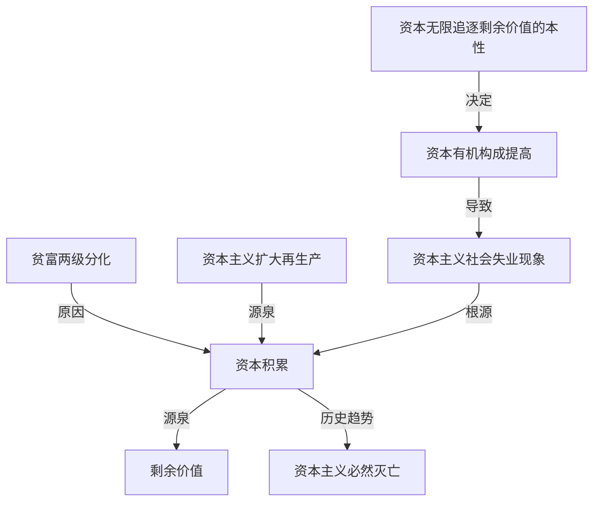

# 第一部分 马克思主义基本原理
总论: 第一章
马克思主义哲学(世界观方法论): 二(唯物论,辩证法)三(认识论)四(唯物史观)章
马克思主义政治经济学(资本主义与垄断资本主义论): 五(自由资本主义)六(垄断资本主义)章
科学社会主义(社会主义与共产主义论): 七八章

##  第一章 马克思主义是关于无产阶级和人类解放的科学
分别阐述了马克思主义唯物论与辩证法的基本原理
1. 第一节
   1.  两观两原理 物质观,意识观,以及物质与意识的辩证关系原理,世界的物质统一性原理
2. 第二节 
   1. 两个总特征 联系和发展的观点是唯物辩证法的总观点和总特征
   2. 三个规律; 对立统一规律,量变质变规律和否定之否定规律
   3. 五对基本范畴;内容与形式,本质与现象,原因与结果,必然与偶然,现实与可能
   4. 其逻辑顺序是:特征-范畴-规律
3. 第三节
   1. 唯物辩证法是认识世界和改造世界的根本方法

###   第一节 马克思主义的创立和发展
###   1 马克思主义和马克思主义基本原理
###   2 马克思主义的创立

####    马克思主义产生的社会根源,阶级基础和思想渊源
1. 资本主义经济的发展为马克思主义的产生提供了经济,社会历史条件
   1.  显露了固有的内在矛盾,预示着未来社会革命的性质和历史发展方向
2. 无产阶级在反对资产阶级的斗争中逐步走向自觉,对科学理论的指导提出强烈的需求(阶级和实践基础)
   1. 几次工人运动的失败
3. 马克思,恩格斯的革命实践和对人类文明成果的继承与创新(主观条件)
   1. 资本主义经济社会的发展及其矛盾运动,为马克思主义的产生提供了 客观条件
   2. 无产阶级与资产阶级的斗争对马克思主义的产生提出了 现实需求
   3. 这些都是马克思主义产生的 时代和实践基础,但这些只是为马克思主义产生提供了可能性
   4. 这些可能性,只有通过马克思,恩格斯的革命实践和 继承与创新 才会变成现实

德国古典哲学,英国古典政治经济学,英法两国的空想社会主义 为马克思主义的创立提供了 直接的理论来源
细胞学说,能量守恒与转化定律,生物进化论,为马克思主义的产生提供了 自然科学前提

1. 1844年2月 德法年鉴 完成了从唯心主义向唯物主义,从革命民主主义向共产主义的转变,为创立 马思 奠定了 思想前提
2. 1845 德意志意识形态 第一次比较系统地阐述了历史唯物主义基本原理
3. 1848 共产党宣言 发表,标志马克思主义的公开问世
4. 1867 资本论 马克思主义最厚重,最丰富的著作,被誉为 工人阶级的圣经
5. 1876-1878 恩格斯 反杜林论 全面阐述马克思主义理论体系,被称为马克思主义的 百科全书

####    共产党宣言 的发表标志着马克思主义的公开问世

###   3 马克思主义的发展
####    列宁对马克思主义的丰富和发展
提出社会主义革命可能在一国或数国首先取得胜利的论断

俄国十月革命的胜利,使科学社会主义从理论开始变为现实

####    共产党对马克思主义的丰富和发展
先后产生了毛泽东思想和中国特色社会主义理论体系

####    一 
####    二
####    三
####    四
####    五

###   第二节 马克思主义的鲜明特征和当代价值
####    一 马克思主义的鲜明特征
#####     科学性
突出特征 和 理论优势,也是马克思主义科学性的重要体现

#####     革命性
集中表现在它的彻底的批判精神和鲜明的无产阶级立场
马克思主义的革命性是建立在科学性基础上的,是与科学性高度统一的

#####     实践性
实践性是马克思主义理论区别于其他理论的显著特征
实践观点是马克思主义 首要的和基本的观点

#####     人民性
人民至上是马克思主义的政治立场
人民性是马克思主义最鲜明的品格

为人类求解放

#####     发展开发性
马克思主义是不断发展的学说,具有与时俱进的理论品质(发展性)
马克思主义不断吸取人类历史上一切优秀思想文化成果而不断丰富自己(开放性)

####    二 马克思主义的当代价值
#####     观察当代世界变化的工具
#####     指引当代中国发展的行动指南
#####     引领人类社会进步的科学真理
马克思主义仍然是当今时代的真理,
人类的未来仍然需要马克思主义的启迪和指南

##  第二章 世界的物质性及发展规律
###   第一节 世界多样性与物质统一性(两观,两原理)
####    一 物质及其存在形态
1. 哲学基本问题--存在和思维的关系问题
2. 哲学基本问题的内容,包含两个方面
   1. 第一,存在和思维究竟谁是世界的本原,即 物质和精神何者是第一性
   2. 第二,思维能否正确认识存在的问题,即 存在和思维有无同一性的问题
3. 哲学基本问题原理的意义,为划分哲学中的基本派别确定了科学标准
4. 唯物主义和唯心主义,可知论与不可知论,辩证法和形而上学
   * 对世界本原问题的不同回答
     * 唯物主义
     * 唯心主义
   * 对世界是否可知问题的不同回答
     * 可知论
     * 不可知论
   * 对世界是怎样存在的不同回答
     * 辩证法: 坚持用联系的,发展的观点看世界,认为发展的根本原因在于事物的内部矛盾
     * 形而上学: 坚持用孤立的,静止的观点看问题,否帧事物内部矛盾的存在和作用
   * 对社会历史观基本问题的不同回答
     * 历史唯物主义(唯物史观),社会存在决定社会意识
     * 历史唯心主义(唯心史观),社会意识决定社会存在
5. 唯物主义和辩证法要统一起来

###### 物质和物质范畴 
1. 唯物主义对 物质的认识过程
   1. 物质范畴史唯物主义哲学关于世界本原和统一性的最高抽象,是唯物主义世界观的基石
   2. 对 物质 认识对深度和广度是区分唯物主义三种形态对重要依据
      1. 唯物主义等三种形态,对物质对理解
      2. 古代朴素唯物主义,金,木等具体股指形态
      3. 近代形而上学唯物主义,原子
      4. 现代辩证唯物主义,客观实在
      5. 共同点: 主张物质第一性
2. 马克思主义物质观
   1. 强调要从能动的实践出发去把握客观世界的意义
   2. 恩格斯对物质概念作论初步概括
      1. 物,物质无非是各种物对总和,而这个概念就是从这一总和中提取出来对
      2. 明确指出论哲学物质概念与自然科学关于具体的物质形态和物质结构的概念之间共性和个性的关系
   3. 列宁对物质概念作了全面的科学的规定
      1. 物质是标志客观实在的哲学范畴
      2. 列宁是从物质与意识的关系上来把握物质的
      3. 物质的 唯一特性 是 客观实在性,
      4. 所谓物质,就是不依赖于人的意志而存在,并能为人类的意识所反映的客观存在

###### 马克思主义物质观的理论意义
第一,坚持唯物主义一元论,同唯心主义一元论和二元论划清了界限
第二,坚持了能动的反映论和可知论,有力地批判了不可知论,世界上只存在尚未认识的东西,不存在不可认识的东西
第三,体现了唯物论和辩证法的统一,主张客观实在性是物质的共性,唯一特性,
第四,体现了唯物主义自然观和唯物主义历史观的统一,为彻底的唯物主义奠定了理论基础

物质与意识的对立,只有在它们何者为第一性,这一范围内才具有绝对意义;超出这个范围,物质和意识的对立便是相对的

马克思主义以前的旧唯物主义在自然观上是唯物的,在历史观上却陷入了唯心,所以是不彻底的 唯物主义

###### 三 物质的存在形态
1. 物质与运动
   1. 运动是物质的根本属性
      1. 世界是物质的,而物质是运动的
   2. 物质和运动不可分割
      1. 一方面,物质是运动的物质,没有不运动的物质
      2. 另一方面,运动是物质的运动,任何形式的运动都有它的物质载体
2. 运动与静止
   1. 静止的含义
      1. 运动是普遍的,永恒的,无条件的,因而是绝对的(人不能两次踏入同一条河流)
      2. 静止是物质的特殊状态,是物质运动在一定条件下的稳定状态,
      3. 包括空间的相对位置暂时不变和事物的根本性质暂时不变这两种运动的特殊状态
   2. 绝对运动与相对静止的辩证统一
      1. 无条件的绝对运动和有条件的相对静止构成了事物的矛盾运动
3. 物质运动与时间,空间
   1. 时间和空间的含义及特点
   2. 时间和空间是物质运动的存在形式
   3. 时空既是有限的又是无限的,既是绝对的又是相对的

相对静止是事物存在和发展的必要条件,是人们认识和利用事物的前提,
是过去运动的结果和未来运动的出发点
是理解和衡量运动的尺度

否认绝对运动,把相对静止绝对化,就会走向形而上学不变论
借口绝对运动,否认相对静止,就会导致相对主义诡辩论(人连一次也不能踏进同一条河流)

客观实在性 是物质的 唯一特性,
运动 是 物质的 根本属性,
时空 是 物质运动的 存在形式

唯物主义运动观与唯心主义运动观的根本区别在于是否承认 运动是物质的运动(不设想非物质的运动)

###### 四 实践是自然存在与社会存在区分和统一的基础
马克思从实践出发去揭示社会的本质,指出 全部社会生活在本质上是实践的 ,从而阐明了社会与自然的区别和联系

从实践出发理解社会生活的本质要把握两大方面
一方面,实践是使 物质世界分化为自然界与人类历史的 历史前提,
又是使 自然界与人类社会统一起来的 物质基础

另一方面,实践是人类社会的基础,是理解和揭示一切社会现象的钥匙
马克思主义确认社会生活在本质上是实践的,也就是把社会生活 当作实践去理解
社会生活是人们各种社会活动的总称.
社会生活的实践性主要体现在:第一,实践是社会关系形成的基础,
第二,实践形成了社会生活的基本领域,第三,实践构成了社会发展的动力

###### 五 人与自然的关系 
自然界包括了人类活动尚未触及的自在自然,以及打上人类活动印记的人化自然
关于动力的几个提法
* 矛盾是事物发展的动力
* 设计间构成了社会发展的动力
* 社会基本矛盾是社会发展的根本动力

####    二 物质与意识的辩证关系
物质决定意识,意识依赖于物质并反作用于物质

#####     物质决定意识
意识是物质世界长期发展的产物,是人脑的机能和属性,是客观世界的主观映像
1. 意识的起源
   1. 意识是自然界长期发展的产物
   2. 意识又是社会历史发展的产物
2. 意识的本质
   1. 意识是物质的产物,但又不是物质本身,意识是特殊的物质,人脑的机能和属性
   2. 意识从本质来看是客观世界的主观映像,是客观内容和主观形式的统一

* 意识虽然有主观性,但是意志的产生和存在都必须依赖于物质,意识不可以脱离物质
* 意识是由物质产生的,但并非一切物质都有意识,
  * 人脑是意识的器官,但不是意识的源泉,意识的源泉是客观世界
* 意识,不管正确错误,先进落后,都是物质世界的主观映像.
  * 人的意识不管主观色彩多浓厚,归根到底都有自己的客观原型
* 高级动物也有感觉和心理,但只有人才有意识,
  * 实践,意识都是人特有的,动物,机器(人工智能)都没有

#####     意识对物质具有反作用(意识的能动性)
人特有的积极认识世界和改造世界的能力和活动,主要表现在
1. 意识活动具有目的性和计划性
2. 意识活动具有创造性
3. 意识具有指导实践改造客观世界的作用

#####     主观能动性和客观规律的统一
所谓规律,是指事物及其发展过程中固有的 本质的,必然的,稳定的客观联系
规律和必然性 是同等程度的概念,代表着事物发展过程中必定如此,确定不移的趋势
规律是客观的,是不以人们的意志为转移的

1. 正确认识和把握物质的决定作用和意识的反作用,必须处理好主观能动性和客观规律的关系
   1. 实践是客观规律性与主观能动性统一的基础
2. 争取发挥主观能动性的前提和条件
   1. 第一,从实际出发,努力认识和把握事物的发展规律,
   2. 这是正确发挥主观能动性的前题
   3. 第二,实践是发挥人的主观能动性的基本途径
   4. 第三,主观能动性的发挥,还依赖于一定的物质条件和物质手段
3. 在社会历史领域,主观能动性与客观规律性的辩证关系具体表现为社会历史趋向与主体选择的关系

####    三 世界的物质统一性
#####     世界的物质统一性原理
1. 包括自然界和人类社会的整个世界,其真正统一性在于它的物质性
2. 物质是世界的本原
3. 世界物质统一性原理的内容包括
    1. 世界是统一的,即世界的本原是一个
    2. 世界的统一性在于它的物质性,即世界统一的基础是物质,
    3. 物质世界的统一性是多样性的统一,而不是单一的无差别的统一
4. 世界的物质统一性首先体现在,意识同一于物质
    1. 从意识的起源上看,意识是客观存在的主观映像
    2. 从意识的作用上看,意识能动性的发挥必须以尊重物质世界的客观规律为前题
    3. 因此,意识统一于物质,在统一的物质世界外,没有任何非物质的存在或非物质的活动
5. 世界的物质统一性还体现在,人类社会也统一于物质
    1. 人类社会依赖自然界
    2. 人们的实践活动,仍然是以物质力量改造物质力量的活动,仍然是物质性的活动
    3. 物质资料的生产方式是人类社会存在和发展的基础,集中体现在人类社会的物质性

* 世界上的一切事物和现象,包括意识现象,归根到底都是物质的表现形式或物质的属性和存在形式
  * 世界上的一切发展,变化多陈都是物质运动的具体表现,器原因是物质世界自身
* 唯心主义是一元论的世界观,主张世界统一于精神.二元哲学否认世界的统一性,把物质和意识绝对对立起来

#####     世界的物质统一性原理的重大理论意义和实践意义
其理论意义在于,它是马克思主义哲学的基石,
其实践意义在于,它是我们从事一切工作的立足点,一切从实际出发是唯物主义一元论的根本要求

###   第二节 事物的联系与发展(特征-范畴-规律)
####    一 联系和发展的普遍性
唯物辩证法是关于世界普遍联系和变化发展的科学,
联系和发展的观点是唯物辩证法的 总观点和总特征

#####     事物的普遍联系
1. 联系的内涵
   1. 联系指事物内部各要素之间和事物之间相互影响,相互制约和相互作用的关系
2. 联系的特点
   1. 客观性,事物的联系是事物本身所固有的,不是主观臆想的(客观的)
   2. 普遍性
      1. 任何事物具有内在的结构性
      2. 任何事物都处于一定的相互联系之中
      3. 整个世界是吸纳高呼联系的统一整体
      4. 世界的普遍联系是通过 中介 来实现的
   3. 多样性
      1. 直接联系与间接联系
      2. 内部联系和外部联系
      3. 本质联系与非本质联系
      4. 必然联系与偶然联系
   4. 条件性
3. 事物普遍联系原理的方法论
   1. 要求人们善于分析事物的具体联系,确立整体性,开放性观念,从动态中考察事物的普遍联系

实践作为人的生命活动和社会存在的形式,实质上是人类所持有的联系形式,即人类社会与自然界
社会中人与人的一切现实联系的基本方式和途径

#####     事物的变化发展
1. 联系和运动是不可分割的
   1. 事物的相互联系包含事物的相互作用,
   2. 而相互作用必然导致事物的运动变化和发展
   3. 概括一切形式的变化就是运动,运动变化的基本趋势是发展
2. 发展及其实质
   1. 发展是前进的,上升的运动
   2. 发展的实质是新事物的产生和旧事物的灭亡
   3. 发展始终是运动多向性中的主流
3. 新事物是不可战胜的
   1. 新事物指合乎历史前进方方向,具有远大前途的事物
   2. 旧事物是指丧失了历史必然性,日趋灭亡的东西
   3. 新事物是不可战胜的,因为
      1. 就新事物与环境的关系而言,新适应了变化的环境和条件
      2. 就新事物与旧事物的关系而言,新在 旧的母体中孕育成熟,它即否定了旧事物中消极腐朽的东西,
      3. 又保留了旧事物中合理的,东西,
      4. 并添加了旧事物所不能容纳的新内容
      5. 这两方面也旧事新事
      6. 物在本质上优越于旧事物,具有强大生命力的原因所在
4. 事物的发展是一个过程
   1. 恩格斯指出 世界不是既成事物的集合体,而是过程的集合体
5. 事物的发展过程...
6. 用历史的眼光看问题

####    二 联系和发展的基本环节
#####     内容与形式
1. 含义
   1. 内容指构成事物的一切要素的总和,是事物存在的基础
   2. 形式指把诸要素统一起来的结构或表现内容的方式
2. 关系
   1. 内容决定形式,形式反作用与内同
   2. 一方面,内容是事物存在的基础,对形式具有决定作用
   3. 另一方面,形式对内同具有反作用,适合内容的形式,对内容的发展起积极的推动作用
3. 方法论意义
   1. 既要重视内容,反对形式主义
   2. 又要善于运用形式,发挥其积极租用,利用和创造必要的形式,适时地抛弃与内容不相适应的形式

内容与形式相互依赖,不可分割
同一内容可以通过多种形式来体现,同一中形式也可以表现不同的内容
在内容与形式的矛盾运动中,内容较为易变,形式则较为稳定?

#####     本质与现象
1. 含义
   1. 本质是事物的根本性质
   2. 现象是事物的外部联系和表面特征,是事物本质的外在表现
2. 关系
   1. 本质与现象相互区别
   2. 本质与现象有是统一的,相互联系,相互依存
      1. 本质决定现象
      2. 现象表现本质,任何现象都是从一定的方面表现着本质,即使假象也是本质的表现
      3. 不表现为现象的本质和不表现本质的现象都是不存在的
3. 方法论意义
   1. 透过现象揭示本质

* 现象与本质是表现与被表现的关系,但两者不会直接合而为一,透过现象发现本质是科学研究的任务
* 真假像是本质正反面的表现,错觉是主观的

#####     原因与结果
1. 含义 
   1. 辩证法把这种**引起与被引起的关系**称为因果关系
   2. 因果联系是由时间顺序的联系,总是原因在前,结果在后
2. 关系
   1. 原因和结果的区分既是确定的,又是不确定的
   2. 原因和结果相互作业,互为因果
   3. 原因和结果相互渗透,结果存在于原因之中,原因表现在结果之中
   4. 原因和结果的关系是复杂多样的
3. 方法论意义
   1. 正确把握事物的因果联系是自觉的实践活动的必要条件
   2. 可以增强人们活动的自觉性,预测性和调控性,即所谓 凡事预则立,不预则废

在一个具体的因果联系中,因果不能混淆和颠倒,
在事物因果联系的长链中,果可以是其他的因

#####     必然与偶然
1. 含义
   1. 必然与偶然是揭示事物产生,发展和衰亡过程中的不同趋势的一对范畴
   2. 必然,指事物联系与发展过程中确定不移的趋势,在一定条件下具有不可避免性
   3. 偶然,指事物联系与发展过程中不确定的趋势
2. 关系
   1. 二者有区别
      1. 它们产生和形成的原因不同
         1. 必然产生于事物内部的根本矛盾,
         2. 偶然产生于非根本矛盾和外部条件
      2. 它们表现形式不同
         1. 必然是同类事物普遍具有的发展趋势
         2. 偶然是事物发展中的个别表现
      3. 它们在事物发展中的低位和作用不同
         1. 必然在事物发展中居于支配地位,决定事物发展方向
         2. 偶然居于从属地位,对事物的发展过程起促进或延缓作用
   2. 必然与偶然又是统一的
      1. 必然与偶然相互依存,没有脱离偶然的必然,也没有脱离必然的偶然
         1. 必然存在于偶然中,通过大量偶然表现出来,并为自己开辟道路
         2. 偶然背后隐藏着必然,收必然支配
      2. 必然和偶然在一定条件下可以相互转化
         1. 相对某一过程来说是必然的东西,对另一过程就可能称为偶然的东西
3. 方法论意义
   1. 必须重视事物发展的必然性,把握事物发展的总趋势,但也绝不可忽视偶然性的作用
   2. 要善于从偶然中发现必然,把握有利于事物发展的机遇

必然性与本质是同等程度的范畴,揭示的都是事物内在联系,认识必然性和认识本质一样,是科学的任务

#####     现实与可能
1. 含义
   1. 现实与可能是揭露事物的过去,现在和未来的相互关系的一对范畴
   2. 现实是指相互联系着的实际存在的事物的综合
   3. 可能是指包含在食物中预示事物发展前途的种种趋势
2. 关系
   1. 现实与可能相互区别(对立)
   2. 现实与可能相互转化(统一)
3. 方法论意义
   1. 要求人们立足现实,展望未来,注意分析事物发展的各种可能性,
   2. 发挥主观能动性,做好应对不利情况的准备,争取实现好的未来

可能有两种形式,即现实的可能性和抽象(非现实)的可能性,
二者的区别在于,现实中的根据和条件是否重非
可能性和不可能性的区别在于,现实中有无根据和条件

####    三 对立统一规律是事物发展的根本规律
#####     唯物辩证法的实质和核心
对立统一规律是唯物辩证法的实质和核心
从根本上回答了事物为什么会发展的问题
中心线索,钥匙
根本方法 --  矛盾分析法

#####     矛盾的同一性和斗争性及其在事物发展中的作用
1. 矛盾是辩证法的核心概念
   1. 对立统一规律又称矛盾规律,简言之,矛盾即对立统一
   2. 矛盾是反映事物内部和事物之间对立统一关系的哲学范畴
2. 矛盾的同一性与矛盾的斗争性的含义
   1. 同一性和斗争性是矛盾的两种基本属性,是矛盾双方相互联系的两个方面
   2. 同一性 指 矛盾双方相互依存,星湖贯通的性质和趋势
      1. 矛盾着的对立面相互依存,互为存在前提
      2. 矛盾的对立面之间相互贯通,在一定条件下相互转化
   3. 斗争性 指 矛盾这的对立面之间相互排斥,相互分离的性质和趋势
3. 矛盾的同一性和斗争性的辩证关系
   1. 同一性不能脱离斗争性而存在,没有斗争性就没有同一性
   2. 因为矛盾的同一是以差别和对立为前提的,是包含差别和对立的同一
   3. 斗争性也不能脱离同一性而存在,斗争性寓于同一性中,没有同一就没有斗争
   4. 斗争性是无条件的绝对的,同一性是有条件的相对的
   5. 斗争性与同一性相结合,构成事物的矛盾运动,推动事物的发展
4. 矛盾的同一性和斗争性在事物发展中的作用
   1. 斗争性与同一性相结合,构成事物的矛盾运动,推动事物的发展
      1. 同一性在事物发展中的作用
         1. 矛盾双发可以利用对发的发展使自己获得发展
         2. 相互吸取有利于自身的因素
         3. 向着对立面转化而得到发展,并规定事物的发展方向
      2. 斗争性在事物发展中的作用
         1. 为对立面的转化,事物的质变创造条件
         2. 促使矛盾双发地位或性质转化,实现事物的质变
      3. 同一性在事物发展中的作用
5. 矛盾的同一性和斗争性原理的方法论意义
   1. 第一,事物的发展不仅表现为 相反相成 而且表现为 相辅相成,
   2. 我们在分析和解决矛盾时,必须从对立中把握同一,从同一中把握对立
   3. 第二,要正确把握和谐对事物发展的作用,
   4. 和谐是相对的有条件的

是否承认对立统一学说是唯物辩证法和形而上学对立的实质

#####     矛盾的普遍性和特殊性及其相互关系
1. 普遍性
   1. 一切事物都是对立统一的,矛盾是事物的普遍本质
2. 特殊性
   1. 不同事物的矛盾各有特点
   2. 同一事物的矛盾在不同的发展过程和阶段各有不同的特典
   3. 构成事物的诸多矛盾及每一矛盾的不同方面各有不同的性质,地位和作用
      1. 主要矛盾是矛盾体系(许多对矛盾中)中处于支配地位,对事物发展起决定作用的矛盾
      2. 每一对矛盾中有以防处于支配地位,其主导作用,这是矛盾的主要方面
      3. 事物的性质是由主要矛盾的主要方面所规定的
      4. 在实际工作中,要坚持 两点论  和 重点论 的统一
      5. 矛盾解决的形式也是多种多样的,主要有
         1. 克服,同归于尽,协同运动的新形式,融合成新事物
3. 普遍性与特殊性的辩证关系
   1. 矛盾的共性和个性,绝对和相对的道理,
   2. 是关于事物矛盾问题的精髓,是正确理解矛盾学说的关键

矛盾是普遍存在的,承认矛盾的普遍性是一切科学认识的首要前提(正视矛盾)
矛盾又具有特殊性,只有具体问题具体分析,才能采取正确的方针和办法去解决矛盾

共性寓于个性中
共性不可能包含所有个性

#####     矛盾的普遍性和特殊性的辩证关系原理的意义
矛盾的普遍性和特殊性辩证关系的原理是马克思注意的普遍真理和各国具体实际相结合的哲学基础,也是建设中国特色社会注意的哲学基础

####    四 量变质变规律和否定之否定规律
#####     量变质变规律
1. 事物存在的质,量,度
   1. 质 是一事物成为自生身并区别于其他事物的内在规定
   2. 量 是事物的规模,程度,速度等可用数量关系表示的规定性
   3. 度 是保持事物质稳定性的数量界限,即事物的限度,幅度和范围
   4. 在认识和处理问题时要掌握适度的原则
2. 事物发展的量变和质变及其辩证关系
   1. 量变
      1. 事物数量的增减和组成要素排列次序的变动
   2. 质变
      1. 事物性质的根本变化
   3. 区分量变和质变的根本标志
      1. 事物的变化是否超出度
   4. 量变和质变的辩证关系
      1. 量变是质变的必要准备
      2. 质变是量变的必然结果
      3. 量变和质变是相互渗透的
      4. 量变和质变是相互依存,相互贯通的
      5. 量变质变规律体现了事物发展的渐进性和飞跃性的统一
3. 量变质变规律原理的方法论意义
   1. 揭示了事物发展过程是连续和阶段性的统一,是无产阶级政党指定路线,方针,政策的重要理论依据

质和事物的存在是直接同一
量和事物是不可分离的,但并不是直接同一的
#####     否定之否定规律
1. 事物发展过程中的肯定和否定
   1. 任何事物内存都存在肯定因素和否定因素
2. 辩证否定观的基本内容
   1. 发展的实质是新事物的产生和旧事物的灭亡
   2. 在新事物取代旧事物的过程中,辩证的否定是决定性环节
   3. 辩证否定观的基本内容
      1. 否定是事物的自我否定
      2. 否定是事物发展的环节
      3. 否定是新旧事物联系的环节
      4. 辩证否定的实质是 扬弃
3. 辩证否定观的方法论意义
   1. 辩证的否定观既是世界观又是方法论,是观察和分析一切问题的方法论原则
   2. 坚持辩证的否定观,就是反对肯定一切和否定一切的形而上学的否定观
   3. 坚持辩证的否定观,就是对一切事物采取科学的分析态度
4. 否定之否定规律及其意义
   1. 否定之否定规律原理
      1. 第一,事物的辩证发展过程经过第一次否定,使矛盾得到初步解决,
      2. 而处于否定阶段的事物仍然具有片面性,还要经过再次否定,即 否定之否定
      3. 实现对立面的统一,使矛盾得到解决
      4. 第二,肯定-否定-否定之否定 ,一个周期,
      5. 第三,从内容上看,是自己发展自己,从形式上看,是螺旋上升或波浪式前进的过程
   2. 否定之否定规律原理的意义
      1. 揭示了事物发展的方向和道理,前进行与曲折性的统一

形而上学的否定信条是 : 是就是是,不是就是不是,否定是绝对的否定,是不包含肯定的否定
辩证否定是事物的自我否定

###   第三节 唯物辩证法是认识世界和改造世界的根本方法
####    一 唯物辩证法是科学的认识方法
#####     客观辩证法与主观辩证法的统一
1. 客观辩证法与主观辩证法的含义
客观辩证法 指客观事物或客观存在的辩证法,即客观事物以相互作用,相互联系的形式呈现出来的各种物质形态的辩证运动和发展规律

主观辩证法指人类认识和思维运动的辩证法,即以作为思维细胞的辩证思维运动和发展规律

唯物辩证法即包括客观辩证法,也包括主观辩证法
2. 主观辩证法与客观辩证法的关系
主观辩证法是客观辩证法在人的思维中反映,本质上是统一的,但在表现形式上却是不同的
可以简要地把主观辩证法称为概念辩证法

#####     唯物辩证法是伟大的认识工具

#####     矛盾分析法是根本的认识方法 :star: 
矛盾分析方法是对立统一规律在方法论上的体现,在唯物辩证法的方法论体系中居于核心的地位,是根本的认识方法
矛盾分析法包含广阔而深刻的内容

马克思主义的最本质的东西,马克思主义的活的灵魂,就在于具体地分析具体的情况

运用唯物辩证法的矛盾分析方法研究问题和解决问题,根本的是具体问题具体分析,一切以时间,地点,和条件为转移

####    二 辩证思维方法与现代科学思维方法
####    辩证思维方法
1. 归纳与演绎
2. 分析与综合
3. 抽象与具体
4. 逻辑与历史相统一
####    现代科学思维方法
...

####    三 学习唯物辩证法,不断增强思维能力
#####     辩证唯物主义是中国共产党人的世界观和方法论
...
#####     习近平新时代中国特色社会主义思想对唯物辩证法的创造性运用和发展
四个全面战略布局
新发展理念

##  第三章 实践与认识及其发展规律
两对关系(实践与认识,真理与价值)
两个规律(认识发展规律,真理发展规律)
一个统一(认识和实践的统一)
突出马克思主义的鲜明特点: 把实践的观点引入认识论,把辩证法应用于反映论

###   第一节 实践与认识
####    一 实践的本质与基本结构
#####     实践的本质和基本特征
1. 实践的本质
   1. 实践是人类能动地改造世界的社会性的物质活动
2. 实践的基本特征
   1. 直接现实性
      1. 实践的这一特征把它同人的主观活动区分开来
   2. 自觉能动性
   3. 社会历史性
      1. 实践从一开始就是社会性的活动
      2. 实践的社会性决定了它的历史性,实践是历史地发展着的实践
#####     实践的基本结构
1. 实践活动的三项基本要素
   1. 实践主体
      1. 自主性和能动性的因素(人)
   2. 实践客体
      1. 实践活动所指对象
   3. 实践中介
      1. 人的肢体延长,等工具性系统
      2. 语言符号工具系统
2. 实践的主体和客体相互作用的关系
   1. 实践关系,最根本的关系
   2. 认识关系
   3. 价值关系

主体客体化:实践,形成世界上本不存在的对象物,体外积累
客体主体化:例如把物质工具作为自己身体器官的延长包括在自身的生命活动中

#####     实践的基本类型
1. 实践的三种类型
   1. 物质生产实践
   2. 社会政治实践
      1. 社会交往
      2. 政治活动
   3. 科学文化实践
   4. (虚拟实践,派生形式,具有相对独立性)
2. 三种实践类型的关系
   1. 物质生产实践是最本质的实践活动,它构成全部的社会生活的基础
   2. 其他类型受生产实践的制约并对其产生能动的反作用

一种活动是否能称为实践活动,关键看它是否超出了纯粹的意识活动,是否改变了除实践主体的意识状态之外的其他存在物的状态

#####     实践在认识活动中的决定性作用
1. 实践是认识的来源
2. 实践是认识发展的动力
3. 实践是认识的目的
4. 实践是检验认识真理性的唯一标准
5. 实践的观点是辩证唯物主义认识论的第一和基本的观点

####    二 认识的本质与过程
认识是主体在实践基础上对客体的能动反映
#####     认识的本质
1. 唯物主义反映论与唯心主义先验论的对立
   1. 一条是坚持从物到感觉和思想的唯物主义认识路线(反映论)
   2. 另一条是坚持从思想和感觉到物的唯心主义认识路线(先验论)
2. 辩证唯物主义能动反映论与旧唯物主义直观反映论的区别
   1. 旧唯物主义直接反映论的严重缺陷
      1. 离开实践考察认知问题,因而不了解实践对认识的决定作用
      2. 不了解认识的辩证性质,不能把认识看作一个不断发展的过程,而认为认识是一次性完成的
   2. 批判继承
      1. 坚持以科学的社会实践为特征的实践观,是两种认识论的根本区别
      2. 辩证唯物主义有两个突出特点
         1. 把实践的观点引入认识论
         2. 把辩证法应用于反映论考察认识的发展过程
3. 认识是主体在实践基础上对客体的能动反映
   1. 认识的本质是主体在实践基础上对客体的能动反映
   2. 第一,认识是主体对客体的反映,实在 思维中再现客观事物的状态属性和本质(反映性)
   3. 第二,主体对客体的反映是一个能动的创造性的过程(创造性)
   4. 第三,反映和创造性是不可分割的,坚持反映性和创造性,才能真正揭示认识的本质和规律

#####     从实践到认知

1. 感性认识和理性认识的含义
   1. 感性认识
      1. 感觉,知觉,表像
      2. 直接性
   2. 理性认识
      1. 概念,判断,推理
      2. 抽象性,间接性
2. 感性认识和理性认识的辩证联系
   1. 区别,感性认识和理性认识在内容和形式上有质的区别
   2. 联系
      1. 感性认识有待于发展和深化为理性认识
      2. 感与里相互渗透相互包含
   3. 在实践的基础上形成,绝不能割裂二者的辩证统一关系
      1. 唯理论(教条主义)
      2. 经验论(经验主义)
3. 感性认识向理性认识的飞跃
4. 认识过程中理性因素和非理性因素
#####     从认识到实践
1. 必要性和重要性
   1. ?
2. 实现飞跃的条件

####    三 实践与认识的辩证运动及其规律

#####     实践与认识的辩证运动及其规律
在实践基础上由感性认识到理性认识,再由理性认识到实践,多次反复才能完成

波浪式前进和螺旋上升的过程

#####     认识和实践的具体的历史的统一

###   第二节 真理与价值

####    一真理的客观性,绝对性和相对性
#####     真理的客观性
1. 真理的含义
   1. 真理是标志主观与客观相符合的哲学范畴,
   2. 是对客观事物及其规律的正确反映
   3. 真理内容是客观的,形式是主观的
2. 真理的客观性
   1. 真理是客观的,凡事真理都是客观真理
   2. 客观性是真理的本质属性
3. 真理的一元性
   1. 真理的客观性决定了真理的一元性
   2. 同一条件下对特定的认识客体的真理性认知只有一个,
   3. 不因主体认识的差别而变化而改变
   4. 不能说 它对谁来说是真理

真理是不是客观的,一切唯心主义都作了否定回答,一切唯物主义都做了肯定回答

真理不是主观产物,不等同客观实在?
错误:
* 真理是 观念与主体感觉相符合(客观)
* 真理是思维和他打先验形式相一致(主观?)
* 真理 是绝对理念的自我显现
* 真理是思想形式,是社会组织起来的经验
* 凡事多数人承认的就是真理
* 有用即真理

真理的一元是针对真理的客观内容而言的,其表现是多样的

#####     真理的绝对性和相对性及其辩证关系
承认真理是客观的,这是真理问题上的唯物论
真理既具有绝对性又具有相对性,它们是同一客观真理的两种属性,这是真理问题上的辩证法
任何真理,既具有客观性,又同时具有绝对性和相对性

1. 真理的绝对性和相对性
   1. 绝对性
      1. 任何真理都标志这主观与客观的符合,都包含不依赖于人的客观内容,同谬误有原则的界限,这是无条件的,绝对的
      2. 承认世界的可知性,也就是承认了绝对的真理?人能正确认识世界,这是绝对的
   2. 相对性
      1. 人们在一定条件下对客观事物及其本质和发展规律的正确认识总是有限度的,不完善的
      2. 任何真理都只是对客观世界的某一阶段,某一部分的正确认识,有待扩展
      3. 就特定事物而言,任何真理都是对客观事物一定方面的正确认知,有待深化
2. 绝对性和相对性的辩证统一关系
   1. 相互依存
   2. 相互包含
3. 真理发展的规律
   1. 真理永远处于在由相对绝对的转化和发展中,是从真理的相对性走向绝对性,接近绝对性的永无止境的过程
4. 真理的绝对性和相对性的起源
   1. 人的认知能力,思维能力既然是无限性与有限性,绝对性与相对性的对立统一,
   2. 作为人的正确认识成果的真理,当然也是绝对性和相对性的对立统一
5. 承认真理是绝对性和相对性的辩证统一
   1. 绝对主义 (片面夸大真理的绝对性),教条主义和思想僵化
   2. 相对主义(片面夸大真理的相对性),不可知论和诡辩论
6. 马克思主义也是绝对性和相对性的统一

#####     真理与谬误
1. 真理与谬误的对立统一关系
   1. 真理与谬误相互对立
      1. 在确定的对象和范围内,真理和谬误的对立是绝对的
      2. 与对象不相符合的就是谬误,反之为真理
   2. 又是统一的,它们相互依存,相互转化
      1. 真理与谬误相比较而存在的,没有真理也无所谓谬误
      2. 真理和缪误超出一定范围酒水相互转化
2. 成功与失败
   1. 真理与谬误是从认识的角度区分
   2. 成功与失败是从实践的角度看的

真理是具体的,任何真理在一定范围内,一定条件下才能成立,否则就会变成谬误
真理又是全面的,把某个原理孤立地抽取出来,斩断联系,就会变成谬误

####    二真理的检验标准
#####     实践之所以能称为真理的唯一检验标准,是由真理的本质和实践的特点决定的
1. 真理的本性在于主观和客观相符合
   1. 检验认知真理性的标准只能是把主观和客观联系起来的桥梁--社会实践
2. 实践的直接现实性,是它能够称为检验真理标准的主要根据

实践是检验真理的唯一,除此以外,再无其它标准
如果把主观的东西当作真理的标准,就属于主观真理标准论,如
* 圣人或权威的意见为标准
* 以自己的观念,意见为标准
* 以多数人的意见和感觉为标准
* 以有用,有效为标准 ???

#####     在实践检验真理的过程中,逻辑证明可以起到重要的补充作用
真理一定符合逻辑,但符合逻辑的不一定是真理

#####     实践标准的确定性与不确定性
实践作为标准,是确定性与不确定性的统一

1. 实践标准的确定性即绝对性
   1. 实践作为标准的唯一性
2. 实践标准的不确定性即相对性
   1. 实践对认识真理性的检验的条件性
3. 坚持实践标准的确定性与不确定性的统一,
4. 就是坚持真理问题上的实践标准的辩证法
5. 既可防止唯心主义的随意性,又可避免形而上学的绝对化

####    三真理与价值的辩证统一
#####     价值及其特性
1. 哲学上 价值 的含义
   1. 实践基础上形成的主体和客体中间的意义关系
   2. 是客体对人,群体乃至整个社会生活和活动所具有的积极意义
   3. 价值由两方面构成
      1. 主体需要
      2. 客体的特性
2. 价值的基本特性
   1. 主体性
      1. 价值直接同主体相联系,始终以主体为总性
      2. 价值关系的形成依赖主体的存在
      3. 价值关系的形成依赖于主体的创造
   2. 客观性
      1. 主体的存在和需要具有客观性
      2. 客体的存在,属性及作用是客观的
   3. 多维性
      1. 每个主体的价值关系具有多样性,同一客体对主体的不同需要会产生不同的价值
   4. 社会历史性
      1. 主体是在一定社会关系总从事实践的具体的人,随着实践和历史的发展
      2. 主体和客体之间的关系发生变化

价值不是实体,而是主体与客体之间的一种特定的关系,
在价值关系中,是物趋近人

#####     价值评价及其特点
1. 也称作价值判断
2. 价值评价的基本特点
   1. 以主客体的价值关系为认知对象
   2. 评价结果与评价主体直接相关,受主体意志的影响
   3. 评价结果的正确与否依赖于对客体状况和主体需求的认知
#####     真理和价值在实践中的辩证统一
1. 实践的真理尺度和价值尺度
2. 真理和价值在实践中的辩证统一关系
   1. 价值尺度以真理为前提
   2. 尺度推动人们发现新真理
3. 新时代中国特色社会主义的伟大实践,充分体现了真理尺度与价值尺度的辩证统一

对真理不能说对谁来说是真理,对价值,必须说对谁来说
同一真理对不同主体有不同价值

###   第三节 认识世界和改造世界
####    一认知世界和改造世界相结合
#####     认知世界和和改造世界及其辩证关系
认知世界和和改造世界是人类创造历史的两种基本活动
坚持认知与实践的统一,归根结底是要将认知世界和改造世界相结合起来

认识与改造是相互依赖,相互制约的辩证关系

二者统一的基础是实践

#####     改造客观世界和改造主观世界及其辩证关系

#####     认识世界和改造世界的过程是从必然走向自由的过程
1. 认识与改造世界是一个充满矛盾的过程
   1. 主观和客观的矛盾是人类认知和实践活动中的基本矛盾
   2. 也是人类认识世界和改造世界的根本动力
2. 自由是对必然的认识和对客观世界的改造
   1. 自由是标志人的活动状态的范畴
   2. 指人在活动中通过认知和利用必然所表现出的一种自觉自主的状态
   3. 必然性即规律性,
   4. 认识必然,争取自由,是人类认识世界和改造世界的根本目标
3. 自由是有条件的
   1. 认识条件
   2. 实践条件
4. 自由和必然的关系贯穿于人类存在和发展的始终,并称为人类存在和发展的永恒矛盾
5. 因此也是人类存在和发展的永恒动力

从必然王国到自由王国

####    二一切从实际出发,实事求是
一切从实际出发是马克思主义认知论的根本要求
实事求是是中国共产党思想路线的核心

####    三实现理论创新和实践创新的良性互动
实践创新为理论创新提供不竭的动力
理论创新为实践创新提供科学的行动指南
我们要努力实现理论创新和实践创新的良性互动

##  第四章 人类社会及其发展规律
本课程重点章,主要讲述唯物史观
第一节,社会基本矛盾及其运动规律,包括 
一个问题(历史观的基本问题,社会存在与社会意识),
两个规律(生产力与生产关系矛盾运动的规律,经济基础与上层建筑矛盾运动的规律),
一个一般,三种特殊(社会更替的一般规律,五种社会形态的依次更替,三种特殊形式---必然和选择,统一和多样性,前进性与曲折性)

第二节,阐述社会发展动力,从客体的角度揭示了社会历史发展的五种动力(一个根本,一个直接,三个重要)

第三节,阐述人民群众在历史发展中的作用,从主体的角度回答人民群众和个人在社会历史发展中的作用

###   第一节 社会基本矛盾及其运动规律
####    一社会存在与社会意识
#####     两种根本对立的历史观
在马克思主义诞生之前,唯心史观一直占据统治地位
其缺陷是,至多考察了人们生活的思想动机,而没有进一步考究思想动机背后的物质动因和经济根源
二是,只看到人在历史上的作用,忽视了人民群众创造历史的决定性作用

#####     社会存在
社会存在也称社会物质生活条件,是社会生活的物质方面,主要包括自然地理环境,人口因素和物质生产方式
1. 自然地理环境,人类社会生存和发展的永恒的,必要的条件
2. 人口因素,社会存在和发展的必要条件
3. 物质生产方式(决定性力量)
   1. 生产力和生产关系的统一体,集中地体现了人类社会的物质性
#####     社会意识
社会意识就是社会生活的精神方面,是社会存在的反映

在阶级社会中,占统治地位的思想文化,本质上是经济上占统治地位的阶级的意识形态,因而具有鲜明的阶级性

1. 社会意识
   1. 社会心理
      1. 人们的感知,情绪等
   2. 社会意识形态
      1. 社会意识形态(观念上层建筑,有阶级性)
         1. 政治法律思想 核心/主导
         2. 道德,艺术...
      2. 非意识形态的社会意识形态(无阶级性)
         1. 语言学,心理学,自然科学

#####     社会存在和社会意识的辩证关系
1. 社会存在决定社会意识
2. 社会意识既依赖于社会存在有具有相对独立性
   1. 社会意识还有自己特有的发展形势和规律
   2. 社会意识对社会存在能动的反作用,这是社会意识相对对立性的突出表现

社会存在决定社会意识,社会意识是社会存在的反映,并反作用于社会存在
不论先进还是落后的社会意识都会对社会存在产生反作用,只不过性质不同
社会意识的能动性是通过指导人们的实践活动实现的

#####     社会存在和社会意识辩证关系原理的意义
第一,它是人类思想史上第一次正确解决了社会历史观的基本问题,是社会历史观革命性变革的基础

第二,它对社会发展具有指导意义

####    二生产力与生产关系的矛盾运动及其规律
#####     生产力与生产关系
1. 生产力
   1. 含义
      1. 人类在实践中形成的改造自然以适合社会需要的物质力量
      2. 生产力具有客观实在性和社会历史性
   2. 结构
      1. 劳动资料,手段
         1. 物质资料或物质条件,是人和劳动对象之间的媒介
         2. 生产工具是生产力发展水平的客观尺度,是区分社会经济时代的客观依据(物质标志)
      2. 劳动对象
         1. 是现实生产的前提
         2. 从侧面体现劳动力的发展水平
         3. 劳动资料和劳动对象合成 生产资料
      3. 劳动者
         1. 劳动者是生产力中最活跃的因素
      4. 科学技术是生产力的重要因素
2. 生产关系
   1. 含义
      1. 人们在物质生产过程中形成的不以人的意志为转移的紧急关系
      2. 生产关系是社会关系中最基本的关系
   2. 内容
      1. 生产资料所有制关系(基本,决定性的)
         1. 区分不同产生方式,判定社会经济结构性质的客观依据
      2. 人与人的关系
      3. 产品分配关系
   3. 分析生产关系必须透过物看到物后面的人与人的关系,生产关系具有客观性
      1. 生产关系是一种客观的物质的社会关系,
      2. 是一种物质利益关系

#####     生产关系一定要适合生产力状况的规律(人类社会发展的基本规律)
1. 生产力与生产关系的相互关系
   1. 生产力决定生产关系
   2. 生产关系对生产力具有能动的反作用
      1. 归根结底还是由生产力决定的,
      2. 生产关系对生产力反作用的性质取决于它是否适合生产力的状况
2. 生产力与生产关系矛盾运动规律
   1. 生产关系一定要适合生产力状况的规律
   2. 这是社会形态发展的普遍规律
3. 生产力与生产关系矛盾运动规律的原理的意义
   1. 理论意义
      1. 科学地确立了生产力发展是 社会进步的最高标准
   2. 现实意义
      1. 是马克思主义政党指定路由,政策的重要依据

####    三经济基础与上层建筑的矛盾运动及其规律
#####     经济基础与上层建筑
1. 经济基础的含义
   1. 社会一定发展阶段的生产力所决定的生产关系的总和
   2. 决定一个社会性质的是其占支配地位的生产关系
2. 上层建筑的含义
   1. 建立在一定经济基础上的意识形态与之相对应的制度
      1. 意识形态又称观念上层建筑
      2. 政治法律制度又称政治上层建筑
   2. 观念上层建筑和政治上层建筑的关系
      1. 政治上层建筑是在一定意识形态指导下建立起来的,是统治阶级意志的体现
      2. 一旦形成,就会成为一种现实的力量,影响并制约着人们的思想理论观点
   3. 国家的起源和实质
      1. 政治上层建筑居主导地位,国家政权是核心
      2. 国家的实质是一个阶级统一另一个阶级的工具

#####     上层建筑一定要适合紧急基础状况的规律(人类社会发展的又一基本规律)
经济基础决定上层建筑,上层建筑反作用于经济基础,二者相互影响,相互作用
上层建筑反作用的性质,归根到底取决于它是否有利于生产力的发展

上层建筑,既对经济基础有依赖性,又具有相对独立性

经济基础状况决定上层建筑的发展方向,决定其调整与变革,而不允许器长期落后或不适应自己的发展

####    四社会形态更替的一般规律及其特殊形式
#####     社会形态的内涵
社会形态是关于社会运动的具体形式,发展阶段和不同质态的范畴
是同生产力发展一定阶段相适应的经济基础与上层建筑的统一体
经济基础是社会的 骨骼系统,上层建筑是社会的 血肉系统

#####     社会形态更替的统一性和多样性
社会形态发展的统一性与多样性,根源于社会发展的客观必然性与人们的历史选择性相统一的过程
1. 社会形态更替的统一性
2. 社会形态更替形式的多样性
3. 

#####     社会形态更替的必然性与人们的历史选择性
生产力的发展具有最终的决定意义

#####     社会形态更替的前进性与曲折性

###   第二节 社会历史发展的动力
####    一社会基本矛盾在历史发展中的作用
#####     社会基本矛盾的内容
1. 内容
   1. 生产力和生产关系
   2. 经济基础和上层建筑
2. 原因
   1. ...

社会主要矛盾可以发生阶段性变化

#####     社会基本矛盾在历史发展中的作用
社会基本矛盾是历史发展的根本动力,表现在
1. 生产力是社会基本矛盾运动中最基本的动力因素,是人类社会发展和进步的终决定力量
2. 社会基本矛盾是一切历史冲突的根源,决定着社会中其它矛盾的存在和发展
3. 社会基本矛盾具有不同的表现形式和解决方式,从根本上影响和促进社会形态的变化和发展

4. 社会基本矛盾是社会发展的根本动力
5. 阶级斗争是社会根本矛盾在阶级社会中的直接表现,是阶级社会发展的直接动力
6. 社会革命是推动社会发展特别是社会形态更替的重要动力
7. 改革是图董社会发展的又一重要动力
8. 科学技术革命是社会动力体系中的一种重要动力

#####     社会主要矛盾在历史发展中的作用
社会主要矛盾是社会基本矛盾的具体体现
会在一定条件下发生转化

####    二阶级斗争和社会革命在阶级社会发展中的作用
#####     阶级和阶级斗争是人类社会发展到一定阶段才会出现的社会现象
生产资料占有关系不同,是划分阶级的基础

#####     阶级斗争在阶级社会发展中的作用
作用是历史的,变化的
#####     社会革命的实质和作用
社会革命既是基本矛盾运动的结果,又是推动社会发展的重要动力
1. 社会革命的实质
   1. 国家政权
2. 社会革命的根源
   1. 社会基本矛盾的尖锐化
3. 社会革命的作用
   1. 实现社会形态更替的手段和决定性环节

####    三改革在社会发展中的作用
#####     改革的性质和作用
改革是同一种社会形态发展过程中的量变和部分质变,是推动社会发展的又一重要动力
#####     改革是社会主义的自我完善和自我发展

####    四科学技术在社会发展中的作用
科学技术是社会发展的重要动力

#####     科学技术的含义

#####     科技革命是推动经济和社会发展的强大标杆
通过促进人们的生产方式,生活方式和思维方式的深刻变化来推动社会发展的
#####     正确把握科学技术的社会作用

###   第三节 人民群众在历史发展中的作用
####    一人民群众是历史的创造者
#####      两种历史观在历史创造者问题上的对立
1. 英雄史观
2. 群众史观
#####      唯物史观考察历史创造者的原则
1. 唯物史观立足于现实的人及其本质来把握历史的创造者
2. 立足于社会历史的过程
3. 社会历史发展的必然性
4. 历史关系的不同层次

人们自己创造自己的历史 不是 人人创造历史(只有代表促进社会历史前进的人才属于历史的创造者,其它人至多算历史的参与者)

#####      人民群众在创造历史过程中的决定作用
1. 人民群众的含义
   1. 一个历史范畴
   2. 指一切对社会历史发展起推动作用的人们
   3. 最稳定的主体部分始终是从事物质资料生产的劳动群众
2. 人民群众在创造历史过程中的决定作用
   1. 人民群众是物质财富的创造者
   2. 是社会精神财富的创造者
   3. 是社会变革的决定力量
3. 人民群众创造历史的活动受到一定社会历史条件的制约

#####      无产阶级的群众路线

####    二个人在社会历史中的作用
#####     杰出人物的历史作用
普通个人,历史人物

杰出人物是历史人物中对推动历史发展作出重要贡献或起重要作用的人,不能决定和改变历史发展的总进程和总方向

#####     辩证地理解和评价个人的历史作用

历史分析法
阶级分析法

#####     正确评价无产阶级领袖

##  第五章 资本主义的本质及其规律
第一节,重点与难点,商品经济和价值规律,揭示了商品经济的一般规律

第二节,资本主义经济制度的本质,揭示了资本主义经济危机的本质特征,根本原因,具体表现和周期性

第三节,资本主义国家的政治制度和意识形态

###   第一节 商品经济和价值规律
####    一自然经济
自然经济是一种以自己自足为特征的经济形式,

####    二商品经济产生的历史条件
商品经济得以产生的历史条件有两个:
1. 社会分工的存在
2. 生产资料和劳动产品属于不同的所有者

####    三商品的二因性
#####     商品的二因性
商品是用来交换的能满足人们某种需要的劳动产品,
具有使用价值和价值两个因素,是使用价值和价值的矛盾统一体

#####     使用价值
商品的有用性
反映的是人与自然之间的物质关系,
是商品的自然属性,
是一切劳动产品所共有的属性

#####     价值
价值是凝结在商品中的无差别的一般人类劳动,即人类脑力和体力的耗费
价值是商品所持有的社会属性

商品的价值在质的规定上是相同的,因而它们可以相互比较
价值是交换价值的基础,交换价值是价值的表现形式

商品的价值在本质上体现了生产者之间的一定的社会关系

天然的物品不是劳动产品,不是为了交换而生产的劳动产品不是商品

#####     商品的价值和使用价值的对立统一关系
对立性表现在,商品的使用价值和价值是相互排斥的,二者不可兼得
统一性表现在,作为商品必须同时具有使用价值和价值两个因素

使用价值是价值的物质承担者,价值寓于使用价值之中

####    四生产商品的劳动二重性
1. 具体劳动和抽象劳动
   1. 具体劳动,有用劳动,形成使用价值
   2. 抽象劳动,撇开一切具体形式的无差别的一般人类劳动,即人的体力和脑力消耗
   3. 形成价值实体
   4. 正是劳动的二重性,决定了商品的二因性
2. 具体劳动和抽象劳动的对立统一关系
   1. 一方面,不是各自独立,在时间上和空间上是统一的
   2. 另一方面,具体劳动反映人与自然的关系,是劳动的自然属性
   3. 抽象劳动反映商品生产者的社会关系,是劳动的社会属性
####    五商品价值量的决定
#####     社会必要劳动时间决定商品的价值量
商品的价值包括质的规定与量的规定两个方面
价值的质的规定回答的是价值的实体是什么(抽象价值)
价值的量的规定则回答价值的大小由什么决定和怎么决定

决定商品价值量的,不是生产商品的个别劳动时间,而只能是社会必要劳动时间

#####     商品的价值与劳动生产率的关系
劳动生产率指的是劳动者生产使用价值的能力,可用单位劳动时间内生产的产品数量来衡量,也可用单位产品所耗费时间来测量

同一劳动在同样的时间内提供的价值量总是相同的

#####     形成商品价值量的劳动以简单劳动为尺度
简单劳动是指不需要经过专门训练和培养的一般劳动者都能从事的劳动

在以私有制为基础的商品经济条件下,复杂劳动转化为简单劳动,不是商品生产者自觉计算出来的,而是在商品交换过程中自发实现的

####    六价值形式的发展与货币的产生,货币的本质和职能
#####     价值形式的发展与货币的产生
从历史上看,商品价值形式的发展经历了四个阶段
简单的或偶然的价值形式,总和的或扩大的价值形式,一般价值形式,货币形式

#####     货币的本质和职能
货币在长期交换过程中形成的固定充当一般等价物的商品,体现商品生产者之间的社会经济关系

货币具有五种基本职能
1. 价值尺度
   1. 为商品定价,只需观念的货币
2. 流通手段
   1. 一手交钱,一手交货,必须是是在的货币
3. 储藏手段
   1. 退出流通领域,必须是足值的金属货币
4. 支付手段
   1. 延期支付形式
5. 世界货币
   1. 在世界范围内的应用

商品内在的使用价值和价值的矛盾发展成为外在的商品和货币的矛盾

货币的出现没有也不可能解决商品经济的基本矛盾
即 私人劳动和社会劳动的矛盾,反而使矛盾更加扩大和加深了

####    七价值规律及其作用
#####     价值规律的内容
商品的价值量由生产商品的社会必要劳动时间决定,商品交换以价值量为基础,按照等价交换的原则进行
价值规律是贯穿整个商品经济的一般规律,它既支配商品生产,又支配商品流通

#####     价值规律的表现形式
商品的价格围绕商品的价值自发波动

价值规律的各种表现形式
1. 平均利润出来前
   1. 围绕商品价值
2. 平均利润出来后
   1. 围绕生产价格
3. 垄断出现后
   1. 价格围绕垄断价格上下波动

并没有否定价值规律的作用

#####     价值规律的作用
价值规律的作用是自发的
1. 自发调节生产资料和劳动力在社会各生产部门之间的分配比例
2. 自发地刺激社会生产力的发展
3. 自发地调节社会收入的分配

消极后果
1. 社会资源浪费
2. 阻碍技术的进步
3. 导致收入两级分化

作用可以与消极后果对应,从记忆的角度

####    八以私有制为基础的商品经济的基本矛盾
#####     私人劳动和社会劳动
商品生产者的劳动的私人性质是由生产资料私有制决定的

#####     私人劳动和社会劳动的矛盾构成私有制商品经济的基本矛盾
私人劳动和社会劳动的矛盾贯穿商品经济发展过程的始终,决定着商品经济的各种内在矛盾及其发展趋势

首先,私人劳动和社会劳动的矛盾决定商品经济的本质及其发展过程
其次,私人劳动和社会劳动的矛盾是商品经济其它一切矛盾的基础
最后,私人劳动和社会劳动的矛盾决定着商品生产者的命运

交换是解决私人劳动和社会劳动矛盾的唯一途径

#####     资本主义的基本矛盾
生产资料的资本主义私人占有和生产社会化之间的矛盾

####    九马克思劳动价值论的理论和实践意义
1. 马克思劳动价值论扬弃了英国固定政治经济学的观点,为剩余价值的创立奠定了基础
   1. 创立了劳动的二重性
   2. 劳动二重性理论成为 理解政治经济学的枢纽
2. 揭示了私有制条件下商品经济的基本矛盾,
3. 揭示了商品经济的一般规律,对理解社会主义市场经济具有指导意义

####    十深化对马克思劳动价值论的认识
...

###   第二节 资本主义经济制度的本质
####    一 资本主义经济制度的产生
1. 前资本主义社会形态的演进和更替
2. 资本主义生产关系的产生
   1. 小商品经济分化出来
   2. 商人和高利贷者转化而来
3. 资本的原始积累
   1. 资本原始积累的内涵
      1. 生产者与生产资料相分离
      2. 货币资本迅速集中于少数人手中的历史过恒
   2. 资本原始积累的途径主要有两个
      1. 暴力手段剥夺农民的土地
      2. 暴力手段掠夺货币财富
4. 资本主义生产方式的确立

####    二 劳动力成为商品与货币转化为资本
这一经济制度的形成是以劳动力成为商品为前提条件的
1. 劳动力成为商品的基本条件
   1. 劳动力
   2. 两个基本条件
      1. 劳动者是自由人
      2. 劳动者没有别的商品可以出卖
   3. 劳动力成为商品,标志着简单商品生产发展到资本主义商品生产的新阶段
2. 劳动力商品与货币转化为资本 重要
   1. 劳动力商品的价值,
      1. 是由生产,发展,维持和延续劳动力所必须的生活必需品的价值决定的
      2. 它包含三个部分
         1. 维持劳动者本人生存所必须的生活资料的价值
         2. 维持劳动者家属生存所必须的生活资料的价值
         3. 劳动者接收教育和训练所支出的费用
      3. 劳动力价值的构成包含着一个历史的和道德的因素
   2. 劳动力商品的一大特点,是它的使用价值是价值的源泉
      1. 它在消费过程中能够创造新的价值,而这个新的价值比劳动本身的价值更大
      2. 一旦货币购买的劳动力带来剩余价值,货币也就变成了资本
   3. 在资本主义条件下,资本家购买的是雇佣工人的劳动力而不是劳动
      1. 劳动是劳动力商品的使用价值,它本身不是商品
      2. 劳动力商品具有能传造比资本价值更大的价值的特点

劳动力商品首先是商品,具有商品的一般属性

劳动力的使用价值就是劳动,而劳动是价值的(唯一)源泉,因此才有它的使用价值是价值的源泉的说法

####    三 资本主义所有制
1. 所有制与所有权
   1. 经济意义上的所有制
      1. 指,事实上生产资料归谁所有
   2. 法律意义上的所有制
      1. 由占有生产资料的法律原则决定的
   3. 所有制与所有权的关系
      1. 所有制是所有权的基础
      2. 所有制决定着所有权
      3. 所有权是所有制的法律形式,它反映着经济关系的意志关系,这种关系根本上是由这种经济关系本身所决定的
2. 资本主义所有制的本质 重要
   1. 资本家凭借对生产资料的占有,
   2. 在等价交换的原则的掩盖下,雇佣工人从事劳动
   3. 无偿占有雇佣工人创造的剩余价值,这就是资本主义所有制的本质

####    四 生产剩余价值是资本主义生产方式的绝对规律
1. 资本主义生产过程的两重性
   1. 一方面是物质生产过程,
      1. 生产使用价值
      2. 工人的劳动隶属于资本家
      3. 劳动的全部成果或者产品全部归资本家所有
   2. 另一方买你是剩余价值的生产过程,即价值的增值过程
      1. 所谓劳动增值过程,是超过劳动力价值的补偿这个一定点而延长了价值形成过程
   3. 资本主义生产过程是劳动价值和价值增值过程的统一
2. 剩余价值的实质
   1. 必要劳动,用于再生产劳动力的价值
   2. 剩余劳动,用于无偿地为资本家生产剩余价值,
      1. 这是价值形成过程转变为价值增值过程的关键
3. 资本的本质
   1. 资本是可以带来剩余价值的价值
   2. 资本的本质不是物,而是一定的历史社会形态下的生产关系
4. 不变资本和可变资本的区分及其意义
   1. 不变资本
      1. 以生产资料形态存在的资本,
      2. 生产资料的价值通过工人的具体劳动被转移到新产品中,其转移的价值量不会大于它原有的价值量
      3. 不仅有固定资本还有流动资本
   2. 可变资本
      1. 用来购买劳动力的那部分资本
      2. 可变资本的价值在生产过程中是由工人的劳动再生产出来的
   3. 区分的意义
      1. 进一步揭示了剩余价值产生的源泉
      2. 剩余价值既不是有全部资本创造的,也不是由不变资本创造的,而是由可变资本创造的
      3. 雇佣劳动者的剩余劳动是剩余价值产生的唯一源泉
5. 剩余价值率
   1. 剩余价值与可变资本的比率,
   2. m' = m/v
6. 绝对剩余价值和相对剩余价值
   1. 绝对剩余价值
      1. 必要劳动时间不变的条件下,由于延长工作日的长度而生产的剩余价值
   2. 相对剩余价值
      1. 工作日长度不变的条件下,通过缩短必要劳动时间
      2. 而相对对延长剩余劳动时间生产的剩余价值
      3. 缩短必要劳动时间是通过全社会劳动生产率的提高而实现的
      4. 全社会劳动生产力的提高是资本家最逐剩余价值的结果
7. 超额剩余价值
   1. 由于提高劳动生产率而使商品的个别价值低于社会价值的差额
   2. 资本家主观追求超额剩余价值,客观后果是普遍获得相对剩余价值
8. 生产自动化条件下剩余价值的源泉
   1. 本质上依然是物化劳动或不变资本的事务形式
   2. 价值在工人生产它们的过程中形成,不创造新的价值
   3. 只是资本家获得高额剩余价值的手段
   4. 雇佣工人的剩余劳动依然是这种剩余价值的源泉

五组劳动划分总结
1. 具体劳动与抽象劳动
   1. 劳动的二重性,决定了商品的二重性
2. 个别劳动和社会必要劳动
   1. 举定商品价值量的是社会必要劳动时间
3. 简单劳动和复杂劳动
   1. 商品价值量是以简单劳动为尺度计算的
4. 私人劳动和社会劳动
   1. 私人劳动转化为社会劳动(商品卖出去),商品的价值才得到了实现
   2. 交换是解决私人劳动和社会劳动之间矛盾唯一的途径
5. 必要劳动和剩余劳动
   1. 必要劳动用于再生产劳动力的价值,剩余劳动无偿地为资本家生产剩余价值

####    五 资本积累
把 剩余价值 转化为 资本,或者说 剩余价值的资本化,就是资本累积

1. 资本主义简单在生产 和 扩大再生产(形式,实质和特点) 重要
   1. 简单再生产
      1. 资本家瓜分剩余价值后,将其完全用于个人消费
      2. 就实质而言 是物质资料再生产和资本主义生产关系再生产的统一
   2. 扩大再生产
      1. 资本主义再生产的特点是扩大再生产
      2. 将无偿占有的剩余价值,一部分转化为资本,用来购买追加的生产资料和劳动力
      3. 使生产在扩大的规模上重复进行,这就是资本主义扩大再生产
      4. 资本积累是资本主义扩大再生产的源泉
2. 资本积累的本质,源泉和后果
   1. 本质
      1. 资本积累的本质,就是资本家不断利用无偿占有的工人创造的剩余价值来扩大自己的资本规模
      2. 进一步扩大和加强对工人的剥削和统治
   2. 源泉 
      1. 资本积累的源泉是剩余价值
      2. 规模大小取决于对工人的剥削程度,劳动生产率的高低,所用资本和所费资本之间的差额,以及垫付资本的大小
   3. 后果
      1. 资本积累不但是社会财富占有两级分化的重要原因,而且是资本主义社会失业现象产生的根源
3. 资本有机构成
   1. 这种由生产的技术水平所决定的生产资料和劳动力之间的比例,叫做 资本的 技术构成
   2. 从价值形式上看 ,资本分为不变资本与可变资本,这两部分资本价值之间的比例,叫做 资本的 价值构成
   3. 资本的技术构成决定资本的价值构成
   4. 由 **技术构成** 决定并反映 技术构成变化的资本价值构成,叫做资本的有机构成,
   5. 通常用 c:v 来表示,其中c为不变资本,v为可变资本
4. 相对过剩人口
   1. 在资本主义生产过程中,资本有机构成的提高是一般趋势,这是由资本无限追逐剩余价值的本性决定的
   2. 相对过剩人口,就是劳动力供给超过了资本对它的需要
   3. 之所以是相对的,是因为它并不是社会发展所绝对不需要的
   4. 基本上有三种形式
      1. 流动的过剩人口
      2. 潜伏的过程人口
      3. 停止的过程人口
5. 资本积累的历史趋势
   1. 生产的社会性 和 资本主义的私人占有形式 之间便发生了深刻的矛盾
   2. 这是资本主义被新的,能适应社会化大生产要求的社会形态所取代的根本原因

* 抽象劳动是价值的唯一源泉,具体劳动是使用价值的源泉
* 劳动力商品的使用价值是价值的源泉
* 劳动者的剩余价值是剩余价值产生的唯一源泉
* 资本积累是资本主义扩大在生产的源泉
* 剩余价值是资本积累的源泉

####    六 资本的循环周转与再生产
1. 资本循环及其职能形式
   1. 资本作为一种自行增值的价值 (资本循环周转规律)
   2. 产业资本循环的三个阶段和采取的三种职能形式
      1. 购买阶段,货币资本的职能
      2. 生产阶段,生产资本的职能
      3. 售卖阶段,商品资本的职能

2. 产业资本运动的基本前提条件
   1. 产业资本的三种职能形式必须在空间上并存
   2. 三种职能形式必须在时间上继起,时间上依次连续
   3. 产业资本的连续循环,是流通过程和生产过程的统一,也是它的所有三种循环形式的统一
3. 资本周转及其速度
   1. 资本周转 
      1. 资本是在运动中增值的
      2. 周而复始的资本循环,就叫做资本的周转
   2. 资本周转速度 
      1. 影响资本周转快慢的关键因素有两个
         1. 资本周转时间 
         2. 生产资本中固定资本和流动资本的构成
            1. 固定资本占的比重大,整个资本周转速度就慢,
            2. 流动相反
4. 社会再生产的核心问题及实现条件
   1. 核心问题
      1. 社会总产品的实现问题,即社会总产品的价值补偿和实物补偿问题
   2. 实现条件
      1. 分析社会在生产的两个基本理论前提
         1. 社会总产品
            1. 社会在一定使其(通常为一年)所生产的全部物质资料的总和,又叫 社会总价值
            2. 它划分为
               1. 包括在产品中的生产资料的转移价值 c 
               2. 凝结在产品中的由工人必要劳动创造的价值 v 
               3. 凝结在产品中的由工人在剩余劳动时间里创造的价值 m 
         2. 社会总产品在物质形态上可分为两大类
            1. 生产生产资料的部门所构成,其产品进入 生产领域
            2. 生产消费资料的部门构成,其产品进入 生活消费领域 
      2. 社会再生产的实现条件 
         1. 生产中所耗费的资本在价值上得到补偿
         2. 实际生产过程中所还非的生产资料和消费资料得到实物替换
            1. 客观上要求两大部类内部之间保持一定比例关系
            2. 只有两大部类的生产不仅在规模上,而且在结构上保持一定的比例
            3. 社会总产品的价值补偿和实物替换才能正产实现
            4. 社会再生产才能顺利进行
      3. 经济危机实际上是以强制的放那骨坏死解决社会再生产的实现问题的途径

马克思对资本家垫付资本的划分
1. 资本在生产中是否增值
   1. 不变资本,可变资本
2. 资本在循环中执行的不同职能
   1. 货币资本,生产资本,商品资本 
3. 资本价值的周换方式
   1. 固定资本,流动资本

####    七 工资与剩余价值的分配
1. 资本主义工资的本质和形式
   1. 资本主义工资的本质
      1. 在资本主义制度下,工人的工资是劳动力的价值或价格,这是资本主义工资的本质
      2. 工资表现为 劳动的价格,模糊了工人的必要劳动和剩余劳动的报酬
   2. 资本主义工资的形式
      1. 计时工资
      2. 计件工资 
      3. 还有各种血汗工资制度
   3. 在当代资本主义国家,工人的实际工资呈不断提高的趋势
      1. 与工人创造的剩余价值增长幅度相比,还是较小的
2. 平均利润的形成和剩余价值的分配
   1. 剩余价值转化为利润
      1. 剩余价值是对可变资本而言,利润是对全部垫付资本而言
      2. 剩余价值是利润的本质,利润是剩余价值的转化形式
   2. 平均利润率与剩余价值的瓜分
      1. 利润平均化
         1. 体现着不同部分的资本家集团按照等量资本要求等量利润的原则来瓜分剩余价值
         2. 在加强对工人阶级的剥削上,资本家有着共同的阶级利益
      2. 随着利润转化为平均利润,商品价值就转化为生产价格,即生产成本加平均利润
      3. 生产价格是商品价值的转化形式,价值规律作用的形式发生了变化

平均利润是不同部门之间竞争的结果
超额利润是部门内部竞争的结果

####    八 马克思剩余价值理论的意义
1. 剩余价值理论深刻揭露了资本主义关系的剥削本质,阐明了资产阶级与无产阶级之间阶级斗争的经济根源,指出无产阶级革命的历史必然性
2. 对发展社会主义市场经济也具有重大指导意义
####    九 资本主义的基本矛盾与经济危机
1. 资本主义基本矛盾 
   1. 生产资料的资本主义私人占有和生产社会化之间的矛盾,是资本主义的基本矛盾
   2. 这是生产力和生产关系之间的矛盾在资本主义社会的具体表现
2. 资本主义经济危机的本质
   1. 生产相对过剩是资本主义经济危机的本质特征
      1. 相对于劳动人民的支付能力的需求来说社会生产的商品显得过剩,
      2. 而不是与劳动人民的实际需要相比绝对过剩
   2. 经济危机的根源
      1. 抽象的一般可能性
         1. 首先是由货币作为流通手段和支付手段引起的
      2. 资本主义经济危机爆发的根本原因
         1. 资本主义的基本矛盾
         2. 体现在
            1. 生产无限扩大的趋势,劳动人民有支付能力的需求相对缩小的矛盾
            2. 个别企业内部生产的有组织性和整个社会生产的无政府状态之间的矛盾
   3. 经济危机的周期性
      1. 由资本主义基本矛盾运动的阶段决定的
      2. 使得社会资本再生产也呈现了周期性的特点
      3. 危机阶段是周期性的基本阶段,是必经阶段

###   第三节 资本主义政治制度和意识形态
####    一 资本主义政治制度及其本质
1. 资本主义国家的职能和本质
   1. 资本主义国家的职能
      1. 对内实行政治统治和社会管理
      2. 对外进行国际交往和维护国家安全及利益
      3. 资本主义国家的对外职能是国家对内政治统治职能的延伸,是服务于其政治统治的
   2. 资本主义国家的本质 
      1. 资产阶级进行阶级统治的工具
2. 资本主义的民主制度及其本质
   1. 资本主义民主制度与法制
      1. 资本主义民主制度
         1. 在不危及资本主义国家安全和资产阶级根本利益的前提下,给予民众一定的自由
      2. 资本主义法制
         1. 资本主义民主制度的重要内容 
         2. 宪法是资本主义国家法律制度的核心
         3. 在 私有制,主权在民,分权与制衡,人权原则 的基础上建立起来
   2. 资本主义国家的政权组织形式
      1. 立法,行政,司法 分开,制横
   3. 选举制度
      1. 竞争制度是公民才与国家事物的重要形式
      2. 是协调统治阶级内部利益关系和矛盾的重要措施
   4. 政党制度
      1. 当代资本主义国家实行的基本上是政党制度
      2. 资本主义民主制度的本质
         1. 资产阶级政治统治的工具 
3. 资本主义政治制度的进步作用和局限性
   1. 唉人类社会历史发展进程中曾经起到过重要的进步作用
   2. 局限性
      1. 金钱操纵下的民主
      2. 名义上的平等掩盖事实上的不平等
      3. 维政党是一种维护资产阶级统治的政治制度
      4. 政党恶斗,决策效率低下,激化社会矛盾

####    二 资本主义意识形态及其本质
1. 资本主义意识形态的形成
2. 资本主义意识形态的本质
   1. 资本主义意识形态是资本主义社会条件下的观念上层建筑,
   2. 为资本主义的经济基础和政治上层建筑服务的
   3. 资本主义意识形态是资产阶级的阶级意识的集中体现
3. 辩证地分析资本主义意识形态

##  第六章 资本主义的发展及其趋势

##  第七章 社会主义的发展及其规律
##  第八章 共产主义崇高理想及其最终实现

# 第二部分 毛泽东思想和中国特色社会主义理论体系概述
# 第三部分 中国近代史纲要
# 第四部分 思想道德修养与法律基础
# 第五部分 形式与政策